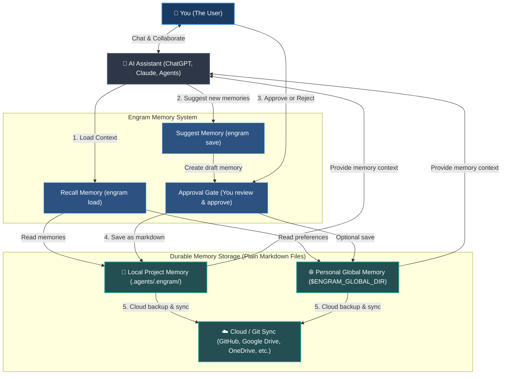

# Engram


[English](README.md) | [Tiếng Việt](documentation/vi/README.md) | [Español](documentation/es/README.md) | [Français](documentation/fr/README.md) | [中文](documentation/zh/README.md) | [한국어](documentation/ko/README.md) | [日本語](documentation/ja/README.md) | [Русский](documentation/ru/README.md)

**Engram is a human-owned memory protocol for AI agents. Grow with you & your teams.**

It gives agents memory without giving agents ownership of memory. Durable rules, workflows, and project knowledge live as readable Markdown, reviewed by humans, portable through Git, and usable by any agent that can read files.

## What It Is

Engram is a knowledge memory center for project, workspace, team, and personal context.

It is not a hidden agent brain. It is not a vendor memory silo. It is not a database that only one tool understands.

Engram's contract:

- **Markdown is durable memory.**
- **JSON index, graph, and optional sqlite-vec sidecars are acceleration layers.**
- **Approval is the trust boundary.**
- **Hashes are integrity checks.**
- **Ignore rules are privacy controls.**
- **Git is portability and audit history.**
- **Agent adapters are convenience, not authority.**
- **Strict rules govern agent output.** Load knowledge memory with strict-rules to control, guide, and constrain AI agent outputs.

The core principle: **agents can suggest memory, but humans own what becomes memory.**

### High-Level System Flow



## Why It Exists

AI assistants and agents forget decisions, repeat setup questions, and carry useful lessons only inside one chat, one vendor account, or one machine. That is convenient until a team needs to review, share, correct, or remove memory.

Furthermore, current AI memory approaches face severe tactical challenges:

- **Context Window Bloat:** Standard rule files (like `.cursorrules` or system prompts) get sent with every single message. As rules grow, they consume token limits, cost money, and slow down response times.
- **Context Drift & Hallucination:** In long chat sessions, agents drift from instructions, invent syntax, or hallucinate behaviors because memory lacks structure and filtering.
- **Silent Secret Leakage:** Automatic background memory capture tools can silently record sensitive keys, API tokens, passwords, or personal identifying information (PII) without your consent or knowledge.
- **Vendor Lock-In:** Vendor-owned memory databases keep your context locked to one specific platform or model provider, making it impossible to switch assistants or back up your data.
- **Broken Offline Workflows:** Cloud-based memory systems stop working the moment you lose internet connection, leaving your agent without crucial context.

Engram moves memory into files to solve these problems:

| Tactical Challenge | Engram Answer |
| --- | --- |
| **Too many rules bloating context** | Routes and refines task-matching memory into a compact top-8 context pack by default. |
| **Silent writes & secret leakage** | Requires human A/B/C approval and scans for secrets/injections. |
| **Vendor lock-in** | Uses plain, readable Markdown files portable across any agent or model. |
| **No offline access** | Runs locally as a lightweight file-based protocol—no server or internet required. |
| **Context drift in team projects** | Synchronizes rules and guidelines team-wide via Git. |
| **Broken or outdated memory** | Provides validation and cleanup utilities (`engram repair`, `engram quality-check`). |

Workspace memory loads first. Global memory is fallback. Fresh installs default
normal saves to both workspace and global when global memory is configured; use
`engram set-save-target workspace|global|both` or per-command `--scope` to
choose the target.
Use `engram profile create <name> --global-path <path>` when company, team, and
personal memory must stay in separate global roots. `engram profile use <name>`
sets the user default for uninitialized folders, and
`engram profile use <name> --workspace` pins a default profile for the current
workspace. One-off commands can use `--profile <name>`; if that profile differs
from the workspace default, workspace memory is disabled for that command.
When broad queries match more than eight memories, `engram load` reranks with
tags, type, recency, graph, and optional sqlite-vec vector signals before loading
the top eight. Use `engram load --dry-run "<task>"` to preview candidate counts
and suggested narrowing tags, or `--all` when broad context is intentional.

## Example Use Cases

Engram is versatile and can be used for any personal, professional, or development memory.

### For Personal & Professional Memory
- **Personal Preferences & Writing Style:** Teach your AI assistant how you like to communicate, your preferred tone, formatting choices, or email/blog templates so it always drafts content exactly how you want.
- **Study Notes & Learning Guides:** Store summaries of topics you are studying, key formulas, foreign language vocabulary, or complex concepts you've mastered, allowing the AI to quiz you or explain things using your own past context.
- **Workflow Checklists:** Keep custom templates and step-by-step checklists for recurring tasks—like video editing checklists, blog post publishing procedures, or travel planning templates.
- **Personal Life Rules & Principles:** Document personal habits, financial goals, recipes, or health routines so your AI assistant can help you plan meals, budget, or manage tasks according to your guidelines.

### For Software Development & Tech
- **Repository Rules & Guidelines:** Document codebase styling conventions, architectural guidelines, or specific rules (e.g., "Always write unit tests for endpoints") so any coding agent adheres to them.
- **Troubleshooting & Debugging Guides:** Save solutions to complex bugs, hardware workarounds, or environment setup steps so future agents (and team members) don't waste time troubleshooting the same issue twice.
- **Common CLI Commands & Workflows:** Keep a list of repository-specific scripts, test execution flows, and deployment commands handy.
- **Team Onboarding & Alignment:** Sync your project’s architecture overviews and common gotchas directly via version-controlled Markdown, keeping the entire team aligned.

### For Enterprise & Teams
- **Security & Compliance Guardrails:** Define strict compliance protocols, data privacy guidelines, or security policies that AI agents must not violate when handling organization or customer data.
- **Shared Standard Operating Procedures (SOPs):** Store and version-control team SOPs, product specifications, customer service playbooks, and company wikis as Markdown memories.
- **Consistent Brand Voice & Style Guide:** Enforce marketing guidelines, trademark rules, and legal disclaimers across all team-facing content and external-facing agents.
- **Audit Trails & Governance:** Maintain full historical records of who modified which guidelines, when, and why via git logs, satisfying enterprise security auditing requirements.

## AI-Agent Quickstart

For daily use, let your AI assistant handle the memory load and save flows directly within chat.

### Best Scenarios (AI Chat Usage)

- **Start of a Chat Session:** Tell your AI assistant to recall relevant guidelines or preferences for your task.
  ```text
  # If you install the skillset globally, supported agents automatically run engram load at session start and task changes.
  /engram load "design pricing table component"
  ```
- **Proposing New Memory:** Ask the agent to save an important decision or fact discovered during the conversation.
  ```text
  /engram save knowledge "Stripe webhook secret is loaded from process.env.STRIPE_WEBHOOK_SECRET"
  ```
- **Summarizing & Saving the Session:** At the end of a session, ask the agent to bundle all new rules, workflows, or facts.
  ```text
  /engram save-session
  ```
  To ask the agent to include recent chat history it can actually access, pass a positive integer query level:
  ```text
  /engram save-session --query-level 3
  ```
  The agent should mine up to that many recent human-agent chat sessions, including the current session, and must not invent unavailable history.
  To both mine recent accessible history and auto-approve all recommended memories, use:
  ```text
  /engram ss -a last 50 sessions
  ```
  This normalizes to `engram save-session --query-level 50 --accept-all`; `-a` is the human's explicit approval for all generated candidates.

For full details and advanced features, refer to the [Documentation](documentation/en/index.md).

---

## Installation & Setup

Set up the Engram CLI and configure it for your AI assistant.

### 1. Install Engram CLI
Install the tool globally on your system:
```bash
npm install -g @the-long-ride/engram
```

### 2. Install Skillset Globally
Teach your global AI assistant how to interact with Engram (loads, saves, updates, and maintenance):
```bash
# You can use below command first to understand.
# engram h is
# Use the below command to know the target name of supported agents.
engram is list
```
```bash
# Install to your AI assistant as global scope for automatic memory loading at start-of-task + the ability to use /engram commands manually
engram is --global <your-agent>
# If your agent is not listed but reads AGENTS.md, use the generic fallback target.
engram is --global agents-md
```
*(Replace `<your-agent>` with your assistant name in result of `engram is list`; use `agents-md` when your agent is not listed but reads `AGENTS.md`.)*
Global installs append one managed Engram block at the end of the assistant's
shared instruction file and preserve your existing content. Agent `SKILL.md`
files are written to the host's skill directory; for example, Claude Code uses
`~/.claude/CLAUDE.md` plus `~/.claude/skills/engram/SKILL.md`.

For Gemini CLI and the current Antigravity surfaces, use the Gemini target:
```bash
engram install-skillset gemini
```
Engram treats `gemini` as the advertised target for Gemini CLI plus the current
Antigravity 2.0, Antigravity CLI, and Antigravity IDE Gemini-compatible paths.
The older `antigravity` and `antigravity-cli` target names remain hidden
compatibility aliases while Google's Antigravity paths settle.

### 3. Initialize Workspace
Run this in the root folder of any project or workspace you want to enable Engram in:
```bash
engram init
```

> [!IMPORTANT]
> **What to notice during initialization (`engram init`):**
> - **Workspace Memory:** It creates a local `.agents/.engram/` directory to store your project-specific memories.
> - **Git Submodule Option:** Use `engram init --submodule` if your team wants memories tracked in a separate, dedicated Git repository.
> - **Personal Global Memory:** It prompts for a global directory path (e.g. `--global-path ~/engram-global`). This serves as a fallback location for personal settings that persist across all your projects.
> - **Cloud Backup & Sync:** Configure a global repository URL (`--global-remote <git-url>`) or set up Onedrive/ Google Drive/ Dropbox to sync and back up your memories seamlessly.

---

## Settings & Next Commands

Once initialized, configure active options and sync behavior. Both CLI commands and their AI agent slash equivalents are supported.

### Set Developer Roles
Filter active memory loading by specific development roles (e.g., `frontend`, `backend`, `security`, `docs`).
- **CLI:**
  ```bash
  # Filter memory loading to frontend and design rules
  engram set-role frontend design

  # Clear active roles to load all memories unfiltered
  engram set-role
  ```
- **AI Agent Chat:**
  ```text
  /engram set-role frontend design
  /engram set-role
  ```

### Set Rule Variant (Strictness Level)
Tune how strictly rules are formatted when loaded by your AI assistant:
- **CLI:**
  ```bash
  # strict: sharper output for low-tier/smaller models; can cause a "brainlock" (over-constraint) in advanced front-tier models (e.g. Claude Opus 3.5, GPT-5.5)
  # balanced/light: keeps reasoning flexible and optimal for advanced models
  engram set-rule-variant balanced
  ```
- **AI Agent Chat:**
  ```text
  /engram set-rule-variant balanced
  ```

### Other Next Commands
- **Check active settings & active paths:** `engram entry` (Agent: `/engram entry`)
- **Manage isolated profiles:** `engram profile create personal --global-path <path>` / `engram profile use company --workspace`
- **Update or move global memory folder:** `engram update-global-folder <new-path> [--move-from-path <old-path>]` / `engram ugf <new-path>` (Agent: `/engram set global memory path to <new-path>`)
- **Clone workspace/global memory:** `engram clone-memory workspace global` or `engram clone-memory global workspace --force` (Agent: `/engram clone workspace memory to global`)
- **Sync local & global changes:** `engram sync` (Agent: `/engram sync`)
- **Run checkup & clean broken links:** `engram verify` / `engram repair` (Agent: `/engram verify` / `/engram repair`)
- **Advisory contradiction scan:** `engram quality-check` (Agent: `/engram quality-check`)

---

## CLI Command vs. AI Agent Cheat Sheet

| Task | CLI Command | AI Agent Suggestion (Slash Command) |
| --- | --- | --- |
| **Load Memory** | `engram load "<task>"` | `/engram load "<task>"` |
| **Preview Load Refinement** | `engram load --dry-run "<task>"` | `/engram load --dry-run "<task>"` |
| **Save Single Memory** | `engram save <type> "<text>"` | `/engram save <type> "<text>"` |
| **Propose Multiple Memories** | `engram save-session` | `/engram ss` |
| **Mine Recent Chat Sessions** | `engram save-session --query-level 3` | `/engram save-session --query-level 3` |
| **Auto-Approve Save Candidates** | `engram save-session --accept-all` | `/engram ss -a` |
| **Mine and Auto-Approve Recent Sessions** | `engram save-session --query-level 50 --accept-all` | `/engram ss -a last 50 sessions` |
| **Import Existing Files / Docs** | `engram take-control --all` | `/engram take-control --all` |
| **Check Config / Paths** | `engram entry` | `/engram entry` |
| **Manage Profiles** | `engram profile status` / `engram profile merge personal company --dry-run` | `/engram profile status` |
| **Update Global Folder** | `engram update-global-folder <new-path>` / `engram ugf <new-path>` | `/engram set global memory path to <new-path>` |
| **Clone Workspace/Global Memory** | `engram clone-memory workspace global` / `engram clone-memory global workspace --force` | `/engram clone workspace memory to global` |
| **Verify Memory Integrity** | `engram verify` | `/engram verify` |
| **Set Active Roles** | `engram set-role <roles>` | `/engram set-role <roles>` |
| **Set Rule Variant** | `engram set-rule-variant <variant>` | `/engram set-rule-variant <variant>` |
| **Sync Memories** | `engram sync` | `/engram sync` |
| **Rebuild & Repair Index** | `engram repair` | `/engram repair` |


## Documentation

Full documentation lives in the repository under `documentation/`; the npm package intentionally ships this README and the runtime docs/assets needed by the CLI, not the full documentation tree.

| Language | Start here |
| --- | --- |
| English | [documentation/en/index.md](documentation/en/index.md) |
| Vietnamese | [documentation/vi/index.md](documentation/vi/index.md) |
| Spanish | [documentation/es/index.md](documentation/es/index.md) |
| French | [documentation/fr/index.md](documentation/fr/index.md) |
| Chinese | [documentation/zh/index.md](documentation/zh/index.md) |
| Korean | [documentation/ko/index.md](documentation/ko/index.md) |
| Japanese | [documentation/ja/index.md](documentation/ja/index.md) |
| Russian | [documentation/ru/index.md](documentation/ru/index.md) |

Each language includes overview, understanding, AI-agent quickstart, protocol, operations, and comparison pages.

## Pros

- Plain Markdown source of truth.
- Human approval before durable writes.
- Git-friendly review, history, sync, and recovery.
- Workspace-first with optional global fallback.
- Agent-agnostic: Codex, Claude, Cursor, Gemini, Copilot, OpenCode, Antigravity, Cline, Windsurf, and file-reading agents can all use it.
- Compact routing by default, with dry-run refinement previews and optional sqlite-vec sidecars for large memory scopes.
- Safety layers: schema validation, secret scan, prompt-injection scan, hashes, ignore rules.
- Useful maintenance flows: observe, take-control, graph, archive, benchmark, repair.
- No required daemon, database, or cloud account; sqlite-vec is an optional local sidecar, not the source of truth.

## Cons

- Less automatic than memory engines that capture everything in the background.
- Default search is deterministic lexical search; `search --semantic` adds deterministic local similarity, not embedding-backed semantic search.
- Optional sqlite-vec routing uses local hashed word vectors, not external embedding services.
- Contradiction detection is heuristic and advisory.
- `deduplicate --semantic` uses deterministic local similarity, not external embeddings.
- Pattern mining, encrypted storage, and full PR automation are design areas, not complete runtime workflows yet.

## Compared With Agentmemory

[rohitg00/agentmemory](https://github.com/rohitg00/agentmemory) is a strong automatic memory engine for coding agents, with server-style memory, MCP/hooks/REST integration, replay/viewer flows, benchmark claims, hybrid retrieval, and integrations such as Hermes.

Engram chooses a different center of gravity.

| Dimension | Engram | agentmemory |
| --- | --- | --- |
| Source of truth | Human-approved Markdown | Memory server/store |
| Trust boundary | A/B/C approval before writes | Automatic capture plus tool governance |
| Default shape | File protocol, no daemon required; optional local sqlite-vec sidecar for large scopes | Running service recommended |
| Review model | Git diff and Markdown review | Viewer/API/session history |
| Best for | human-owned team memory | automatic recall and replay |
| Main risk | requires save discipline | can become invisible state without governance |

Use agentmemory when you want automatic capture, replay, vector retrieval, and many live memory tools.

Use Engram when you want memory to be boring in the best way: files, review, hashes, Git, and human ownership.

## Compared With Tolaria

[refactoringhq/tolaria](https://github.com/refactoringhq/tolaria) is a strong desktop app for managing Markdown knowledge bases. It is files-first, Git-first, offline-first, standards-based, and designed for large personal or team vaults that can also become useful context for AI agents.

Engram sits lower in the stack. It is not a desktop knowledge-base app; it is a memory protocol, CLI, and agent skillset for governed agent memory.

| Dimension | Engram | Tolaria |
| --- | --- | --- |
| Source of truth | Human-approved memories in `.agents/.engram/` | Markdown vault notes with YAML frontmatter |
| Primary interface | CLI, slash adapters, MCP-style wrapper, and agent-readable Markdown | Cross-platform desktop app |
| Write model | Agents propose; humans approve durable memory writes | Humans directly manage a Markdown knowledge base |
| Scope | Rules, workflows, skills, and project/team/personal agent memory | Broad personal or team knowledge bases and second brains |
| Runtime shape | No required daemon, cloud account, or desktop app; optional local sqlite-vec sidecar for large scopes | Tauri desktop app for macOS, Windows, and Linux |
| Best for | Auditable memory governance across agents and repos | Browsing, editing, and organizing large Markdown vaults |
| Main risk | requires save discipline | more app surface than needed if you only want an agent memory protocol |

Use Tolaria when you want a full desktop home for Markdown notes, vault navigation, and keyboard-first knowledge work.

Use Engram when you want agent memory as a small governed protocol with approval gates, hashes, Git diffs, and installable agent instructions.

## Compared With Obsidian

[Obsidian](https://obsidian.md/) is an excellent Markdown-first app for personal notes, linked knowledge bases, writing, planning, and long-lived vaults. It stores notes locally, has a large plugin and theme ecosystem, and offers optional Sync and Publish services.

Engram is not trying to be a note-taking app. It is a governed memory protocol for AI agents: smaller in scope, stricter about approval, and designed so durable agent memory can be reviewed like code.

| Dimension | Engram | Obsidian |
| --- | --- | --- |
| Source of truth | Human-approved memories in `.agents/.engram/` | Local Markdown vault notes |
| Primary interface | CLI, slash adapters, MCP-style wrapper, and agent-readable Markdown | Desktop and mobile note app with links, graph, canvas, plugins, and themes |
| Write model | Agents propose; humans approve durable memory writes | Humans and plugins edit vault notes directly |
| Scope | Rules, workflows, skills, and project/team/personal agent memory | Personal or team notes, writing, planning, and knowledge bases |
| Runtime shape | No required app, daemon, or cloud account; optional local sqlite-vec sidecar for large scopes | Obsidian app, with optional Sync, Publish, and community plugins |
| AI integration | Installable agent instructions and approval-gated memory flows | Vaults can become AI context through plugins, MCP servers, or custom workflows |
| Best for | Auditable cross-agent memory governance | Rich Markdown note-taking and second-brain workflows |
| Main risk | requires save discipline | agent-facing context can become broad or unreviewed without a separate governance layer |

Use Obsidian when you want a full thinking, writing, and note-navigation workspace.

Use Engram when you want the agent-memory layer itself to stay small, explicit, reviewable, portable, and governed.

They can also work together: keep broad notes in Obsidian, then distill durable AI-agent rules and project knowledge into Engram.

## Compared With Built-In Agent Memory

Built-in AI-assistant memory (like ChatGPT's memory, Claude's projects, or Cursor's rules settings) is convenient, but often locked to one host. It may be hard to diff, export, audit, share, or correct.

Engram treats built-in memory as a convenience layer, not authority. The authority is the memory folder humans can inspect.

| Dimension | Engram | Built-In Agent Memory |
| --- | --- | --- |
| **Portability** | Multi-agent & cross-platform: plain Markdown files readable by any editor or agent. | Locked to a single platform (e.g., only in ChatGPT Web, or only in Cursor). |
| **Human Control** | Explicit: agents propose memory drafts, but humans review and approve (A/B/C gate) before writes. | Silent/Blackbox: assistant updates memory in the background without user review. |
| **Collaboration** | Git-friendly: share project memory team-wide through version control. | Single-user only: no native way to share, merge, or collaborate on memories. |
| **Security & Privacy** | Safe: scans for PII and secrets before writing, and runs 100% locally/offline. | High-risk: can silently capture and upload API keys, passwords, and sensitive company data. |
| **Prompt Optimization** | Selective: loads only memory files relevant to the current task or developer role. | Monolithic: either dumps all instructions into context or uses opaque backend vectors. |

Use built-in memory when you want hands-free, background personalization on a single web chat platform.

Use Engram when you want your assistant's memory to be auditable, shared with your team, portable across multiple IDEs, and 100% controlled by you.

## Roadmap

We are expanding Engram to seamlessly support web-based AI interfaces and cloud storage sync:

- **AI Web Chat Integration:** Develop browser extensions (Chrome/Firefox) and native web plugins that let Engram memory work directly in web chat clients like ChatGPT, Claude.ai, and Gemini Web.
- **Linked Cloud & Git Storage:** Make `engram` available for user using web-based AI assistants to load memory directly from a user's linked GitHub repository, Google Drive, OneDrive, or Dropbox folder.
- **Natural Language Command Mapping:** Enable AI agents to map conversational commands (e.g. "Hey, please remember that we use HSL" or "Check my memory bank health") directly into corresponding Engram actions without requiring rigid slash commands.

## Companion Project: Markdown Explorer

Need a visual way to navigate and search your Markdown files? Check out [Markdown Explorer](https://the-long-ride.github.io/markdown-explorer/)—a lightweight, open-source (MIT) VS Code extension/ desktop app (Windows, Linux, macOS) to explore, visualize, and search through your local Markdown folders. It works beautifully alongside Engram to help you browse your agent rules, skills, and knowledge files directly in the Engram memory folder.

## License

[GPL-3.0 License](LICENSE)
