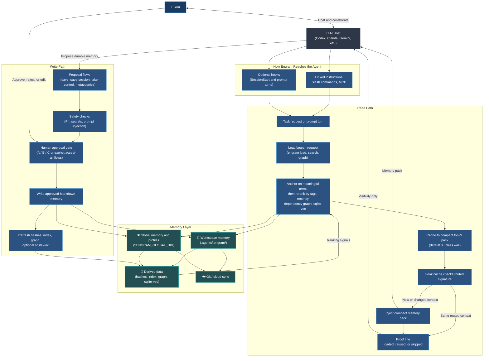

# Engram

[](LICENSE) [](https://github.com/the-long-ride/engram) [](https://www.npmjs.com/package/@the-long-ride/engram) [](https://www.npmjs.com/package/@the-long-ride/engram)


[English](README.md) | [Tiếng Việt](documentation/vi/README.md) | [Español](documentation/es/README.md) | [Français](documentation/fr/README.md) | [中文](documentation/zh/README.md) | [한국어](documentation/ko/README.md) | [日本語](documentation/ja/README.md) | [Русский](documentation/ru/README.md)

**Engram is a human-owned, file-first memory protocol for AI agents. Grow with you & your teams.**

It gives agents memory without giving agents ownership of memory. Durable rules, workflows, and project knowledge live as plain Markdown, reviewed by humans, portable through Git, and usable by any agent.

---

## Key Highlights

- **Human in the Loop**: AI proposes memory candidates; humans review and approve (A/B/C gate, automatable via rules).
- **Context-Optimized**: Routes meaningful task matches plus prerequisites into a compact pack (default: 8 files) to avoid context bloat.
- **Git-Native & Portable**: Plain Markdown files stored in `.agents/.engram/` synced via Git—completely vendor-agnostic and offline-first.
- **Privacy & Security Control**: Runs 100% locally and scans for PII/secrets before writing.
- **Prerequisite Graphs**: Declares dependencies (`depends_on`) so agents load foundational rules before advanced tasks automatically.

---

### High-Level System Flow



---

## What It Is (The Contract)

- **Markdown is durable memory** — no hidden binary or proprietary formats.
- **JSON index, graph, and optional sqlite-vec sidecars** act as acceleration layers.
- **Approval is the trust boundary** — the core principle is that agents suggest, humans approve.
- **Hashes check integrity** and **Ignore rules handle privacy**.
- **Profiles isolate memory contexts** (personal, client, and corporate).
- **Git provides portability and audit history** — share rules across the team.
- **Agent adapters are convenience, not authority**.
- **Runtime-capable hosts get bootstrap instructions** — short `AGENTS.md`/`CLAUDE.md`/`GEMINI.md` text plus MCP tools and Agent Skills for the full workflow. Fallback targets get complete compact protocol.
- **Strict rules govern agent output** to prevent context drift and hallucinations.
- **SQLite config DB is optional** — if the DB cannot be opened or initialized, commands fall back to JSON config snapshots.

---

## Why Engram Exists (Tactical Solutions)

Standard rule files get sent with every single message, bloating context, causing drift, leaking secrets, or locking you to cloud vendors. Engram moves memory into files to solve these problems:

| Tactical Challenge | Engram Answer |
| --- | --- |
| **Too many rules bloating context** | Routes meaningful task matches and explicit prerequisites into a compact context pack, defaulting to 8 memories. |
| **Silent writes & secret leakage** | Requires human A/B/C approval and scans for secrets/injections. |
| **Vendor lock-in** | Uses plain, readable Markdown files portable across any agent or model. |
| **No offline access** | Runs locally as a lightweight file-based protocol—no server or internet required. |
| **Context drift in team projects** | Synchronizes rules and guidelines team-wide via Git. |
| **Broken or outdated memory** | Provides validation and cleanup utilities (`engram repair`, `engram quality-check`). |

---

## Example Use Cases

- **Personal & Professional**: Writing styles, personal preferences, checklists, vocabulary, templates, life principles.
- **Software Development**: Coding rules, architectural guidelines, debug scripts, troubleshooting, team onboarding.
- **Enterprise**: Security guardrails, compliance guidelines, brand tone, Git-based audit trails.

---

## Installation & Setup

### 1. Install Engram CLI
```bash
npm install -g @the-long-ride/engram
```

### 2. Configure & Link (Recommended First Step)
To configure your settings, manage profiles, and connect AI agents in a premium web interface, run:
```bash
engram entry
```
- **Connections Tab**: Scan and link Engram to your local AI agents (installs skillsets and hooks automatically).
  
- **Construct Tab**: Configure core settings, load limits, rule variant preferences, global Git settings, and rule memory line limits.
  
- **Core Tab**: Review and resolve duplicate memory candidates across workspace, global, and profile scopes, or run metacognitive analysis.
  
- **Memories Tab**: Visualize active memories, their tags, and dependency edges using the interactive memory graph.
  

Alternatively, you can manually link Engram to your agent:
```bash
# Link Engram in this workspace (installs skillset + MCP config + hooks where supported)
engram link codex
```

For Gemini / Antigravity surfaces:
```bash
engram link gemini
```

Optional auto-load hooks are available for hosts that can inject context at both
session start and later prompt turns:
```bash
engram link codex
engram link claude
engram link gemini
engram link cursor
engram link windsurf
engram link --global opencode
engram set-read auto
engram set-proof compact
```

**OpenCode hook support:** `engram link --global opencode` installs a managed local
JavaScript plugin at `~/.config/opencode/plugins/engram.js` (or the
platform/config override equivalent) alongside rules, the Engram skill, and MCP
configuration. The plugin uses `chat.message` to route the current user prompt
and `experimental.chat.system.transform` to inject routed memory before each
LLM request. OpenCode must be restarted or reloaded after `link`/`unlink`
because local plugin files are loaded at startup. The plugin fails open and
keeps raw routed memory only in the running OpenCode process; Engram's disk hook
cache remains hashes, session IDs, host, cwd, and routed signatures only.
`engram unlink --global opencode` removes only the Engram-generated plugin; a
human-authored `engram.js` is preserved unless `--force` is explicit.

v1 hook installs are available for `codex`, `claude`, `gemini`, `opencode`,
`cursor`, and `windsurf`/`cascade`. Antigravity compatibility currently routes
through `gemini`. Cursor hooks inject startup context via `sessionStart` and
`additional_context`; `beforeSubmitPrompt` is allow/block-only, not context
injection. Windsurf/Cascade hooks can audit/preload/block on `pre_user_prompt`
but cannot inject model context; rules and MCP provide the reliable AI context
channels. Copilot and Cline remain instruction/skillset/manual-load driven
until their hook surfaces support reliable prompt-time context injection.
Use `engram set-proof compact` when you want supported hooks to append a short
`Engram proof:` line on each eligible turn showing whether Engram memory was
loaded, reused, or skipped without changing `set-read` injection behavior.

### 3. Inject Workspace
Run this in the root of any project workspace to enable local memory routing:
```bash
engram inject
```
*Notice: creates local `.agents/.engram/`, prompts for global memory folder path, and allows optional submodules (`--submodule`) and cloud/remote sync config.*

---

## AI-Agent Quickstart

You can instruct your agent to use the following slash commands in chat:

- **Start of a task**: `/engram load "design pricing table component"`
- **Save key decisions/facts**: `/engram save knowledge "Webhook secret is process.env.STRIPE_WEBHOOK"`
- **Summarize & save session**: `/engram save-session` (or `--query-level 3`, or `ss -a last 50 sessions` to auto-approve)

When an agent asks how to use Engram, run `engram llm`. It prints the packaged
`llm.txt` AI-agent guide, which is safe to use before `engram inject`.

When an AI agent proposes `TYPE: ... | TEXT: ...` memory candidates, it may add optional `CONTEXT: ...` when that helps explain why the memory exists. Simple facts can omit it and use the default approval context.

---

## CLI Command vs. AI Agent Cheat Sheet

| Task | CLI Command | AI Agent Suggestion |
| --- | --- | --- |
| **Load Memory** | `engram load "<task>"` | `/engram load "<task>"` |
| **Agent-Facing Load** | `engram load --for-agents "<task>"` | `/engram load --for-agents "<task>"` |
| **Dry Run Load** | `engram load --dry-run "<task>"` | `/engram load --dry-run "<task>"` |
| **Save Single Memory** | `engram save <type> "<text>"` | `/engram save <type> "<text>"` |
| **Propose Memories** | `engram save-session` | `/engram ss` |
| **Mine Recent Sessions** | `engram save-session --query-level <n>` | `/engram save-session --query-level <n>` |
| **Auto-Approve Saves** | `engram save-session --accept-all` | `/engram ss -a` |
| **Import Files / Docs** | `engram take-control --all` | `/engram take-control --all` |
| **Import & Metacognize** | `engram take-control --all --metacognize --accept-all` | `/engram take control accept all metacognize` |
| **Restructure Memory** | `engram metacognize --workspace` | `/engram restructure workspace memory accept all` |
| **Resolve Conflicts** | `engram resolve-conflicts --metacognize` | `/engram resolve conflicts and metacognize` |
| **Check Config / Paths** | `engram entry` | `/engram entry` |
| **Show Agent Guide** | `engram llm` | Run once when an agent needs Engram usage guidance |
| **Manage Profiles** | `engram profile status` / `create` / `use` | `/engram profile status` |
| **Configure Save Target** | `engram set-save-target <workspace/global/both>` | `/engram set-save-target <target>` |
| **Configure Load Limit** | `engram set-load-limit <1..32>` | `/engram set-load-limit <count>` |
| **Configure Auto Read** | `engram set-read startup|auto|always|manual|off` | `/engram set-read auto` |
| **Configure Proof Visibility** | `engram set-proof off|compact` | `/engram set-proof compact` |
| **Install Agent Hooks** | `engram link codex|claude|gemini|opencode|cursor|windsurf` | Run once from terminal |
| **Update Global Path** | `engram update-global-folder <new-path>` | `/engram set global memory path to <new-path>` |
| **Clone Memory** | `engram clone-memory <src> <dest>` | `/engram clone workspace memory to global` |
| **Manage Workspaces** | `engram workspace list|info|set|unregister|link|unlink` | `/engram workspace list` |
| **View/Set Config** | `engram config view|set` | `/engram config set <key> <value>` |
| **Launch Web UI** | `engram entry` | `/engram entry` |
| **Set Active Roles** | `engram set-role <roles>` | `/engram set-role <roles>` |
| **Set Rule Strictness** | `engram set-rule-variant <variant>` | `/engram set-rule-variant <variant>` |
| **Verify & Repair** | `engram verify` / `engram repair` | `/engram verify` / `/engram repair` |
| **Scan Contradictions** | `engram quality-check` | `/engram quality-check` |
| **Sync Memories** | `engram sync` | `/engram sync` |

When `engram set-role ...` or `engram set-rule-variant ...` succeeds, Engram now returns an `Agent action:` line. Engram-aware adapters and MCP hosts should immediately rerun `engram load --for-agents "<current task/request>"` and replace earlier Engram-derived context in the same conversation. This happens after the command completes, not in the middle of a response, and installed skillset files still control future or reloaded chats.

---

## Comparisons

### Compared With Agentmemory
[rohitg00/agentmemory](https://github.com/rohitg00/agentmemory) is an automatic, background-running server-style memory engine. Engram differs by focusing on file-based local Markdown, human review, and no background daemon overhead.

| Dimension | Engram | agentmemory |
| --- | --- | --- |
| Source of truth | Human-approved Markdown | Memory server/store |
| Trust boundary | A/B/C approval before writes | Automatic capture |
| Default shape | File protocol (no daemon) | Running service recommended |
| Review model | Git diff and Markdown review | Viewer/API/session history |
| Best for | Human-owned team memory | Automatic recall and replay |
| Main risk | Requires save discipline | Invisible state |

### Compared With Tolaria
[refactoringhq/tolaria](https://github.com/refactoringhq/tolaria) is a Markdown-first desktop app. Engram sits lower in the stack, providing a CLI, agent skillsets, and Git-native rules governance instead of a full GUI workspace.

| Dimension | Engram | Tolaria |
| --- | --- | --- |
| Source of truth | Memories in `.agents/.engram/` | Markdown vault notes |
| Primary interface | CLI, slash adapters, agent skill | Desktop app |
| Write model | Agents propose; humans approve | Humans directly manage Markdown |
| Best for | Auditable memory governance | Browsing and managing vaults |

### Compared With Obsidian
[Obsidian](https://obsidian.md/) is a rich personal note-taking desktop/mobile app. Engram is an agent memory protocol: much smaller in scope, strict about human approval, and designed to track agent instructions like code.

| Dimension | Engram | Obsidian |
| --- | --- | --- |
| Source of truth | Memories in `.agents/.engram/` | Local Markdown notes |
| Write model | Agents propose; humans approve | Directly edit notes |
| Best for | Auditable cross-agent memory | Note-taking and second brains |

### Compared With Hermes Agent
Hermes Agent uses an autonomous, always-on memory structure with hard caps, whereas Engram is human-owned by default (automatable via rules) with tag/graph-based on-demand routing.

| | Engram | Hermes Agent |
|---|---|---|
| **Philosophy** | Human-owned, file-first protocol (automation optional) | Autonomous, always-active memory |
| **Storage** | Typed Markdown files in `.agents/.engram/` | `MEMORY.md` + `USER.md` (hard char caps) |
| **Write model** | Human-approved by default (A/B/C gate; automatable via rules) | Agent writes autonomously |
| **Recall** | On-demand: `engram load "<task>"` injects relevant files | Always-on: core files frozen into system prompt each session |
| **Vector search** | Optional local sqlite-vec | Via external provider (agentmemory) |
| **Overhead** | No daemon, requires save discipline (unless automated) | Server process + viewer UI, REST API, MCP server |

### Compared With Built-In Agent Memory
Built-in memory (ChatGPT, Claude Projects, Cursor rules) is siloed and invisible. Engram treats local files as the source of truth, offering team sharing via Git, scanning for secrets, and multi-agent portability.

| Dimension | Engram | Built-In Agent Memory |
| --- | --- | --- |
| **Portability** | Plain Markdown readable by any agent | Locked to a single platform |
| **Human Control** | Explicit A/B/C approval before writes | Silent background updates |
| **Collaboration** | Git-friendly team sharing | Single-user only |
| **Security** | Local-first, scans for PII/secrets | Cloud-first, high risk of secret leakage |

---

## Documentation

Full documentation lives in `documentation/`:
- [English](documentation/en/index.md) | [Tiếng Việt](documentation/vi/index.md) | [Español](documentation/es/index.md) | [Français](documentation/fr/index.md) | [中文](documentation/zh/index.md) | [한국어](documentation/ko/index.md) | [日本語](documentation/ja/index.md) | [Русский](documentation/ru/index.md)

## Roadmap & Companion Project
We are working on **Making Engram easier to use first, then documentation page**, **Documentation site**, **AI Web Chat Integration** and **Improving Natural Language Command Mapping**. 
For visual Markdown vault navigation, use [Markdown Explorer](https://the-long-ride.github.io/markdown-explorer/).

## License & Changelog
Licensed under [GPL-3.0](LICENSE). See [Changelog](https://github.com/the-long-ride/engram/blob/main/CHANGELOG.md).
