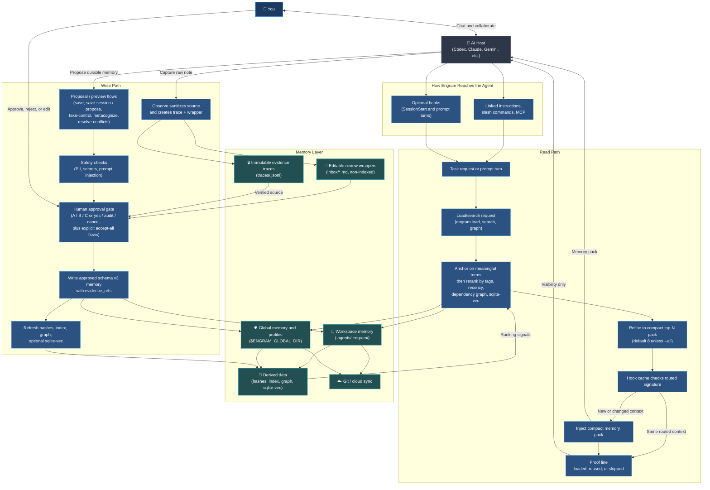
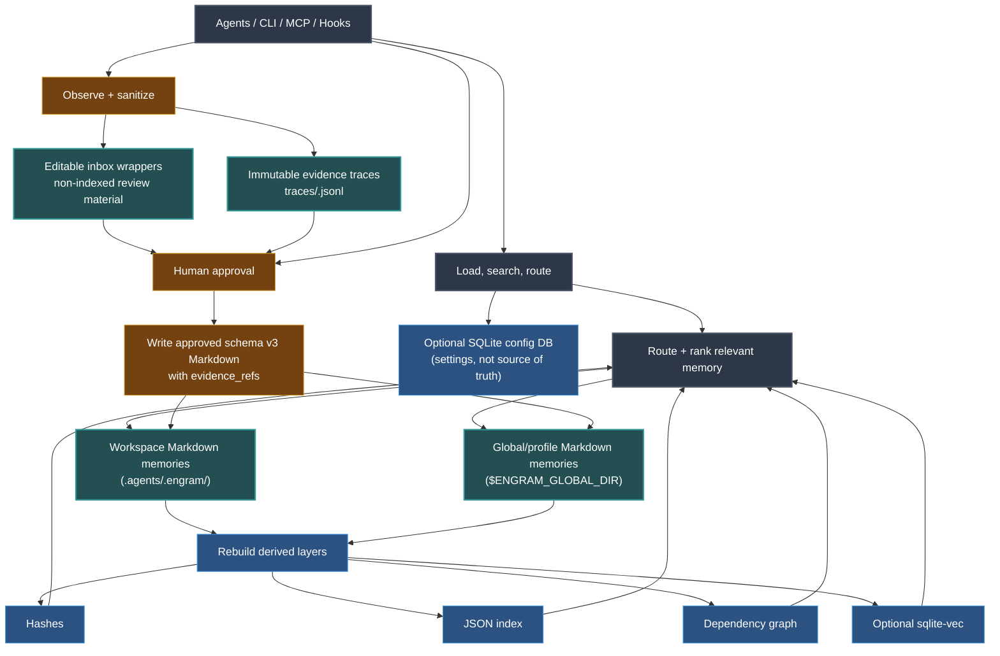
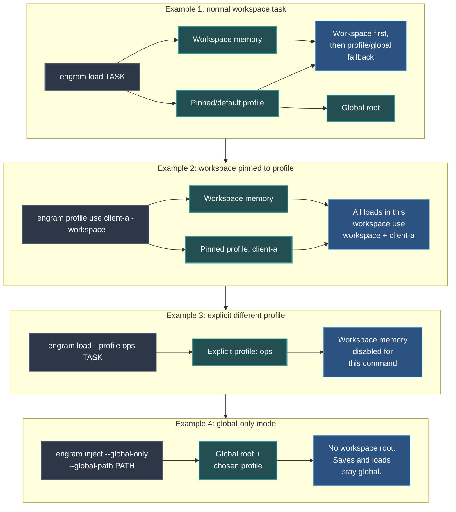
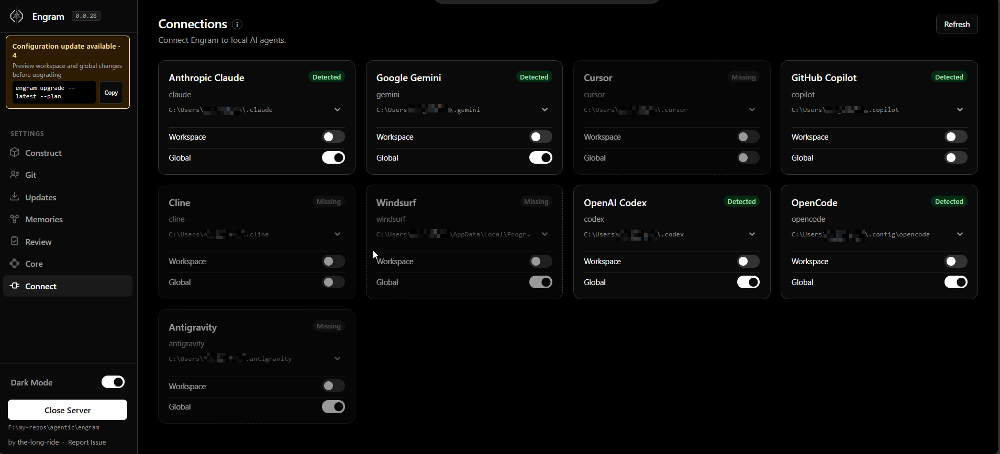
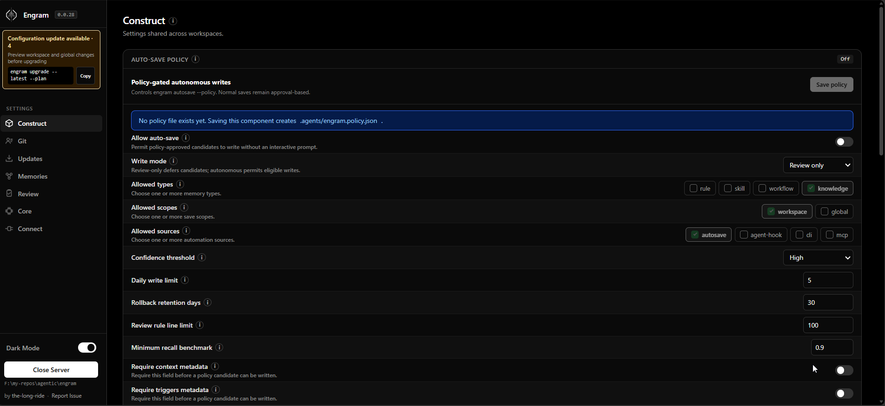
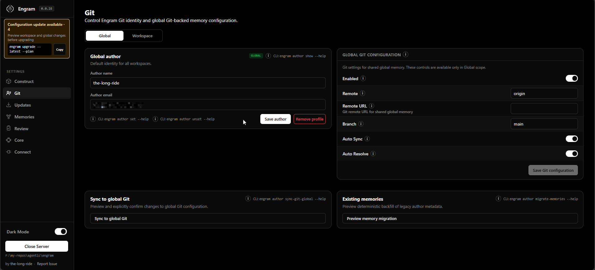
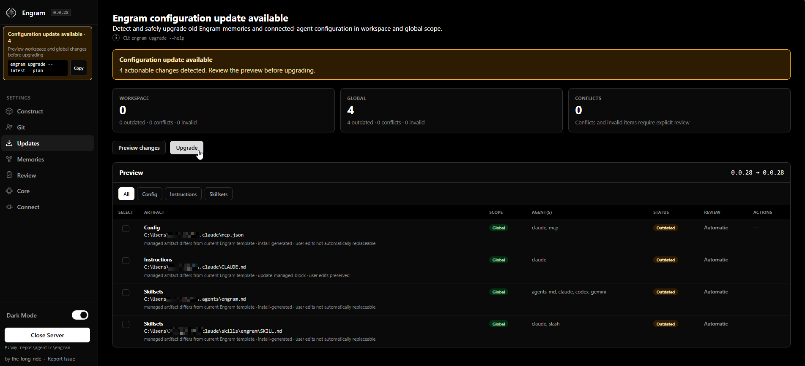
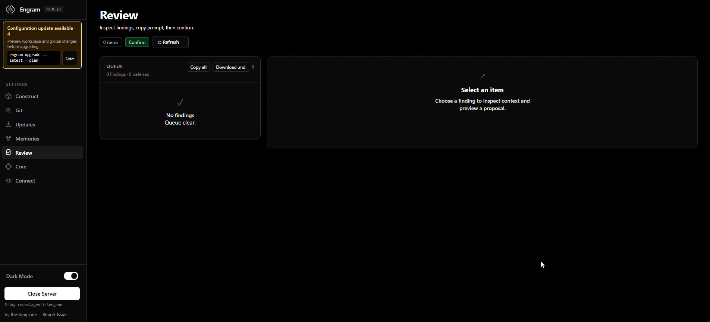
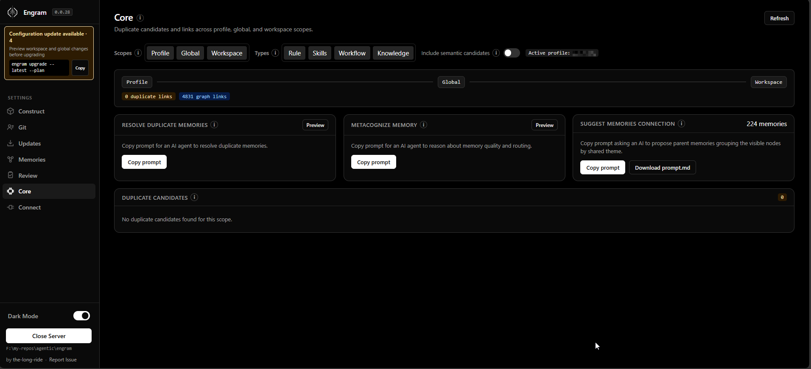
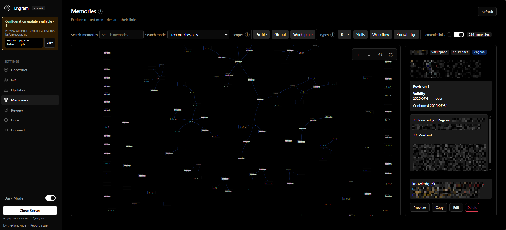

# Engram

[](LICENSE) [](https://github.com/the-long-ride/engram) [](https://the-long-ride.github.io/engram/) [](https://www.npmjs.com/package/@the-long-ride/engram)


**Engram is a human-owned, file-first memory protocol for AI agents. Grow with you & your teams.**

It gives agents memory without giving agents ownership of memory. Durable rules, workflows, and project knowledge live as plain Markdown, reviewed by humans, portable through Git, and usable by any agent.

Full documentation lives on the website: [@the-long-ride/engram docs-site](https://the-long-ride.github.io/engram/docs/intro)

---

## Key Highlights

- **Human in the Loop**: Direct CLI saves use A/B/C approval. AI-agent chat saves use an exact-candidate `yes` / `audit` / `cancel` loop before the agent writes with `save-session --force`.
- **Partial Force Safety**: `save-session --force` saves unrelated ready candidates, but defers candidates that need dependency or duplicate review with ID-only `engram load --id ...` guidance.
- **Context-Optimized**: Routes meaningful task matches plus prerequisites into a compact pack (default: 8 files) to avoid context bloat.
- **Git-Native & Portable**: Plain Markdown files stored in `.agents/.engram/` synced via Git—completely vendor-agnostic and offline-first.
- **Privacy & Security Control**: Runs 100% locally and scans for PII/secrets before writing.
- **Prerequisite Graphs**: Declares dependencies (`depends_on`) so agents load foundational rules before advanced tasks automatically.
- **Evidence-Backed Provenance**: `observe` writes a sanitized immutable evidence trace plus an editable inbox review wrapper; approved schema v3 memories cite source traces through `evidence_refs`.
- **Authority Separation**: Raw evidence is always `authority: evidence`; active memory is explicitly `instruction` or `reference`, preventing source material from silently becoming commands.

---


### Evidence-Backed Memory Foundation

Engram separates source evidence from approved memory:

```text
engram observe --file session.md
  -> .agents/.engram/traces/<trace-id>.jsonl   # immutable evidence trace
  -> .agents/.engram/inbox/<observation>.md    # editable review wrapper

engram save-session --file .agents/.engram/inbox/<observation>.md
  -> approved schema v3 Markdown memory
  -> authority: instruction | reference
  -> evidence_refs: [tr_...]
  -> derived_from: [session-id]
```

The wrapper is review material, not authority. During promotion Engram reopens the immutable trace, validates its hash and scope, and uses the trace content rather than edited wrapper text. Legacy v1 and v2 memories remain readable; newly created or updated memories use schema v3 with revision and validity metadata.

The CLI and Entry Web UI expose the same memory provenance: `authority`, `revision`, `evidence_refs`, `derived_from`, supersession links, validity dates, and `last_confirmed`.

See [Evidence traces and provenance](https://the-long-ride.github.io/engram/docs/concepts/evidence-traces).

### High-Level System Flow


```mermaid
graph TD
    classDef human fill:#1a3a5f,stroke:#3182ce,stroke-width:2px,color:#fff;
    classDef agent fill:#2d3748,stroke:#4a5568,stroke-width:2px,color:#fff;
    classDef storage fill:#234e52,stroke:#319795,stroke-width:2px,color:#fff;
    classDef action fill:#2c5282,stroke:#4299e1,stroke-width:1px,color:#fff;

    User["👤 You"]:::human
    AI["🤖 AI Host\n(Codex, Claude, Gemini, etc.)"]:::agent

    subgraph Entry ["How Engram Reaches the Agent"]
        Links["Linked instructions,\nslash commands, MCP"]:::action
        Hooks["Optional hooks\n(SessionStart and prompt turns)"]:::action
    end

    subgraph Read ["Read Path"]
        Trigger["Task request or prompt turn"]:::action
        Load["Load/search request\n(engram load, search, graph)"]:::action
        Route["Anchor on meaningful terms\nthen rerank by tags, recency,\ndependency graph, sqlite-vec"]:::action
        Refine["Refine to compact top-N pack\n(default 8 unless --all)"]:::action
        Cache["Hook cache checks routed signature"]:::action
        Inject["Inject compact memory pack"]:::action
        Proof["Proof line\nloaded, reused, or skipped"]:::action
    end

    subgraph Write ["Write Path"]
        Proposal["Proposal / preview flows\n(save, save-session / propose,\ntake-control, metacognize,\nresolve-conflicts)"]:::action
        Observe["Observe sanitizes source\nand creates trace + wrapper"]:::action
        Scan["Safety checks\n(PII, secrets, prompt injection)"]:::action
        Review["Human approval gate\n(A / B / C or yes / audit / cancel,\nplus explicit accept-all flows)"]:::action
        Persist["Write approved schema v3 memory\nwith evidence_refs"]:::action
        Rebuild["Refresh hashes, index, graph,\noptional sqlite-vec"]:::action
    end

    subgraph Memory ["Memory Layer"]
        Workspace["📁 Workspace memory\n(.agents/.engram/)"]:::storage
        Global["🌐 Global memory and profiles\n($ENGRAM_GLOBAL_DIR)"]:::storage
        TraceStore["🔒 Immutable evidence traces\n(traces/<trace-id>.jsonl)"]:::storage
        Inbox["📝 Editable review wrappers\n(inbox/*.md, non-indexed)"]:::storage
        Derived["🧠 Derived data\n(hashes, index, graph, sqlite-vec)"]:::storage
        Sync["☁️ Git / cloud sync"]:::storage
    end

    User <-->|Chat and collaborate| AI
    AI --> Links
    AI --> Hooks
    Links --> Trigger
    Hooks --> Trigger
    Trigger --> Load
    Load --> Route
    Route --> Workspace
    Route --> Global
    Workspace --> Derived
    Global --> Derived
    Derived -->|Ranking signals| Route
    Route --> Refine
    Refine --> Cache
    Cache -->|New or changed context| Inject
    Cache -->|Same routed context| Proof
    Inject -->|Memory pack| AI
    Inject --> Proof
    Proof -->|Visibility only| AI
    AI -->|Propose durable memory| Proposal
    AI -->|Capture raw note| Observe
    Proposal --> Scan
    Scan --> Review
    User -->|Approve, reject, or edit| Review
    Review --> Persist
    Observe --> TraceStore
    Observe --> Inbox
    Inbox --> Review
    TraceStore -->|Verified source| Review
    Persist --> Workspace
    Persist --> Global
    Persist --> Rebuild
    Rebuild --> Derived
    Workspace --> Sync
    Global --> Sync
```

---

### DB and Memory Architecture


```mermaid
flowchart TB
    classDef source fill:#234e52,stroke:#319795,stroke-width:2px,color:#fff;
    classDef derived fill:#2c5282,stroke:#4299e1,stroke-width:1px,color:#fff;
    classDef runtime fill:#2d3748,stroke:#4a5568,stroke-width:2px,color:#fff;
    classDef write fill:#744210,stroke:#d69e2e,stroke-width:1px,color:#fff;

    Agent["Agents / CLI / MCP / Hooks"]:::runtime
    Query["Load, search, route"]:::runtime
    Rank["Route + rank relevant memory"]:::runtime

    WorkspaceMD["Workspace Markdown memories\n(.agents/.engram/)"]:::source
    GlobalMD["Global/profile Markdown memories\n($ENGRAM_GLOBAL_DIR)"]:::source
    TraceJSONL["Immutable evidence traces\ntraces/<trace-id>.jsonl"]:::source
    InboxMD["Editable inbox wrappers\nnon-indexed review material"]:::source

    Rebuild["Rebuild derived layers"]:::derived
    Hashes["Hashes"]:::derived
    Index["JSON index"]:::derived
    Graph["Dependency graph"]:::derived
    Vec["Optional sqlite-vec"]:::derived
    ConfigDB["Optional SQLite config DB\n(settings, not source of truth)"]:::derived

    ObserveWrite["Observe + sanitize"]:::write
    Approve["Human approval"]:::write
    Persist["Write approved schema v3 Markdown\nwith evidence_refs"]:::write

    Agent --> Query --> Rank
    Rank --> WorkspaceMD
    Rank --> GlobalMD
    WorkspaceMD --> Rebuild
    GlobalMD --> Rebuild
    Rebuild --> Hashes
    Rebuild --> Index
    Rebuild --> Graph
    Rebuild --> Vec
    Query --> ConfigDB
    Hashes --> Rank
    Index --> Rank
    Graph --> Rank
    Vec --> Rank
    Agent --> ObserveWrite --> TraceJSONL
    ObserveWrite --> InboxMD
    InboxMD --> Approve
    TraceJSONL --> Approve
    Agent --> Approve --> Persist
    Persist --> WorkspaceMD
    Persist --> GlobalMD
```

### Scope Resolution Examples


```mermaid
flowchart TD
    classDef scope fill:#234e52,stroke:#319795,stroke-width:2px,color:#fff;
    classDef cmd fill:#2d3748,stroke:#4a5568,stroke-width:2px,color:#fff;
    classDef result fill:#2c5282,stroke:#4299e1,stroke-width:1px,color:#fff;

    subgraph Example1 ["Example 1: normal workspace task"]
        Cmd1["engram load TASK"]:::cmd
        Ws1["Workspace memory"]:::scope
        Prof1["Pinned/default profile"]:::scope
        G1["Global root"]:::scope
        Out1["Workspace first,\nthen profile/global\nfallback"]:::result
        Cmd1 --> Ws1 --> Out1
        Cmd1 --> Prof1 --> Out1
        Prof1 --> G1
    end

    subgraph Example2 ["Example 2: workspace pinned to profile"]
        Cmd2["engram profile use client-a --workspace"]:::cmd
        Ws2["Workspace memory"]:::scope
        Prof2["Pinned profile: client-a"]:::scope
        Out2["All loads in this\nworkspace use\nworkspace + client-a"]:::result
        Cmd2 --> Ws2 --> Out2
        Cmd2 --> Prof2 --> Out2
    end

    subgraph Example3 ["Example 3: explicit different profile"]
        Cmd3["engram load --profile ops TASK"]:::cmd
        Prof3["Explicit profile: ops"]:::scope
        Off3["Workspace memory\ndisabled for\nthis command"]:::result
        Cmd3 --> Prof3 --> Off3
    end

    subgraph Example4 ["Example 4: global-only mode"]
        Cmd4["engram inject --global-only\n--global-path PATH"]:::cmd
        G4["Global root +\nchosen profile"]:::scope
        Out4["No workspace root.\nSaves and loads\nstay global."]:::result
        Cmd4 --> G4 --> Out4
    end

    Example1 --> Example2
    Example2 --> Example3
    Example3 --> Example4
```

---

## What It Is (The Contract)

- **Markdown is durable memory** — no hidden binary or proprietary formats.
- **Immutable traces preserve evidence** — each `traces/<trace-id>.jsonl` file contains one canonical sanitized source record.
- **Schema v3 links memory to evidence** — `authority`, `evidence_refs`, `derived_from`, `revision`, supersession, and validity fields make provenance explicit.
- **JSON index, graph, and optional sqlite-vec sidecars** act as acceleration layers.
- **Approval is the trust boundary** — the core principle is that agents suggest, humans approve.
- **Hashes check integrity** and **Ignore rules handle privacy**.
- **Profiles isolate memory contexts** (personal, client, and corporate). Resolution order is explicit `--profile`/`ENGRAM_PROFILE`, workspace default, then user default; a workspace-pinned profile controls all CLI, MCP, and agent-hook loads in that workspace.
- **Git provides portability and audit history** — share rules across the team.
- **Agent adapters are convenience, not authority**.
- **Runtime-capable hosts get bootstrap instructions** — short `AGENTS.md`/`CLAUDE.md`/`GEMINI.md` text plus MCP tools and Agent Skills for the full workflow. Fallback targets get complete compact protocol.
- **Strict rules govern agent output** to prevent context drift and hallucinations.
- **SQLite config DB is optional** — if the DB cannot be opened or initialized, commands fall back to JSON config snapshots.

### Git author metadata

Engram resolves the workspace author, then the global Engram author, then read-only Git fallback values. New memories write separate identity fields:

```yaml
author_name: Jane Doe
author_email: jane@example.com
```

Author settings affect future memories only. A workspace override never changes global Git configuration. Use `engram author sync-git-global --confirm` only after reviewing `--plan`; use `engram author migrate-memories --plan` before explicitly migrating existing memories. See the [Git author settings guide](https://the-long-ride.github.io/engram/docs/operations/git-author-settings).

---

## Why Engram Exists (Tactical Solutions)

Standard rule files get sent with every single message, bloating context, causing drift, leaking secrets, or locking you to cloud vendors. Engram moves memory into files to solve these problems:

| Tactical Challenge | Engram Answer |
| --- | --- |
| **Too many rules bloating context** | Routes meaningful task matches and explicit prerequisites into a compact context pack, defaulting to 8 memories. |
| **Silent writes & secret leakage** | Requires human A/B/C approval and scans for secrets/injections. |
| **Vendor lock-in** | Uses plain, readable Markdown files portable across any agent or model. |
| **No offline access** | Runs locally as a lightweight file-based protocol—no server or internet required. |
| **Context drift in team projects** | Synchronizes rules and guidelines team-wide via Git. |
| **Broken or outdated memory** | Provides validation and cleanup utilities (`engram repair`, `engram quality-check`). |
| **Summaries lose source evidence** | Keeps the immutable sanitized trace and lets approved memory cite it, instead of treating an editable summary as the original source. |

---

## Example Use Cases

- **Personal & Professional**: Writing styles, personal preferences, checklists, vocabulary, templates, life principles.
- **Software Development**: Coding rules, architectural guidelines, debug scripts, troubleshooting, team onboarding.
- **Enterprise**: Security guardrails, compliance guidelines, brand tone, Git-based audit trails.

---

## Installation & Setup

### 1. Install Engram CLI
```bash
npm install -g @the-long-ride/engram
```

### 2. Configure & Link (Recommended First Step)
To configure your settings, manage profiles, and connect AI agents in a local web interface, run:
```bash
engram entry
```
- **Connect Tab**: Scan and link Engram to your local AI agents (installs skillsets and hooks automatically).
  
- **Construct Tab**: Configure core settings, load limits, rule variant preferences, and rule memory line limits. Global Git settings live under Git → Global.
  
- **Git Tab**: Configure global and workspace author profiles, preview the resolved identity, manage Global Git configuration from the Global scope, explicitly sync the global profile to Git, and migrate legacy author metadata. The resolved name carries a compact source badge (`WORKSPACE`, `GLOBAL`, `GIT`, or `UNRESOLVED`) instead of a large scope tag. Global Git configuration is not shown in Workspace scope. Every info button links to localized docs and its matching CLI `--help`.
  
- **Updates Tab**: Detect outdated workspace/global memories, instructions, skillsets, configs, hooks, and plugins; preview the exact shared upgrade plan before applying changes. Preview uses `All`, `Config`, `Instructions`, `Memories`, `Skillsets`, `Hooks`, and `Plugins` kind tabs, hiding empty kind tabs. The sidebar update card can copy `engram upgrade --latest --plan` without opening Updates. Conflicts open a review modal with **Current**, editable **Proposed**, and **Diff** views. **Diff** opens in **Inline** mode by default and can switch to **Parallel**: removed lines use `-` with a red background, added lines use `+` with a green background, and Parallel aligns **Current** with **Proposed** using the same red/green semantics. Resolve individually with **Use latest**, an edited proposal, **Keep current**, or **Force upgrade** when Engram can prove the file is an Engram-managed block or generated Engram file. Eligible pending conflicts also have checkboxes: **Select all visible** selects eligible rows in the active kind tab, **Confirm selected changes** accepts latest for the checked rows, and **Confirm all changes** accepts latest for every eligible pending conflict in the preview. Batch confirmation validates the whole selection first and writes all decisions atomically; one invalid, stale, or already-reviewed item means no batch decisions are saved. Bulk confirmation never forces manual edits. Upgrade-review checkbox controls share clear checked, keyboard-focus, and disabled states, while result toast feedback uses a green border/glow for success and a red border/glow for errors. **Force upgrade** is per-item: managed-block force replaces only the Engram block and preserves surrounding user bytes; generated-file force replaces the whole proven Engram-owned file. For file-backed conflicts, **Open in editor** opens the exact current artifact using `$VISUAL`, then `$EDITOR`, then the platform fallback; external edits make the saved preview/source hash stale and require a refresh. Instructions previews contain only the managed `<!-- engram:start -->` block, while the full global skillset stays in the companion `.agents/engram.md` guide. The final Upgrade button still requires every blocker to be reviewed, and a post-apply rescan must confirm expected-updated files converged to current before success is reported.
  
- **Review Tab**: Preview memory diffs, inspect evidence traces, and select ID-only dependency choices before approving proposals.
  
- **Core Tab**: Review and resolve duplicate memory candidates across workspace, global, and profile scopes, or run metacognitive analysis.
  
- **Memories Tab**: Visualize active memories, search full Markdown content, include related matches, inspect dependency edges, and review the same provenance fields shown by CLI (`authority`, `revision`, `evidence_refs`, `derived_from`, supersession, and validity).
  

Alternatively, you can manually link Engram to your agent:
```bash
# Link Engram in this workspace (installs skillset + MCP config + hooks where supported)
engram link codex
```

After upgrading the npm package, preview configuration changes first:

```bash
engram upgrade --latest --plan
engram upgrade --latest --review
engram upgrade --latest
```

To migrate legacy v1/v2 memory files to schema v3 with `.pre-v3.bak` backups and default `evidence_status: unverified` for unlinked observations, run:

```bash
engram upgrade --migrate-memories
```

Pass `--no-migrate-memories` alongside `engram upgrade --latest --no-migrate-memories` to upgrade configs without modifying legacy memories.

The same inventory powers CLI and Entry Web UI. Config, instruction, and skillset
conflicts receive a type-aware proposed replacement/merge. In Entry, review **Current**,
**Proposed**, and **Diff**. Diff defaults to **Inline** and can switch to **Parallel**; Inline keeps `-` removed / `+` added markers with red/green backgrounds, while Parallel aligns **Current** and **Proposed** with the same colors. Edit Proposed if needed, choose **Use latest**, choose **Keep current**, or choose **Force upgrade** only when Engram shows a proven managed-block/generated-file ownership boundary. For bulk review, use **Select all visible**, **Confirm selected changes**, or **Confirm all changes**; only eligible pending replaceable conflicts participate, and the server validates the full batch before one atomic review write. Bulk actions never perform Force upgrade. Shared physical integration files are canonicalized into one upgrade item/write, and apply rescans expected-updated files before reporting success. In the CLI,
`engram upgrade --latest --review` uses `[V]` diff, `[E]` edit, `[L]` latest, `[K]` Keep
current, and `[Q]` save/quit. Editing uses `$VISUAL`, then `$EDITOR`. Reviews are
resumable and guarded by the file's source hash. `pendingReviewCount` must reach zero
before apply; `engram upgrade --latest --yes` refuses unresolved/stale conflicts instead
of guessing. Engram preserves user-authored bytes outside managed content. Vector indexing
is a fail-open acceleration layer and cannot block an otherwise valid upgrade.
See the [configuration upgrades guide](https://the-long-ride.github.io/engram/docs/operations/configuration-upgrades).

For Gemini / Antigravity surfaces:
```bash
engram link gemini
```

Optional auto-load hooks are available for hosts that can inject context at both
session start and later prompt turns:
```bash
engram link codex
engram link claude
engram link gemini
engram link cursor
engram link windsurf
engram link --global opencode
engram set-read auto
engram set-proof compact
```

**OpenCode hook support:** `engram link --global opencode` installs a managed local
JavaScript plugin at `~/.config/opencode/plugins/engram.js` alongside rules, the Engram skill, and MCP
configuration. The plugin uses `chat.message` to route the current user prompt
and `experimental.chat.system.transform` to inject routed memory before each
LLM request. OpenCode must be restarted or reloaded after `link`/`unlink`
because local plugin files are loaded at startup. The plugin fails open and
keeps raw routed memory only in the running OpenCode process; Engram's disk hook
cache remains hashes, session IDs, host, cwd, and routed signatures only.
Workspace OpenCode links write `AGENTS.md`, `.opencode/engram.md`,
`.opencode/skills/engram/SKILL.md`, and `opencode.json`; if an existing
`opencode.jsonc` is already present, Engram updates that file instead of
creating a parallel `opencode.json`. Global OpenCode links write
`~/.config/opencode/AGENTS.md`, `~/.config/opencode/engram.md`,
`~/.config/opencode/skills/engram/SKILL.md`, and
`~/.config/opencode/opencode.jsonc`, or update an existing
`~/.config/opencode/opencode.json`. OpenCode, Cursor, Windsurf, Codex,
Claude, and Gemini JSON/JSONC config merges preserve unrelated user settings
while only adding or refreshing Engram-managed entries.
The OpenCode MCP entry is intentionally simple and matches OpenCode's local MCP
shape:

```json
"engram": {
  "type": "local",
  "command": ["engram-mcp"],
  "args": [],
  "enabled": true
}
```

`engram unlink --global opencode` removes only the Engram-generated plugin; a
human-authored `engram.js` is preserved unless `--force` is explicit.

v1 hook installs are available for `codex`, `claude`, `gemini`, `opencode`,
`cursor`, and `windsurf`/`cascade`. Antigravity compatibility currently routes
through `gemini`. Cursor hooks inject startup context via `sessionStart` and
`additional_context`; `beforeSubmitPrompt` is allow/block-only, not context
injection. Windsurf/Cascade hooks can audit/preload/block on `pre_user_prompt`
but cannot inject model context; rules and MCP provide the reliable AI context
channels. Copilot and Cline remain instruction/skillset/manual-load driven
until their hook surfaces support reliable prompt-time context injection.
Use `engram set-proof compact` when you want supported hooks to append a short
`Engram proof:` line on each eligible turn showing whether Engram memory was
loaded, reused, or skipped without changing `set-read` injection behavior.

### 3. Inject Workspace
Run this in the root of any project workspace to enable local memory routing:
```bash
engram inject
```
*Notice: creates local `.agents/.engram/`, prompts for global memory folder path, and allows optional submodules (`--submodule`) and cloud/remote sync config.*

---

## AI-Agent Quickstart
When you ask an AI agent to save memory, the agent should first show the refined `TYPE: ... | TEXT: ...` candidate. For rule memories it should also show Light, Balanced, and Strict variants. Reply `yes` to save the exact candidate, `audit` to revise it, or `cancel` to stop. After `yes`, the agent writes the exact shown candidate with `engram save-session --force`.

When the agent notices a durable rule, workflow, skill, or knowledge item during normal work, it should propose it at the end of its response only if it passes the value gate: durable, reusable, objective, triggerable, and not already covered by existing memory.


You can instruct your agent to use the following slash commands in chat:

If the host exposes only one visible `/engram` command, send bare `/engram` first to get a compact menu of `load`, `search`, `save`, `propose`, `entry`, and `help`.


- **Start of a task**: `/engram load "design pricing table component"`
- **Save key decisions/facts**: `/engram save knowledge "Webhook secret is process.env.STRIPE_WEBHOOK"`
- **Brainstorm proposed memories**: `/engram propose`
- **Summarize & save session**: `/engram save-session` (or `--query-level 3`, or `ss -f last 50 sessions` to force-save approved candidates)
- **Capture evidence before approval**: `engram observe --file session.md`, review the inbox wrapper, then run `engram save-session --file .agents/.engram/inbox/<observation>.md`

When an agent asks how to use Engram, run `engram llm`. It prints the packaged
`llm.txt` AI-agent guide, which is safe to use before `engram inject`.

When an AI agent proposes `TYPE: ... | TEXT: ...` memory candidates, it may add optional `CONTEXT: ...` when that helps explain why the memory exists. Simple facts can omit it and use the default approval context.

---

## CLI Command vs. AI Agent Cheat Sheet

| Task | CLI Command | AI Agent Suggestion |
| --- | --- | --- |
| **Open Slash Menu** | `engram help` | `/engram` |
| **Load Memory** | `engram load "<task>"` | `/engram load "<task>"` |
| **Compact Load** | `engram load "<task>"` | `/engram load "<task>"` |
| **Budgeted Load** | `engram load --budget-tokens 800 "<task>"` | `/engram load --budget-tokens 800 "<task>"` |
| **Full Load** | `engram load --full "<task>"` | `/engram load --full "<task>"` |
| **Dry Run Load** | `engram load --dry-run "<task>"` | `/engram load --dry-run "<task>"` |
| **Save Single Memory** | `engram save <type> "<text>"` | `/engram save <type> "<text>"` |
| **Propose Memories** | `engram save-session` | `/engram propose` or `/engram ss` |
| **Capture Evidence** | `engram observe --file <path>` | Ask the agent to observe a file or session note |
| **Promote Observed Evidence** | `engram save-session --file .agents/.engram/inbox/<observation>.md` | Review the wrapper, then approve exact candidates |
| **Mine Recent Sessions** | `engram save-session --query-level <n>` | `/engram save-session --query-level <n>` |
| **Force Saves** | `engram save-session --force` | `/engram ss -f` |
| **Import Files / Docs** | `engram take-control --all` | `/engram take-control --all` |
| **Import & Metacognize** | `engram take-control --all --metacognize --force` | `/engram take control force metacognize` |
| **Restructure Memory** | `engram metacognize --workspace --force` | `/engram restructure workspace memory force` |
| **Resolve Conflicts** | `engram resolve-conflicts --metacognize` | `/engram resolve conflicts and metacognize` |
| **Check Config / Paths** | `engram entry` | `/engram entry` |
| **Show Agent Guide** | `engram llm` | Run once when an agent needs Engram usage guidance |
| **Manage Profiles** | `engram profile status` / `create` / `use` | `/engram profile status` |
| **Show Author Identity** | `engram author show` | Inspect workspace, global, Git fallback, and resolved identity |
| **Set Author Profile** | `engram author set --name "Jane Doe" --email "jane@example.com"` | Configure the global or workspace author |
| **Remove Author Profile** | `engram author unset --scope workspace` | Remove one Engram-owned author profile |
| **Sync Global Git Author** | `engram author sync-git-global --plan` / `--confirm` | Preview, then explicitly update global Git config |
| **Migrate Memory Authors** | `engram author migrate-memories --plan` / `--confirm` | Backfill legacy metadata with backups |
| **Configure Save Target** | `engram set-save-target <workspace/global/both>` | `/engram set-save-target <target>` |
| **Configure Load Limit** | `engram set-load-limit <1..32>` | `/engram set-load-limit <count>` |
| **Configure Auto Read** | `engram set-read startup|auto|always|manual|off` | `/engram set-read auto` |
| **Configure Proof Visibility** | `engram set-proof off|compact` | `/engram set-proof compact` |
| **Install Agent Hooks** | `engram link codex|claude|gemini|opencode|cursor|windsurf` | Run once from terminal |
| **Update Global Path** | `engram update-global-folder <new-path>` | `/engram set global memory path to <new-path>` |
| **Clone Memory** | `engram clone-memory <src> <dest>` | `/engram clone workspace memory to global` |
| **Manage Workspaces** | `engram workspace list|info|set|unregister|link|unlink` | `/engram workspace list` |
| **View/Set Config** | `engram config view|set` | `/engram config set <key> <value>` |
| **Launch Web UI** | `engram entry` | `/engram entry` |
| **Set Active Roles** | `engram set-role <roles>` | `/engram set-role <roles>` |
| **Set Rule Strictness** | `engram set-rule-variant <variant>` | `/engram set-rule-variant <variant>` |
| **Verify & Repair** | `engram verify` / `engram repair` | `/engram verify` / `/engram repair` |
| **Scan Contradictions** | `engram quality-check` | `/engram quality-check` |
| **Sync Memories** | `engram sync` | `/engram sync` |

### Safe automation and team checks

`engram policy init` creates a deny-by-default `.agents/engram.policy.json`. Use
`engram policy validate --json` in CI, `engram autosave --policy --dry-run` to
preview an allowed candidate, `engram policy audit --json` to inspect ID-only
receipts, and `engram policy rollback <audit-id>` to archive a policy-approved
write immediately. Autonomous writes remain disabled until a
reviewed policy explicitly enables them; quota and local JSONL audit receipts
apply per memory scope.

Transcript ingestion is opt-in and evidence-only. Sanitized events create an immutable trace plus a non-indexed inbox review wrapper; they never become active memories automatically. Promotion reopens the trace, verifies its hash and scope, and writes approved schema v3 memory with `evidence_refs`.
`engram capabilities --json` reports host-specific support without claiming
prompt injection where a host cannot provide it.

The Entry UI groups work by task: Construct, Git, Updates, Memories, Review, Core, and Connect. Review
previews show a memory diff and ID-only dependency choices before any approval
flow can write.

When `engram set-role ...` or `engram set-rule-variant ...` succeeds, Engram now returns an `Agent action:` line. Engram-aware adapters and MCP hosts should immediately rerun `engram load "<current task/request>"` and replace earlier Engram-derived context in the same conversation. This happens after the command completes, not in the middle of a response, and installed skillset files still control future or reloaded chats.

---

## Comparisons

### Compared With Agentmemory
[rohitg00/agentmemory](https://github.com/rohitg00/agentmemory) is an automatic, background-running server-style memory engine. Engram differs by focusing on file-based local Markdown, human review, and no background daemon overhead.

| Dimension | Engram | agentmemory |
| --- | --- | --- |
| Source of truth | Human-approved Markdown | Memory server/store |
| Trust boundary | A/B/C approval before writes | Automatic capture |
| Default shape | File protocol (no daemon) | Running service recommended |
| Review model | Git diff and Markdown review | Viewer/API/session history |
| Best for | Human-owned team memory | Automatic recall and replay |
| Main risk | Requires save discipline | Invisible state |

### Compared With Tolaria
[refactoringhq/tolaria](https://github.com/refactoringhq/tolaria) is a Markdown-first desktop app. Engram sits lower in the stack, providing a CLI, agent skillsets, and Git-native rules governance instead of a full GUI workspace.

| Dimension | Engram | Tolaria |
| --- | --- | --- |
| Source of truth | Memories in `.agents/.engram/` | Markdown vault notes |
| Primary interface | CLI, slash adapters, agent skill | Desktop app |
| Write model | Agents propose; humans approve | Humans directly manage Markdown |
| Best for | Auditable memory governance | Browsing and managing vaults |

### Compared With Obsidian
[Obsidian](https://obsidian.md/) is a rich personal note-taking desktop/mobile app. Engram is an agent memory protocol: much smaller in scope, strict about human approval, and designed to track agent instructions like code.

| Dimension | Engram | Obsidian |
| --- | --- | --- |
| Source of truth | Memories in `.agents/.engram/` | Local Markdown notes |
| Write model | Agents propose; humans approve | Directly edit notes |
| Best for | Auditable cross-agent memory | Note-taking and second brains |

### Compared With Hermes Agent
Hermes Agent uses an autonomous, always-on memory structure with hard caps, whereas Engram is human-owned by default (automatable via rules) with tag/graph-based on-demand routing.

| | Engram | Hermes Agent |
|---|---|---|
| **Philosophy** | Human-owned, file-first protocol (automation optional) | Autonomous, always-active memory |
| **Storage** | Typed Markdown files in `.agents/.engram/` | `MEMORY.md` + `USER.md` (hard char caps) |
| **Write model** | Human-approved by default (A/B/C gate; automatable via rules) | Agent writes autonomously |
| **Recall** | On-demand: `engram load "<task>"` injects relevant files | Always-on: core files frozen into system prompt each session |
| **Vector search** | Optional local sqlite-vec | Via external provider (agentmemory) |
| **Overhead** | No daemon, requires save discipline (unless automated) | Server process + viewer UI, REST API, MCP server |

### Compared With Built-In Agent Memory
Built-in memory (ChatGPT, Claude Projects, Cursor rules) is siloed and invisible. Engram treats local files as the source of truth, offering team sharing via Git, scanning for secrets, and multi-agent portability.

| Dimension | Engram | Built-In Agent Memory |
| --- | --- | --- |
| **Portability** | Plain Markdown readable by any agent | Locked to a single platform |
| **Human Control** | Explicit A/B/C approval before writes | Silent background updates |
| **Collaboration** | Git-friendly team sharing | Single-user only |
| **Security** | Local-first, scans for PII/secrets | Cloud-first, high risk of secret leakage |

---

## Documentation

Full documentation lives on the website: [https://the-long-ride.github.io/engram/](https://the-long-ride.github.io/engram/)

## Roadmap & Companion Project

We are working on **Making Engram easier to use first even for non-technical users**, **AI Web Chat Integration**.

For visual Markdown vault navigation, use [Markdown Explorer](https://the-long-ride.github.io/markdown-explorer/).

## License & Changelog

Licensed under [GPL-3.0](LICENSE). See [Changelog](https://github.com/the-long-ride/engram/blob/main/CHANGELOG.md).
