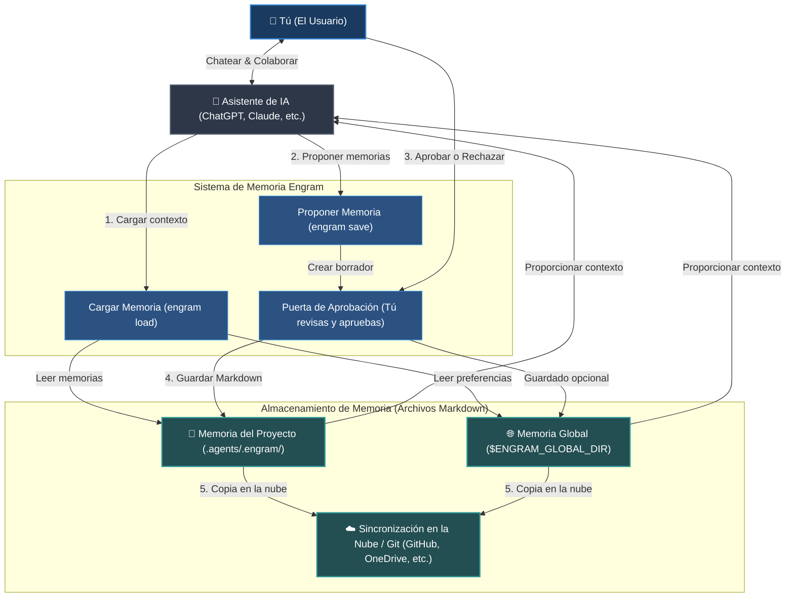

# Engram (Español)


[English](../../README.md) | [Tiếng Việt](../vi/README.md) | [Español](README.md) | [Français](../fr/README.md) | [中文](../zh/README.md) | [한국어](../ko/README.md) | [日本語](../ja/README.md) | [Русский](../ru/README.md)

**Engram es un protocolo de memoria basado en archivos y controlado por humanos para agentes de IA. Crece contigo y con tu equipo.**

Proporciona memoria a los agentes sin darles la propiedad de la misma. Las reglas duraderas, los flujos de trabajo y el conocimiento del proyecto residen en archivos Markdown legibles, revisados por humanos, portables a través de Git y utilizables por cualquier agente.

---

## Características Clave

- **Humano en el Bucle**: La IA propone candidatos a memoria; los humanos revisan y aprueban (puerta A/B/C, automatizable mediante reglas).
- **Contexto Optimizado**: Enruta y refina memorias que coinciden con la tarea en un paquete compacto (por defecto 8 archivos) para evitar saturar el contexto.
- **Nativo de Git y Archivos**: Archivos Markdown guardados en `.agents/.engram/` y sincronizados mediante Git—sin dependencia de proveedores y totalmente local.
- **Control de Privacidad**: Ejecución 100% local y escaneo de secretos e información personal (PII) antes de guardar.
- **Grafos de Prerrequisitos**: Declara dependencias (`depends_on`) para cargar automáticamente reglas base antes de tareas avanzadas.

---

### Flujo del Sistema (System Flow)



---

## Qué es Engram (El Contrato)

- **Markdown es memoria duradera** — sin formatos binarios ocultos ni propietarios.
- **El índice JSON, grafo y sqlite-vec opcional** actúan como capas de aceleración.
- **La aprobación es el límite de confianza** — el agente propone, el humano aprueba.
- **Los hashes comprueban la integridad** y las **Reglas ignore manejan la privacidad**.
- **Los perfiles aíslan los contextos de memoria** (personal, cliente y empresa).
- **Git proporciona portabilidad e historial de auditoría** — comparte reglas con tu equipo.
- **Los adaptadores son conveniencia, no autoridad**.
- **Reglas estrictas gobiernan la salida del agente** para evitar alucinaciones.

---

## Por qué existe Engram (Soluciones Prácticas)

Los archivos de reglas estándar se envían con cada mensaje, lo que satura el contexto, causa desviación, filtra secretos o te bloquea en la nube. Engram resuelve estos problemas:

| Desafío Táctico | Respuesta de Engram |
| --- | --- |
| **Demasiadas reglas saturan el contexto** | Enruta y refina memorias específicas para la tarea en un paquete compacto, por defecto de 8 memorias. |
| **Escrituras silenciosas y fugas** | Requiere aprobación humana A/B/C y escanea en busca de secretos/inyecciones. |
| **Bloqueo de proveedor** | Utiliza archivos Markdown legibles y portátiles para cualquier agente o modelo. |
| **Sin acceso sin conexión** | Se ejecuta localmente como un protocolo basado en archivos ligeros, sin servidores. |
| **Desviación de contexto en el equipo** | Sincroniza reglas y directrices en todo el equipo a través de Git. |
| **Memoria corrupta u obsoleta** | Proporciona utilidades de validación y limpieza (`engram repair`, `engram quality-check`). |

---

## Casos de Uso

- **Personal y Profesional**: Estilos de escritura, preferencias personales, listas de verificación, vocabulario, plantillas, principios de vida.
- **Desarrollo de Software**: Reglas de codificación, directrices de arquitectura, depuración, onboarding del equipo.
- **Empresarial**: Reglas de seguridad y cumplimiento, wiki SOP de equipos, tono de marca, auditoría Git.

---

## Instalación y Configuración

### 1. Instalar la CLI de Engram
```bash
npm install -g @the-long-ride/engram
```

### 2. Instalar el Skillset Globalmente
Enseña a tu asistente de IA cómo interactuar con Engram (leer, escribir, mantener):
```bash
# Listar agentes soportados
engram is list

# Instalar el skillset para tu agente
engram is --global <tu-agente>
```
*(Reemplaza `<tu-agente>` con el nombre de tu asistente; usa `agents-md` para agentes no listados que leen `AGENTS.md`.)*

Para Gemini / superficies Antigravity:
```bash
engram install-skillset gemini
```

### 3. Inicializar el Espacio de Trabajo
Ejecuta esto en la raíz del proyecto:
```bash
engram init
```
*Aviso: crea la carpeta `.agents/.engram/` local, solicita la ruta de la memoria global y permite submódulos opcionales (`--submodule`) y sincronización remota.*

---

## Guía Rápida para el Agente de IA

Puedes indicarle al agente en el chat que use los siguientes comandos:

- **Inicio de tarea**: `/engram load "design pricing table component"`
- **Guardar decisiones importantes**: `/engram save knowledge "Webhook secret is process.env.STRIPE_WEBHOOK"`
- **Resumir y guardar sesión**: `/engram save-session` (o `--query-level 3`, o `ss -a last 50 sessions` para autoaprobar)

---

## Tabla de Referencia de Comandos (Cheat Sheet)

| Tarea | Comando CLI | Sugerencia del Agente de IA |
| --- | --- | --- |
| **Cargar Memoria** | `engram load "<tarea>"` | `/engram load "<tarea>"` |
| **Simulación de Carga** | `engram load --dry-run "<tarea>"` | `/engram load --dry-run "<tarea>"` |
| **Guardar Memoria Única** | `engram save <tipo> "<texto>"` | `/engram save <tipo> "<texto>"` |
| **Proponer Sesión** | `engram save-session` | `/engram ss` |
| **Minar Sesiones Recientes** | `engram save-session --query-level <n>` | `/engram save-session --query-level <n>` |
| **Autoaprobar Guardado** | `engram save-session --accept-all` | `/engram ss -a` |
| **Importar Archivos / Docs** | `engram take-control --all` | `/engram take-control --all` |
| **Importar e Integrar** | `engram take-control --all --metacognize --accept-all` | `/engram take control accept all metacognize` |
| **Reestructurar Memoria** | `engram metacognize --workspace` | `/engram restructure workspace memory accept all` |
| **Resolver Conflictos** | `engram resolve-conflicts --metacognize` | `/engram resolve conflicts and metacognize` |
| **Ver Configuración** | `engram entry` | `/engram entry` |
| **Administrar Perfiles** | `engram profile status` / `create` / `use` | `/engram profile status` |
| **Destino de Guardado** | `engram set-save-target <workspace/global/both>` | `/engram set-save-target <target>` |
| **Límite de Tải** | `engram set-load-limit <1..32>` | `/engram set-load-limit <count>` |
| **Actualizar Ruta Global** | `engram update-global-folder <nueva-ruta>` | `/engram set global memory path to <new-path>` |
| **Clonar Memoria** | `engram clone-memory <origen> <destino>` | `/engram clone workspace memory to global` |
| **Establecer Roles** | `engram set-role <roles>` | `/engram set-role <roles>` |
| **Establecer Variante** | `engram set-rule-variant <variant>` | `/engram set-rule-variant <variant>` |
| **Verificar y Reparar** | `engram verify` / `engram repair` | `/engram verify` / `/engram repair` |
| **Escanear Conflictos** | `engram quality-check` | `/engram quality-check` |
| **Sincronizar Memorias** | `engram sync` | `/engram sync` |

---

## Comparaciones

### Con Agentmemory
[rohitg00/agentmemory](https://github.com/rohitg00/agentmemory) es un motor de memoria automático que se ejecuta en segundo plano. Engram se diferencia por enfocarse en Markdown local, revisión humana y sin demonios activos.

| Dimensión | Engram | agentmemory |
| --- | --- | --- |
| Fuente de verdad | Markdown aprobado | Servidor/base de datos de memoria |
| Confianza | Aprobación A/B/C humana | Captura automática |
| Operación | Protocolo de archivos (sin daemon) | Servicio en segundo plano recomendado |
| Revisión | Git diff y Markdown | Interfaz/API e historial |

### Con Tolaria
[refactoringhq/tolaria](https://github.com/refactoringhq/tolaria) es una aplicación Markdown para escritorio. Engram opera a un nivel inferior, ofreciendo CLI y skillsets integrados en Git.

| Dimensión | Engram | Tolaria |
| --- | --- | --- |
| Fuente de verdad | `.agents/.engram/` | Bóvedas de Markdown |
| Interfaz | CLI y skillset | Aplicación de escritorio |

### Con Obsidian
[Obsidian](https://obsidian.md/) es una aplicación de notas personales. Engram es un protocolo para agentes: con un alcance menor, aprobación estricta y control de versiones mediante Git.

| Dimensión | Engram | Obsidian |
| --- | --- | --- |
| Fuente de verdad | `.agents/.engram/` | Notas Markdown locales |
| Control | Aprobación explícita | Edición directa |

### Con Hermes Agent
Hermes Agent utiliza memoria autónoma con caps rígidos, mientras que Engram es propiedad humana (automatizable) con recuperación bajo demanda basada en tags/grafos.

| | Engram | Hermes Agent |
|---|---|---|
| **Filosofía** | Humano, basado en archivos (automatización opcional) | Autónomo, memoria siempre activa |
| **Almacenamiento** | Markdown en `.agents/.engram/` | `MEMORY.md` + `USER.md` (caps de caracteres) |
| **Escritura** | Aprobado por el usuario (automatizable via reglas) | El agente escribe autónomamente |
| **Recuperación** | Bajo demanda via `engram load` | Siempre activo en system prompt |
| **Búsqueda Vector** | Opcional sqlite-vec local | Proveedor externo (agentmemory) |

### Con Memoria Integrada
La memoria integrada (ChatGPT, Claude Projects, Cursor) está bloqueada. Engram utiliza archivos locales, permitiendo compartir vía Git, escaneo de secretos y portabilidad multi-agente.

| Dimensión | Engram | Memoria Integrada |
| --- | --- | --- |
| **Portabilidad** | Markdown accesible por cualquier agente | Bloqueada en una plataforma |
| **Control Humano** | Aprobación explícita A/B/C | Actualizaciones silenciosas de fondo |

---

## Documentación

La documentación completa reside en `documentation/`:
- [English](../../README.md) | [Tiếng Việt](../vi/README.md) | [Español](index.md) | [Français](../fr/README.md) | [中文](../zh/README.md) | [한국어](../ko/README.md) | [日本語](../ja/README.md) | [Русский](../ru/README.md)

## Roadmap y Proyecto Compañero
Trabajamos en el **Sitio de documentación**, la **Integración de Web Chat AI** y la **Mejora del mapeo de comandos en lenguaje natural**. 
Para explorar tus carpetas Markdown visualmente, utiliza [Markdown Explorer](https://the-long-ride.github.io/markdown-explorer/).

## Licencia y Cambios
Licencia bajo [GPL-3.0](LICENSE). Consulta el [Changelog](https://github.com/the-long-ride/engram/blob/main/CHANGELOG.md).
