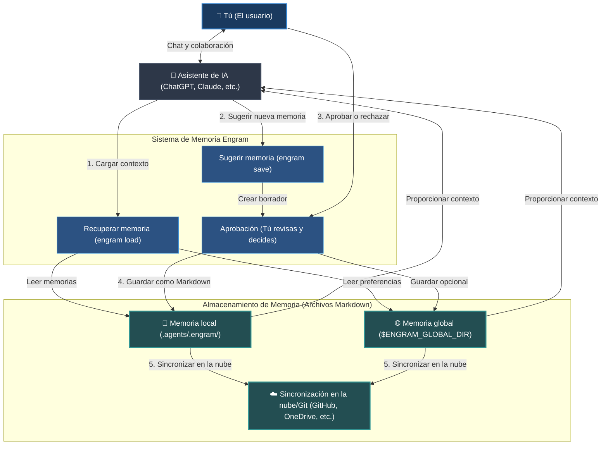

# Engram (Español)


[English](../../README.md) | [Tiếng Việt](../vi/README.md) | [Español](README.md) | [Français](../fr/README.md) | [中文](../zh/README.md) | [한국어](../ko/README.md) | [日本語](../ja/README.md) | [Русский](../ru/README.md)

**Engram es un protocolo de memoria de propiedad humana para agentes de IA. Crece contigo y con tus equipos.**

Ofrece memoria a los agentes sin darles la propiedad de la misma. Las reglas duraderas, los flujos de trabajo y el conocimiento del proyecto viven como Markdown legible, revisado por humanos, portátil a través de Git y utilizable por cualquier agente capaz de leer archivos.

---

## Qué Es

Engram es un centro de memoria de conocimiento para el espacio de trabajo, el proyecto, el equipo y el contexto personal.

No es un cerebro oculto de un agente. No es un silo de memoria de un proveedor. No es una base de datos que solo una herramienta entiende.

El contrato de Engram:

- **Markdown es memoria duradera.**
- **JSON index, grafos y sqlite-vec opcionales son capas de aceleración.**
- **La aprobación es el límite de confianza.**
- **Los hashes son comprobaciones de integridad.**
- **Las reglas de omisión son controles de privacidad.**
- **Los perfiles aíslan contextos de memoria.** Mantén la memoria de empresa, cliente y personal en perfiles tipo navegador para que el contexto usado con API externas o agentes de la empresa no se filtre a proyectos personales.
- **Git proporciona portabilidad e historial de auditoría.**
- **Los adaptadores son conveniencia, no autoridad.**
- **Las reglas estrictas rigen la salida del agente.** Cargue la memoria de conocimiento con reglas estrictas (strict-rules) para controlar, guiar y restringir las salidas del agente de IA.

El principio fundamental: **los agentes pueden sugerir memoria, pero los humanos poseen lo que se convierte en memoria.**

### Flujo de Trabajo del Sistema (High-Level Flow)



---

## Por Qué Existe

Los asistentes y agentes de IA olvidan las decisiones, repiten preguntas de configuración y llevan lecciones útiles solo dentro de un chat, una cuenta de proveedor o una máquina. Eso es conveniente hasta que un equipo necesita revisar, compartir, corregir o eliminar la memoria.

Además, los enfoques actuales de memoria de IA se enfrentan a graves desafíos tácticos:

- **Saturación del contexto (Context Window Bloat):** Los archivos de reglas estándar (como `.cursorrules` o las instrucciones del sistema) se envían con cada mensaje. A medida que las reglas crecen, consumen los límites de tokens, aumentan los costos y ralentizan los tiempos de respuesta.
- **Desviación del contexto y alucinación:** En sesiones de chat largas, los agentes se desvían de las instrucciones, inventan sintaxis o alucinan comportamientos debido a que la memoria carece de estructura y filtrado.
- **Fugas silenciosas de secretos:** Las herramientas automáticas de captura de memoria en segundo plano pueden registrar silenciosamente claves confidenciales, tokens de API, contraseñas o información de identificación personal (PII) sin su consentimiento o conocimiento.
- **Bloqueo del proveedor (Vendor Lock-In):** Las bases de datos de memoria propiedad del proveedor mantienen su contexto bloqueado en una plataforma o proveedor de modelos específico, lo que imposibilita cambiar de asistente o respaldar sus datos.
- **Flujos de trabajo sin conexión dañados:** Los sistemas de memoria basados en la nube dejan de funcionar en el momento en que se pierde la conexión a Internet, dejando a su agente sin un contexto crucial.

Engram mueve la memoria a archivos para resolver estos problemas:

| Desafío Táctico | Solución de Engram |
| --- | --- |
| **Demasiadas reglas saturando el contexto** | Enruta y refina la memoria coincidente con la tarea en un paquete de contexto compacto, con 8 memorias por defecto. |
| **Escrituras silenciosas y fugas de secretos** | Requiere aprobación humana A/B/C y escanea secretos/inyecciones. |
| **Bloqueo del proveedor** | Utiliza archivos Markdown legibles y portátiles para cualquier agente o modelo de IA. |
| **Sin acceso sin conexión** | Funciona localmente como un protocolo ligero basado en archivos, sin servidores externos. |
| **Desviación del contexto en proyectos de equipo** | Sincroniza y comparte reglas y directrices en todo el equipo a través de Git. |
| **Memoria dañada o desactualizada** | Proporciona herramientas de validación y limpieza (`engram verify`, `engram repair`). |

La memoria del espacio de trabajo se carga primero. La memoria global es el respaldo. Cuando la memoria global está configurada, los flujos de guardado aprobados en el espacio de trabajo también mantienen una copia global, por lo que la memoria portátil sobrevive incluso en espacios de trabajo que no han ejecutado `engram init`.
Cuando las consultas amplias coinciden con más memorias que el límite de carga configurado, `engram load` vuelve a clasificar con etiquetas, tipo, antigüedad, grafo y señales vectoriales sqlite-vec opcionales antes de cargar el paquete compacto. La carga normal muestra seleccionadas y total relacionado, como `loaded 8 memory files / 14 total related memories`. Utilice `engram load --dry-run "<tarea>"` para previsualizar conteos relacionados y etiquetas sugeridas, `engram set-load-limit 1..32` para ajustar el valor, o `--all` cuando el contexto amplio sea intencional.

Las memorias también pueden declarar dependencias con `depends_on` y un nivel opcional como `level: advanced`. El grafo ordena esas memorias desde fundamentos hasta niveles profundos, y `engram load` mantiene los prerrequisitos junto a la memoria dependiente en el paquete compacto. Durante `engram save`, la vista previa avisa cuando una candidata se parece a memorias existentes y puede sugerir `depends_on` o limpieza de duplicados antes de guardar.

---

## Casos de Uso de Ejemplo

Engram es versátil y se puede utilizar para cualquier memoria personal, profesional o de desarrollo.

### Para Memoria Personal y Profesional
- **Preferencias Personales y Estilo de Escritura:** Enseña a tu asistente de IA cómo te gusta comunicarte, tu tono preferido, opciones de formato o plantillas de correo electrónico/blog para que siempre redacte contenido exactamente como deseas.
- **Notas de Estudio y Guías de Aprendizaje:** Almacena resúmenes de temas que estás estudiando, fórmulas clave, vocabulario de idiomas extranjeros o conceptos complejos que hayas dominado, lo que permite que la IA te examine o te explique cosas usando tu propio contexto pasado.
- **Listas de Verificación de Flujo de Trabajo:** Mantén plantillas personalizadas y listas de verificación paso a paso para tareas recurrentes, como listas de verificación de edición de video, procedimientos de publicación de publicaciones de blog o plantillas de planificación de viajes.
- **Reglas y Principios de Vida Personal:** Documenta hábitos personales, metas financieras, recetas o rutinas de salud para que tu asistente de IA pueda ayudarte a planificar comidas, presupuestos o administrar tareas de acuerdo con tus pautas.

### Para Desarrollo de Software y Tecnología
- **Reglas y Directrices del Repositorio:** Documenta las convenciones de estilo de la base de código, las directrices arquitectónicas o reglas específicas (p. ej., "Siempre escriba pruebas unitarias para los endpoints") para que cualquier agente de codificación se adhiera a ellas.
- **Guías de Solución de Problemas y Depuración:** Guarda soluciones a errores complejos, soluciones alternativas de hardware o pasos de configuración del entorno para que los futuros agentes (y miembros del equipo) no pierdan tiempo solucionando el mismo problema dos veces.
- **Comandos CLI y Flujos de Trabajo Comunes:** Mantén a mano una lista de scripts específicos del repositorio, flujos de ejecución de pruebas y comandos de implementación.
- **Onboarding y Alineación del Equipo:** Sincroniza la descripción general de la arquitectura de tu proyecto y los problemas comunes directamente a través de Markdown controlado por versiones, manteniendo a todo el equipo alineado.

### Para Empresas y Equipos
- **Salvaguardas de Seguridad y Cumplimiento:** Define protocolos de cumplimiento estrictos, directrices de privacidad de datos o políticas de seguridad que los agentes de IA no deben violar al manejar datos de la organización o de los clientes.
- **Procedimientos Operativos Estándar Compartidos (SOP):** Almacena y controla las versiones de las SOP del equipo, las especificaciones del producto, los manuales de servicio al cliente y las wikis de la empresa como memorias Markdown.
- **Voz de Marca y Guía de Estilo Coherentes:** Aplica directrices de marketing, reglas de marcas comerciales y descargos de responsabilidad legal en todo el contenido creado por el equipo y en los agentes externos.
- **Pistas de Auditoría y Gobernanza:** Mantén registros históricos completos de quién modificó qué directrices, cuándo y por qué a través de los registros de git, satisfaciendo los requisitos de auditoría de seguridad de la empresa.

---

## Inicio Rápido para Agentes de IA

Para el uso diario, permita que su asistente de IA maneje la carga de memoria y los flujos de guardado directamente dentro del chat.

### Mejores Escenarios (Uso del Chat de IA)

- **Inicio de una sesión de chat:** Dile a tu asistente de IA que recuerde las directrices o preferencias relevantes para tu tarea.
  ```text
  # Si instala el skillset globalmente, los agentes compatibles ejecutan automáticamente engram load al inicio de la sesión y en los cambios de tarea.
  /engram load "design pricing table component"
  ```
- **Proponer Nueva Memoria:** Pídele al agente que guarde una decisión o hecho importante descubierto durante la conversación.
  ```text
  /engram save knowledge "Stripe webhook secret is loaded from process.env.STRIPE_WEBHOOK_SECRET"
  ```
- **Resumir y Guardar la Sesión:** Al final de una sesión, pídele al agente que agrupe todas las nuevas reglas, flujos de trabajo o hechos.
  ```text
  /engram save-session
  ```
  Para pedirle al agente que incluya el historial de chat reciente al que realmente puede acceder, pase un nivel de consulta de entero positivo:
  ```text
  /engram save-session --query-level 3
  ```
  El agente debe extraer hasta esa cantidad de sesiones de chat recientes entre humano y agente, incluida la sesión actual, y no debe inventar historial no disponible.
  Para extraer el historial accesible reciente y autoaprobar todas las memorias recomendadas, use:
  ```text
  /engram ss -a last 50 sessions
  ```
  Esto se normaliza a `engram save-session --query-level 50 --accept-all`; `-a` es la aprobación explícita del humano para todos los candidatos generados.

Para obtener detalles completos y funciones avanzadas, consulte la [Documentación](index.md).

---

## Instalación y Configuración

Configure la CLI de Engram y adáptela para su asistente de IA.

### 1. Instalar la CLI de Engram
Instale la herramienta globalmente en su sistema:
```bash
npm install -g @the-long-ride/engram
```

### 2. Instalar el Skillset Globalmente
Enseña a tu asistente de IA global cómo interactuar con Engram (cargas, guardados, actualizaciones y mantenimiento):
```bash
# Puede utilizar el siguiente comando primero para comprender.
# engram h is
# Utilice el comando siguiente para conocer el nombre del objetivo de los agentes compatibles.
engram is list
```
```bash
# Instalar en su asistente de IA como alcance global para la carga automática de memoria al inicio de la tarea + la capacidad de usar comandos /engram manualmente
engram is --global <tu-agente>
# Si su agente no está en la lista pero lee AGENTS.md, use el objetivo genérico de respaldo.
engram is --global agents-md
```
*(Reemplace `<tu-agente>` con el nombre de su asistente en el resultado de `engram is list`; use `agents-md` when su agente no esté en la lista pero lea `AGENTS.md`.)*

Para Antigravity, utilice el objetivo del ecosistema unificado:
```bash
engram install-skillset antigravity
```
Esto escribe la guía de espacio de trabajo `.antigravity/`, `.antigravity-cli/`, `.antigravity-ide/` y `.antigravityrules`. El antiguo nombre de destino `antigravity-cli` se sigue aceptando solo como un alias de compatibilidad.

### 3. Inicializar el Espacio de Trabajo
Ejecute esto en la carpeta raíz de cualquier proyecto o espacio de trabajo en el que desee habilitar Engram:
```bash
engram init
```

> [!IMPORTANT]
> **Qué tener en cuenta durante la inicialización (`engram init`):**
> - **Memoria del Espacio de Trabajo:** Crea un directorio local `.agents/.engram/` para almacenar sus memorias específicas del proyecto.
> - **Opción de Submódulo Git:** Utilice `engram init --submodule` si su equipo desea realizar un seguimiento de las memorias en un repositorio Git independiente y dedicado.
> - **Memoria Global Personal:** Solicita una ruta de directorio global (por ejemplo, `--global-path ~/engram-global`). Esto sirve como una ubicación de respaldo para configuraciones personales que persisten en todos sus proyectos.
> - **Copia de Seguridad y Sincronización en la Nube:** Configure una URL de repositorio global (`--global-remote <git-url>`) o configure OneDrive/ Google Drive/ Dropbox para sincronizar y respaldar sus memorias sin problemas.

---

## Configuración y Siguientes Comandos

Una vez inicializado, configure las opciones activas y el comportamiento de sincronización. Se admiten tanto los comandos de la CLI como sus equivalentes de barra diagonal del agente de IA.

### Configurar Roles de Desarrollador
Filtre la carga de memoria activa por roles de desarrollo específicos (por ejemplo, `frontend`, `backend`, `security`, `docs`).
- **CLI:**
  ```bash
  # Filtrar la carga de memoria a frontend y reglas de diseño
  engram set-role frontend design

  # Borrar roles activos para cargar todas las memorias sin filtrar
  engram set-role
  ```
- **Chat del Agente de IA:**
  ```text
  /engram set-role frontend design
  /engram set-role
  ```

### Configurar Variante de Reglas (Nivel de Estrictez)
Sintonice qué tan estrictamente se formatean las reglas cuando las carga su asistente de IA:
- **CLI:**
  ```bash
  # strict: salida más nítida para modelos pequeños/de bajo nivel; puede causar un "brainlock" (sobre-restricción) en modelos avanzados de nivel frontal (por ejemplo, Claude Opus 3.5, GPT-5.5)
  # balanced/light: mantiene el razonamiento flexible y óptimo para modelos avanzados
  engram set-rule-variant balanced
  ```
- **Chat del Agente de IA:**
  ```text
  /engram set-rule-variant balanced
  ```

### Siguientes Comandos Adicionales
- **Comprobar la configuración activa y las rutas activas:** `engram entry` (Agente: `/engram entry`)
- **Sincronizar cambios locales y globales:** `engram sync` (Agent: `/engram sync`)
- **Configurar destino de guardado:** `engram set-save-target workspace|global|both|status` (Agente: `/engram set-save-target status`)
- **Configurar límite de carga:** `engram set-load-limit 1..32|status|reset` (Agente: `/engram set-load-limit status`)
- **Gestionar perfiles aislados:** `engram profile status` / `engram profile merge personal company --dry-run` (Agente: `/engram profile status`)
- **Reestructurar carpeta de memoria:** `engram metacognize --workspace|--global|--all --accept-all` (Agente: `/engram restructure workspace memory accept all`)
- **Clonar memoria workspace/global:** `engram clone-memory workspace global` / `engram clone-memory global workspace --force` (Agente: `/engram clone workspace memory to global`) (`--metacognize` routes cloned memories through save-session-style approval instead of raw copy.)
- **Ejecutar revisión y limpiar enlaces rotos:** `engram verify` / `engram repair` (Agente: `/engram verify` / `/engram repair`)
- **Escaneo asesor de contradicciones:** `engram quality-check` (Agente: `/engram quality-check`)

---

## Tabla de Equivalencias: Comando CLI vs. Agente de IA

| Tarea | Comando CLI | Sugerencia para el Agente (Slash Command) |
| --- | --- | --- |
| **Cargar Memoria** | `engram load "<tarea>"` | `/engram load "<tarea>"` |
| **Vista Previa de Carga** | `engram load --dry-run "<tarea>"` | `/engram load --dry-run "<tarea>"` |
| **Guardar Memoria Única** | `engram save <tipo> "<texto>"` | `/engram save <tipo> "<texto>"` |
| **Proponer Varias Memorias** | `engram save-session` | `/engram ss` |
| **Extraer Sesiones de Chat Recientes** | `engram save-session --query-level 3` | `/engram save-session --query-level 3` |
| **Autoaprobar Candidatos para Guardar** | `engram save-session --accept-all` | `/engram ss -a` |
| **Extraer y Autoaprobar Sesiones Recientes** | `engram save-session --query-level 50 --accept-all` | `/engram ss -a last 50 sessions` |
| **Importar Archivos / Documentos Existentes** | `engram take-control --all` | `/engram take-control --all` |
| **Reestructurar Carpeta de Memoria** | `engram metacognize --workspace` / `engram metacognize --all --accept-all` | `/engram restructure workspace memory accept all` |
| **Comprobar Rutas / Configuración** | `engram entry` | `/engram entry` |
| **Verificar Integridad de la Memoria** | `engram verify` | `/engram verify` |
| **Configurar Roles Activos** | `engram set-role <roles>` | `/engram set-role <roles>` |
| **Configurar Variante de Regla** | `engram set-rule-variant <variante>` | `/engram set-rule-variant <variante>` |
| **Configurar Destino de Guardado** | `engram set-save-target <destino>` | `/engram set-save-target <destino>` |
| **Configurar Límite de Carga** | `engram set-load-limit <cantidad>` | `/engram set-load-limit <cantidad>` |
| **Gestionar Perfiles** | `engram profile status` / `engram profile merge personal company --dry-run` | `/engram profile status` |
| **Clonar Memoria Workspace/Global** | `engram clone-memory workspace global` / `engram clone-memory workspace global --metacognize` | `/engram clone workspace memory to global` |
| **Sincronizar Memorias** | `engram sync` | `/engram sync` |
| **Reconstruir y Reparar Índice** | `engram repair` | `/engram repair` |


## Documentación

La documentación completa se encuentra en el repositorio bajo `documentation/`; el paquete npm incluye intencionalmente este README y la documentación/recursos en tiempo de ejecución que necesita la CLI, no todo el árbol de documentación.

| Idioma | Empiece aquí |
| --- | --- |
| Inglés | [documentation/en/index.md](../en/index.md) |
| Vietnamita | [documentation/vi/index.md](../vi/index.md) |
| Español | [documentation/es/index.md](index.md) |
| Francés | [documentation/fr/index.md](../fr/index.md) |
| Chino | [documentation/zh/index.md](../zh/index.md) |
| Coreano | [documentation/ko/index.md](../ko/index.md) |
| Japonés | [documentation/ja/index.md](../ja/index.md) |
| Ruso | [documentation/ru/index.md](../ru/index.md) |

Cada idioma incluye páginas de descripción general, mentalidad, inicio rápido para agentes de IA, protocolo, operaciones y comparación.

## Ventajas

- Fuente de verdad en Markdown simple.
- Aprobación humana antes de escrituras duraderas.
- Historial de revisión, historial, sincronización y recuperación amigables con Git.
- Prioridad en el espacio de trabajo con respaldo global opcional.
- Agnóstico del agente: Codex, Claude, Cursor, Gemini, Copilot, OpenCode, Antigravity, Cline, Windsurf y cualquier agente capaz de leer archivos pueden usarlo.
- Enrutamiento compacto por defecto, con vistas previas de refinamiento dry-run y sidecars sqlite-vec opcionales para ámbitos de memoria grandes.
- Capas de seguridad: validación de esquemas, escaneo de secretos, escaneo de inyección de prompts, hashes y reglas de omisión.
- Útiles flujos de mantenimiento: observe, take-control, graph, archive, benchmark, repair.
- No se requiere daemon, base de datos ni cuenta en la nube; sqlite-vec es un sidecar local opcional, no la fuente de verdad.

## Desventajas

- Menos automático que los motores de memoria que capturan todo en segundo plano.
- La búsqueda predeterminada es una búsqueda léxica determinista; `search --semantic` agrega similitud local determinista, no búsqueda semántica respaldada por embeddings.
- El enrutamiento sqlite-vec opcional utiliza vectores de palabras con hash local, no servicios de embedding externos.
- La detección de contradicciones es heurística y consultiva.
- `deduplicate --semantic` utiliza similitud local determinista, no embeddings externos.
- La minería de patrones, el almacenamiento cifrado y la automatización completa de PR son áreas de diseño, aún no flujos de trabajo completos en tiempo de ejecución.

## Comparado con Agentmemory

[rohitg00/agentmemory](https://github.com/rohitg00/agentmemory) es un potente motor de memoria automática para agentes de codificación, con memoria de estilo servidor, integración MCP/hooks/REST, flujos de reproducción/visor, afirmaciones de benchmark, recuperación híbrida e integraciones como Hermes.

Engram elige un centro de gravedad diferente.

| Dimensión | Engram | agentmemory |
| --- | --- | --- |
| Fuente de verdad | Markdown aprobado por humanos | Servidor/almacén de memoria |
| Límite de confianza | Aprobación A/B/C antes de escribir | Captura automática más gobernanza de herramientas |
| Forma predeterminada | Protocolo de archivos, no requiere daemon; sidecar sqlite-vec opcional para grandes ámbitos | Se recomienda servicio en ejecución |
| Modelo de revisión | Git diff y revisión de Markdown | Visor/API/historial de sesiones |
| Mejor para | Propiedad y auditabilidad de la memoria del equipo | Recuerdo automático y reproducción |
| Riesgo principal | Requiere disciplina de guardado | Puede convertirse en un estado invisible sin gobernanza |

Use agentmemory cuando desee captura automática, reproducción, recuperación de vectores y muchas herramientas de memoria en vivo.

Use Engram cuando desee que la memoria sea aburrida de la mejor manera: archivos, revisión, hashes, Git y propiedad humana.

## Comparado con Tolaria

[refactoringhq/tolaria](https://github.com/refactoringhq/tolaria) es una excelente aplicación de escritorio para administrar bases de conocimiento Markdown. Es primero archivos, primero Git, primero sin conexión, basada en estándares y diseñada para grandes bóvedas personales o de equipo que también pueden convertirse en un contexto útil para los agentes de IA.

Engram se sitúa más abajo en la pila. No es una aplicación de escritorio para bases de conocimiento; es un protocolo de memoria, una CLI y un conjunto de habilidades de agentes para la memoria gobernada de los agentes.

| Dimensión | Engram | Tolaria |
| --- | --- | --- |
| Fuente de verdad | Memorias aprobadas por humanos en `.agents/.engram/` | Notas de bóveda Markdown con frontmatter YAML |
| Interfaz principal | CLI, adaptadores slash, envoltura estilo MCP y Markdown legible por el agente | Aplicación de escritorio multiplataforma |
| Modelo de escritura | Los agentes proponen; los humanos aprueban las escrituras de memoria duradera | Los humanos administran directamente una base de conocimientos Markdown |
| Ámbito | Reglas, flujos de trabajo, habilidades y memoria del agente de proyecto/equipo/personal | Bases de conocimiento amplias y segundos cerebros personales o de equipo |
| Forma de ejecución | No requiere daemon, cuenta en la nube ni aplicación de escritorio; sidecar sqlite-vec local opcional | Aplicación de escritorio Tauri para macOS, Windows y Linux |
| Mejor para | Gobernanza de memoria auditable entre agentes y repositorios | Navegar, editar y organizar grandes bóvedas Markdown |
| Riesgo principal | Requiere disciplina de guardado | Más superficie de aplicación de la necesaria si solo desea un protocolo de memoria de agentes |

Use Tolaria cuando desee un hogar de escritorio completo para notas de Markdown, navegación por bóvedas y trabajo de conocimiento primero con el teclado.

Use Engram cuando desee que la capa de memoria del agente sea un protocolo pequeño y gobernado con puertas de aprobación, hashes, diferencias de Git e instrucciones del agente instalables.

## Comparado con Obsidian

[Obsidian](https://obsidian.md/) es una excelente aplicación basada primero en Markdown para notas personales, bases de conocimiento vinculadas, escritura, planificación y bóvedas de larga duración. Almacena notas localmente, tiene un gran ecosistema de complementos y temas, y ofrece servicios opcionales de sincronización y publicación.

Engram no está tratando de ser una aplicación para tomar notas. Es un protocolo de memoria gobernado para agentes de IA: de menor alcance, más estricto con respecto a la aprobación y diseñado para que la memoria duradera del agente se pueda revisar como el código.

| Dimensión | Engram | Obsidian |
| --- | --- | --- |
| Fuente de verdad | Memorias aprobadas por humanos en `.agents/.engram/` | Notas locales de la bóveda Markdown |
| Interfaz principal | CLI, adaptadores slash, envoltura estilo MCP y Markdown legible por el agente | Aplicación de notas para escritorio y móvil con enlaces, grafos, canvas, plugins y temas |
| Modelo de escritura | Los agentes proponen; los humanos aprueban las escrituras de memoria duradera | Los humanos y los complementos editan las notas de la bóveda directamente |
| Ámbito | Reglas, flujos de trabajo, habilidades y memoria del agente de proyecto/equipo/personal | Notas personales o de equipo, escritura, planificación y bases de conocimiento |
| Forma de ejecución | No requiere app, daemon ni cuenta en la nube; sidecar sqlite-vec local opcional | Obsidian app, con sincronización, publicación y complementos comunitarios opcionales |
| Integración de IA | Instrucciones de agente instalables y flujos de memoria con aprobación previa | Las bóvedas pueden convertirse en contexto de IA a través de complementos, servidores MCP o flujos de trabajo personalizados |
| Mejor para | Gobernanza auditable de memoria entre múltiples agentes | Toma de notas Markdown enriquecida y flujos de trabajo de segundo cerebro |
| Riesgo principal | Requiere disciplina de guardado | El contexto del agente puede volverse amplio o no revisado sin una capa de gobernanza separada |

Use Obsidian cuando desee un espacio de trabajo completo para pensar, escribir y navegar por notas.

Use Engram cuando desee que la capa de memoria del agente permanezca pequeña, explícita, revisable, portátil y gobernada.

También pueden trabajar juntos: mantenga notas amplias en Obsidian y luego destile reglas duraderas de agentes de IA y conocimiento del proyecto en Engram.

## Comparado con la Memoria Integrada del Agente

La memoria integrada del asistente de IA (como la memoria de ChatGPT, los proyectos de Claude o la configuración de reglas de Cursor) es conveniente, pero a menudo está bloqueada en un solo host. Puede ser difícil de comparar (diff), exportar, auditar, compartir o corregir.

Engram trata la memoria integrada como una capa de conveniencia, no de autoridad. La autoridad es la carpeta de memoria que los humanos pueden inspeccionar.

| Dimensión | Engram | Memoria Integrada del Agente |
| --- | --- | --- |
| **Portability** | Multiagente y multiplataforma: archivos Markdown simples legibles por cualquier editor o agente. | Bloqueado en una sola plataforma (por ejemplo, solo en ChatGPT Web o solo en Cursor). |
| **Control Humano** | Explícito: los agentes proponen borradores de memoria, pero los humanos revisan y aprueban (puerta A/B/C) antes de escribir. | Silencioso/Caja negra: el asistente actualiza la memoria en segundo plano sin revisión del usuario. |
| **Colaboración** | Compatible con Git: comparta la memoria del proyecto con todo el equipo a través del control de versiones. | Solo para un usuario: no hay una forma nativa de compartir, fusionar o colaborar en las memorias. |
| **Seguridad y Privacidad** | Seguro: busca PII y secretos antes de escribir, y funciona 100% localmente/sin conexión. | Alto riesgo: puede capturar y cargar silenciosamente claves API, contraseñas y datos confidenciales de la empresa. |
| **Optimización de Prompts** | Selectivo: carga solo los archivos de memoria relevantes para la tarea actual o el rol del desarrollador. | Monolítico: vuelca todas las instrucciones en el contexto o utiliza vectores opacos en el backend. |

Use la memoria integrada cuando desee personalización en segundo plano con manos libres en una sola plataforma de chat web.

Use Engram cuando desee que la memoria de su asistente sea auditable, compartida con su equipo, portátil a través de múltiples IDE y controlada al 100% por usted.

---

## Hoja de Ruta

Estamos expandiendo Engram para admitir sin problemas interfaces de IA basadas en web y sincronización de almacenamiento en la nube:

- **Integración con Chat Web de IA:** Desarrollar extensiones de navegador (Chrome/Firefox) y complementos web nativos que permitan que la memoria de Engram funcione directamente en clientes de chat web como ChatGPT, Claude.ai y Gemini Web.
- **Almacenamiento Git y en la Nube Vinculado:** Hacer que `engram` esté disponible para los usuarios que utilizan asistentes de IA basados en la web para cargar la memoria directamente desde un repositorio de GitHub vinculado, Google Drive, OneDrive o una carpeta de Dropbox del usuario.
- **Mapeo de Comandos de Lenguaje Natural:** Permitir que los agentes de IA mapeen comandos conversacionales (p. ej., "Oye, recuerda que usamos HSL" o "Revisa el estado de mi banco de memoria") directamente en las acciones correspondientes de Engram sin requerir comandos de barra diagonal rígidos.

---

## Proyecto Compañero: Markdown Explorer

¿Necesita una forma visual de navegar y buscar sus archivos Markdown? Eche un vistazo a [Markdown Explorer](https://the-long-ride.github.io/markdown-explorer/), una extensión de VS Code / aplicación de escritorio ligera y de código abierto (MIT) (Windows, Linux, macOS) para explorar, visualizar y buscar a través de sus carpetas Markdown locales. Funciona de manera hermosa junto con Engram para ayudarlo a examinar sus reglas, habilidades y archivos de conocimiento del agente directamente en la carpeta de memoria de Engram.

---

## Licencia

[Licencia GPL-3.0](LICENSE)
