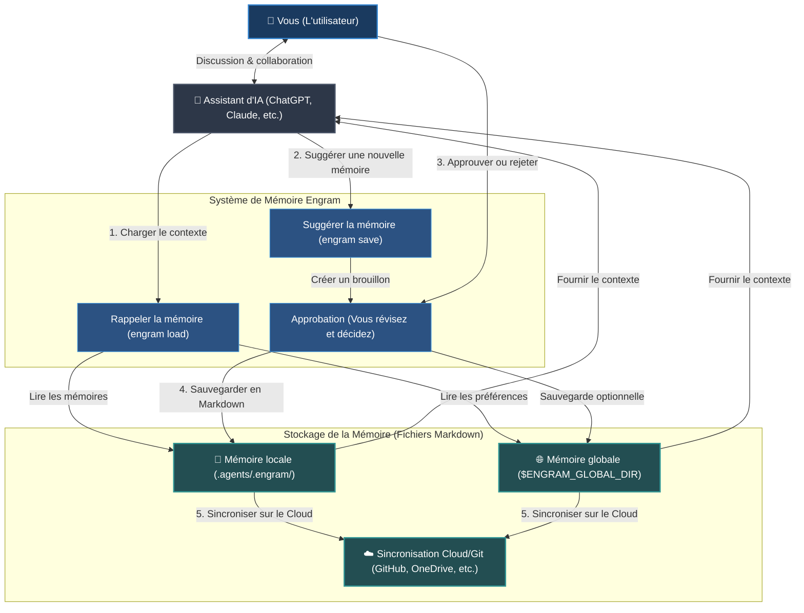

# Engram (Français)


[English](../../README.md) | [Tiếng Việt](../vi/README.md) | [Español](../es/README.md) | [Français](README.md) | [中文](../zh/README.md) | [한국어](../ko/README.md) | [日本語](../ja/README.md) | [Русский](../ru/README.md)

**Engram est un protocole de mémoire sous le contrôle de l'utilisateur pour les agents d'IA. Il grandit avec vous et vos équipes.**

Il donne de la mémoire aux agents sans leur en accorder la propriété. Les règles durables, les flux de travail et les connaissances du projet vivent sous la forme de fichiers Markdown lisibles, révisés par des humains, portables via Git et exploitables par tout agent capable de lire des fichiers.

---

## Qu'est-ce que c'est

Engram est un centre de mémoire de connaissances pour l'espace de travail, le projet, l'équipe et le contexte personnel.

Ce n'est pas un cerveau d'agent caché. Ce n'est pas un silo de mémoire propriétaire d'un fournisseur. Ce n'est pas une base de données que seul un outil comprend.

Le contrat d'Engram :

- **Markdown est une mémoire durable.**
- **L'index JSON, les graphes et sqlite-vec optionnels sont des couches d'accélération.**
- **L'approbation est la limite de confiance.**
- **Les hashes sont des vérifications d'intégrité.**
- **Les règles d'exclusion sont des contrôles de confidentialité.**
- **Les profils isolent les contextes mémoire.** Gardez les mémoires d'entreprise, client et personnelle dans des profils type navigateur afin que le contexte utilisé avec des API externes ou des agents fournis par l'entreprise ne fuite pas vers les projets personnels.
- **Git fournit la portabilité et l'historique d'audit.**
- **Les adaptateurs sont des commodités, pas des autorités.**
- **Des règles strictes régissent la sortie de l'agent.** Chargez la mémoire de connaissances avec des règles strictes (strict-rules) pour contrôler, guider et contraindre les sorties de l'agent d'IA.

Le principe de base : **les agents peuvent suggérer de la mémoire, mais les humains possèdent ce qui devient de la mémoire.**

### Flux de Fonctionnement du Système (High-Level Flow)



---

## Pourquoi Il Existe

Les assistants et agents d'IA oublient les décisions, répètent les questions de configuration et transportent les leçons utiles uniquement au sein d'un seul chat, d'un seul compte fournisseur ou d'une seule machine. C'est pratique jusqu'à ce qu'une équipe ait besoin de réviser, partager, corriger ou supprimer cette mémoire.

De plus, les approches actuelles de la mémoire des IA sont confrontées à de sérieux défis tactiques :

- **Surcharge du contexte (Context Window Bloat) :** Les fichiers de règles standard (comme `.cursorrules` ou les prompts système) sont envoyés avec chaque message. Au fur et à mesure que les règles s'accumulent, elles consomment les limites de tokens, entraînent des coûts supplémentaires et ralentissent les temps de réponse.
- **Dérive du contexte & Hallucination :** Dans les longues sessions de chat, les agents s'écartent des instructions, inventent de la syntaxe ou hallucnent des comportements parce que la mémoire manque de structure et de filtrage.
- **Fuite silencieuse de secrets :** Les outils de capture de mémoire automatique en arrière-plan peuvent enregistrer silencieusement des clés privées, des tokens d'API, des mots de passe ou des informations d'identification personnelle (PII) à votre insu.
- **Verrouillage fournisseur (Vendor Lock-In) :** Les bases de données de mémoire détenues par les fournisseurs verrouillent votre contexte sur une plateforme ou un fournisseur de modèles spécifique, ce qui rend impossible le changement d'assistant ou la sauvegarde autonome de vos données.
- **Workflows hors ligne cassés :** Les systèmes de mémoire basés sur le cloud s'arrêtent dès que vous perdez votre connexion Internet, laissant votre agent sans contexte crucial.

Engram déplace la mémoire dans des fichiers pour résoudre ces problèmes :

| Défi Tactique | Solution d'Engram |
| --- | --- |
| **Surcharge du contexte par trop de règles** | Route et affine la mémoire correspondant à la tâche dans un pack de contexte compact, avec 8 mémoires par défaut. |
| **Écritures silencieuses et fuite de secrets** | Requiert l'approbation humaine A/B/C et analyse les secrets/injections. |
| **Verrouillage fournisseur** | Utilise des fichiers Markdown lisibles et portables pour tout agent ou modèle d'IA. |
| **Aucun accès hors ligne** | Fonctionne entièrement en local en tant que protocole léger de fichiers, sans serveurs externes. |
| **Dérive du contexte dans les projets d'équipe** | Synchronise et partage les règles et guides dans toute l'équipe via Git. |
| **Mémoire corrompue ou obsolète** | Fournit des outils de validation et de nettoyage (`engram verify`, `engram repair`). |

La mémoire de l'espace de travail est chargée en premier. La mémoire globale sert de secours. Lorsque la mémoire globale est configurée, les flux de sauvegarde approuvés dans l'espace de travail conservent également une copie globale afin que la mémoire portable survive même dans les espaces de travail qui n'ont pas exécuté `engram init`.
Lorsque des requêtes larges correspondent à plus de mémoires que la limite de chargement configurée, `engram load` effectue un nouveau classement avec les balises (tags), le type, la récence, le graphe et les signaux vectoriels sqlite-vec optionnels avant de charger le paquet compact. Le chargement normal affiche le nombre sélectionné et le total lié, par exemple `loaded 8 memory files / 14 total related memories`. Utilisez `engram load --dry-run "<tâche>"` pour prévisualiser les comptes liés et les balises suggérées, `engram set-load-limit 1..32` pour ajuster la valeur, ou `--all` lorsque le contexte large est intentionnel.

Les mémoires peuvent aussi déclarer des dépendances avec `depends_on` et un niveau optionnel comme `level: advanced`. Le graphe les ordonne des bases vers les niveaux plus profonds, et `engram load` garde les prérequis avec la mémoire dépendante dans le paquet compact. Pendant `engram save`, l'aperçu signale les mémoires liées ou les doublons possibles afin de restructurer avant l'enregistrement.

---

## Exemples de Cas d'Utilisation

Engram est polyvalent et peut être utilisé pour n'importe quelle mémoire personnelle, professionnelle ou de développement.

### Pour la Mémoire Personnelle & Professionnelle
- **Préférences personnelles & style d'écriture :** Apprenez à votre assistant IA comment vous souhaitez communiquer, votre ton préféré, vos choix de mise en forme ou vos modèles d'e-mails/blogs afin qu'il rédige le contenu exactement comme vous le souhaitez.
- **Notes d'étude & guides d'apprentissage :** Stockez des résumés de sujets que vous étudiez, des formules clés, du vocabulaire de langues étrangères ou des concepts complexes que vous maîtrisez, permettant à l'IA de vous interroger ou de vous expliquer les choses en utilisant votre propre contexte passé.
- **Listes de contrôle (Checklists) de flux de travail :** Conservez des modèles personnalisés et des listes de contrôle étape par étape pour les tâches récurrentes, comme les listes de contrôle de montage vidéo, les procédures de publication d'articles de blog ou les modèles de planification de voyage.
- **Règles & principes de vie personnelle :** Documentez vos habitudes personnelles, vos objectifs financiers, vos recettes ou vos routines de santé afin que votre assistant IA puisse vous aider à planifier vos repas, votre budget ou à gérer vos tâches conformément à vos directives.

### Pour le Développement de Logiciels & la Technologie
- **Règles & directives du dépôt :** Documentez les conventions de style de code, les directives d'architecture ou des règles spécifiques (ex. "Toujours écrire des tests unitaires pour les points de terminaison") afin que tout agent de codage s'y conforme.
- **Guides de dépannage & de débogage :** Enregistrez les solutions aux bogues complexes, les contournements matériels ou les étapes de configuration de l'environnement afin que les futurs agents (et membres de l'équipe) ne perdent pas de temps à résoudre deux fois le même problème.
- **Commandes CLI & flux de travail courants :** Gardez sous la main une liste de scripts spécifiques au dépôt, de flux d'exécution de tests et de commandes de déploiement.
- **Intégration & alignement de l'équipe :** Synchronisez les aperçus de l'architecture de votre projet et les pièges courants directement via des fichiers Markdown versionnés, gardant toute l'équipe alignée.

### Pour les Entreprises & les Équipes
- **Garde-fous de sécurité & de conformité :** Définissez des protocoles de conformité stricts, des directives de confidentialité des données ou des politiques de sécurité que les agents d'IA ne doivent pas violer lors de la manipulation de données d'organisation ou de clients.
- **Procédures opérationnelles standard (SOP) partagées :** Stockez et gérez les versions des SOP d'équipe, des spécifications de produits, des guides de service client et des wikis d'entreprise sous forme de mémoires Markdown.
- **Voix de marque & guide de style cohérents :** Appliquez des directives marketing, des règles de marque et des clauses de non-responsabilité juridique sur tout le contenu créé par l'équipe et les agents externes.
- **Pistes d'audit & gouvernance :** Conservez un historique complet de qui a modifié quelles directives, quand et pourquoi via les journaux Git, répondant ainsi aux exigences d'audit de sécurité des entreprises.

---

## Démarrage Rapide pour l'Agent d'IA

Pour une utilisation quotidienne, laissez votre assistant d'IA gérer lui-même le chargement de la mémoire et les flux de sauvegarde directement dans le chat.

### Meilleurs Scénarios (Utilisation du Chat d'IA)

- **Début d'une session de chat :** Demandez à votre assistant d'IA de rappeler les directives ou préférences pertinentes pour votre tâche.
  ```text
  # Si vous installez le skillset globalement, les agents pris en charge exécutent automatiquement engram load au début de la session et lors des changements de tâche.
  /engram load "design pricing table component"
  ```
- **Proposer une Nouvelle Mémoire :** Demandez à l'agent d'enregistrer une décision ou un fait important découvert lors de la discussion.
  ```text
  /engram save knowledge "Stripe webhook secret is loaded from process.env.STRIPE_WEBHOOK_SECRET"
  ```
- **Résumer & Enregistrer la Session :** À la fin d'une session, demandez à l'agent de regrouper toutes les nouvelles règles, workflows ou faits.
  ```text
  /engram save-session
  ```
  Pour demander à l'agent d'inclure l'historique récent du chat auquel il peut réellement accéder, passez un niveau de requête sous forme d'entier positif :
  ```text
  /engram save-session --query-level 3
  ```
  L'agent doit analyser jusqu'à ce nombre de sessions de chat humain-agent récentes, y compris la session en cours, et ne doit pas inventer d'historique non disponible.
  Pour à la fois analyser l'historique récent accessible et approuver automatiquement toutes les mémoires recommandées, utilisez :
  ```text
  /engram ss -a last 50 sessions
  ```
  Cela se normalise en `engram save-session --query-level 50 --accept-all` ; `-a` est l'approbation explicite de l'humain pour tous les candidats générés.

Pour plus de détails et de fonctionnalités avancées, reportez-vous à la [Documentation](index.md).

---

## Installation & Configuration

Configurez la CLI Engram et préparez-la pour votre assistant d'IA.

### 1. Installer la CLI Engram
Installez l'outil globalement sur votre système :
```bash
npm install -g @the-long-ride/engram
```

### 2. Installer le Skillset Globalement
Apprenez à votre assistant d'IA global comment interagir avec Engram (chargement, sauvegarde, mise à jour et maintenance) :
```bash
# Vous pouvez utiliser la commande ci-dessous en premier pour comprendre.
# engram h is
# Utilisez la commande ci-dessous pour connaître le nom cible des agents pris en charge.
engram is list
```
```bash
# Installer sur votre assistant d'IA en tant que portée globale pour le chargement automatique de la mémoire au début de la tâche + la possibilité d'utiliser les commandes /engram manuellement
engram is --global <votre-assistant>
# Si votre agent n'est pas répertorié mais lit AGENTS.md, utilisez la cible générique de secours.
engram is --global agents-md
```
*(Remplacez `<votre-assistant>` par le nom de votre assistant dans le résultat d' `engram is list` ; utilisez `agents-md` lorsque votre agent n'est pas répertorié mais lit `AGENTS.md`.)*

Pour Antigravity, utilisez la cible d'écosystème unifié :
```bash
engram install-skillset antigravity
```
Cela écrit les guides d'espace de travail `.antigravity/`, `.antigravity-cli/`, `.antigravity-ide/` et `.antigravityrules`. L'ancien nom de cible `antigravity-cli` reste accepté uniquement comme alias de compatibilité.

### 3. Initialiser l'Espace de Travail
Exécutez cette commande dans le dossier racine de tout projet ou espace de travail dans lequel vous souhaitez activer Engram :
```bash
engram init
```

> [!IMPORTANT]
> **Ce qu'il faut noter lors de l'initialisation (`engram init`) :**
> - **Mémoire de l'Espace de Travail :** Crée un répertoire local `.agents/.engram/` pour stocker les mémoires spécifiques à votre projet.
> - **Option Submodule Git :** Utilisez `engram init --submodule` si votre équipe souhaite suivre les mémoires dans un dépôt Git séparé et dédié.
> - **Mémoire Globale Personnelle :** Vous demande un chemin de répertoire global (ex. `--global-path ~/engram-global`). Cela sert de dossier de secours pour les paramètres personnels qui persistent sur tous vos projets.
> - **Sauvegarde & Sincronisation Cloud :** Configurez l'URL d'un dépôt global (`--global-remote <git-url>`) ou configurez OneDrive/ Google Drive/ Dropbox pour synchroniser et sauvegarder vos mémoires en toute transparence.

---

## Paramètres & Commandes Suivantes

Une fois initialisé, configurez les options actives et le comportement de synchronisation. Les commandes CLI et leurs équivalents de commande slash d'agent d'IA sont pris en charge.

### Définir les Rôles de Développeur
Filtrez le chargement de la mémoire active par rôles de développement spécifiques (ex. `frontend`, `backend`, `security`, `docs`).
- **CLI :**
  ```bash
  # Filtrer le chargement de la mémoire aux règles de frontend et de design
  engram set-role frontend design

  # Effacer les rôles actifs pour charger toutes les mémoires sans filtre
  engram set-role
  ```
- **Chat d'Agent d'IA :**
  ```text
  /engram set-role frontend design
  /engram set-role
  ```

### Définir la Variante de Règle (Nivel de Stricte)
Ajustez la rigueur de mise en forme des règles chargées par votre assistant IA :
- **CLI :**
  ```bash
  # strict : résultat plus net pour les modèles de bas niveau/plus petits ; peut provoquer un "brainlock" (sur-contrainte) dans les modèles avancés de premier plan (ex. Claude Opus 3.5, GPT-5.5)
  # balanced/light : garde le raisonnement flexible et optimal pour les modèles avancés
  engram set-rule-variant balanced
  ```
- **Chat d'Agent d'IA :**
  ```text
  /engram set-rule-variant balanced
  ```

### Autres Commandes Suivantes
- **Vérifier les paramètres actifs & les chemins actifs :** `engram entry` (Agent : `/engram entry`)
- **Synchroniser les modifications locales & globales :** `engram sync` (Agent : `/engram sync`)
- **Configurer la cible de sauvegarde :** `engram set-save-target workspace|global|both|status` (Agent : `/engram set-save-target status`)
- **Configurer la limite de chargement :** `engram set-load-limit 1..32|status|reset` (Agent : `/engram set-load-limit status`)
- **Gérer les profils isolés :** `engram profile status` / `engram profile merge personal company --dry-run` (Agent : `/engram profile status`)
- **Cloner la mémoire workspace/global :** `engram clone-memory workspace global` / `engram clone-memory global workspace --force` (Agent : `/engram clone workspace memory to global`)
- **Exécuter un contrôle & nettoyer les liens brisés :** `engram verify` / `engram repair` (Agent : `/engram verify` / `/engram repair`)
- **Scan de contradiction consultatif :** `engram quality-check` (Agent : `/engram quality-check`)

---

## Tableau de Correspondance : CLI vs. Assistant d'IA

| Tâche | Commande CLI | Suggestion pour l'Assistant (Slash Command) |
| --- | --- | --- |
| **Charger la Mémoire** | `engram load "<tâche>"` | `/engram load "<tâche>"` |
| **Aperçu du Chargement** | `engram load --dry-run "<tâche>"` | `/engram load --dry-run "<tâche>"` |
| **Sauvegarder une Mémoire** | `engram save <type> "<texte>"` | `/engram save <type> "<texte>"` |
| **Proposer Plusieurs Mémoires** | `engram save-session` | `/engram ss` |
| **Analyser les Sessions de Chat Récentes** | `engram save-session --query-level 3` | `/engram save-session --query-level 3` |
| **Auto-approuver les Candidats à la Sauvegarde** | `engram save-session --accept-all` | `/engram ss -a` |
| **Analyser et Auto-approuver les Sessions Récentes** | `engram save-session --query-level 50 --accept-all` | `/engram ss -a last 50 sessions` |
| **Importer les Fichiers / Documents Existants** | `engram take-control --all` | `/engram take-control --all` |
| **Vérifier la Config / Chemins** | `engram entry` | `/engram entry` |
| **Vérifier l'Intégrité de la Mémoire** | `engram verify` | `/engram verify` |
| **Définir les Rôles Actifs** | `engram set-role <roles>` | `/engram set-role <roles>` |
| **Définir la Variante de Règle** | `engram set-rule-variant <variant>` | `/engram set-rule-variant <variant>` |
| **Configurer la Cible de Sauvegarde** | `engram set-save-target <cible>` | `/engram set-save-target <cible>` |
| **Configurer la Limite de Chargement** | `engram set-load-limit <nombre>` | `/engram set-load-limit <nombre>` |
| **Gérer les Profils** | `engram profile status` / `engram profile merge personal company --dry-run` | `/engram profile status` |
| **Cloner la Mémoire Workspace/Global** | `engram clone-memory workspace global` | `/engram clone workspace memory to global` |
| **Synchroniser les Mémoires** | `engram sync` | `/engram sync` |
| **Reconstruire et Réparer l'Index** | `engram repair` | `/engram repair` |


## Documentation

La documentation complète vit dans le dépôt sous `documentation/` ; le paquet npm distribue volontairement ce README et les docs/actifs d'exécution requis par la CLI, pas tout l'arbre de documentation.

| Langue | Commencez ici |
| --- | --- |
| Anglais | [documentation/en/index.md](../en/index.md) |
| Vietnamien | [documentation/vi/index.md](../vi/index.md) |
| Espagnol | [documentation/es/index.md](../es/index.md) |
| Français | [documentation/fr/index.md](index.md) |
| Chino | [documentation/zh/index.md](../zh/index.md) |
| Coréen | [documentation/ko/index.md](../ko/index.md) |
| Japonais | [documentation/ja/index.md](../ja/index.md) |
| Russe | [documentation/ru/index.md](../ru/index.md) |

Chaque langue comprend des pages de vue d'ensemble, de compréhension, de démarrage rapide de l'agent d'IA, de protocole, d'opérations et de comparaison.

## Avantages

- Source de vérité en Markdown simple.
- Approbation humaine requise avant toute écriture durable.
- Historique d'audit, historique, synchronisation et récupération natifs dans Git.
- Mémoire de l'espace de travail prioritaire avec mémoire globale facultative en cas de secours.
- Indépendant de l'agent : Codex, Claude, Cursor, Gemini, Copilot, OpenCode, Antigravity, Cline, Windsurf et tout agent capable de lire des fichiers peuvent l'utiliser.
- Routage compact par défaut, avec des aperçus d'affinement dry-run et des sidecars sqlite-vec optionnels pour les grands volumes de mémoire.
- Couches de sécurité : validation de schéma, détection de secrets, détection d'injections de prompts, hashes, et règles d'exclusion.
- Flux de maintenance utiles : observe, take-control, graph, archive, benchmark, repair.
- Aucun démon, base de données ou compte cloud n'est requis ; sqlite-vec est un sidecar local optionnel, pas la source de vérité.

## Inconvénients

- Moins automatique que les moteurs de mémoire qui capturent tout en arrière-plan.
- La recherche par défaut est une recherche lexicale déterministe ; `search --semantic` ajoute une similarité locale déterministe, et non une recherche sémantique basée sur des embeddings.
- Le routage sqlite-vec facultatif utilise des vecteurs locaux de mots hachés, pas des services d'embeddings externes.
- La détection de contradictions est heuristique et consultative.
- `deduplicate --semantic` utilise la similarité locale déterministe, pas d'embeddings externes.
- L'extraction de modèles, le stockage chiffré et l'automatisation complète de PR sont des zones de conception, pas encore des workflows d'exécution complets.

## Comparé à Agentmemory

[rohitg00/agentmemory](https://github.com/rohitg00/agentmemory) est un puissant moteur de mémoire automatique pour les agents de codage, avec mémoire basée sur un serveur, intégration MCP/hooks/REST, flux de relecture/visualiseur, affirmations de benchmark, récupération hybride et intégrations comme Hermes.

Engram choisit un centre de gravité différent.

| Dimension | Engram | agentmemory |
| --- | --- | --- |
| Source de vérité | Markdown approuvé par l'humain | Serveur/magasin de mémoire |
| Limite de confiance | Approbation A/B/C avant écriture | Capture automatique et gouvernance des outils |
| Forme par défaut | Protocole de fichier, pas de démon requis ; sidecar sqlite-vec facultatif pour les grands volumes | Service en cours d'exécution recommandé |
| Modèle de révision | Git diff et révision de Markdown | Visualiseur/API/historique de session |
| Idéal pour | Propriété et auditabilité de la mémoire d'équipe | Rappel automatique et relecture |
| Risque principal | Nécessite une discipline de sauvegarde | Peut devenir un état invisible sans gouvernance |

Utilisez agentmemory lorsque vous souhaitez une capture automatique, une relecture, une récupération de vecteurs et de nombreux outils de mémoire en direct.

Utilisez Engram lorsque vous souhaitez que la mémoire soit ennuyeuse de la meilleure façon possible : fichiers, révision, hashes, Git et propriété humaine.

## Comparé à Tolaria

[refactoringhq/tolaria](https://github.com/refactoringhq/tolaria) est une excellente application de bureau pour gérer des bases de connaissances Markdown. Elle est orientée fichiers d'abord, Git d'abord, hors ligne d'abord, basée sur des standards et conçue pour de grands coffres personnels ou d'équipe qui peuvent également devenir un contexte utile pour les agents d'IA.

Engram se situe plus bas dans la pile. Ce n'est pas une application de bureau de base de connaissances ; c'est un protocole de mémoire, une CLI et un skillset d'agent pour une mémoire d'agent gouvernée.

| Dimension | Engram | Tolaria |
| --- | --- | --- |
| Source de vérité | Mémoires approuvées par l'humain dans `.agents/.engram/` | Notes de coffre Markdown avec frontmatter YAML |
| Interface principale | CLI, adaptateurs slash, wrapper de style MCP et Markdown lisible par l'agent | Application de bureau multiplateforme |
| Modèle d'écriture | Les agents proposent ; les humains approuvent les écritures de mémoire durable | Les humains gèrent directement une base de connaissances Markdown |
| Portée | Règles, flux de travail, compétences et mémoire d'agent de projet/équipe/personnelle | Grandes bases de connaissances et seconds cerveaux personnels ou d'équipe |
| Forme d'exécution | Aucun démon, compte cloud ou application de bureau requis ; sidecar sqlite-vec local en option | Application de bureau Tauri pour macOS, Windows et Linux |
| Idéal pour | Gouvernance de mémoire auditable sur plusieurs agents et dépôts | Parcourir, éditer et organiser de grands coffres Markdown |
| Risque principal | Nécessite une discipline de sauvegarde | Plus de surface d'application que nécessaire si vous voulez uniquement un protocole de mémoire d'agent |

Utilisez Tolaria lorsque vous souhaitez un environnement de bureau complet pour les notes Markdown, la navigation dans les coffres et le travail de connaissances orienté clavier d'abord.

Utilisez Engram lorsque vous souhaitez que la couche de mémoire de l'agent reste un petit protocole gouverné avec des portes d'approbation, des hashes, des diffs Git et des instructions d'agent installables.

## Comparé à Obsidian

[Obsidian](https://obsidian.md/) is an excellent Markdown-first app for personal notes, linked knowledge bases, writing, planning, and long-lived vaults. It stores notes locally, has a large plugin and theme ecosystem, and offers optional Sync and Publish services.

Engram is not trying to be a note-taking app. It is a governed memory protocol for AI agents: smaller in scope, stricter about approval, and designed so durable agent memory can be reviewed like code.

| Dimension | Engram | Obsidian |
| --- | --- | --- |
| Source de vérité | Mémoires approuvées par l'humain dans `.agents/.engram/` | Notes de coffre locales Markdown |
| Interface principale | CLI, adaptateurs slash, wrapper de style MCP et Markdown lisible par l'agent | Application de notes de bureau et mobile avec liens, graphe, canvas, plugins et thèmes |
| Modèle d'écriture | Les agents proposent ; les humains approuvent les écritures de mémoire durable | Les humains et les plugins modifient directement les notes du coffre |
| Portée | Règles, flux de travail, compétences et mémoire d'agent de projet/équipe/personnelle | Notes personnelles ou d'équipe, écriture, planification et bases de connaissances |
| Forme d'exécution | Aucun démon, application ou compte cloud requis ; sidecar sqlite-vec local en option | Application Obsidian, avec Sync, Publish et plugins communautaires facultatifs |
| Intégration d'IA | Instructions d'agent installables et flux de mémoire approuvés | Les coffres peuvent devenir un contexte d'IA via des plugins, serveurs MCP ou workflows personnalisés |
| Idéal pour | Gouvernance auditable de la mémoire entre plusieurs agents | Prise de notes Markdown riche et flux de travail de second cerveau |
| Risque principal | Nécessite une discipline de sauvegarde | Le contexte pour l'agent peut devenir large ou non révisé sans couche de gouvernance séparée |

Utilisez Obsidian lorsque vous souhaitez un espace complet de réflexion, d'écriture et de navigation dans les notes.

Utilisez Engram lorsque vous souhaitez que la couche de mémoire de l'agent reste petite, explicite, révisable, portable et gouvernée.

Ils peuvent également fonctionner ensemble : conservez des notes larges dans Obsidian, puis distillez les règles durables de l'agent d'IA et les connaissances du projet dans Engram.

## Comparé à la Mémoire Intégrée de l'Agent

La mémoire intégrée de l'assistant d'IA (comme la mémoire de ChatGPT, les projets de Claude ou les paramètres de règles de Cursor) est pratique, mais elle est souvent verrouillée sur un seul hôte. Il peut être difficile de comparer (diff), d'exporter, d'auditer, de partager ou de corriger.

Engram traite la mémoire intégrée comme une couche de commodité, pas comme l'autorité. L'autorité est le dossier de mémoire que les humains peuvent inspecter.

| Dimension | Engram | Mémoire Intégrée de l'Agent |
| --- | --- | --- |
| **Portabilité** | Multi-agent & multi-plateforme : fichiers Markdown simples lisibles par n'importe quel éditeur ou agent. | Verrouillé sur une seule plateforme (ex. uniquement dans le client Web de ChatGPT, ou uniquement dans Cursor). |
| **Contrôle Humain** | Explicite : les agents proposent des brouillons de mémoire, mais les humains révisent et approuvent (porte A/B/C) avant écriture. | Silencieux/Boîte noire : l'assistant met à jour la mémoire en arrière-plan sans révision de l'utilisateur. |
| **Collaboration** | Adapté à Git : partagez la mémoire du projet à l'échelle de l'équipe grâce au contrôle de version. | Utilisateur unique uniquement : aucun moyen natif de partager, fusionner ou collaborer sur les mémoires. |
| **Sécurité & Confidentialité** | Sûr : recherche de PII et de secrets avant écriture, et fonctionne à 100% en local/hors ligne. | Risque élevé : peut capturer et télécharger silencieusement des clés API, des mots de passe et des données d'entreprise sensibles. |
| **Optimisation des Prompts** | Sélectif : charge uniquement les fichiers de mémoire pertinents pour la tâche en cours ou le rôle de développeur. | Monolithique : verse toutes les instructions dans le contexte ou utilise des vecteurs opaques du backend. |

Utilisez la mémoire intégrée lorsque vous souhaitez une personnalisation en arrière-plan sans intervention sur une seule plateforme de discussion en ligne.

Utilisez Engram lorsque vous souhaitez que la mémoire de votre assistant soit auditable, partagée avec votre équipe, portable sur plusieurs IDE et contrôlée à 100% par vous.

---

## Feuille de Route

Nous développons Engram afin de prendre en charge de manière transparente les interfaces d'IA basées sur le Web et la synchronisation du stockage dans le cloud :

- **Intégration du Chat Web d'IA :** Développer des extensions de navigateur (Chrome/Firefox) et des plugins web natifs qui permettent à la mémoire d'Engram de fonctionner directement dans les clients de discussion en ligne tels que ChatGPT, Claude.ai et Gemini Web.
- **Stockage Git & Cloud Liés :** Rendre `engram` disponible pour les utilisateurs d'assistants IA basés sur le Web afin de charger la mémoire directement depuis un dépôt GitHub lié, Google Drive, OneDrive ou un dossier Dropbox.
- **Mappage des Commandes en Langage Naturel :** Permettre aux agents d'IA de mapper des commandes conversationnelles (ex. "Hé, s'il te plaît, souviens-toi que nous utilisons HSL" ou "Vérifie la santé de ma banque de mémoire") directement dans les actions Engram correspondantes, sans nécessiter de commandes slash rigides.

---

## Projet Compagnon : Markdown Explorer

Besoin d'un moyen visuel pour naviguer et rechercher vos fichiers Markdown ? Découvrez [Markdown Explorer](https://the-long-ride.github.io/markdown-explorer/) — une extension VS Code / application de bureau (Windows, Linux, macOS) légère et open-source (MIT) pour explorer, visualiser et rechercher dans vos dossiers Markdown locaux. Elle s'intègre parfaitement avec Engram pour vous aider à parcourir vos fichiers de règles, de compétences et de connaissances d'agent directement dans le dossier de mémoire d'Engram.

---

## Licence

[Licence GPL-3.0](LICENSE)
