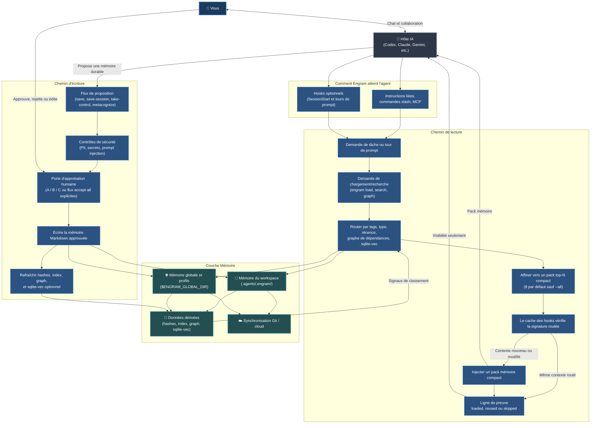
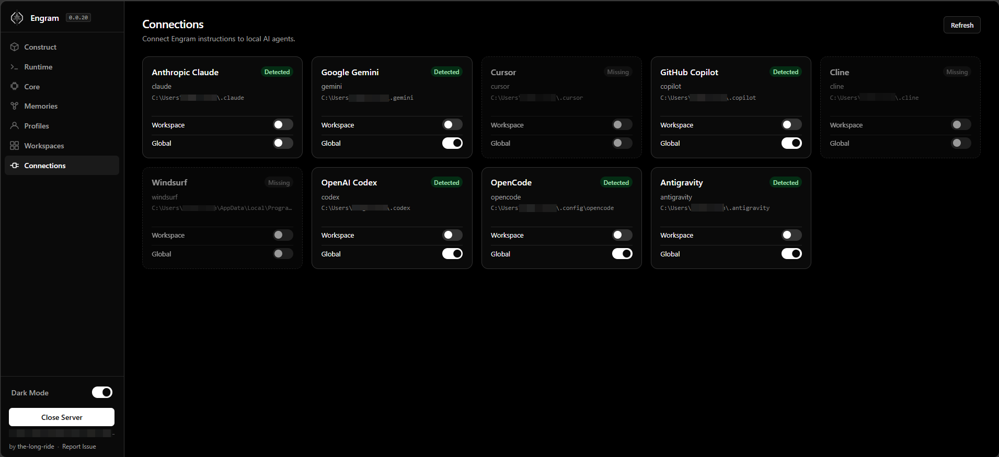
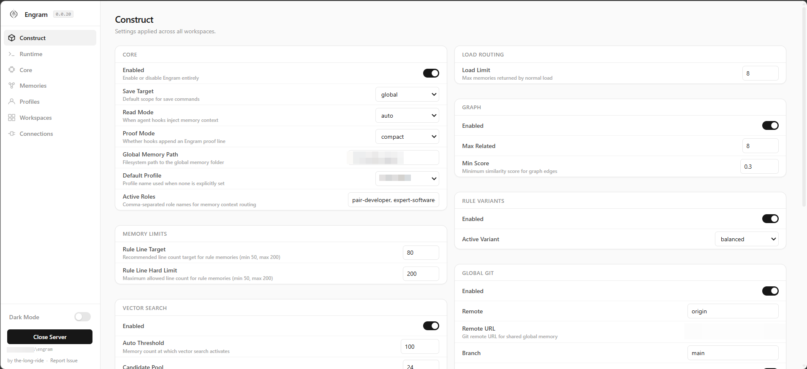
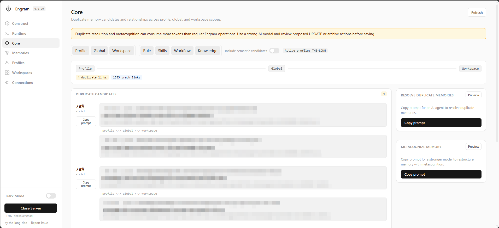
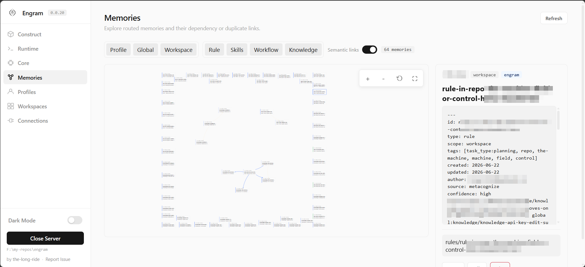

# Engram (Français)

## Approbation en Chat IA

Dans le chat avec un agent IA, l'approbation Engram est conversationnelle. L'agent montre d'abord des candidats affines `TYPE: ... | TEXT: ...`, y compris les variantes Light/Balanced/Strict pour les regles. Repondez `yes` pour enregistrer exactement ces candidats, `audit` pour les reviser, ou `cancel` pour arreter. Apres `yes`, l'agent utilise `engram save-session --accept-all` avec les candidats approuves. Les enregistrements directs en CLI continuent d'utiliser A/B/C sauf si une commande accept-all a ete invoquee explicitement.


[](../../LICENSE) [](https://github.com/the-long-ride/engram) [](https://www.npmjs.com/package/@the-long-ride/engram) [](https://www.npmjs.com/package/@the-long-ride/engram)


[English](../../README.md) | [Tiếng Việt](../vi/README.md) | [Español](../es/README.md) | [Français](README.md) | [中文](../zh/README.md) | [한국어](../ko/README.md) | [日本語](../ja/README.md) | [Русский](../ru/README.md)

**Engram est un protocole de mémoire basé sur des fichiers et contrôlé par l'humain pour les agents d'IA. Il grandit avec vous et vos équipes.**

Il donne de la mémoire aux agents sans leur en donner la propriété. Les règles durables, les flux de travail et les connaissances du projet résident dans des fichiers Markdown lisibles, validés par l'humain, portables via Git et utilisables par n'importe quel agent.

---

## Points Forts

- **Contrôle Humain** : L'IA propose des candidats de mémoire ; l'humain valide et approuve (porte A/B/C, automatisable par règles).
- **Contexte Optimisé** : Oriente et affine les mémoires correspondant à la tâche dans un pack compact (8 fichiers par défaut) pour éviter de saturer le contexte.
- **Natif Git et Fichiers** : Fichiers Markdown sauvegardés dans `.agents/.engram/` et synchronisés via Git—sans dépendance fournisseur et 100% hors ligne.
- **Contrôle de Confidentialité** : Exécution locale à 100% et scan des secrets et informations personnelles (PII) avant sauvegarde.
- **Graphes de Dépendances** : Déclare des prérequis (`depends_on`) pour charger automatiquement les règles de base avant les tâches avancées.

---

### Flux Général du Système



---

## Qu'est-ce que c'est (Le Contrat)

- **Markdown est la mémoire durable** — aucun format binaire caché ou propriétaire.
- **L'index JSON, le graphe et sqlite-vec optionnel** agissent comme des couches d'accélération.
- **L'approbation est la frontière de confiance** — l'agent propose, l'humain approuve.
- **Les empreintes (hashes) vérifient l'intégrité** et les **Règles d'ignorance protègent la confidentialité**.
- **Les profils isolent les contextes de mémoire** (personnel, client et entreprise). L'ordre de résolution est explicite : `--profile`/`ENGRAM_PROFILE`, valeur par défaut du workspace, puis valeur par défaut de l'utilisateur ; un profil épinglé au workspace contrôle tous les chargements CLI, MCP et hooks d'agent dans ce workspace.
- **Git offre la portabilité et l'historique d'audit** — partagez les règles au sein de l'équipe.
- **Les adaptateurs sont des commodités, pas des autorités**.
- **Des règles strictes gouvernent les sorties de l'agent** pour éviter les dérives et alucinations.

---

## Pourquoi Engram existe (Solutions Tactiques)

Les fichiers de règles standards sont envoyés avec chaque message, ce qui sature le contexte, provoque des dérives, fuit des secrets ou vous lie à un cloud propriétaire. Engram résout ces problèmes :

| Défi Tactique | Réponse d'Engram |
| --- | --- |
| **Trop de règles saturent le contexte** | Oriente et affine les mémoires spécifiques à la tâche dans un pack compact, par défaut de 8 mémoires. |
| **Écritures silencieuses et fuites** | Requiert une approbation humaine A/B/C et scanne en recherche de secrets/injections. |
| **Verrouillage fournisseur** | Utilise des fichiers Markdown lisibles et portables pour tout agent ou modèle. |
| **Sans accès hors ligne** | S'exécute localement comme un protocole basé sur des fichiers légers, sans serveur. |
| **Dérive de contexte en équipe** | Synchronise les règles et directives dans toute l'équipe via Git. |
| **Mémoire corrompue ou obsolète** | Fournit des utilitaires de validation et nettoyage (`engram repair`, `engram quality-check`). |

---

## Cas d'Utilisation

- **Personnel & Professionnel** : Styles d'écriture, préférences personnelles, listes de contrôle, vocabulaire, modèles, principes de vie.
- **Développement Logiciel** : Règles de codage, directives d'architecture, débogage, onboarding de l'équipe.
- **Entreprise** : Règles de sécurité et conformité, wiki SOP d'équipes, ton de marque, audit Git.

---

## Installation & Configuration

### 1. Installer la CLI d'Engram
```bash
npm install -g @the-long-ride/engram
```

### 2. Installer le Skillset Globalement
Apprenez à votre assistant d'IA comment interagir avec Engram (lire, écrire, maintenir) :
```bash
# Lister les agents supportés
engram link list

# Installer le skillset pour votre agent
engram link --global <votre-agent>
```
*(Remplacez `<votre-agent>` par le nom de votre assistant ; utilisez `agents-md` pour les agents non listés qui lisent `AGENTS.md`.)*

Pour Gemini / interfaces Antigravity :
```bash
engram link gemini
```

Des hooks de chargement automatique optionnels sont disponibles pour les hôtes capables d'injecter du contexte au début de la session et lors des invites suivantes :
```bash
engram link codex
engram link claude
engram link gemini
engram link cursor
engram link windsurf
engram link --global opencode
engram set-read auto
engram set-proof compact
```
Les installations de hooks v1 sont disponibles pour `codex`, `claude`, `gemini`, `opencode`, `cursor` et `windsurf`/`cascade`. La compatibilité avec Antigravity passe actuellement par `gemini`. Les hooks Cursor injectent le contexte de démarrage via `sessionStart` et `additional_context` ; `beforeSubmitPrompt` est en mode allow/block uniquement, pas une injection de contexte. Les hooks Windsurf/Cascade peuvent auditer/pré-charger/bloquer sur `pre_user_prompt` mais ne peuvent pas injecter de contexte de modèle ; les rules et MCP fournissent les canaux fiables de contexte AI. Copilot et Cline restent gérés par instructions/skillset/chargement manuel jusqu'à ce que leurs surfaces de hook prennent en charge une injection de contexte fiable au moment de l'invite.
Utilisez `engram set-proof compact` si vous souhaitez que les hooks pris en charge ajoutent une courte ligne `Engram proof:` à chaque tour éligible pour indiquer si la mémoire Engram a été chargée, réutilisée ou ignorée sans modifier le comportement d'injection de `set-read`.
Pour OpenCode, l'entrée MCP générée est :

```json
"engram": {
  "type": "local",
  "command": ["engram-mcp"],
  "args": [],
  "enabled": true
}
```

Le plugin local reste dans `~/.config/opencode/plugins/engram.js` ; n'ajoutez pas d'entrée `plugin` de style npm pour ce fichier local.


### 3. Initialiser l'Espace de Travail
Exécutez ceci à la racine du projet :
```bash
engram inject
```
*Note : crée le dossier `.agents/.engram/` local, demande le chemin de la mémoire globale, et permet des sous-modules optionnels (`--submodule`) et la synchronisation distante.*

### 4. Ouvrir l'interface Web du panneau de configuration
Pour visualiser, rechercher et configurer vos profils de mémoire, exécutez :
```bash
engram entry
```






---

## Guide Rapide pour l'Agent d'IA

Vous pouvez indiquer à l'agent dans le chat d'utiliser les commandes suivantes :

- **Début de tâche** : `/engram load "design pricing table component"`
- **Sauvegarder des décisions importantes** : `/engram save knowledge "Webhook secret is process.env.STRIPE_WEBHOOK"`
- **Résumer et sauvegarder la session** : `/engram save-session` (ou `--query-level 3`, ou `ss -a last 50 sessions` pour auto-approuver)

Lorsqu'un agent demande comment utiliser Engram, exécutez `engram llm`. Cela affiche le guide de l'agent IA empaqueté `llm.txt`, qui peut être utilisé en toute sécurité avant `engram inject`.

Lorsqu'un agent IA propose des candidats de mémoire `TYPE: ... | TEXT: ...`, il peut éventuellement ajouter `CONTEXT: ...` pour expliquer la raison d'être de cette mémoire. Les faits simples peuvent s'en passer et utiliser le contexte d'approbation par défaut.


---

## Tableau de Référence des Commandes (Cheat Sheet)

| Tâche | Commande CLI | Suggestion de l'Agent d'IA |
| --- | --- | --- |
| **Charger la Mémoire** | `engram load "<tâche>"` | `/engram load "<tâche>"` |
| **Simulation de Charge** | `engram load --dry-run "<tâche>"` | `/engram load --dry-run "<tâche>"` |
| **Sauvegarder une Mémoire** | `engram save <type> "<texte>"` | `/engram save <type> "<texte>"` |
| **Proposer une Session** | `engram save-session` | `/engram ss` |
| **Extraire Sessions Récentes** | `engram save-session --query-level <n>` | `/engram save-session --query-level <n>` |
| **Auto-approuver Sauvegarde** | `engram save-session --accept-all` | `/engram ss -a` |
| **Importer Fichiers / Docs** | `engram take-control --all` | `/engram take-control --all` |
| **Importer et Intégrer** | `engram take-control --all --metacognize --accept-all` | `/engram take control accept all metacognize` |
| **Restructurer la Mémoire** | `engram metacognize --workspace` | `/engram restructure workspace memory accept all` |
| **Résoudre les Conflits** | `engram resolve-conflicts --metacognize` | `/engram resolve conflicts and metacognize` |
| **Vérifier Config** | `engram entry` | `/engram entry` |
| **Guide de l'agent** | `engram llm` | À exécuter si l'agent a besoin du guide d'utilisation d'Engram |
| **Gérer les Profils** | `engram profile status` / `create` / `use` | `/engram profile status` |
| **Cible de Sauvegarde** | `engram set-save-target <workspace/global/both>` | `/engram set-save-target <target>` |
| **Limite de Charge** | `engram set-load-limit <1..32>` | `/engram set-load-limit <count>` |
| **Configurer Lecture Auto** | `engram set-read startup|auto|always|manual|off` | `/engram set-read auto` |
| **Visibilité de Preuve** | `engram set-proof off|compact` | `/engram set-proof compact` |
| **Installer les Hooks Agent** | `engram link codex|claude|gemini|opencode|cursor|windsurf` | À lancer une fois depuis le terminal |
| **Mettre à Jour Chemin Global** | `engram update-global-folder <nouveau-chemin>` | `/engram set global memory path to <new-path>` |
| **Cloner la Mémoire** | `engram clone-memory <source> <destination>` | `/engram clone workspace memory to global` |
| **Définir les Roles** | `engram set-role <roles>` | `/engram set-role <roles>` |
| **Définir la Variante** | `engram set-rule-variant <variant>` | `/engram set-rule-variant <variant>` |
| **Vérifier et Réparer** | `engram verify` / `engram repair` | `/engram verify` / `/engram repair` |
| **Scanner les Conflits** | `engram quality-check` | `/engram quality-check` |
| **Synchroniser les Mémoires** | `engram sync` | `/engram sync` |

Lorsque `engram set-role ...` ou `engram set-rule-variant ...` réussit, Engram renvoie désormais une ligne `Agent action:`. Les adaptateurs compatibles Engram et les hôtes MCP doivent immédiatement réexécuter `engram load "<tâche/demande actuelle>"` et remplacer le contexte précédent dérivé d'Engram dans la même conversation. Cela se produit après la fin de la commande, pas au milieu d'une réponse, et les fichiers de skillset installés contrôlent toujours les discussions futures ou rechargées.

---

## Comparaisons

### Avec Agentmemory
[rohitg00/agentmemory](https://github.com/rohitg00/agentmemory) est un moteur de mémoire automatique s'exécutant en arrière-plan. Engram s'en distingue par son approche sur des fichiers Markdown locaux, sa validation humaine, et l'absence de service actif en arrière-plan.

| Dimension | Engram | agentmemory |
| --- | --- | --- |
| Source de vérité | Markdown approuvé | Serveur/base de données de mémoire |
| Frontière de confiance | Approbation A/B/C humaine | Capture automatique |
| Structure par défaut | Protocole de fichiers (sans daemon) | Service en arrière-plan recommandé |
| Révision | Git diff et Markdown | Interface/API et historique |

### Avec Tolaria
[refactoringhq/tolaria](https://github.com/refactoringhq/tolaria) est une application Markdown pour bureau. Engram opère à un niveau inférieur, proposant une CLI et des instructions pour agents intégrés dans Git.

| Dimension | Engram | Tolaria |
| --- | --- | --- |
| Source de vérité | `.agents/.engram/` | Coffres de fichiers Markdown |
| Interface | CLI et skillset | Application de bureau |

### Avec Obsidian
[Obsidian](https://obsidian.md/) est une application de prise de notes. Engram est un protocole de mémoire : avec un périmètre restreint, une validation stricte, et un historique de modifications via Git.

| Dimension | Engram | Obsidian |
| --- | --- | --- |
| Source de vérité | `.agents/.engram/` | Notes Markdown locales |
| Modèle d'écriture | L'agent propose ; l'humain valide | Édition directe des notes |

### Avec Hermes Agent
Hermes Agent utilise une structure de mémoire autonome avec des limites de caractères strictes, tandis qu'Engram est validé par l'humain par défaut (ou automatisable) avec un chargement à la demande basé sur des étiquettes et graphes.

| | Engram | Hermes Agent |
|---|---|---|
| **Philosophie** | Humain, basé fichiers (automatisation optionnelle) | Autonome, mémoire toujours active |
| **Stockage** | Fichiers Markdown dans `.agents/.engram/` | `MEMORY.md` + `USER.md` (limites strictes) |
| **Écriture** | Approuvé par l'utilisateur (automatisable) | L'agent écrit de manière autonome |
| **Récupération** | À la demande via `engram load` | Toujours actif dans le prompt système |
| **Burs. Vectorielle** | sqlite-vec local optionnel | Via fournisseur externe (agentmemory) |

### Con Memoria Integrada
La mémoire intégrée (ChatGPT, Claude Projects, Cursor) est cloisonnée. Engram utilise des fichiers locaux, permettant le partage via Git, le scan de secrets et la portabilité multi-agents.

| Dimension | Engram | Mémoire Intégrée |
| --- | --- | --- |
| **Portabilité** | Markdown accessible par tout agent | Bloquée sur une seule plateforme |
| **Contrôle Humain** | Approbation explicite A/B/C | Mises à jour silencieuses en arrière-plan |

---

## Documentation

La documentation complète est disponible dans `documentation/` :
- [English](../../README.md) | [Tiếng Việt](../vi/README.md) | [Español](../es/README.md) | [Français](index.md) | [中文](../zh/README.md) | [한국어](../ko/README.md) | [日本語](../ja/README.md) | [Русский](../ru/README.md)

## Roadmap & Projet Complémentaire
Nous travaillons sur **Rendre d'abord Engram plus facile à utiliser, puis la page de documentation**, le **Site de documentation**, **l'intégration Web Chat AI** et **l'amélioration de la cartographie des commandes en langage naturel**. 
Pour visualiser vos dossiers Markdown, utilisez [Markdown Explorer](https://the-long-ride.github.io/markdown-explorer/).

## Licence & Changements
Publié sous licence [GPL-3.0](LICENSE). Voir le [Changelog](https://github.com/the-long-ride/engram/blob/main/CHANGELOG.md).
