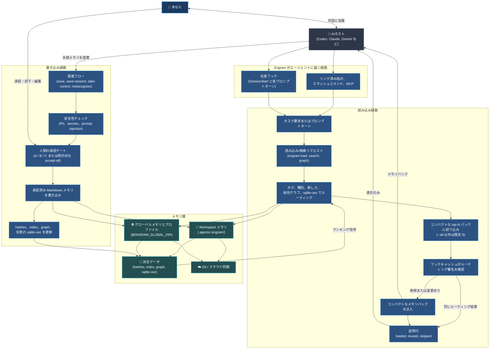

# Engram (日本語)

## AIチャットでの承認

AIエージェントとのチャットでは、Engram の承認は会話型です。エージェントはまず洗練した `TYPE: ... | TEXT: ...` 候補を表示し、ルールでは Light/Balanced/Strict の各バリアントも示します。正確にその候補を保存するには `yes`、修正するには `audit`、中止するには `cancel` と返信します。`yes` の後、エージェントは承認された候補そのままで `engram save-session --accept-all` を使います。直接の CLI 保存は、accept-all コマンドが明示的に呼ばれていない限り、引き続き A/B/C を使います。


[](../../LICENSE) [](https://github.com/the-long-ride/engram) [](https://www.npmjs.com/package/@the-long-ride/engram) [](https://www.npmjs.com/package/@the-long-ride/engram)


[English](../../README.md) | [Tiếng Việt](../vi/README.md) | [Español](../es/README.md) | [Français](../fr/README.md) | [中文](../zh/README.md) | [한국어](../ko/README.md) | [日本語](README.md) | [Русский](../ru/README.md)

**Engramは、AIエージェント向けの人間所有・ファイル優先のメモリプロトコルです。あなたとあなたのチームとともに成長します。**

エージェントにメモリを提供しますが、メモリの所有権は人間にあります。永続的なルール、ワークフロー、およびプロジェクト知識は、人間が監査し、Git経由で共有でき、任意のAIエージェントが読み込めるプレーンなMarkdownとして保存されます。

---

## 主な特徴

- **人間による承認**：AIがメモリ候補を提案し、人間が確認して承認します（A/B/Cゲート、ルールによる自動化が可能）。
- **コンテキストの最適化**：タスクに合致するメモリを抽出してコンパクトなパック（デフォルト8ファイル）として読み込むことで、コンテキストの肥大化を防ぎます。
- **Gitネイティブ＆ファイルベース**：Markdownファイルとして `.agents/.engram/` に保存され、Git経由で同期されます。オフラインで動作し、クラウドロックインはありません。
- **プライバシー＆セキュリティ**：100%ローカルで動作し、保存前に個人情報（PII）やAPIキーなどのシークレットをスキャンします。
- **依存関係グラフ**：前提条件 (`depends_on`) を宣言でき、エージェントが高度なタスクを実行する前に、自動的に基本ルールを読み込むことができます。

---

### システム全体フロー



---

## Engramとは何か (メモリ契約)

- **Markdownが永続メモリ** — 隠されたバイナリや独自のデータベースフォーマットはありません。
- **JSONインデックス、依存グラフ、オプションのsqlite-vec**は高速化レイヤーです。
- **承認が信頼の境界** — AIが提案し、人間が承認するという基本原則です。
- **ハッシュによる完全性チェック**と**Ignoreルールによるプライバシー制御**。
- **プロファイルによるメモリコンテキストの分離**（個人、クライアント、企業）。
- **Gitによるポータビリティと変更履歴の監査** — チーム間で簡単にルールを共有。
- **エージェントアダプターは便宜的機能**であり、権限はありません。
- **厳格なルールによるエージェント出力の制御**。

---

## Engramが存在する理由 (技術的な解決策)

標準的なルールファイルは毎回のメッセージで送信されるため、コンテキストが肥大化し、指示のドリフトやAPIキーの漏洩の原因となり、クラウドへのロックインが発生します。Engramはこれらの課題を解決します：

|  tacticalな課題 | Engramの解決策 |
| --- | --- |
| **多すぎるルールによるコンテキストの肥大化** | タスクに適合するメモリのみを抽出し、デフォルト8ファイルのコンパクトなパックとして読み込みます。 |
| **サイレントな書き込みとシークレットの漏洩** | 保存前にシークレットやインジェクションのスキャンを行い、人間によるA/B/C承認を求めます。 |
| **特定のベンダーへのロックイン** | プレーンなMarkdownを使用し、あらゆるエージェントやモデル間で移植可能に設計されています。 |
| **オフラインで動作しない** | サーバーを必要とせず、ローカルファイルベースの軽量プロトコルとして動作します。 |
| **チーム内のルールドリフト** | Gitを通じて、プロジェクトルールやガイドラインをチーム全体で同期・共有します。 |
| **古くなったメモリや壊れたファイル** | 整合性検証および修復ツール (`engram repair`, `engram quality-check`) を提供します。 |

---

## ユースケースの例

- **個人＆プロフェッショナル**：執筆スタイル、個人の優先設定、チェックリスト、語彙リスト、テンプレート、人生の行動原則。
- **ソフトウェア開発**：コーディング規約、アーキテクチャガイドライン、デバッグスクリプト、トラブルシューティング、チームのオンボーディング。
- **エンタープライズ**：セキュリティ・コンプライアンスルール、社内SOPのWiki、ブランドトーン、Git履歴監査。

---

## インストールとセットアップ

### 1. Engram CLIのインストール
```bash
npm install -g @the-long-ride/engram
```

### 2. スキルセットのグローバルインストール
AIアシスタントにEngramとの連携方法（読み込み、保存、メンテナンス）を指示します：
```bash
# サポートされているエージェントのリスト
engram link list

# 対象エージェントにスキルセットをインストール
engram link --global <エージェント名>
```
*( `<エージェント名>` を該当するエージェントの名前に置き換えてください。リストにない場合は `agents-md` を指定して `AGENTS.md` 経由で設定します。)*

Gemini / Antigravity 環境の場合：
```bash
engram link gemini
```

セッション開始時とそれ以降의プロンプトターンの両方でコンテキストを注入できるホスト向けに、オプションの自動ロードフックが利用可能です。
```bash
engram link codex
engram link claude
engram link gemini
engram link cursor
engram link windsurf
engram link --global opencode
engram set-read auto
engram set-proof compact
```
v1 フックのインストールは `codex`、`claude`、`gemini`、`opencode`、`cursor`、`windsurf`/`cascade` で利用可能です。Antigravity との互換性は現在 `gemini` を経由してルーティングされます。Cursor フックは `sessionStart` と `additional_context` を介して起動時コンテキストを注入します。`beforeSubmitPrompt` は allow/block のみで、コンテキスト注入ではありません。Windsurf/Cascade のフックは `pre_user_prompt` で監査/プリロード/ブロックが可能ですが、モデルコンテキストの注入はできません。rules と MCP が信頼できる AI コンテキストチャネルを提供します。Copilot と Cline は、フックのインターフェースがプロンプト実行時の信頼性の高いコンテキスト注入をサポートするまで、指示/スキルセット/手動ロード駆動のままとなります。
`set-read` の注入動作を変更せずに、サポートされているフックが対象となるターンごとに Engram メモリがロード、再利用、またはスキップされたかを示す短い `Engram proof:` 行を追加したい場合は、`engram set-proof compact` を使用します。


### 3. ワークスペースの初期化
プロジェクトのルートディレクトリで実行します：
```bash
engram inject
```
*注意：プロジェクト用の `.agents/.engram/` ディレクトリを作成し、グローバルフォルダの場所を設定、オプションでGitサブモジュール (`--submodule`) やリモート同期を設定します。*

### 4. コントロールパネルの Web UI を開く
メモリプロファイルを表示、検索、設定するには、以下を実行します：
```bash
engram entry
```


---

## AIエージェントクイックスタート

チャット内でエージェントに以下のスラッシュコマンドを実行させることができます：

- **タスク開始時**：`/engram load "design pricing table component"`
- **重要な決定の保存**：`/engram save knowledge "Webhook secret is process.env.STRIPE_WEBHOOK"`
- **セッションの集約保存**：`/engram save-session`（または `--query-level 3`、または自動承認用の `ss -a last 50 sessions`）

エージェントが Engram の使用方法を尋ねてきた場合は、`engram llm` を実行します。パッケージ化された AI エージェントガイド `llm.txt` が出力され、これは `engram inject` の実行前でも安全に使用できます。

AIエージェントが `TYPE: ... | TEXT: ...` のメモリ候補を提案する際、そのメモリが存在する理由を说明するのに役立つ場合は、オプションで `CONTEXT: ...` を追加できます。単純な事実であればこれを省略し、デフォルトの承認コンテキストを使用できます。


---

## コマンド＆エージェント対照表 (Cheat Sheet)

| タスク | CLIコマンド | AIエージェントでの指定方法 |
| --- | --- | --- |
| **メモリの読み込み** | `engram load "<タスク>"` | `/engram load "<タスク>"` |
| **読み込みドライラン** | `engram load --dry-run "<タスク>"` | `/engram load --dry-run "<タスク>"` |
| **メモリの保存** | `engram save <タイプ> "<テキスト>"` | `/engram save <タイプ> "<テキスト>"` |
| **セッションの保存提案** | `engram save-session` | `/engram ss` |
| **過去のセッションの抽出** | `engram save-session --query-level <n>` | `/engram save-session --query-level <n>` |
| **自動承認保存** | `engram save-session --accept-all` | `/engram ss -a` |
| **ファイル / ドキュメントのインポート** | `engram take-control --all` | `/engram take-control --all` |
| **インポートと再構築** | `engram take-control --all --metacognize --accept-all` | `/engram take control accept all metacognize` |
| **メモリの再構築** | `engram metacognize --workspace` | `/engram restructure workspace memory accept all` |
| **競合の解決** | `engram resolve-conflicts --metacognize` | `/engram resolve conflicts and metacognize` |
| **設定の確認** | `engram entry` | `/engram entry` |
| **エージェントガイド表示** | `engram llm` | エージェントが Engram の使用ガイドを必要とするときに一度実行 |
| **プロファイルの管理** | `engram profile status` / `create` / `use` | `/engram profile status` |
| **保存ターゲット設定** | `engram set-save-target <workspace/global/both>` | `/engram set-save-target <target>` |
| **読み込み上限設定** | `engram set-load-limit <1..32>` | `/engram set-load-limit <count>` |
| **自動読み込み設定** | `engram set-read startup|auto|always|manual|off` | `/engram set-read auto` |
| **証明表示設定** | `engram set-proof off|compact` | `/engram set-proof compact` |
| **エージェントフック導入** | `engram link codex|claude|gemini|opencode|cursor|windsurf` | 一度だけターミナルで実行 |
| **グローバルフォルダ変更** | `engram update-global-folder <新しいパス>` | `/engram set global memory path to <new-path>` |
| **メモリの複製** | `engram clone-memory <コピー元> <コピー先>` | `/engram clone workspace memory to global` |
| **開発ロールの設定** | `engram set-role <ロールリスト>` | `/engram set-role <roles>` |
| **ルールの厳格さ設定** | `engram set-rule-variant <variant>` | `/engram set-rule-variant <variant>` |
| **整合性検証と修復** | `engram verify` / `engram repair` | `/engram verify` / `/engram repair` |
| **競合の検出** | `engram quality-check` | `/engram quality-check` |
| **メモリの同期** | `engram sync` | `/engram sync` |

`engram set-role ...` または `engram set-rule-variant ...` が成功すると、Engram は `Agent action:` 行を返すようになります。Engram 対応のアダプターや MCP ホストは、ただちに `engram load "<現在のタスク/リクエスト>"` を再実行し、同じ会話内の以前の Engram 由来のコンテキストを置き換える必要があります。これはコマンド完了後に発生し、レスポンスの途中では発生しません。また、インストールされたスキルセットファイルは、将来のチャットや再ロードされたチャットを引き続き制御します。

---

## 比較

### agentmemoryとの比較
[rohitg00/agentmemory](https://github.com/rohitg00/agentmemory) は、バックグラウンドで自動実行されるサーバー型メモリエンジンです。Engramは、人間が確認するローカルMarkdownファイルに特化しており、デーモンのオーバーヘッドがありません。

| 項目 | Engram | agentmemory |
| --- | --- | --- |
| 信頼できるソース | 承認済みMarkdown | メモリサーバー / データベース |
| 信頼の境界 | 人間によるA/B/C承認 | 自動的なキャプチャ |
| 動作形態 | ローカルファイル (デーモン不要) | サーバーサービスの起動を推奨 |
| レビュー方法 | Git diff と Markdown の目視確認 | ビューア / API / 履歴 |

### Tolariaとの比較
[refactoringhq/tolaria](https://github.com/refactoringhq/tolaria) はMarkdownデスクトップアプリです。Engramは下位レイヤーに位置し、CLIやGit連携のルール管理を提供します。

| 項目 | Engram | Tolaria |
| --- | --- | --- |
| 信頼できるソース | `.agents/.engram/` フォルダ | Markdown Vault |
| インターフェース | CLIおよびエージェントスキルセット | デスクトップアプリ |

### Obsidianとの比較
[Obsidian](https://obsidian.md/) はノートアプリです。Engramはエージェントメモリプロトコルであり、承認フローが厳密に定義され、メモリをコードのように管理します。

| 項目 | Engram | Obsidian |
| --- | --- | --- |
| 信頼できるソース | `.agents/.engram/` フォルダ | ローカルのMarkdownノート |
| 編集方法 | エージェントが提案、人間が承認 | 直接ファイルを編集 |

### Hermes Agentとの比較
Hermes Agentは文字数制限を設けた自動メモリを使用しますが、Engramは人間所有（ルールにより自動化可能）かつ必要時にのみタグ/グラフベースで呼び出します。

| | Engram | Hermes Agent |
|---|---|---|
| **哲学** | 人間所有、ファイルベース（自動化は任意） | 自動型、常にアクティブなメモリ |
| **保存先** | `.agents/.engram/` 内のMarkdown | `MEMORY.md` + `USER.md` (文字数制限あり) |
| **書き込み** | ユーザーによる承認（ルール自動化可能） | エージェントによる自動書き込み |
| **呼び出し** | 必要時に `engram load` で読み込み | 毎回システムプロンプトに常時ロード |
| **ベクトル検索** | オプションのローカル sqlite-vec | 外部プロバイダー経由 (agentmemory) |

### 内蔵メモリ (Built-In Memory) との比較
ChatGPT等の内蔵メモリはクローズドです。Engramはローカルファイルをソースとし、Gitによるチーム共有、シークレットスキャン、複数のエージェント間での移植性を提供します。

| 項目 | Engram | 内蔵メモリ |
| --- | --- | --- |
| **ポータビリティ** | プレーンMarkdown（あらゆる環境で読み込み可） | 特定のプラットフォームに固定 |
| **人間の制御** | 記述前の明示的なA/B/C承認 | バックグラウンドでの自動書き換え |

---

## ドキュメント

完全なドキュメントは `documentation/` フォルダ内にあります：
- [English](../../README.md) | [Tiếng Việt](../vi/README.md) | [Español](../es/README.md) | [Français](../fr/README.md) | [中文](../zh/README.md) | [한국어](../ko/README.md) | [日本語](index.md) | [Русский](../ru/README.md)

## ロードマップ＆関連プロジェクト
私たちは現在、**まず Engram をより使いやすくすること、次にドキュメントページ**、**ドキュメントサイト**、**AIウェブチャット連携**、および**自然言語コマンドマッピングの改善**の開発を進めています。
Markdownフォルダを視覚的に管理するには、[Markdown Explorer](https://the-long-ride.github.io/markdown-explorer/) を使用してください。

## ライセンス＆変更履歴
[GPL-3.0](LICENSE) ライセンスの下で公開されています。詳細は [Changelog](https://github.com/the-long-ride/engram/blob/main/CHANGELOG.md) をご覧ください。
