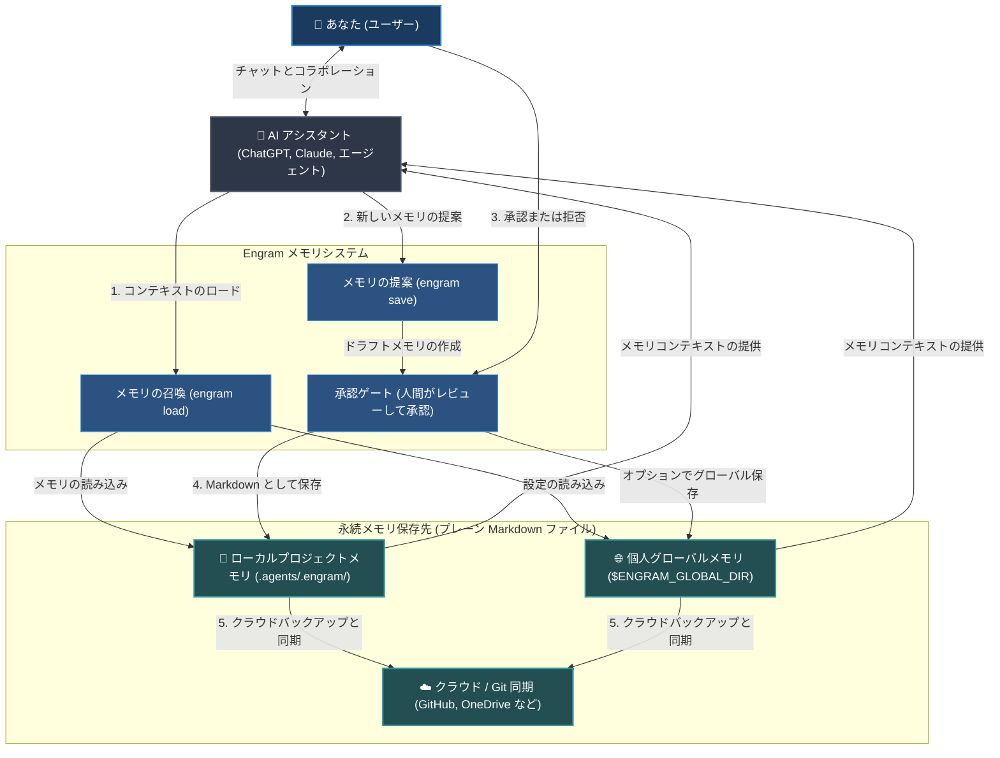

# Engram (日本語)


[English](../../README.md) | [Tiếng Việt](../vi/README.md) | [Español](../es/README.md) | [Français](../fr/README.md) | [中文](../zh/README.md) | [한국어](../ko/README.md) | [日本語](README.md) | [Русский](../ru/README.md)

**Engram は、AI エージェントのための人間が所有するメモリプロトコルです。あなたとあなたのチームとともに成長します。**

エージェントにメモリの所有権を与えることなく、エージェントにメモリを提供します。永続的なルール、ワークフロー、およびプロジェクト知識は、人間がレビューし、Git でポータブルに管理できる、読み取り可能な Markdown ファイルとして保存され、ファイルを読み取ることができる任意のエージェントが使用できます。

---

## 何であるか

Engram は、プロジェクト、ワークスペース、チーム、および個人のコンテキストのための知識メモリセンターです。

隠されたエージェントの脳ではありません。ベンダー所有의 メモリサイロではありません。1つのツールだけが理解するデータベースではありません。

Engram の契約：

- **Markdown は永続的なメモリです。**
- **JSON インデックス、グラフ、およびオプションの sqlite-vec サイドカーは加速レイヤーです。**
- **承認は信頼의 境界線です。**
- **ハッシュは整合性チェックです。**
- **除外ルールはプライバシー管理です。**
- **プロファイルはメモリコンテキストを分離します。** ブラウザのプロファイルのように会社、クライアント、個人のメモリを分け、外部 API や会社提供のエージェントで使う会社コンテキストが個人プロジェクトへ漏れないようにします。
- **Git はポータビリティと変更履歴の監査性を提供します。**
- **エージェントアダプターは便宜上のものであり、権限はありません。**
- **厳格なルールがエージェントの出力を管理します。** AI エージェントの出力を制御、案内、および制約するために、厳格なルール（strict-rules）を伴って知識メモリをロードします。

核となる原則：**エージェントはメモリを提案できますが、人間が何がメモリになるかを決定（所有）します。**

### システム高レベルフロー (High-Level Flow)



---

## なぜ存在するのか

AI アシスタントやエージェントは決定事項を忘れ、セットアップに関する質問を繰り返し、1つのチャット、1つのベンダーアカウント、または1つのマシンの中にだけ有益な教訓を持ち込みます。これは便利ですが、チームがメモリをレビュー、共有、修正、または削除する必要が生じた場合に問題となります。

さらに、現在の AI メモリのアプローチは重大な戦術的課題に直面しています：

- **コンテキストウィンドウの肥大化 (Context Window Bloat)：** 标准的なルールファイル（`.cursorrules` やシステムプロンプトなど）は、メッセージごとに毎回送信されます。ルールが大きくなるにつれて、トークン制限を消費し、コストを増大させ、応答時間を遅くします。
- **コンテキストのドリフトと幻覚 (Hallucination)：** 長いチャットセッションにおいて、メモリに構造やフィルタリングが不足していると、エージェントは指示から逸脱し、独自の構文を自作したり、動作を幻覚（ハルシネーション）したりします。
- **サイレントな情報漏洩：** バックグラウンドで動作する自動メモリキャプチャツールは、同意や通知なしに、機密の API キー、パスワード、または個人特定情報（PII）をサイレントに記録することがあります。
- **ベンダーロックイン：** ベンダーが所有するメモリデータベースは、コンテキストを特定のプラットフォームや模型プロバイダーにロックするため、アシスタントの切り替えやデータのセルフバックアップが困難になります。
- **オフラインワークフローの破損：** クラウドベースのメモリシステムは、インターネット接続が切断された瞬間に動作を停止し、エージェントから重要なコンテキストを奪います。

Engram は、メモリをファイルに移行することでこれらの問題を解決します：

| 戦術的課題 | Engram のソリューション |
| --- | --- |
| **多すぎるルールによるコンテキストの肥大化** | デフォルトでは、タスクに一致するメモリのみをルーティングし、最大 8 個のファイルからなるコンパクトなコンテキストパックに精製します。 |
| **サイレントな書き込みと秘密情報の漏洩** | 書き込み前に人間による承認（A/B/C ゲート）を要求し、機密情報をスキャンします。 |
| **ベンダーロックイン** | プレーンテキストで読みやすく、任意の AI エージェントやモデル間で移植可能な Markdown 文件を使用します。 |
| **オフラインアクセスの欠如** | サーバーや外部通信なしで、100% ローカルの軽量ファイルプロトコルとして実行されます。 |
| **チームプロジェクト内のコンテキストドリフト** | Git を介してチーム全体でエージェントのルールやガイドラインを直接同期して共有します。 |
| **破損した、または古いメモリ** | 整合性チェックと修復ツール（`engram verify`、`engram repair`）を提供します。 |

ワークスペースメモリが最初にロードされます。グローバルメモリはフォールバックです。グローバルメモリが設定されている場合、承認されたワークスペースの保存フローはグローバルコピーにも同時に反映されるため、`engram init` を実行していないプロジェクトでもポータブルなメモリが生き残ります。
当広範な検索によって一致するメモリが 8 個を超える場合、`engram load` は上位 8 個をロードする前に、タグ、タイプ、鮮度、グラフ、および sqlite-vec ベクトル点数に基づいて優先順位を再調整します。エージェントが `engram load --dry-run "<タスク>"` を使用して候補数と推奨されるフィルタリングタグをプレビューするか、広い範囲のロードを意図する場合は `--all` を指定できます。

メモリは `depends_on` と `level: advanced` のような任意のレベルで依存関係を宣言できます。グラフは基礎から深い知識へ並べ、`engram load` は依存先のメモリと一緒に前提メモリをコンパクトなパックへ保持します。`engram save` のプレビューでは、関連する既存メモリや重複候補を知らせ、保存前に `depends_on` 追加や重複整理を検討できます。

---

## 代表的な使用例

Engram は多用途であり、個人的、専門的、あるいは開発に関連するメモリにすべて適しています。

### 個人および業務用のメモリ
- **個人の好みと執筆スタイル：** AI アシスタントに、あなたが好む語調、書式スタイル、電子メール/ブログのテンプレートを学習させ、常にあなたの意図通りにコンテンツを作成させます。
- **学習要約と学習ガイド：** 勉強しているトピックの要約、重要な公式、外国語の単語などを記録しておき、AI が過去の文脈に基づいてあなたにクイズを出したり説明したりできるようにします。
- **ワークフローチェックリスト：** ビデオ編集手順、ブログ投稿プロセス、旅行計画テンプレートなど、繰り返されるタスクのステップバイステップのガイドを保持します。
- **個人の生活ルールと原則：** 個人の習慣、財務目標、レシピ、または健康管理ルーチンを記録し、AI アシスタントがそれらのルールに従って食事計画、予算編成、またはタスク管理をサポートできるようにします。

### ソフトウェア開発と技術
- **リポジトリのルールとガイドライン：** コードベースのスタイル規約、アーキテクチャの原則、または特定のルール（例：「すべてのエンドポイントには必ずユニットテストを記述すること」）を明記し、コーディングエージェントがこれを遵守するようにします。
- **トラブルシューティングとデバッグガイド：** 複雑なバグの解決策や特殊な環境セットアップ方法を保存し、将来のエージェントや同僚開発者が同じ問題の解決に時間を無駄にしないように保護します。
- **一般的な CLI コマンド：** リポジトリ固有の実行スクリプト、テスト順序、およびデプロイコマンドの一覧を手元に保持します。
- **チームオンボーディングと配置の整合：** アーキテクチャの概要やよくある罠を Git バージョン管理下の Markdown で共有し、チーム全体とエージェントの知識を1つに統合します。

### 企業およびチーム
- **セキュリティと合規性ガイドライン：** 組織や顧客のデータを処理する際に、AI エージェントが違反してはならない厳格な合規プロトコル、データプライバシーガイドライン、または安全ポリシーを定義します。
- **共有標準運用手順書 (SOP)：** チームの SOP、製品仕様書、顧客サービスマニュアル、および社内 Wiki を Markdown メモリとして保存し、バージョン管理します。
- **一貫したブランドボイスとスタイルガイド：** チームが作成するすべてのコンテンツや外部エージェントに、一貫したマーケティングガイドライン、商標表記規則、および標準免責事項を強制適用します。
- **監査証跡とガバナンス：** Git コミットログを介して、誰がいつどのようなガイドラインを変更したかの完全な変更履歴を透過的に維持し、企業のセキュリティ監査要件を完全に満たします。

---

## AI エージェントクイックスタート

日常的な日常の使用では、AI アシスタントがメモリのロードと保存のフローをチャット画面内で直接処理できるように指示してください。

### 最良のシナリオ (AI チャット中での使用)

- **チャットセッションの開始：** AI アシスタントに、現在のタスクに関連するガイドラインや設定をロードするように指示します。
  ```text
  # グローバルにエージェントスキルセットをインストールしている場合、エージェントがタスクを開始または切り替えるときに自動的に engram load を実行します。
  /engram load "design pricing table component"
  ```
- **新しいメモリの提案：** 会話中に得られた重要な決定事項や事実を保存するようにエージェントに要求します。
  ```text
  /engram save knowledge "Stripe webhook secret is loaded from process.env.STRIPE_WEBHOOK_SECRET"
  ```
- **セッションの要約と保存：** セッションの終了時に、新しいルール、ワークフロー、または事実をまとめて保存するように指示します。
  ```text
  /engram save-session
  ```
  エージェントが実際にアクセスして読み取ることができる最近のチャット履歴をクエリレベルの指定によって追加するには、正の整数を入力してください：
  ```text
  /engram save-session --query-level 3
  ```
  エージェントは、現在のセッションを含む指定された件数内の最近のチャットセッションのみを分析し、利用できない過去の履歴を偽造してはなりません。
  最近の履歴を分析し、同時に提案されたメモリをすべて自動承認するには、以下を使用します：
  ```text
  /engram ss -a last 50 sessions
  ```
  これは `engram save-session --query-level 50 --accept-all` に変換されて実行されます。`-a` は、提案されたすべてのメモリ候補に対する人間による明示的な自動事前承認を意味します。

詳細な機能や詳細な設定については、[詳細ドキュメント](index.md)を参照してください。

---

## インストールと設定

Engram CLI をセットアップし、お使いの AI アシスタントに合わせて設定します。

### 1. Engram CLI のインストール
システム全体にツールをグローバルにインストールします：
```bash
npm install -g @the-long-ride/engram
```

### 2. スキルセットのグローバルインストール
グローバル AI アシスタントに、Engram との対話方法（ロード、セーブ、アップデート、メンテナンス）を指示します：
```bash
# 動作構造を確認するには、まず以下のコマンドを使用できます。
# engram h is
# サポートされているエージェントのターゲット名を確認します。
engram is list
```
```bash
# タスク開始時の自動メモリロード + 手動で /engram コマンドを使用できるように、グローバルスコープとしてインストールします。
engram is --global <エージェント名>
# お使いのエージェントがリストにないが AGENTS.md を読み取れる場合は、汎用のフォールバックターゲットを使用します。
engram is --global agents-md
```
*(お使いのツールに合わせて `<エージェント名>` の部分に適した値を入力してください。 `engram is list` 結果に適合するものがない場合は `agents-md` を採用します。)*

Antigravity 環境の場合、以下のように統合されたエコシステムターゲットを使用します：
```bash
engram install-skillset antigravity
```
This writes `.antigravity/`, `.antigravity-cli/`, `.antigravity-ide/`, and `.antigravityrules` workspace guidance. The old `antigravity-cli` target name remains accepted only as a compatibility alias.

### 3. ワークスペースの初期化
メモリを連携させたいプロジェクトのルートフォルダに移動して以下を実行します：
```bash
engram init
```

> [!IMPORTANT]
> **ワークスペース初期化 (`engram init`) プロセスで留意すべき点：**
> - **ワークスペースメモリ：** プロジェクト固有のメモリを格納するために、ローカルの `.agents/.engram/` ディレクトリを作成します。
> - **Git サブモジュールオプション：** チームで共有する別の専用 Git リポジトリでメモリを共同管理したい場合は、`engram init --submodule` を指定して連携します。
> - **個人グローバルメモリ：** すべて의 プロジェクトで共通して利用するグローバルメモリのディレクトリパスの指定を求められます（例：`--global-path ~/engram-global`）。
> - **クラウド同期バックアップ：** グローバルリポジトリの URL を設定するか（`--global-remote <git-url>`）、OneDrive/ Google Drive/ Dropbox のフォルダを活用してメモリをバックアップし同期します。

---

## 環境設定と追加コマンド

初期化完了後、有効なオプションと同期の挙動を設定します。CLI シェルプロンプトコマンドとチャット画面用の slash command の両方がサポートされています。

### 開発者役割 (Roles) の設定
現在の開発スタイル（例：`frontend`、`backend`、`security`、`docs` など）に必要なメモリのみにフィルタリングしてロードできます。
- **CLI:**
  ```bash
  # UI 開発およびデザインに関連するルールのみをロード
  engram set-role frontend design

  # フィルタ指定をクリアしてすべてのメモリを制限なしでロード
  engram set-role
  ```
- **AI エージェントチャット:**
  ```text
  /engram set-role frontend design
  /engram set-role
  ```

### ルール厳格度の設定 (Rule Variant)
エージェントがロードして遵守するルールの論理的な厳格さを設定します：
- **CLI:**
  ```bash
  # strict: 脳のサイズが比較的小さいローカルエージェントのルール遵守率を強力に引き上げる際に使用します。 Claude Opus 3.5 や GPT-5.5 などの高度な推理モデルに指定すると、推理制約が過剰になりオ作動（brainlock）を引き起こす可能性があります。
  # balanced/light: 高度なモデルがルールの下でも柔軟で最適化された推理を実行できるように、ルール構造を緩和します。
  engram set-rule-variant balanced
  ```
- **AI エージェントチャット:**
  ```text
  /engram set-rule-variant balanced
  ```

### その他の追加コマンド
- **현재 적용된 활성 설정 및 경로들 확인:** `engram entry` (에이전트: `/engram entry`)
- **ローカルとグローバルの変更点の同期:** `engram sync` (エージェント: `/engram sync`)
- **既定の保存先を設定：** `engram set-save-target workspace|global|both|status` (エージェント: `/engram set-save-target status`)
- **分離プロファイルを管理：** `engram profile status` / `engram profile merge personal company --dry-run` (エージェント: `/engram profile status`)
- **workspace/global メモリを複製：** `engram clone-memory workspace global` / `engram clone-memory global workspace --force` (エージェント: `/engram clone workspace memory to global`)
- **整合性の自己診断およびインデックスの整理修復:** `engram verify` / `engram repair` (エージェント: `/engram verify` / `/engram repair`)
- **矛盾の検出スキャン:** `engram quality-check` (エージェント: `/engram quality-check`)

---

## CLI コマンド vs AI エージェントクイックシート

| タスク目標 | CLI コマンド | エージェントチャット用 (Slash Command) |
| --- | --- | --- |
| **メモリのロード** | `engram load "<タスク名>"` | `/engram load "<タスク名>"` |
| **ロード前のプレビュー** | `engram load --dry-run "<タスク名>"` | `/engram load --dry-run "<タスク名>"` |
| **単一メモリの保存** | `engram save <メモリタイプ> "<保存する文>"` | `/engram save <メモリタイプ> "<保存する文>"` |
| **複数メモリの提案** | `engram save-session` | `/engram ss` |
| **最近のチャット履歴追跡** | `engram save-session --query-level 3` | `/engram save-session --query-level 3` |
| **メモリの自動承認保存** | `engram save-session --accept-all` | `/engram ss -a` |
| **セッション自動保存承認** | `engram save-session --query-level 50 --accept-all` | `/engram ss -a last 50 sessions` |
| **既存ファイルの取り込み** | `engram take-control --all` | `/engram take-control --all` |
| **設定およびパスの確認** | `engram entry` | `/engram entry` |
| **メモリ整合性の検証** | `engram verify` | `/engram verify` |
| **開発役割の設定** | `engram set-role <役割名>` | `/engram set-role <役割名>` |
| **ルール厳格度の設定** | `engram set-rule-variant <厳格度>` | `/engram set-rule-variant <厳格度>` |
| **既定の保存先を設定** | `engram set-save-target <保存先>` | `/engram set-save-target <保存先>` |
| **プロファイルを管理** | `engram profile status` / `engram profile merge personal company --dry-run` | `/engram profile status` |
| **Workspace/Global メモリを複製** | `engram clone-memory workspace global` | `/engram clone workspace memory to global` |
| **メモリの同期** | `engram sync` | `/engram sync` |
| **インデックスの修復復旧** | `engram repair` | `/engram repair` |


## ドキュメント

詳細な全ドキュメントはリポジトリの `documentation/` フォルダ内にあります。配布される npm パッケージには、CLI 使用時の動作に必要な本 README とコアドキュメントのみが選択されて含まれており、ドキュメントツリー全体は含まれていません。

| 言語区分 | 开始リンク |
| --- | --- |
| 英語 | [documentation/en/index.md](../en/index.md) |
| ベトナム語 | [documentation/vi/index.md](../vi/index.md) |
| スペイン語 | [documentation/es/index.md](../es/index.md) |
| フランス語 | [documentation/fr/index.md](../fr/index.md) |
| 中国語 | [documentation/zh/index.md](../zh/index.md) |
| 韓国語 | [documentation/ko/index.md](../ko/index.md) |
| 日本語 | [documentation/ja/index.md](index.md) |
| ロシア語 | [documentation/ru/index.md](../ru/index.md) |

各言語別のドキュメントには、全体概要、メンタルモデル、エージェント連携クイックスタート、通信プロトコル、詳細コマンド、代替ツール比較ガイドなどが含まれています。

## メリット (Pros)

- プレーンな Markdown テストを最終的な信頼の原点（Source of truth）として活用します。
- 実際の永続データに変換されてディスクに書き込まれる前に、常に人間の明確な承認ステップを必要とします。
- Git 親和性の高いレビュー、変更履歴、同期、およびバックアップ復元機能を提供します。
- ローカルプロジェクト（workspace）メモリを最優先で検索し、グローバル（global）メモリを予備の手段として活用します。
- エージェントの技術仕様に依存しません：Codex, Claude, Cursor, Gemini, Copilot, OpenCode, Antigravity, Cline, Windsurf など、Markdown ファイルを読み取ることができるすべてのエージェントで使用可能です。
- デフォルトでは必要なメモリのみをルーティングし、コンパクトに提供します。また、dry-run モードで精製結果をプレビューでき、メモリが膨大になる環境では sqlite-vec 拡張パックがサポートします。
- 複数のセキュリティ対策：フォーマットスキーマ検査、プロンプトインジェクションの脆弱性スキャン、セキュリティ機密トークンのフィルタリング、改ざん防止のハッシュ化、除外ルール。
- メンテナンス用の実用的なツールキット：observe, take-control, graph, archive, benchmark, repair。
- 常駐プロセス（daemon）、外部データベース、またはクラウドのアカウントが一切不要です。sqlite-vec 拡張エンジンもローカルの補助ファイルに過ぎず、唯一の情報源ではありません。

## デメリット (Cons)

- バックグラウンドで自動的にすべての記憶を蓄積する自動メモリエンジンと比較して、手動の規律（保存の管理）がやや必要になります。
- デフォルトの検索は決定論的なレキシカル検索です。`search --semantic` は決定論的なローカル類似度を追加しますが、高精度な外部埋め込みサーバーを利用したセマンティック検索ではありません。
- sqlite-vec ルーティングも、ローカル環境のハッシュ化された単語カウント類似度を使用するものであり、外部の埋め込みサービスを利用しません。
- 矛盾の検出は启发式的（ヒューリスティック）なものであり、アドバイザリー（助言）の意味合いを持ちます。
- `deduplicate --semantic` 類似度整理も、外部の埋め込み API なしでローカルマッチングとして実行されます。
- パターンマイニング、暗号化ストレージ、PR 自動生成テンプレートなどは設計領域にあり、現時点では完全な CLI ワークフローとしては統合されていません。

## agentmemory との比較

[rohitg00/agentmemory](https://github.com/rohitg00/agentmemory) は、コーディングエージェント向けの高性能なバックグラウンド自動メモリマシンであり、サーバー型のデータベース構造、MCP 統合、API 通信、セッションリプレイ機能、ベンチマーク、ビューアー画面、および Hermes 最適化などを備えています。

Engram は哲学の重点を異なる場所に置いています。

| 比較次元 | Engram | agentmemory |
| --- | --- | --- |
| 信頼できる情報源 | 人間が検証した Markdown ファイル | メモリ専用サーバー/DB |
| ガバナンス信頼境界 | 保存前の人間による A/B/C の承認ゲート | 自動キャプチャとツール管理 |
| デフォルトモード | ファイルプロトコル、追加の常駐不要 | 常駐サービスの実行が必要 |
| 変更履歴確認 | Git Diff の確認および Markdown のレビュー | ビューアー画面、API またはセッション履歴 |
| 最適な用途 | ガバナンス、透過性、Git 監査が不可欠なチーム | 自動的な思い出しやリプレイを望むユーザー |
| 主なリスク | メモリの承認/保存に関する規律が必要 | 不可視なデータベース状態が乱れるリスク |

記録の自動保存、セッションリプレイ、ベクトルデータベース、およびライブで共有されるメモリが必要な場合は、agentmemory が適しています。

逆に、メモリが開発コードファイルのようにシンプルで、バージョン管理が透明で、Git と人間によるガバナンスの中に確実に所有されることを望む場合は、Engram が適しています。

## Tolaria との比較

[refactoringhq/tolaria](https://github.com/refactoringhq/tolaria) は、Markdown ベースの個人またはチームの知識ベースを管理する洗練されたデスクトップアプリです。ファイル指向、ローカル指向、オフライン優先を貫き、巨大な知識リポジトリ（vaults）を AI エージェントのコンテキストとして連携させるのに優れています。

Engram はシステムスタック上でより低い位置にあります。ドキュメントの編集/ビューアーを主体としたアプリではなく、エージェントの制御ルールを管理するためのエージェント向けメモリプロトコルおよび CLI ツールキットです。

| 比較次元 | Engram | Tolaria |
| --- | --- | --- |
| 信頼できる情報源 | `.agents/.engram/` 内의 Markdown | YAML ヘッダーを含む大規模な Markdown |
| 主なインターフェース | CLI シェル環境, slash adapters, MCP API および Markdown | クロスプラットフォームのデスクトップアプリ |
| 데이터 입력 | 에이전트가 후보 제안; 사람이 검토해 최종 승인 | 人間が直接作成し編集管理する |
| コバエリア | エージェント動作ルール、ワークフロー、スキルセット | チームまたは個人の巨大な知識保管庫 |
| 動作要件 | 常駐プロセスやデスクトップアプリは一切不要 | Tauri フレームワークベースのデスクトップアプリ |
| 最適な用途 | マルチエージェントに対する詳細な制御と監査 | 知識の視覚化および手動の知識整理 |
| 主なリスク | メモリの承認/保存に関する規律が必要 | 単にエージェントメモリが欲しい場合には重すぎる |

Markdown ノートのリンク接続、知識リポジトリの管理、キーボード優先の知識ワーク空間が必要な場合は、Tolaria が適しています。

エージェントを制御するための小さなメモリポリシーレイヤーを確保し、Git Diff とコミットハッシュで追跡されるミニマルな管理体系を望む場合は、Engram が適しています。

## Obsidian との比較

[Obsidian](https://obsidian.md/) は、個人のメモ、二方向リンクの知識ベース、執筆、計画用の優れたローカル指向型 Markdown アプリケーションです。多数のプラグインとテーマをサポートし、有料の Sync および Publish サービスも提供しています。

Engram はノート作成アプリとは競合しません。エージェント制御に特化したメモリプロトコルであり、対象範囲が狭く、承認に関して非常に厳格であり、メモリ自体をコードファイルのように Git で相互レビューするように設計されています。

| 比較次元 | Engram | Obsidian |
| --- | --- | --- |
| 信頼できる情報源 | `.agents/.engram/` 内の Markdown | ローカルの Markdown ファイル群 |
| 主なインターフェース | CLI シェル環境, slash adapters, MCP API および Markdown | ノートアプリ（リンク、グラフ、Canvas、テーマなど） |
| データ書き込み | エージェントが提案; 人間が承認 | 人間またはプラグインが直接編集する |
| コバエリア | エージェント動作ルール、ワークフロー、スキルセット | 個人メモ、日程、ブログ執筆、統合知識 |
| 動作要件 | 追加プログラム不要; sqlite-vec はオプション | Obsidian アプリ必要, 同期/公開プラグイン提供 |
| AI 連携 | インストール型エージェントルールおよび承認フロー | プラグインや MCP を介して知識を活用 |
| 最適な用途 | エージェントポリシーの透明な監査と制御 | ナビゲーションおよび第二の脳ワークフロー |
| 主なリスク | メモリの承認/保存に関する規律が必要 | 知識が膨大になった場合にレビューが崩壊するリスク |

Obsidian は、個人のメモ、二方向リンクの知識ベース、執筆、計画用の優れたローカル指向型 Markdown アプリケーションです。多数のプラグインとテーマをサポートし、有料の Sync および Publish サービスも提供しています。

Engram はノート作成アプリとは競合しません。エージェント制御に特化したメモリプロトコルであり、対象範囲が狭く、承認に関して非常に厳格であり、メモリ自体をコードファイルのように Git で相互レビューするように設計されています。

両者は共存可能です：広範な百科事典的知識は Obsidian で管理し、その中からエージェントが動作する際に遵守すべき厳選されたルールとプロジェクトチップは Engram に蒸留して使用してください。

## 内蔵のエージェントメモリとの比較

内蔵のエージェントメモリは便利ですが、特定のホストに縛られがちです。差分（diff）をとったり、エクスポートしたり、レビューしたり、他のエージェントと共有したりするのが難しい場合があります。

Engram は内蔵メモリを「利便性のためのレイヤー」として扱い、権威とはみなしません。権威は常に、人間が所有する Markdown ファイルにあります。

| 比較次元 | Engram | 内蔵のエージェントメモリ |
| --- | --- | --- |
| **ポータビリティ** | マルチエージェント & マルチプラットフォーム：プレーン Markdown でどこでも読み込み可能。 | 単一プラットフォーム（ChatGPT Web または Cursor のみ）に限定。 |
| **人間の制御力** | 明示的：エージェントは提案書のみを作成、最終的な保存は人間が承認する。 | 不可視：バックグラウンドでアシスタントが自動でメモリを蓄積し管理しにくい。 |
| **コラボレーション** | Git に最適：規則メモリの変更をチーム全員でコミットして共有。 | 個人用限定：チームでエージェント記憶をマージして共同管理する仕組みがない。 |
| **セキュリティ** | 安全性確保：機密情報や個人情報のスキャンおよび 100% ローカルオフライン動作。 | 漏洩リスクあり：API キーやコードがバックグラウンドでクラウドに収集される可能性。 |
| **プロンプト効率** | 効率的なロード：現在の開発役割やタグに密接なメモリのみをロードしてトークン節約。 | 単一ロード：すべてのシステムプロンプトを詰め込むか、ブラックボックスベクトルに依存。 |

単一のブラウザウェブチャット環境で、人間の手間をかけずにエージェントがユーザーの文脈を追跡してほしい場合は、内蔵メモリが十分便利です。

エージェントのメモリをセキュリティポリシーに適合させ、チームと共有し、複数の IDE 開発環境を移動するエージェントに対して 100% の制御を発揮したい場合は、Engram が最善の選択肢です。

---

## ロードマップ

私たちは、Web ベースの AI インターフェースやリモートクラウドストレージとのシームレスな同期を実現するために、Engram の機能を拡張しています：

- **Web チャット AI 連携：** Chrome/Firefox 用のブラウザ拡張機能およびネイティブ Web プラグインを開発し、ChatGPT, Claude.ai, Gemini Web 等のチャットクライアント内で Engram メモリが直接動作するようにします。
- **クラウド & Git ストレージ連携：** Web ベース of AI アシスタントを使用するユーザーが、連携された GitHub リポジトリ、Google ドライブ、OneDrive、または Dropbox から直接メモリをロードできるようにします。
- **自然言語コマンドのマッピング：** 厳格なスラッシュコマンド入力の代わりに、「ねぇ、カラーパレットには HSL ルールを使うことを覚えておいて」や「メモリ整合性の健康状態をチェックして」のような日常的な対話文から、対応する Engram 動作を自動的に抽出して実行できるようにします。

---

## 姉妹プロジェクト：Markdown Explorer

Markdown ファイルを視覚的にナビゲートして検索する方法が必要ですか？ [Markdown Explorer](https://the-long-ride.github.io/markdown-explorer/) をチェックしてください。ローカルの Markdown フォルダを検索、ビジュアライズ、ナビゲートするための軽量なオープンソース（MIT）の VS Code 拡張機能およびデスクトップ（Windows, Linux, macOS）アプリケーションです。Engram と美しく連携し、エージェントのルール、スキル、知識ファイルをメモリフォルダ内で直接管理するのに役立ちます。

---

## ライセンス

[GPL-3.0 ライセンス](LICENSE)
