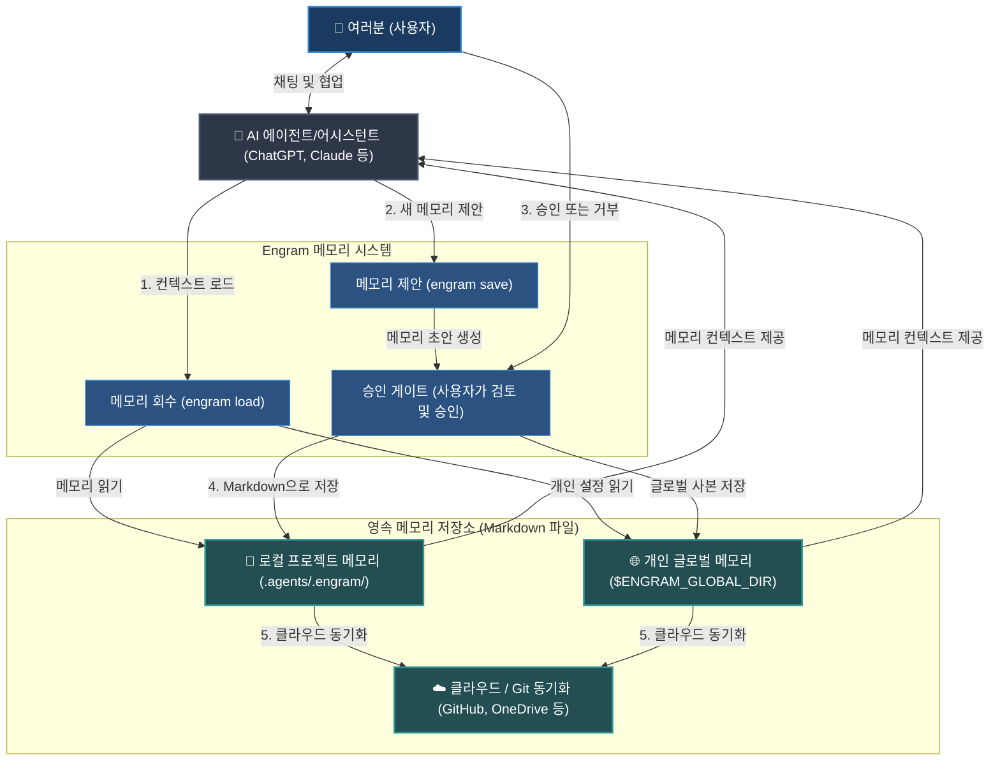

# Engram (한국어)


[English](../../README.md) | [Tiếng Việt](../vi/README.md) | [Español](../es/README.md) | [Français](../fr/README.md) | [中文](../zh/README.md) | [한국어](README.md) | [日本語](../ja/README.md) | [Русский](../ru/README.md)

**Engram은 AI 에이전트를 위한 인간 소유의 메모리 프로토콜입니다. 여러분과 여러분의 팀과 함께 성장합니다.**

에이전트에게 메모리 소유권을 주지 않으면서 메모리를 제공합니다. 영속적인 규칙, 워크플로우, 프로젝트 지식은 읽기 쉽고 인간이 검토할 수 있는 Markdown 파일로 저장되며, Git을 통해 이식되고 파일 읽기 능력이 있는 모든 에이전트가 사용할 수 있습니다.

---

## Engram이란 무엇인가

Engram은 프로젝트, 워크스페이스, 팀, 그리고 개인 컨텍스트를 위한 지식 메모리 센터입니다.

숨겨진 에이전트 브레인이 아닙니다. 특정 벤더에 종속된 메모리 저장소도 아닙니다. 오직 하나의 도구만 이해하는 데이터베이스도 아닙니다.

Engram의 계약:

- **Markdown은 영속적인 메모리입니다.**
- **JSON 인덱스, 그래프 및 선택적인 sqlite-vec은 가속 레이어입니다.**
- **승인은 신뢰의 경계입니다.**
- **해시는 무결성 체크입니다.**
- **제외 규칙은 개인정보 보호 및 제어입니다.**
- **프로필은 메모리 컨텍스트를 격리합니다.** 브라우저 프로필처럼 회사, 고객, 개인 메모리를 나누어 외부 API나 회사 제공 에이전트가 쓰는 회사 컨텍스트가 개인 프로젝트로 새지 않게 합니다.
- **Git은 이식성 및 변경 이력 감사를 제공합니다.**
- **에이전트 어댑터는 권한이 아닌 편의성을 제공합니다.**
- **엄격한 규칙이 에이전트의 출력을 제어합니다.** AI 에이전트의 출력을 제어, 안내 및 제약하기 위해 엄격한 규칙(strict-rules)과 함께 지식 메모리를 로드합니다.

핵심 원칙: **에이전트는 메모리를 제안할 수 있지만, 인간이 무엇을 메모리로 저장할지 결정합니다.**

### 시스템 데이터 흐름도 (High-Level Flow)



---

## 존재하는 이유

AI 어시스턴트와 에이전트는 결정을 잊어버리고, 설정 질문을 반복하며, 단 하나의 채팅, 단 하나의 벤더 계정 또는 단 하나의 머신 내부에서만 유용한 교훈을 보관합니다. 이는 개인이 편할 순 있지만, 팀이 메모리를 검토, 공유, 수정 또는 삭제해야 할 때는 큰 문제로 다가옵니다.

더군다나 현재의 AI 메모리 접근법은 심각한 전술적 과제에 직면해 있습니다:

- **컨텍스트 창 비대화 (Context Window Bloat):** 표준 규칙 파일(예: `.cursorrules` 또는 시스템 프롬프트)은 매 메시지마다 함께 전송됩니다. 규칙이 커질수록 토큰 한도를 소모하고 비용을 발생시키며 응답 속도를 늦춥니다.
- **컨텍스트 드리프트 및 환각 (Hallucination):** 긴 채팅 세션에서 에이전트는 규칙의 구조와 필터링 부족으로 인해 지침에서 벗어나거나, 존재하지 않는 구문을 자초하거나, 행동을 환각해 내기 쉽습니다.
- **보이지 않는 보안 노출:** 백그라운드에서 실행되는 자동 메모리 수집 도구는 사용자의 동의나 인지 없이 민감한 API 키, 패스워드, 개인 식별 정보(PII)를 조용히 저장할 수 있습니다.
- **특정 벤더 종속 (Vendor Lock-In):** 특정 벤더 소유의 메모리 데이터베이스는 사용자의 컨텍스트를 해당 플랫폼이나 모델 공급자에 종속시켜 에이전트 전환이나 데이터 백업을 어렵게 만듭니다.
- **오프라인 작동 중단:** 클라우드 기반 메모리 시스템은 인터넷 연결이 해제되는 순간 작동을 멈추며, 에이전트는 핵심 맥락을 상실하게 됩니다.

Engram은 메모리를 파일로 이동하여 이러한 문제들을 해결합니다:

| 전술적 과제 | Engram의 해결책 |
| --- | --- |
| **너무 많은 규칙으로 인한 컨텍스트 비대화** | 현재 작업에 매칭되는 지식만 검색해 컴팩트 팩으로 제공하며, 기본값은 8개입니다. |
| **자동 기록 및 비밀 정보 노출** | 저장 시 인간의 승인(A/B/C 게이트)이 의무적이며, 민감 정보 스캔을 수행합니다. |
| **특정 벤더 종속** | 모든 AI 모델 및 IDE에서 독립적으로 읽고 이식할 수 있는 일반 Markdown을 사용합니다. |
| **인터넷 연결 끊김 (Offline)** | 100% 로컬에서 가벼운 파일 프로토콜로 작동하여 서버나 통신 없이도 동작합니다. |
| **팀 프로젝트 내 지식 파편화** | Git을 통해 팀 내에서 에이전트 규칙과 가이드라인을 직접 동기화하고 공유합니다. |
| **손상되거나 유효하지 않은 메모리** | 무결성 체크 및 복구 유틸리티를 제공합니다 (`engram verify`, `engram repair`). |

워크스페이스 메모리가 먼저 로드되고, 글로벌 메모리는 폴백으로 쓰입니다. 글로벌 메모리가 설정되면, 승인된 워크스페이스 저장본도 글로벌 사본에 함께 반영되므로 `engram init`을 하지 않은 프로젝트에서도 유효 메모리가 소생되어 재활용됩니다.
넓은 범위의 검색으로 매칭되는 메모리가 설정된 로드 제한을 초과하면, `engram load`는 태그, 타입, 최근 순서, 그래프 및 sqlite-vec 벡터 점수를 기반으로 가중치를 재조정한 뒤 컴팩트 팩을 로드합니다. 일반 로드는 선택 수와 관련 총수를 `loaded 8 memory files / 14 total related memories`처럼 표시합니다. `engram load --dry-run "<작업>"`으로 관련 수와 추천 태그를 미리보고, `engram set-load-limit 1..32`로 기본값을 조정하거나, 넓은 범위의 로드를 의도할 때는 `--all`을 지정할 수 있습니다.

메모리는 `depends_on`과 `level: advanced` 같은 선택적 레벨로 의존 관계를 선언할 수 있습니다. 그래프는 기초 지식에서 더 깊은 지식 순서로 배치하고, `engram load`는 의존 메모리와 함께 필요한 선행 메모리를 컴팩트 팩에 유지합니다. `engram save` 미리보기는 관련 기존 메모리나 중복 후보를 알려 저장 전에 `depends_on` 추가나 중복 정리를 검토할 수 있게 합니다.

---

## 대표적인 사용 사례

Engram은 다재다능하며 개인적, 전문적, 혹은 개발 관련 메모리에 모두 적합합니다.

### 개인 및 업무용 메모리
- **개인 스타일 및 글쓰기 스타일:** AI 어시스턴트에게 선호하는 어조, 서식 스타일, 이메일/블로그 포맷을 지정하여 에이전트가 작성하는 내용이 언제나 사용자의 취향에 부합하도록 제어합니다.
- **학습 요약 및 학습 가이드:** 공부하는 주제의 핵심 요약, 공식, 외국어 단어 등을 기록해 두고 에이전트가 사용자의 지식 수준과 설명 규칙을 바탕으로 소통하도록 합니다.
- **워크플로우 체크리스트:** 비디오 편집 순서, 블로그 발행 절차, 여행 준비 체크리스트 등 반복되는 작업들의 단계별 목록 가이드를 유지합니다.
- **개인 삶의 규칙 및 원칙:** 개인 습관, 재정 계획 목표, 레시피, 건강 목표 기록 등을 기록하여 에이전트가 그 규칙 범위 내에서 계획을 수립하고 작업을 관리하게 합니다.

### 소프트웨어 개발 및 기술
- **레포지토리 규칙 및 개발 표준:** 스타일 가이드, 아키텍처 원칙, 특정 개발 규칙(예: "모든 엔드포인트에는 유닛 테스트가 동반되어야 함")을 명시하여 코딩 에이전트가 이를 준수하게 만듭니다.
- **트러블슈팅 및 버그 복구 가이드:** 복잡한 버그 해결책이나 특수 환경 셋업 방법을 저장해 에이전트나 동료 개발자가 미래에 동일 문제를 해결하느라 시간을 낭비하지 않도록 보호합니다.
- **자주 쓰이는 CLI 명령어:** 프로젝트 전용 실행 스크립트, 테스트 순서, 배포용 커맨드를 한곳에 취합하여 필요할 때 즉시 사용합니다.
- **팀 온보딩 및 지식 정렬:** 아키텍처 개요 및 흔히 만나는 함정들을 Git 버전 관리 하의 Markdown으로 공유해 팀 전체와 에이전트들의 지식을 하나로 정렬합니다.

### 기업 및 팀
- **보안 및 컴플라이언스 규제 가이드:** 기업 합의 정책, 컴플라이언스 기준, 개인정보 보호 절차를 기록하여 모든 에이전트가 의무적으로 안전 규정을 위반하지 않게 통제합니다.
- **부서 표준 운영 절차 (SOP):** 팀의 SOP, 제품 사양 문서, 고객 서비스 매뉴얼, 사내 Wiki 등을 Markdown 파일 형태로 저장하고 버전 관리합니다.
- **브랜드 보이스 및 디자인 시스템 지침:** 일관성 있는 마케팅 지침, 상표 표기 규칙, 표준 면책조항 가이드를 모든 생성물과 배포 에이전트에 적용시킵니다.
- **감사 기록 및 거버넌스:** Git 커밋 로그를 통해 어떤 규칙이 언제, 왜, 누구에 의해 바뀌었는지 전체 변경 기록을 투명하게 유지하여 기업 보안 감사 기준을 완벽하게 만족시킵니다.

---

## AI 에이전트 퀵스타트

일반적인 매일의 에이전트 사용 시에는 에이전트가 메모리 조회 및 임시 저장 Flows를 채팅 창 안에서 직접 처리하도록 지시하십시오.

### 최고의 시나리오 (AI 채팅 중 활용)

- **새로운 대화 세션의 시작:** AI 에이전트에게 현재 하려는 작업과 관계가 깊은 가이드라인과 룰을 머리에 넣어달라고 명령합니다.
  ```text
  # 글로벌로 에이전트 스킬셋을 장착한 경우, 에이전트가 작업을 시작하거나 전환할 때 알아서 engram load를 가동합니다.
  /engram load "design pricing table component"
  ```
- **지식 메모리 신규 제안:** 대화 중에 얻어낸 핵심 결정 사항이나 사실 정보를 저장해 달라고 요구합니다.
  ```text
  /engram save knowledge "Stripe webhook secret is loaded from process.env.STRIPE_WEBHOOK_SECRET"
  ```
- **세션 대화 정리 및 아카이빙:** 작업이 마무리될 무렵, 새로 알아내거나 합의한 에이전트 지침 및 정보들을 취합해 저장하라고 지시합니다.
  ```text
  /engram save-session
  ```
  에이전트가 실제로 접근해 읽을 수 있는 최근 대화 히스토리를 대화 수준 지정을 통해 분석 범위에 보태려면 양의 정수를 기입하십시오:
  ```text
  /engram save-session --query-level 3
  ```
  에이전트는 현재 세션을 포함하여 명시된 숫자 한도 내의 최근 대화 정보만 분석하고 임의로 존재하지 않는 과거 내용을 꾸며내지 않아야 합니다.
  최근 정보 분석과 동시에 추천되는 최종 메모리 지침들을 사람이 일일이 검토하지 않고 100% 자동 통과시키려면 다음을 보탭니다:
  ```text
  /engram ss -a last 50 sessions
  ```
  이 커맨드는 `engram save-session --query-level 50 --accept-all`로 변환되어 실행되며, `-a`는 에이전트가 제안한 메모리 지침 후보들 전부에 대한 인간의 직접적인 자동 사전 승인을 뜻합니다.

고급 기능과 보다 자세한 세부 사항은 [상세 도큐먼트](index.md)를 참조하십시오.

---

## 설치 및 셋업

Engram CLI를 설치하고 여러분이 즐겨 쓰는 AI 도구 어시스턴트에 연동하십시오.

### 1. Engram CLI 설치
시스템 전역에 도구를 전역(global)으로 설치합니다:
```bash
npm install -g @the-long-ride/engram
```

### 2. 에이전트 스킬셋 글로벌 설치
글로벌 AI 에이전트에게 Engram과 상호작용하는 방법(로드, 세이브, 업데이트, 환경 점검)을 지시합니다:
```bash
# 작동 구조를 확인하려면 먼저 아래 커맨드를 사용할 수 있습니다.
# engram h is
# 지원하는 에이전트 목록의 이름 규격을 확인합니다.
engram is list
```
```bash
# 매번 작업 시작 시마다 에이전트가 메모리를 자동 조회해 가도록 스킬셋을 설치합니다.
engram is --global <에이전트이름>
# 사용하는 에이전트 이름이 목록에 없더라도 해당 에이전트가 AGENTS.md를 읽을 수 있다면 폴백 규격을 설치합니다.
engram is --global agents-md
```
*(사용하는 도구에 맞춰 `<에이전트이름>` 자리에 적절한 값을 기입합니다. `engram is list` 결과에 적절한 도구 이름이 없는 경우 `agents-md`를 채택합니다.)*

Antigravity 환경의 경우, 다음과 같은 단일 스킬셋 지침으로 설치할 수 있습니다:
```bash
engram install-skillset antigravity
```
이 명령은 워크스페이스 안내 지침으로 `.antigravity/`, `.antigravity-cli/`, `.antigravity-ide/` 및 `.antigravityrules`를 생성합니다. 예전 설치 타깃명인 `antigravity-cli` 또한 하위 호환성 전용 별칭(alias)으로 받아들여집니다.

### 3. 워크스페이스 초기화
메모리를 연계해 사용하고자 하는 프로젝트의 루트 폴더로 진입해 다음을 실행합니다:
```bash
engram init
```

> [!IMPORTANT]
> **워크스페이스 초기화(`engram init`) 과정에서 꼭 알아둘 사항:**
> - **로컬 메모리 디렉토리:** 해당 폴더 루트에 `.agents/.engram/` 디렉토리를 마련해 프로젝트 고유 메모리를 저장합니다.
> - **Git Submodule 옵션:** 팀원 전체와 별도의 격리된 공용 레포지토리로 규칙 메모리를 공동 유지하려면 `engram init --submodule`을 사용해 연결합니다.
> - **개인 글로벌 메모리:** 다른 모든 프로젝트에서 공통 분모로 활용할 글로벌 메모리 폴더 지정을 묻습니다 (예: `--global-path ~/engram-global`).
> - **클라우드 연동 동기화:** 저장소의 원격 주소 지정을 입력하거나 (`--global-remote <git-url>`), OneDrive/ Google Drive/ Dropbox 폴더를 활용해 기억을 백업하고 실시간 동기화합니다.

---

## 환경 설정 및 추가 명령어

초기화 완료 후, 활성화 옵션과 자동 동기화 방식을 설정합니다. CLI 쉘 프롬프트 커맨드와 채팅창용 slash command가 모두 지원됩니다.

### 개발자 역할(Roles)의 할당
현재 하려는 개발 유형(예: `frontend`, `backend`, `security`, `docs` 등)에 필요한 기억만 필터링하여 로딩해 올 수 있습니다.
- **CLI:**
  ```bash
  # UI 개발 및 디자인 관련 메모리만 선택적으로 로드함
  engram set-role frontend design

  # 필터 지정을 비워 모든 범위의 메모리를 제한 없이 불러오도록 재설정함
  engram set-role
  ```
- **AI 에이전트 채팅:**
  ```text
  /engram set-role frontend design
  /engram set-role
  ```

### 규칙 템플릿의 엄격도 설정 (Rule Variant)
에이전트가 로드해서 준수해야 할 규칙 목록의 논리 엄격 구조를 설정합니다:
- **CLI:**
  ```bash
  # strict: 두뇌 크기가 상대적으로 작은 소형 로컬 에이전트의 지침 준수율을 강력하게 견인할 때 씁니다. Claude Opus 3.5나 GPT-5.5 급의 강력한 추론 모델에 지정하면 추론 제약이 과도해져 오작동(brainlock)을 부를 수 있습니다.
  # balanced/light: 고급 모델들이 규칙 속에서도 유연하고 최적화된 논리 추론을 펼칠 수 있게 규칙 구조를 가볍게 풀어줍니다.
  engram set-rule-variant balanced
  ```
- **AI 에이전트 채팅:**
  ```text
  /engram set-rule-variant balanced
  ```

### 추가 명령어 가이드
- **현재 적용된 활성 설정 및 경로들 확인:** `engram entry` (에이전트: `/engram entry`)
- **로컬 및 글로벌 기억 변경본 상호 동기화:** `engram sync` (에이전트: `/engram sync`)
- **기본 저장 대상 설정:** `engram set-save-target workspace|global|both|status` (에이전트: `/engram set-save-target status`)
- **로드 제한 설정:** `engram set-load-limit 1..32|status|reset` (에이전트: `/engram set-load-limit status`)
- **격리 프로필 관리:** `engram profile status` / `engram profile merge personal company --dry-run` (에이전트: `/engram profile status`)
- **workspace/global 메모리 복제:** `engram clone-memory workspace global` / `engram clone-memory global workspace --force` (에이전트: `/engram clone workspace memory to global`)
- **유효성 셀프 진단 및 망가진 인덱스 정리:** `engram verify` / `engram repair` (에이전트: `/engram verify` / `/engram repair`)
- **메모리 간 모순 및 대립 체크:** `engram quality-check` (에이전트: `/engram quality-check`)

---

## CLI 명령어 vs AI 에이전트 퀵 시트

| 작업 목표 | CLI 커맨드 | 에이전트 채팅용 커맨드 (Slash Command) |
| --- | --- | --- |
| **메모리 로드** | `engram load "<작업명>"` | `/engram load "<작업명>"` |
| **로드 사전 미리보기** | `engram load --dry-run "<작업명>"` | `/engram load --dry-run "<작업명>"` |
| **단일 기억 저장** | `engram save <메모리유형> "<저장할문장>"` | `/engram save <메모리유형> "<저장할문장>"` |
| **여러 기억 제안** | `engram save-session` | `/engram ss` |
| **최근 대화내역 추적** | `engram save-session --query-level 3` | `/engram save-session --query-level 3` |
| **지식 메모리 자동 승인** | `engram save-session --accept-all` | `/engram ss -a` |
| **세션 자동 저장 승인** | `engram save-session --query-level 50 --accept-all` | `/engram ss -a last 50 sessions` |
| **기존 파일 가져오기** | `engram take-control --all` | `/engram take-control --all` |
| **설정 및 경로 확인** | `engram entry` | `/engram entry` |
| **메모리 정합성 검증** | `engram verify` | `/engram verify` |
| **개발 역할 설정** | `engram set-role <역할이름들>` | `/engram set-role <역할이름들>` |
| **규칙 엄격도 변체 설정** | `engram set-rule-variant <엄격도>` | `/engram set-rule-variant <엄격도>` |
| **기본 저장 대상 설정** | `engram set-save-target <대상>` | `/engram set-save-target <대상>` |
| **로드 제한 설정** | `engram set-load-limit <개수>` | `/engram set-load-limit <개수>` |
| **프로필 관리** | `engram profile status` / `engram profile merge personal company --dry-run` | `/engram profile status` |
| **Workspace/Global 메모리 복제** | `engram clone-memory workspace global` | `/engram clone workspace memory to global` |
| **기억 동기화** | `engram sync` | `/engram sync` |
| **인덱스 파손 수리 복구** | `engram repair` | `/engram repair` |


## 상세 도큐먼트

상세한 전체 문서는 레포지토리의 `documentation/` 폴더 내에 수록되어 있습니다. 배포되는 npm 패키지에는 CLI 사용 시 구동을 위해 참조해야 할 본 README와 코어 문서 자료만 엄선해 탑재되어 있고, 방대한 문서 트리 전체가 중복 수록되지는 않습니다.

| 언어 구분 | 시작 링크 |
| --- | --- |
| 영어 | [documentation/en/index.md](../en/index.md) |
| 베트남어 | [documentation/vi/index.md](../vi/index.md) |
| 스페인어 | [documentation/es/index.md](../es/index.md) |
| 프랑스어 | [documentation/fr/index.md](../fr/index.md) |
| 중국어 | [documentation/zh/index.md](../zh/index.md) |
| 한국어 | [documentation/ko/index.md](index.md) |
| 일본어 | [documentation/ja/index.md](../ja/index.md) |
| 러시아어 | [documentation/ru/index.md](../ru/index.md) |

각 개별 언어별 문서에는 전체 개요, 핵심 이해 모델, 에이전트 연동 퀵스타트, 통신 규격 프로토콜, 상세 작동 명령어, 대안 도구 비교 가이드 등이 알차게 동봉되어 있습니다.

## 특장점 (Pros)

- 일반 Markdown 텍스트를 최종 신뢰 원천(Source of truth)으로 활용합니다.
- 실제 영속 데이터로 변환되어 물리 디스크에 안착하기 직전에 항상 사람의 명시적 승인을 거칩니다.
- Git 친화적인 검토, 변경점 리뷰, 동기화 및 백업 복원 성능을 선사합니다.
- 로컬 프로젝트(workspace) 메모리를 최고 순위로 탐색하고 전역(global) 메모리를 보조 수단으로 활용합니다.
- 에이전트 기술 구조에 얽매이지 않습니다: Codex, Claude, Cursor, Gemini, Copilot, OpenCode, Antigravity, Cline, Windsurf 등 마크다운 파일을 들여다볼 수 있는 존재라면 기종 불문하고 누구나 통용됩니다.
- 기본적으로 군더더기 없이 꼭 필요한 메모리만 로드하여 제공하며, dry-run 모드를 지원해 필터링을 미리 테스트할 수 있고 메모리가 방대해지는 환경에선 sqlite-vec 가속 팩이 든든히 뒷받침합니다.
- 철저한 다중 안전판: 포맷 스키마 검사, 프롬프트 인젝션 패턴 우회 스캔, 보안 기밀 토큰 필터링, 변경 방지 해싱, 제외 처리 규칙 제공.
- 유지 보수를 위한 다양한 툴킷 완비: observe, take-control, graph, archive, benchmark, repair.
- 항시 백그라운드에서 메모리를 잡아먹는 백그라운드 데몬 서비스, 통신 서버, 계정 연동 등이 일체 필요하지 않습니다; sqlite-vec 가속 엔진 역시 단순 보조 파일에 불과하며 핵심 진실 소스는 아닙니다.

## 한계 및 제약 사항 (Cons)

- 사용자의 개입이나 룰 작성 수고 없이 백그라운드에서 모든 기억을 자동으로 누적해 주는 편의형 도구들에 비해 사용자의 정리가 어느 정도 필요합니다.
- 기본적인 검색은 규칙적인 형태소/철자 매칭으로 작동합니다. `search --semantic`은 로컬 단어 분석에 기반해 거리를 환산하는 것이며, 상용 딥러닝 임베딩 서버의 세밀한 고차원 의미 벡터 검색이 아닙니다.
- sqlite-vec 가속화 역시 로컬 환경의 가벼운 형태소 해시화 단어 카운트 매칭 스코어를 환산해 주는 구조이며 무거운 외부 모델 임베딩을 이용하지 않습니다.
- 메모리 모순 및 충돌 체크는 휴리스틱 연산에 의거하므로 어디까지나 가이드라인 및 조언을 구하는 정도의 성격을 띱니다.
- `deduplicate --semantic` 유사도 정리 또한 외부 임베딩 API 없이 로컬 매칭으로 실행됩니다.
- 정형화되지 않은 대화 패턴 분석(pattern mining), 기밀 설정 암호화 보존, PR 자동 완성 템플릿 등은 방향성 설계 영역에 해당하며 완벽한 CLI 파이프라인으로 엮여 동작하진 않습니다.

## agentmemory 도구와의 비교

[rohitg00/agentmemory](https://github.com/rohitg00/agentmemory)는 코딩용 에이전트 맞춤형 고성능 백그라운드 메모리 머신으로, 백그라운드 DB 서비스 구조, MCP 연동, API 통신 규격, 대화 리플레이 기능, 리그레션 벤치마킹, 시각 뷰어 화면 및 Hermes 최적화 등을 구현했습니다.

Engram은 철학의 무게중심을 다르게 놓았습니다.

| 비교 차원 | Engram | agentmemory |
| --- | --- | --- |
| 최종 신뢰 소스 | 사람이 검증한 Markdown 파일들 | 메모리 전용 서버/DB |
| 거버넌스 신뢰 경계 | 저장 전 사람이 개입하는 A/B/C 게이트 | 백그라운드 자동 수집 + 도구 제약 |
| 기본 실행 형태 | 파일 프로토콜, 추가 데몬 요구하지 않음 | 항상 실행되어 있는 서비스가 요구됨 |
| 변경점 확인 방법 | Git Diff 이력 분석 및 마크다운 파일 리뷰 | 뷰어 화면, API 조회 및 세션 로그 확인 |
| 가장 잘 어울림 | 거버넌스, 투명성, Git 감사 지침이 절실한 팀 | 개인용 대화 자동 리콜 및 리플레이 우선 |
| 잠재적 리스크 | 사용자가 메모리를 승인/정리하는 디시플린 필요 | 백그라운드에서 블랙박스로 동작해 꼬일 수 있음 |

기록의 자동 저장, 세션 리플레이, 임베딩 벡터 데이터베이스, 실시간 공유 클라이언트 메모리 도구 위주로 구축하고자 하신다면 agentmemory가 정답입니다.

반대로 메모리가 우리가 짜는 소스 코드 파일처럼 깔끔하고, 버전 관리가 투명하며, Git 이력과 인간 거버넌스 안에 확실히 소유되길 원하신다면 Engram이 최선입니다.

## Tolaria 도구와의 비교

[refactoringhq/tolaria](https://github.com/refactoringhq/tolaria)는 마크다운 기반 개인/팀 지식 허브를 깔끔하게 다루는 세련된 데스크톱 앱입니다. 파일 지향, 로컬 지향, 오프라인 우선 정책을 관철하여 거대한 지식 저장소(vaults)를 에이전트의 참고 지식 맥락으로 연계시키는 데 매우 뛰어납니다.

Engram은 시스템 지층 구조상 더 낮은 레벨에 뿌리를 둡니다. 지식을 편집/뷰어로 다루는 마크다운 앱의 외형이 아니며, 에이전트의 제어 지침들을 감시하고 적재하는 엄격한 에이전트용 메모리 프로토콜이자 CLI 툴킷입니다.

| 비교 차원 | Engram | Tolaria |
| --- | --- | --- |
| 최종 신뢰 소스 | `.agents/.engram/` 내의 정형 마크다운 메모리 | YAML 헤더가 포함된 대형 마크다운 보관소 |
| 기본 인터페이스 | CLI 쉘 환경, slash adapters, MCP API 및 에이전트용 가이드 | 크로스 플랫폼 데스크톱 전용 앱 프로그램 |
| 데이터 입력 | 에이전트가 후보 제안; 사람이 검토해 최종 승인 | 사람이 키보드로 직접 작성 및 편집 정리 |
| 커버 영역 | 세부 에이전트 작동 룰, 워크플로우 템플릿, 업무 스킬셋 | 팀 또는 개인의 거대한 지식 보관소 및 세컨드 브레인 |
| 작동 요구 사항 | 별도 구동 백그라운드 프로세스나 데스크톱 앱 전혀 없음 | Tauri 프레임워크 기반의 macOS, Windows, Linux 데스크톱 앱 |
| 가장 잘 어울림 | 멀티 에이전트 시스템에 대한 정밀 통제 및 이력 감사 | 지식 자료들의 가시적 시각화 및 수동 지식 정리 |
| 잠재적 리스크 | 사용자의 수동 규칙 승인 관리가 필요함 | 단지 가벼운 에이전트 메모리 팩을 원할 시 다소 무거움 |

마크다운 메모의 링크 연결, 지식 보관소 관리, 마우스와 단축키 기반의 세련된 메모 전용 작업실이 필요하다면 Tolaria가 훌륭합니다.

에이전트를 통제할 타이트한 메모리 정책 레이어를 확보하고, Git Diff와 커밋 해시로 추적되는 미니멀한 규칙 통제 체계를 원하신다면 Engram이 최선입니다.

## Obsidian 도구와의 비교

[Obsidian](https://obsidian.md/)은 개인 필기, 양방향 위키식 문서 허브, 글쓰기, 기획 작업에 최고로 꼽히는 로컬 지향형 마크다운 애플리케이션입니다. 수많은 플러그인과 테마를 지탱하며 유료 Sync 및 Publish 서비스도 운영 중입니다.

Engram은 필기 도구와 경쟁하지 않습니다. 에이전트 통제 지침에 특화된 메모리 규격으로서, 대상 영역이 좁고, 승인에 훨씬 보수적이며, 기억 자체를 마치 코드 파일처럼 Git을 통해 상호 검토하도록 특별 디자인되었습니다.

| 비교 차원 | Engram | Obsidian |
| --- | --- | --- |
| 최종 신뢰 소스 | `.agents/.engram/` 내의 정형 마크다운 메모리 | 로컬 마크다운 보관소 파일들 |
| 기본 인터페이스 | CLI 쉘 환경, slash adapters, MCP API 및 에이전트용 가이드 | 문서 링크, 그래프 관계, Canvas, 플러그인 등의 데스크톱/모바일 앱 |
| 데이터 입력 | 에이전트가 후보 제안; 사람이 검토해 최종 승인 | 사람 또는 연계 플러그인이 직접 노트를 생산 및 수정 |
| 커버 영역 | 세부 에이전트 작동 룰, 워크플로우 템플릿, 업무 스킬셋 | 개인 메모, 일정, 블로그 초안 작성, 종합 지식 저장고 |
| 작동 요구 사항 | 추가 프로그램 없음; 대규모 가속용 sqlite-vec 선택 사항 | 전용 데스크톱/모바일 앱 필요, 동기화/커뮤니티 플러그인 제공 |
| AI 연계 | 연동 에이전트 규칙 스킬셋 및 단계별 승인 플로우 | 임베딩 플러그인, MCP 연계 등을 활용해 수동 지식 허브화 |
| 가장 잘 어울림 | 에이전트 다수를 위한 투명한 정책 규범 통제 | 세컨드 브레인을 위한 세련된 마크다운 메모 정리 환경 |
| 잠재적 리스크 | 사용자의 수동 규칙 승인 관리가 필요함 | 규칙과 에이전트용 지식이 방대해질 시 인간 검토선이 붕괴될 우려 |

생각을 기록하고, 서로 엮어가며, 쾌적하게 텍스트를 기획하는 허브를 갖고자 한다면 Obsidian이 아주 훌륭합니다.

에이전트가 머리에 집어넣을 기억 지침을 언제나 작고, 투명하며, 이송 가능하고, 확실하게 제어 가능한 규격 상태로 묶어 두고 싶다면 Engram이 최선입니다.

두 도구는 공존할 수 있습니다: 광범위한 일상 백과사전 지식은 Obsidian으로 편하게 관리하고, 그 속에서 에이전트가 정교하게 코딩할 때 지켜야 할 엄선된 규칙과 프로젝트 팁은 Engram으로 한 번 더 증류하여 활용하십시오.

## 개발 도구 자체 내장 메모리와의 비교

IDE나 특정 에이전트 서비스에 내장된 메모리는 쓰기는 간편하지만, 백업하거나 추출하여 타사 도구와 공유하기 곤란하고, 어떤 내용을 머리에 넣었는지 사람이 diff로 변경점을 검토하기 아주 어렵습니다.

Engram은 그러한 에이전트의 내부 기억들을 단지 필요할 때 읽어 가는 보조 장치로 격하시킵니다. 진짜 기억의 중심부는 인간이 소유한 Markdown 파일들이기 때문입니다.

| 비교 차원 | Engram | 개발 도구 자체 내장 메모리 |
| --- | --- | --- |
| **이식성** | 멀티 에이전트 및 타 도구 공용: 텍스트 마크다운 파일 규격으로 어디서든 파싱 가능. | 해당 플랫폼 웹 페이지나 단일 도구 내부에 종속 격리됨. |
| **인간의 통제력** | 명시적: 에이전트는 제안서만 밀어 올리고, 최종 디스크 쓰기는 사람이 직접 승인해야 함. | 비가시적: 백그라운드 엔진이 대화 속에서 임의로 기억을 누적하며 사용자가 통제하기 어려움. |
| **협업 친화력** | Git 완벽 대응: 규칙 메모리 변경 사항을 팀원 모두와 브랜치를 따서 커밋하고 공유함. | 개인용 한정: 팀원 간에 에이전트 기억이나 룰셋을 머지하고 관리하는 공유 구조가 없음. |
| **보안 및 프라이버시** | 안전성 확보: 기밀 데이터나 개인 식별 정보(PII) 쓰기 전 자체 필터링 및 100% 로컬 오프라인 작동. | 노출 위험성 존재: API 키나 기업 기밀 코드가 백그라운드 캡처 필터를 거쳐 클라우드로 통째로 수집될 수 있음. |
| **프롬프트 효율** | 스마트 적재: 현재 개발 유형이나 태그 조건에 밀접한 특정 메모리 조각만 요약하여 토큰 낭비 방지. | 단일 적재 형태: 보이지 않는 벡터 검색에 의존하거나 system prompt에 메모리 전체를 우겨넣음. |

단일 브라우저 웹 환경에서 사람의 신경 쓰임 없이 알아서 에이전트가 사용자의 맥락을 따라와 주길 바란다면 내장 메모리가 충분히 편합니다.

반면에 에이전트 메모리를 회사 보안 가이드에 맞춰 투명하게 감사하고, 팀원과 공유하며, 복수 IDE 개발 환경을 누비는 에이전트에게 100% 장악된 통제력을 보여주고 싶다면 Engram이 해답입니다.

---

## 향후 로드맵

저희는 Engram의 지평을 넓혀 웹 기반 AI 인터페이스 및 원격 클라우드 보관소와의 완벽 연동을 실현해 나가고 있습니다:

- **웹 브라우저 AI 채팅창 연계:** Chrome/Firefox용 브라우저 확장 프로그램 및 네이티브 웹 플러그인을 개발하여 ChatGPT, Claude.ai, Gemini Web 등 상용 웹 에이전트 내에서 Engram 로컬 메모리가 실시간 연동되게 합니다.
- **클라우드 연계 보관소:** 웹 기반 AI 채팅 에이전트가 사용자의 원격 GitHub 저장소, Google Drive, OneDrive, Dropbox 폴더로부터 메모리 지침을 곧장 불러올 수 있는 클라우드 바인더 커넥터를 추가합니다.
- **자연어 커맨드 분석 라우팅:** 엄격하고 딱딱한 슬래시 커맨드 입력 대신, "어이, 우리가 색상 팔레트에는 HSL 규칙을 사용한다는 점을 머리에 꼭 박아 둬" 혹은 "내 메모리 정합성 상태가 양호한지 한 번 진단해 봐"와 같은 일상 대화문으로부터 알맞은 Engram 작동 API를 자동으로 추출해 가동합니다.

---

## 자매 프로젝트: Markdown Explorer

마크다운 메모와 문서를 시각적으로 빠르게 둘러보고 정밀 검색할 돋보기가 필요하신가요? [Markdown Explorer](https://the-long-ride.github.io/markdown-explorer/)를 만나보세요. 로컬 마크다운 문서 보관소를 탐색, 분석, 시각 검색해 주는 초경량 오픈소스(MIT) VS Code 확장 프로그램이자 데스크톱(Windows, Linux, macOS) 애플리케이션입니다. Engram과 나란히 동작하여 수집된 에이전트 규칙, 개발 룰, 메모리 지침 파일들을 직관적으로 관리할 수 있는 훌륭한 파트너가 되어줍니다.

---

## 라이선스

[GPL-3.0 라이선스](LICENSE)
