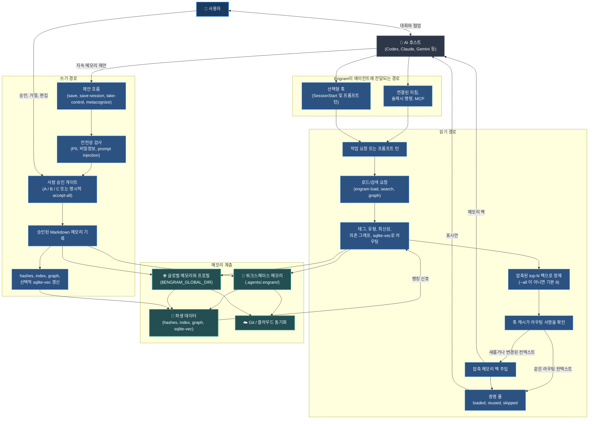

# Engram (한국어)

[](../../LICENSE) [](https://github.com/the-long-ride/engram) [](https://www.npmjs.com/package/@the-long-ride/engram) [](https://www.npmjs.com/package/@the-long-ride/engram)


[English](../../README.md) | [Tiếng Việt](../vi/README.md) | [Español](../es/README.md) | [Français](../fr/README.md) | [中文](../zh/README.md) | [한국어](README.md) | [日本語](../ja/README.md) | [Русский](../ru/README.md)

**Engram은 AI 에이전트를 위한 인간 소유·파일 우선 메모리 프로토콜입니다. 여러분과 팀의 성장과 함께합니다.**

에이전트에게 메모리를 제공하되, 메모리 소유권은 인간이 유지합니다. 영구적인 규칙, 워크플로우, 프로젝트 지식은 읽기 쉬운 Markdown 파일로 저장되어 인간이 검토하고 Git으로 동기화하며 파일 읽기가 가능한 모든 에이전트에서 활용할 수 있습니다.

---

## 주요 특징

- **인간 승인 기반**：AI가 메모리 후보를 제안하고, 인간이 직접 검토하여 승인합니다(A/B/C 게이트, 규칙을 통해 자동화 가능).
- **컨텍스트 최적화**：현재 태스크에 일치하는 메모리만 정밀하게 라우팅하여 컴팩트한 팩(기본 8개 파일)으로 주입해 컨텍스트 비대화를 방지합니다.
- **Git 네이티브 및 파일 방식**：Markdown 파일 형태로 `.agents/.engram/` 디렉토리에 저장되고 Git으로 관리됩니다. 오프라인 작동을 지원하며 공급업체 종속이 없습니다.
- **개인정보 및 보안 관리**：100% 로컬 환경에서 작동하며, 저장 전 API 키나 비밀번호 등 민감 정보(PII)/시크릿을 자동으로 스캔합니다.
- **의존성 그래프**：선행 조건(`depends_on`)을 선언할 수 있어 에이전트가 고난도 태스크 전에 기본 규칙을 자동으로 먼저 로드하게 만듭니다.

---

### 시스템 전체 흐름



---

## Engram이란 (메모리 계약)

- **Markdown이 영구 메모리입니다** — 숨겨진 바이너리나 전용 파일 포맷은 존재하지 않습니다.
- **JSON 인덱스, 그래프 및 옵션 sqlite-vec**는 오직 검색 속도를 높이기 위한 가속 레이어입니다.
- **승인이 신뢰의 경계입니다** — 에이전트가 제안하고 인간이 승인한다는 핵심 원칙을 따릅니다.
- **해시를 통한 무결성 검증** 및 **Ignore 규칙을 통한 개인정보 처리**.
- **프로파일을 통한 메모리 컨텍스트 격리** (개인, 클라이언트, 기업 업무 영역).
- **Git으로 포터빌리티 및 변경 이력 감사 기능 제공** — 팀원 간 규칙 공유가 용이함.
- **에이전트 어댑터는 편의 기능일 뿐**, 어떠한 결정 권한도 없습니다.
- **엄격한 규칙으로 에이전트 출력을 제어**하여 환각 현상을 줄입니다.

---

## Engram이 존재하는 이유 (기술적 해결책)

표준 규칙 파일은 모든 메시지와 함께 전송되므로 컨텍스트가 비대해지고, 지침이 드리프트되며, 시크릿 정보가 유출될 우려가 있으며, 특정 클라우드 벤더에 종속됩니다. Engram은 이러한 문제를 해결합니다:

| 기술적 문제 | Engram의 해결책 |
| --- | --- |
| **과도한 규칙으로 인한 컨텍스트 비대화** | 현재 작업에 일치하는 메모리만 정밀하게 추출하여 기본 8개 파일의 컴팩트 팩으로 로드합니다. |
| **자동 쓰기로 인한 시크릿 정보 유출** | 쓰기 작업 전 시크릿 및 인젝션 스캔을 실행하고 인간의 A/B/C 승인을 구합니다. |
| **특정 플랫폼에의 종속** | 평문 Markdown을 활용하므로 모든 에이전트 및 모델에 손쉽게 이식할 수 있습니다. |
| **오프라인 작업 불가능** | 별도 백앤드 서버나 인터넷 없이 로컬 파일 기반의 가벼운 프로토콜로 동작합니다. |
| **팀 내 규칙 불일치** | Git 버전 관리를 통해 팀 전체에 일관된 프로젝트 규칙과 지침을 동기화합니다. |
| **손상되거나 오래된 기존 메모리** | 무결성 검증 및 복구 도구(`engram repair`, `engram quality-check`)를 기본 제공합니다. |

---

## 주요 사용 사례

- **개인 및 전문 업무**：작성 스타일, 선호도 설정, 체크리스트, 학습 가이드, 템플릿, 인생 행동 강령.
- **소프트웨어 개발**：코딩 규칙, 아키텍처 가이드라인, 자주 사용하는 디버그 스크립트, 문제 해결, 팀 온보딩.
- **엔터프라이즈**：보안 및 규정 준수 가이드라인, 사내 SOP 위키, 브랜드 톤, Git 기반 감사 이력.

---

## 설치 및 설정

### 1. Engram CLI 설치
```bash
npm install -g @the-long-ride/engram
```

### 2. 에이전트 Skillset 글로벌 설치
AI 어시스턴트에게 Engram 연동 지침(읽기, 쓰기, 유지보수)을 가르칩니다:
```bash
# 지원 에이전트 목록 조회
engram is list

# 특정 에이전트에 스킬셋 설치
engram is --global <에이전트명>
```
*(`<에이전트명>`을 해당 어시스턴트 이름으로 교체하십시오. 목록에 없다면 `agents-md`를 입력하여 `AGENTS.md`를 통해 설정합니다.)*

Gemini / Antigravity 환경의 경우:
```bash
engram link gemini
```

세션 시작과 이후 프롬프트 턴 모두에서 컨텍스트를 주입할 수 있는 호스트를 위해 선택적 자동 로드 훅을 사용할 수 있습니다.
```bash
engram install-agent-hooks codex --plan
engram install-agent-hooks codex
engram install-agent-hooks claude
engram install-agent-hooks gemini
engram set-read auto
engram set-proof compact
```
v1 훅 설치는 `codex`, `claude`, `gemini`로 제한됩니다. Antigravity 호환성은 현재 `gemini`를 통해 라우팅됩니다. Cursor, Copilot, Cline, Windsurf/Cascade는 훅 표면이 프롬프트 시점에 안정적인 컨텍스트 주입을 지원할 때까지 지침/스킬셋/수동 로드 방식으로 유지됩니다.
`set-read` 주입 동작을 변경하지 않고 각 적격 턴마다 Engram 메모리가 로드, 재사용 또는 건너뛰었는지 여부를 보여주는 짧 'Engram proof:' 줄을 지원되는 훅이 추가하도록 하려면 `engram set-proof compact`를 사용하십시오.


### 3. 워크스페이스 초기화
프로젝트 루트 폴더에서 실행합니다:
```bash
engram init
```
*알림: 로컬 `.agents/.engram/` 디렉토리를 생성하고, 글로벌 메모리 경로를 설정하며, 옵션으로 서브모듈(`--submodule`) 및 원격 동기화를 활성화합니다.*

### 4. 제어판 웹 UI 열기
메모리 프로필을 시각화하고 검색하고 설정하려면 다음을 실행하십시오:
```bash
engram entry
```


---

## AI 에이전트 퀵스타트

대화 중 에이전트에게 다음 슬래시 명령어를 사용하도록 요청할 수 있습니다:

- **작업 시작 시**：`/engram load "design pricing table component"`
- **중요 결정사항 저장**：`/engram save knowledge "Webhook secret is process.env.STRIPE_WEBHOOK"`
- **세션 요약 저장**：`/engram save-session` (또는 `--query-level 3`, 또는 자동 승인용 `ss -a last 50 sessions`)

에이전트가 Engram 사용 방법을 물으면 `engram llm`을 실행하십시오. 패키지된 `llm.txt` AI 에이전트 가이드가 인쇄되며, `engram init` 전에 사용해도 안전합니다.

AI 에이전트가 `TYPE: ... | TEXT: ...` 메모리 후보를 제안할 때, 해당 메모리가 존재하는 이유를 설명하는 데 도움이 되는 경우 선택적으로 `CONTEXT: ...`를 추가할 수 있습니다. 단순한 사실은 이를 생략하고 기본 승인 컨텍스트를 사용할 수 있습니다.


---

## 명령어 및 에이전트 대조표 (Cheat Sheet)

| 태스크 | CLI 명령어 | AI 에이전트 명령어 제안 |
| --- | --- | --- |
| **메모리 로드** | `engram load "<태스크>"` | `/engram load "<태스크>"` |
| **로드 모의 테스트** | `engram load --dry-run "<태스크>"` | `/engram load --dry-run "<태스크>"` |
| **단일 메모리 저장** | `engram save <타입> "<텍스트>"` | `/engram save <타입> "<텍스트>"` |
| **세션 저장 제안** | `engram save-session` | `/engram ss` |
| **최근 세션 로드** | `engram save-session --query-level <n>` | `/engram save-session --query-level <n>` |
| **자동 승인 저장** | `engram save-session --accept-all` | `/engram ss -a` |
| **파일 / 문서 가져오기** | `engram take-control --all` | `/engram take-control --all` |
| **가져오기 및 재구성** | `engram take-control --all --metacognize --accept-all` | `/engram take control accept all metacognize` |
| **메모리 폴더 재구성** | `engram metacognize --workspace` | `/engram restructure workspace memory accept all` |
| **충돌 해결** | `engram resolve-conflicts --metacognize` | `/engram resolve conflicts and metacognize` |
| **경로 구성 확인** | `engram entry` | `/engram entry` |
| **에이전트 가이드 표시** | `engram llm` | 에이전트가 Engram 사용 안내를 필요로 할 때 한 번 실행 |
| **프로파일 격리 관리** | `engram profile status` / `create` / `use` | `/engram profile status` |
| **저장 대상 설정** | `engram set-save-target <workspace/global/both>` | `/engram set-save-target <target>` |
| **로드 제한 설정** | `engram set-load-limit <1..32>` | `/engram set-load-limit <count>` |
| **자동 읽기 설정** | `engram set-read startup|auto|always|manual|off` | `/engram set-read auto` |
| **증명 표시 설정** | `engram set-proof off|compact` | `/engram set-proof compact` |
| **에이전트 훅 설치** | `engram install-agent-hooks codex|claude|gemini` | 터미널에서 한 번 실행 |
| **글로벌 경로 변경** | `engram update-global-folder <신규경로>` | `/engram set global memory path to <new-path>` |
| **메모리 복제** | `engram clone-memory <원본> <대상>` | `/engram clone workspace memory to global` |
| **개발 역할 설정** | `engram set-role <역할리스트>` | `/engram set-role <roles>` |
| **규칙 엄격성 설정** | `engram set-rule-variant <variant>` | `/engram set-rule-variant <variant>` |
| **일관성 확인 및 복구** | `engram verify` / `engram repair` | `/engram verify` / `/engram repair` |
| **모순 규칙 스캔** | `engram quality-check` | `/engram quality-check` |
| **메모리 동기화** | `engram sync` | `/engram sync` |

`engram set-role ...` 또는 `engram set-rule-variant ...`가 성공하면 Engram은 이제 `Agent action:` 줄을 반환합니다. Engram을 지원하는 어댑터와 MCP 호스트는 즉시 `engram load "<현재 작업/요청>"`을 다시 실행하고 동일한 대화에서 이전 Engram 파생 컨텍스트를 대체해야 합니다. 이는 명령이 완료된 후에 발생하며 응답 중간에 발생하지 않으며, 설치된 스킬셋 파일은 여전히 향후 또는 재로드된 대화를 제어합니다.

---

## 비교

### agentmemory와의 비교
[rohitg00/agentmemory](https://github.com/rohitg00/agentmemory)는 백그라운드 자동 메모리 서버 엔진입니다. Engram은 인간이 직접 확인하는 로컬 Markdown 파일 방식이며 데몬 백그라운드 서비스가 불필요합니다.

| 차원 | Engram | agentmemory |
| --- | --- | --- |
| 신뢰의 근원 | 승인된 Markdown | 메모리 서버 / 데이터베이스 |
| 신뢰 경계 | 인간의 A/B/C 직접 승인 | 백그라운드 자동 획득 |
| 실행 형태 | 로컬 파일 (데몬 불필요) | 백그라운드 서비스 상시 실행 권장 |
| 검토 모델 | Git diff 및 Markdown 파일 검토 | 전용 뷰어 / API / 이력 조회 |

### Tolaria와의 비교
[refactoringhq/tolaria](https://github.com/refactoringhq/tolaria)는 Markdown 전용 데스크톱 앱입니다. Engram은 더 하위 레이어에서 CLI, 에이전트 스킬셋, Git 동기화를 지원합니다.

| 차원 | Engram | Tolaria |
| --- | --- | --- |
| 신뢰의 근원 | `.agents/.engram/` 폴더 | Markdown 노트 보관소 |
| 인터페이스 | CLI 및 에이전트 스킬셋 지침 | 데스크톱 앱 |

### Obsidian과의 비교
[Obsidian](https://obsidian.md/)은 개인용 노트 앱입니다. Engram은 에이전트 전용 메모리 프로토콜로서 더 협소한 범위, 엄격한 승인, Git 코드 관리 방식을 적용합니다.

| 차원 | Engram | Obsidian |
| --- | --- | --- |
| 신뢰의 근원 | `.agents/.engram/` 폴더 | 로컬 Markdown 노트 |
| 편집 방식 | 에이전트 제안, 인간 직접 승인 | 파일 직접 편집 및 수정 |

### Hermes Agent와의 비교
Hermes Agent는 하드 글자수 제한을 둔 자동화 메모리를 쓰지만, Engram은 인간 소유(또는 규칙 자동 저장 가능)에 기반하며 필요 시에만 태그/그래프 형태로 주입합니다.

| | Engram | Hermes Agent |
|---|---|---|
| **철학** | 인간 소유, 파일 우선(자동화는 선택) | 자동 및 항시 활성화되는 메모리 구조 |
| **저장소** | `.agents/.engram/` 내의 Markdown | `MEMORY.md` + `USER.md` (글자수 하드캡) |
| **쓰기** | 사용자가 검토하여 승인(자동화 가능) | 에이전트가 자체적으로 백그라운드 쓰기 실행 |
| **호출** | 필요 시 `engram load`로 적재 | 항시 실행: 매 세션마다 시스템 프롬프트에 로드 |
| **벡터 검색** | 옵션으로 로컬 sqlite-vec 사용 | 외부 프로바이더 제공 (agentmemory) |

### 기본 제공 메모리(Built-In Memory)와의 비교
기본 메모리(ChatGPT 웹 커스텀, Claude 프로젝트, Cursor 규칙)는 벤더에 종속됩니다. Engram은 로컬 파일을 데이터 원천으로 삼아 Git 협업과 시크릿 정보 유출 스캔을 지원합니다.

| 차원 | Engram | 기본 제공 메모리 |
| --- | --- | --- |
| **포터빌리티** | 평문 Markdown (모든 에이전트 호환) | 단일 플랫폼 또는 웹에 종속 |
| **제어권** | 쓰기 전 A/B/C 명시적 승인 | 백그라운드 암묵적 업데이트 |

---

## 상세 문서

상세 안내 문서는 저장소 내 `documentation/` 폴더에 있습니다:
- [English](../../README.md) | [Tiếng Việt](../vi/README.md) | [Español](../es/README.md) | [Français](../fr/README.md) | [中文](../zh/README.md) | [한국어](index.md) | [日本語](../ja/README.md) | [Русский](../ru/README.md)

## 로드맵 및 동반 프로젝트
우리는 현재 **Engram을 더 사용하기 쉽게 만드는 작업을 먼저 진행한 후 문서 페이지 개발**, **문서 사이트**, **AI 웹챗 통합**, **자연어 명령 맵핑 개선** 기능을 개발하고 있습니다.
Markdown 보관소를 시각적으로 쉽게 탐색하고 싶다면 [Markdown Explorer](https://the-long-ride.github.io/markdown-explorer/)를 참고하십시오.

## 라이선스 및 로그
[GPL-3.0](LICENSE) 라이선스로 배포됩니다. 상세 변경 사항은 [Changelog](https://github.com/the-long-ride/engram/blob/main/CHANGELOG.md)를 확인하십시오.
