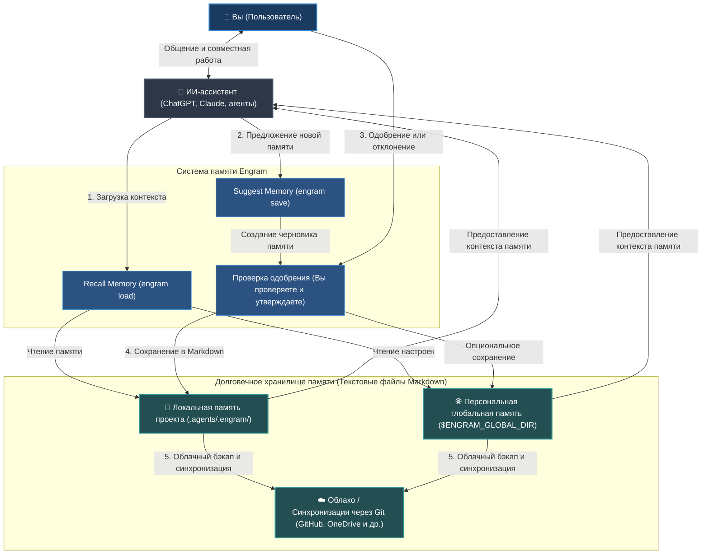

# Engram (Русский)


[English](../../README.md) | [Tiếng Việt](../vi/README.md) | [Español](../es/README.md) | [Français](../fr/README.md) | [中文](../zh/README.md) | [한국어](../ko/README.md) | [日本語](../ja/README.md) | [Русский](README.md)

**Engram — это протокол памяти, принадлежащий человеку, для ИИ-агентов. Растет вместе с вами и вашими командами.**

Он дает агентам память, не передавая им право собственности на нее. Долговечные правила, рабочие процессы и знания проекта хранятся в виде читаемого Markdown, проверяются человеком, переносятся через Git и могут быть использованы любым агентом, способным читать файлы.

---

## Что это такое

Engram — это центр памяти знаний для проекта, рабочей области, команды и личного контекста.

Это не скрытый мозг агента. Это не изолированное хранилище памяти конкретного провайдера. Это не база данных, которую понимает только один инструмент.

Контракт Engram:

- **Markdown — это надежная память.**
- **JSON-индекс, граф и опциональные модули sqlite-vec — это слои ускорения.**
- **Одобрение человека — это граница доверия.**
- **Хэши — это проверки целостности.**
- **Правила игнорирования — это средства контроля конфиденциальности.**
- **Git обеспечивает переносимость и историю аудита.**
- **Адаптеры агентов — это удобство, а не авторитет.**
- **Строгие правила управляют выводом агента.** Загружайте память знаний со строгими правилами (strict-rules) для контроля, направления и ограничения ответов ИИ-агентов.

Основной принцип: **агенты могут предлагать память, но люди владеют тем, что становится памятью.**

### Высокоуровневая схема работы (High-Level Flow)



---

## Почему он существует

ИИ-ассистенты и агенты забывают решения, повторяют вопросы по настройке и хранят полезные уроки только внутри одного чата, одной учетной записи провайдера или одной машины. Это удобно, пока команде не понадобится просмотреть, поделиться, исправить или удалить память.

Более того, текущие подходы к памяти ИИ сталкиваются с серьезными практическими проблемами:

- **Раздувание окна контекста (Context Window Bloat):** Стандартные файлы правил (такие как `.cursorrules` или системные промпты) отправляются с каждым сообщением. По мере роста правил они потребляют лимиты токенов, увеличивают стоимость и замедляют время ответа.
- **Дрейф контекста и галлюцинации:** В длинных чат-сессиях агенты отклоняются от инструкций, придумывают несуществующий синтаксис или галлюцинируют поведением из-за отсутствия структуры памяти и фильтрации.
- **Скрытая утечка секретов:** Автоматические инструменты фонового захвата памяти могут незаметно для вас записывать конфиденциальные ключи, API-токены, пароли или персональные данные (PII).
- **Блокировка внутри вендора (Vendor Lock-In):** Базы данных памяти, принадлежащие провайдерам, привязывают ваш контекст к одной конкретной платформе или модели, делая невозможным перенос данных или создание резервных копий.
- **Сломанные рабочие процессы в оффлайне:** Облачные системы памяти перестают работать в момент потери интернет-соединения, оставляя вашего агента без критически важного контекста.

Engram переносит память в локальные файлы для решения этих проблем:

| Практический вызов | Ответ Engram |
| --- | --- |
| **Слишком много правил раздувают контекст** | По умолчанию направляет и сокращает соответствующую задаче память в компактный пакет контекста из максимум 8 элементов. |
| **Скрытая запись и утечка секретов** | Требует явного одобрения человеком в стиле A/B/C и сканирует секреты/инъекции перед записью. |
| **Привязка к вендору** | Использует простые, понятные файлы Markdown, переносимые между любыми агентами и моделями. |
| **Нет оффлайн-доступа** | Работает локально как легковесный файловый протокол — сервер или интернет не требуются. |
| **Дрейф контекста в командных проектах** | Синхронизирует правила и руководства внутри всей команды с помощью Git. |
| **Поврежденная или устаревшая память** | Предоставляет утилиты для проверки и очистки (`engram verify`, `engram repair`). |

Память рабочей области загружается первой. Глобальная память является резервной. Когда глобальная память настроена, одобренные потоки сохранения в рабочей области также обновляют глобальную копию, поэтому переносимая память выживает даже в тех проектах, где не был запущен `engram init`.
Когда широкие запросы соответствуют более чем восьми элементам памяти, `engram load` повторно ранжирует их с помощью тегов, типа, давности, графа и опциональных векторных сигналов sqlite-vec перед загрузкой восьми лучших. Используйте `engram load --dry-run "<задача>"` для предварительного просмотра количества кандидатов и предложенных сужающих тегов, или `--all`, когда широкий контекст является намеренным.

---

## Примеры использования

Engram универсален и может использоваться для сохранения любых личных, профессиональных или технических воспоминаний.

### Для личной и профессиональной памяти
- **Личные предпочтения и стиль письма:** Научите своего ИИ-ассистента тому, как вы предпочитаете общаться, вашему любимому тону, выбору форматирования или шаблонам писем/блогов, чтобы он всегда создавал контент именно так, как вы хотите.
- **Конспекты и учебные пособия:** Храните краткие резюме изучаемых тем, ключевые формулы, словари иностранных языков или сложные концепции, которые вы освоили, позволяя ИИ опрашивать вас или объяснять вещи на основе вашего прошлого контекста.
- **Списки задач для рабочих процессов:** Храните настраиваемые шаблоны и пошаговые инструкции для повторяющихся задач — например, списки для монтажа видео, процедуры публикации постов в блоге или шаблоны планирования поездок.
- **Правила и принципы личной жизни:** Документируйте личные привычки, финансовые цели, рецепты или программы тренировок, чтобы ваш ИИ-ассистент мог помочь вам планировать питание, бюджет или управлять задачами в соответствии с вашими правилами.

### Для разработки программного обеспечения и ИТ
- **Правила и руководства репозитория:** Документируйте соглашения о стиле кода, архитектурные рекомендации или конкретные правила (например, "Всегда писать юнит-тесты для эндпоинтов"), чтобы любой кодинг-агент придерживался их.
- **Руководства по устранению неполадок и отладке:** Сохраняйте решения сложных багов, аппаратные обходные пути или шаги по настройке окружения, чтобы будущие агенты (и члены команды) не тратили время на решение одной и той же проблемы дважды.
- **Общие команды CLI и рабочие процессы:** Держите под рукой список скриптов репозитория, потоков выполнения тестов и команд развертывания.
- **Онбординг и координация команды:** Синхронизируйте обзоры архитектуры вашего проекта и общие подводные камни непосредственно через файлы Markdown с контролем версий, обеспечивая слаженную работу всей команды.

### Для предприятий и команд
- **Ограничения безопасности и соответствия требованиям:** Определите строгие протоколы комплаенса, правила конфиденциальности данных или политики безопасности, которые ИИ-агенты не должны нарушать при обработке организационных или клиентских данных.
- **Общие стандартные операционные процедуры (SOP):** Храните и версионируйте регламенты команды, спецификации продуктов, сценарии обслуживания клиентов и внутренние базы знаний в виде памяти Markdown.
- **Согласованный голос бренда и руководство по стилю:** Обеспечивайте соблюдение маркетинговых правил, требований к использованию товарных знаков и юридических дисклеймеров во всех материалах команды.
- **Журналы аудита и управление:** Ведите полную историю того, кто изменял те или иные правила, когда и почему через логи git-коммитов, полностью удовлетворяя корпоративным требованиям к безопасности.

---

## Быстрый старт для ИИ-агента

Для ежедневного использования позвольте вашему ИИ-ассистенту самостоятельно управлять загрузкой и сохранением памяти прямо внутри чата.

### Лучшие сценарии (использование в ИИ-чате)

- **Начало чат-сессии:** Попросите ИИ-ассистента вспомнить соответствующие правила или предпочтения для вашей задачи.
  ```text
  # Если вы установили skillset глобально, поддерживаемые агенты автоматически запускают engram load при начале сессии и смене задач.
  /engram load "design pricing table component"
  ```
- **Предложение новой памяти:** Попросите агента сохранить важное решение или факт, обнаруженный во время разговора.
  ```text
  /engram save knowledge "Stripe webhook secret is loaded from process.env.STRIPE_WEBHOOK_SECRET"
  ```
- **Саммари и сохранение сессии:** В конце сессии попросите агента объединить все новые правила, рабочие процессы или факты.
  ```text
  /engram save-session
  ```
  Чтобы попросить агента включить недавнюю историю чата, к которой он действительно имеет доступ, передайте положительный целочисленный уровень запроса:
  ```text
  /engram save-session --query-level 3
  ```
  Агент должен анализировать указанное количество недавних сессий чата человека и агента, включая текущую сессию, и не должен выдумывать недоступную историю.
  Чтобы одновременно анализировать недавнюю доступную историю и автоматически одобрять все рекомендуемые воспоминания, используйте:
  ```text
  /engram ss -a last 50 sessions
  ```
  Это нормализуется до `engram save-session --query-level 50 --accept-all`; `-a` является явным согласием человека на одобрение всех сгенерированных кандидатов.

Для получения полной информации и расширенных функций обратитесь к [Документации](index.md).

---

## Установка и настройка

Настройте Engram CLI и подготовьте его для вашего ИИ-ассистента.

### 1. Установка Engram CLI
Установите инструмент глобально в вашей системе:
```bash
npm install -g @the-long-ride/engram
```

### 2. Установка Skillset глобально
Научите своего глобального ИИ-ассистента взаимодействовать с Engram (загрузка, сохранение, обновление и обслуживание):
```bash
# Сначала вы можете использовать команду ниже для ознакомления.
# engram h is
# Используйте команду ниже, чтобы узнать имя поддерживаемых агентов.
engram is list
```
```bash
# Установите для своего ИИ-ассистента в качестве глобальной области видимости для автозагрузки памяти в начале задачи + возможности вручную использовать команды /engram
engram is --global <имя-вашего-агента>
# Если вашего агента нет в списке, но он читает AGENTS.md, используйте универсальный резервный вариант.
engram is --global agents-md
```
*(Замените `<имя-вашего-агента>` именем вашего ассистента из вывода команды `engram is list`; используйте `agents-md`, если вашего агента нет в списке, но он читает `AGENTS.md`.)*

Для Antigravity используйте единую цель экосистемы:
```bash
engram install-skillset antigravity
```
Это записывает инструкции для рабочей области в директории `.antigravity/`, `.antigravity-cli/`, `.antigravity-ide/` и файл `.antigravityrules`. Старое имя цели `antigravity-cli` по-прежнему принимается только как псевдоним совместимости.

### 3. Инициализация рабочей области
Запустите эту команду в корневой папке любого проекта или рабочей области, где вы хотите включить Engram:
```bash
engram init
```

> [!IMPORTANT]
> **На что обратить внимание во время инициализации (`engram init`):**
> - **Память рабочей области:** Создает локальную директорию `.agents/.engram/` для хранения специфичных для вашего проекта воспоминаний.
> - **Опция подмодуля Git:** Используйте `engram init --submodule`, если ваша команда хочет отслеживать память в отдельном, выделенном Git-репозитории.
> - **Персональная глобальная память:** Запросит путь к глобальной директории (например, `--global-path ~/engram-global`). Она служит резервным местом для личных настроек, сохраняющихся во всех ваших проектах.
> - **Резервное копирование и синхронизация в облаке:** Настройте URL глобального репозитория (`--global-remote <git-url>`) или настройте OneDrive/ Google Drive/ Dropbox для беспрепятственной синхронизации ваших воспоминаний.

---

## Настройки и следующие команды

После инициализации настройте активные опции и поведение синхронизации. Поддерживаются как команды CLI, так и эквивалентные слэш-команды ИИ-агента.

### Установка ролей разработчиков
Фильтруйте активную загрузку памяти по конкретным ролям разработки (например, `frontend`, `backend`, `security`, `docs`).
- **CLI:**
  ```bash
  # Фильтровать загрузку памяти по правилам frontend и дизайна
  engram set-role frontend design

  # Сбросить активные роли для загрузки всех воспоминаний без фильтрации
  engram set-role
  ```
- **Чат ИИ-агента:**
  ```text
  /engram set-role frontend design
  /engram set-role
  ```

### Установка варианта правил (уровень строгости)
Настройте строгость форматирования правил при их загрузке вашим ИИ-ассистентом:
- **CLI:**
  ```bash
  # strict: более точный результат для небольших/слабых моделей; может вызвать "brainlock" (перегрузку ограничениями) в продвинутых флагманских моделях (например, Claude Opus 3.5, GPT-5.5)
  # balanced/light: сохраняет рассуждения гибкими и оптимальными для продвинутых моделей
  engram set-rule-variant balanced
  ```
- **Чат ИИ-агента:**
  ```text
  /engram set-rule-variant balanced
  ```

### Другие полезные команды
- **Проверить активные настройки и пути:** `engram entry` (Агент: `/engram entry`)
- **Синхронизировать локальные и глобальные изменения:** `engram sync` (Агент: `/engram sync`)
- **Запустить проверку и очистить битые ссылки:** `engram verify` / `engram repair` (Агент: `/engram verify` / `/engram repair`)
- **Проверить наличие противоречий:** `engram quality-check` (Агент: `/engram quality-check`)

---

## Таблица соответствия команд: CLI vs. ИИ-агент

| Задача | Команда CLI | Предложение для ИИ-агента (слэш-команда) |
| --- | --- | --- |
| **Загрузить память** | `engram load "<задача>"` | `/engram load "<задача>"` |
| **Просмотр загрузки** | `engram load --dry-run "<задача>"` | `/engram load --dry-run "<задача>"` |
| **Сохранить одну запись** | `engram save <тип> "<текст>"` | `/engram save <тип> "<текст>"` |
| **Предложить несколько записей** | `engram save-session` | `/engram ss` |
| **Собрать сессии недавних чатов** | `engram save-session --query-level 3` | `/engram save-session --query-level 3` |
| **Автоматическое одобрение** | `engram save-session --accept-all` | `/engram ss -a` |
| **Собрать и автоодобрить сессии** | `engram save-session --query-level 50 --accept-all` | `/engram ss -a last 50 sessions` |
| **Импортировать файлы / доки** | `engram take-control --all` | `/engram take-control --all` |
| **Проверить конфиг / пути** | `engram entry` | `/engram entry` |
| **Проверить целостность памяти** | `engram verify` | `/engram verify` |
| **Установить активные роли** | `engram set-role <роли>` | `/engram set-role <роли>` |
| **Установить строгость правил** | `engram set-rule-variant <вариант>` | `/engram set-rule-variant <вариант>` |
| **Синхронизировать память** | `engram sync` | `/engram sync` |
| **Перестроить и исправить индекс** | `engram repair` | `/engram repair` |


## Документация

Полная документация находится в репозитории в директории `documentation/`; npm-пакет намеренно содержит этот README и файлы рантайма, необходимые для работы CLI, а не все дерево документации.

| Язык | Начните отсюда |
| --- | --- |
| Английский | [documentation/en/index.md](../en/index.md) |
| Вьетнамский | [documentation/vi/index.md](../vi/index.md) |
| Испанский | [documentation/es/index.md](../es/index.md) |
| Французский | [documentation/fr/index.md](../fr/index.md) |
| Китайский | [documentation/zh/index.md](../zh/index.md) |
| Корейский | [documentation/ko/index.md](../ko/index.md) |
| Японский | [documentation/ja/index.md](../ja/index.md) |
| Русский | [documentation/ru/index.md](index.md) |

Каждый язык содержит страницы обзора, ментальной модели, быстрого старта для ИИ-агента, протокола, операций и сравнения.

## Плюсы

- Простой Markdown в качестве первоисточника данных.
- Одобрение человеком перед записью долговечной памяти.
- Удобное для Git ревью изменений, история коммитов, синхронизация и восстановление.
- Приоритет рабочей области с возможностью отката к глобальной памяти.
- Независимость от ИИ-агента: Codex, Claude, Cursor, Gemini, Copilot, OpenCode, Antigravity, Cline, Windsurf и любые читающие файлы агенты могут использовать его.
- Компактная маршрутизация по умолчанию, с возможностью предпросмотра dry-run и опциональными локальными sidecar-модулями sqlite-vec для больших объемов памяти.
- Уровни безопасности: валидация схемы, сканирование секретов, сканирование на промпт-инъекции, хэши и правила игнорирования.
- Полезные сценарии обслуживания: observe, take-control, graph, archive, benchmark, repair.
- Не требует фоновых демонов, баз данных или облачных учетных записей; sqlite-vec — опциональный локальный модуль, а не источник истины.

## Минусы

- Менее автоматизирован, чем движки памяти, которые фоном записывают абсолютно все подряд.
- Поиск по умолчанию является детерминированным лексическим поиском; `search --semantic` добавляет локальное сходство, а не полноценный семантический векторный поиск.
- Опциональный sqlite-vec использует локальные хэшированные векторы слов, а не внешние сервисы эмбеддингов.
- Обнаружение противоречий носит эвристический и рекомендательный характер.
- `deduplicate --semantic` использует локальное сходство слов, а не внешние эмбеддинги.
- Анализ паттернов, зашифрованное хранилище и автоматические PR находятся на стадии проектирования, а не готовых решений рантайма.

## Сравнение с Agentmemory

[rohitg00/agentmemory](https://github.com/rohitg00/agentmemory) — это мощный движок автоматической памяти для кодинг-агентов с памятью в стиле сервера, интеграцией MCP/hooks/REST, воспроизведением сессий, тестами производительности, гибридным поиском и готовыми интеграциями (например, Hermes).

Engram выбирает другую философию.

| Критерий | Engram | agentmemory |
| --- | --- | --- |
| Источник истины | Проверенный человеком Markdown | Сервер/хранилище памяти |
| Граница доверия | Проверка A/B/C перед записью | Автозахват плюс контроль на уровне утилит |
| Режим работы | Файловый протокол, службы не нужны; sqlite-vec опционален | Рекомендуется запуск службы |
| Модель ревью | Сравнение Git diff и проверка Markdown | Просмотрщик/API/история сессий |
| Отличный выбор для | Прозрачного владения памятью команды | Автоматического возврата контекста и реплея |
| Главный риск | Требует дисциплины сохранения | Может стать невидимым состоянием без контроля |

Используйте agentmemory, если хотите автоматический захват, воспроизведение сессий, векторный поиск и множество живых инструментов работы с памятью.

Используйте Engram, когда хотите, чтобы память была максимально простой и надежной: файлы, ревью, хэши, Git и полный контроль человека.

## Сравнение с Tolaria

[refactoringhq/tolaria](https://github.com/refactoringhq/tolaria) — отличное настольное приложение для управления базами знаний в Markdown. Оно ориентировано на локальные файлы, интеграцию с Git, работу без сети и создано для больших личных или командных баз данных, которые могут стать полезным контекстом для ИИ-агентов.

Engram находится ниже в технологическом стеке. Это не десктопное приложение для ведения заметок; это низкоуровневый протокол памяти, CLI и набор инструкций (skillset) для управляемой памяти агентов.

| Критерий | Engram | Tolaria |
| --- | --- | --- |
| Источник истины | Одобренная память в `.agents/.engram/` | Заметки в Markdown с YAML frontmatter |
| Интерфейс | CLI, слэш-адаптеры, MCP-обертка и Markdown для чтения агентом | Кроссплатформенное настольное приложение |
| Модель записи | Агенты предлагают; человек одобряет запись | Человек напрямую ведет базу знаний Markdown |
| Область применения | Правила, процессы, навыки и память агентов проектов/команд | Большие личные или командные базы знаний |
| Формат работы | Не требует фоновых служб, облаков или приложений; sqlite-vec опционален | Tauri-приложение для macOS, Windows и Linux |
| Отличный выбор для | Проверяемого контроля памяти агентов в репозиториях | Просмотра, редактирования и организации больших баз Markdown |
| Главный риск | Требует дисциплины сохранения | Избыточный функционал приложения, если нужен только протокол памяти |

Используйте Tolaria, если вам нужно полноценное настольное приложение для ведения заметок в Markdown, визуализация связей и работа в первую очередь с клавиатуры.

Используйте Engram, когда вам нужно, чтобы слой памяти агента оставался маленьким, контролируемым, версионируемым через Git diff, с хэшами и простыми инструкциями.

## Сравнение с Obsidian

[Obsidian](https://obsidian.md/) — превосходное приложение для ведения личных заметок, построения баз знаний со связями, планирования и долговечного хранения файлов в Markdown. Оно хранит файлы локально, имеет огромную экосистему плагинов и тем, а также предлагает платные сервисы Sync и Publish.

Engram не пытается заменить приложение для ведения заметок. Это протокол управляемой памяти для ИИ-агентов: он меньше по масштабу, строже относится к одобрению данных и спроектирован так, чтобы память ИИ можно было инспектировать точно так же, как исходный код.

| Критерий | Engram | Obsidian |
| --- | --- | --- |
| Источник истины | Одобренная память в `.agents/.engram/` | Локальные файлы заметок Markdown |
| Интерфейс | CLI, слэш-адаптеры, MCP-обертка и Markdown для чтения агентом | Приложение для ПК и мобильных с графом, канвасом, плагинами и темами |
| Модель записи | Агенты предлагают; человек одобряет запись | Люди и плагины редактируют заметки напрямую |
| Область применения | Правила, процессы, навыки и память агентов проектов/команд | Личные или командные заметки, планирование, базы знаний |
| Формат работы | Без фоновых служб и приложений; sqlite-vec локально опционально | Приложение Obsidian с плагинами сообщества и облачной синхронизацией |
| Интеграция ИИ | Готовые инструкции и потоки одобрения памяти | База данных может стать контекстом через плагины или MCP |
| Отличный выбор для | Проверяемого контроля памяти множества агентов | Сложного ведения заметок и построения "второго мозга" |
| Главный риск | Требует дисциплины сохранения | Контекст агента может стать раздутым и непроверенным без цензуры |

Используйте Obsidian, когда хотите полноценное рабочее пространство для размышлений, написания текстов и связывания заметок.

Используйте Engram, когда хотите, чтобы слой памяти ИИ оставался компактным, чётким, проверяемым, переносимым и контролируемым.

Они отлично работают вместе: ведите обширные заметки в Obsidian, а затем дистиллируйте строгие правила ИИ-агентов и знания проектов в Engram.

## Сравнение со встроенной памятью ИИ-агентов

Встроенная память ИИ-ассистентов (такая как память ChatGPT, Claude Projects или настройки правил Cursor) удобна, но часто заблокирована внутри одной платформы. Её трудно сравнить (diff), экспортировать, аудировать, делиться или исправлять.

Engram относится к встроенной памятью как к уровню удобства, а не как к первоисточнику. Авторитетным источником является папка памяти, которую человек может свободно инспектировать.

| Критерий | Engram | Встроенная память ИИ-агентов |
| --- | --- | --- |
| **Переносимость** | Мультиплатформенность: текстовые файлы Markdown, читаемые любым редактором или агентом. | Заблокирована внутри одной платформы (например, только в ChatGPT Web или в Cursor). |
| **Контроль человека** | Явный: агенты предлагают черновики, но человек проверяет и одобряет (A/B/C) перед записью. | Скрытый/Черный ящик: ассистент обновляет память в фоновом режиме без проверки пользователем. |
| **Коллаборация** | Удобно для Git: делитесь памятью проекта со всей командой через контроль версий. | Только один пользователь: нет встроенного способа делиться или объединять память. |
| **Безопасность** | Безопасно: сканирует PII и секреты перед записью, работает на 100% локально/оффлайн. | Высокий риск: может незаметно перехватывать и отправлять в облако API-ключи, пароли и секреты компании. |
| **Оптимизация промпта** | Избирательно: загружает только файлы памяти, соответствующие текущей задаче или роли. | Монолитно: либо сваливает все правила в контекст, либо использует скрытые векторные базы. |

Используйте встроенную память, когда хотите фоновую персонализацию без лишних действий на одной веб-платформе.

Используйте Engram, когда хотите, чтобы память вашего ассистента была проверяемой, общей для всей команды, переносимой между IDE и на 100% контролируемой вами.

---

## Дорожная карта

Мы расширяем возможности Engram для беспрепятственной поддержки веб-интерфейсов ИИ и синхронизации с облачными хранилищами:

- **Интеграция с веб-чатами ИИ:** Разработка расширений для браузеров (Chrome/Firefox) и нативных веб-плагинов, позволяющих памяти Engram работать напрямую в веб-клиентах, таких как ChatGPT, Claude.ai и Gemini Web.
- **Подключение облачных хранилищ и Git:** Предоставление возможности веб-ассистентам загружать память напрямую из подключенного GitHub-репозитория пользователя, папок Google Drive, OneDrive или Dropbox.
- **Маппинг команд на естественном языке:** Позволить ИИ-агентам преобразовывать обычные фразы в чате (например, "Эй, пожалуйста, запомни, что мы пишем стили в HSL" или "Проверь здоровье моего банка памяти") в соответствующие действия Engram без необходимости жесткого ввода слэш-команд.

---

## Сопутствующий проект: Markdown Explorer

Нужен визуальный способ навигации и поиска по файлам Markdown? Обратите внимание на [Markdown Explorer](https://the-long-ride.github.io/markdown-explorer/) — легкое расширение для VS Code / десктопное приложение (Windows, Linux, macOS) с открытым исходным кодом (MIT) для изучения, визуализации и поиска по локальным папкам Markdown. Оно отлично дополняет Engram, помогая вам просматривать файлы правил, навыков и знаний агента непосредственно в папке памяти Engram.

---

## Лицензия

[Лицензия GPL-3.0](LICENSE)
