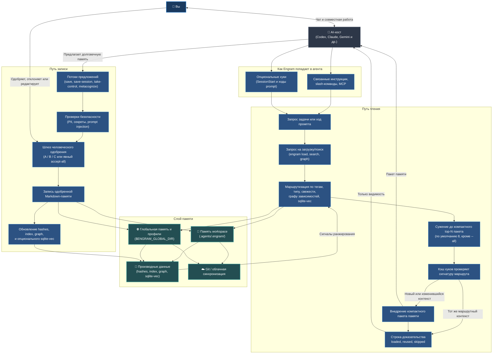

# Engram (Русский)

[](../../LICENSE) [](https://github.com/the-long-ride/engram) [](https://www.npmjs.com/package/@the-long-ride/engram) [](https://www.npmjs.com/package/@the-long-ride/engram)


[English](../../README.md) | [Tiếng Việt](../vi/README.md) | [Español](../es/README.md) | [Français](../fr/README.md) | [中文](../zh/README.md) | [한국어](../ko/README.md) | [日本語](../ja/README.md) | [Русский](README.md)

**Engram — это локальный файловый протокол управляемой памяти ИИ-агентов. Растет вместе с вами и вашими командами.**

Он дает агентам память, но оставляет право владения ею за человеком. Постоянные правила, рабочие процессы и знания о проектах хранятся в виде простых текстовых файлов Markdown, проверяются человеком, переносятся через Git и могут быть использованы любым агентом, способным читать файлы.

---

## Ключевые Особенности

- **Контроль Человеком**: ИИ предлагает кандидатов воспоминаний; человек проверяет и одобряет их (шлюз A/B/C, автоматизируемый правилами).
- **Оптимизация Контекста**: Находит и упаковывает только те воспоминания, которые соответствуют задаче, в компактный пакет (по умолчанию 8 файлов), чтобы избежать раздувания контекста.
- **Нативный для Git и Файлов**: Воспоминания сохраняются в `.agents/.engram/` в формате Markdown и синхронизируются через Git — никакой привязки к облаку, полная автономность.
- **Безопасность и Конфиденциальность**: Работает на 100% локально и сканирует секреты/PII перед физической записью на диск.
- **Графы Зависимостей**: Позволяет объявлять зависимости (`depends_on`), чтобы агент автоматически читал базовые правила перед переходом к сложным задачам.

---

### Общий Поток Системы



---

## Что такое Engram (Контракт Памяти)

- **Markdown — это надежная память** — никаких скрытых бинарных или проприетарных форматов.
- **JSON-индекс, граф зависимостей и sqlite-vec** служат слоями ускорения.
- **Одобрение — граница доверия** — агент предлагает, человек утверждает.
- **Хеши проверяют целостность**, а **Правила ignore управляют приватностью**.
- **Профили изолируют контексты памяти** (личный, клиенты, компания).
- **Git обеспечивает переносимость и историю аудита** — делитесь правилами с командой.
- **Адаптеры — для удобства, они не имеют решающего голоса**.
- **Строгие правила управляют выводами агента** для предотвращения галлюцинаций.

---

## Почему существует Engram (Практические Решения)

Стандартные файлы правил (например, `.cursorrules`) отправляются с каждым сообщением, переполняя контекст, уводя агента от темы, приводя к утечке ключей или привязывая вас к облачному вендору. Engram решает эти проблемы:

| Тактическая проблема | Ответ от Engram |
| --- | --- |
| **Слишком много правил раздувают контекст** | Извлекает и загружает только воспоминания, подходящие к текущей задаче (по умолчанию 8 файлов). |
| **Тихие записи и утечка секретов** | Требует явного одобрения человеком (A/B/C) и сканирует на наличие паролей/ключей перед записью. |
| **Блокировка вендором** | Использует переносимые файлы Markdown, которые может читать любой редактор или агент. |
| **Нет работы оффлайн** | Работает полностью локально без запуска фоновых служб или баз данных. |
| **Рассинхронизация правил в команде** | Хранит правила прямо в репозитории проекта и синхронизирует их через Git. |
| **Сломанная или устаревшая память** | Предоставляет инструменты проверки целостности и исправления (`engram repair`, `engram quality-check`). |

---

## Примеры Использования

- **Для личных и рабочих задач**: Стили написания, предпочтения, списки задач, словари, шаблоны, жизненные принципы.
- **Для разработки ПО**: Правила кодирования, соглашения об архитектуре, отладочные скрипты, онбординг команды.
- **Для бизнеса**: Правила безопасности и соответствия нормативным требованиям, SOP команды, базы знаний, история аудита в Git.

---

## Установка и Настройка

### 1. Установите Engram CLI
```bash
npm install -g @the-long-ride/engram
```

### 2. Установите Skillset Глобально
Обучите вашего ИИ-ассистента работе с памятью (чтение, сохранение, обслуживание):
```bash
# Список поддерживаемых агентов
engram link list

# Установка набора навыков (skillset) для агента
engram link --global <имя_агента>
```
*(Замените `<имя_агента>` на имя вашего ассистента; используйте `agents-md` для неподдерживаемых агентов, умеющих читать `AGENTS.md`.)*

Для сред Gemini / Antigravity:
```bash
engram link gemini
```

Необязательные хуки автозагрузки доступны для хостов, которые могут внедрять контекст как при запуске сессии, так и при последующих ходах промпта:
```bash
engram link codex
engram link claude
engram link gemini
engram link --global opencode
engram set-read auto
engram set-proof compact
```
Установка хуков v1 доступна для `codex`, `claude`, `gemini` и `opencode`. Совместимость с Antigravity в настоящее время маршрутизируется через `gemini`; Cursor, Copilot, Cline и Windsurf/Cascade остаются управляемыми через инструкции/набор навыков/ручную загрузку до тех пор, пока поверхности их хуков не станут поддерживать надежное внедрение контекста во время промпта.
Используйте `engram set-proof compact`, если вы хотите, чтобы поддерживаемые хуки добавляли короткую строку `Engram proof:` при каждом подходящем ходе, показывая, была ли память Engram загружена, повторно использована или пропущена, без изменения поведения внедрения `set-read`.


### 3. Инициализируйте Рабочее Пространство
Запустите в корневом каталоге проекта:
```bash
engram inject
```
*Замечание: создается локальная папка `.agents/.engram/`, настраивается путь глобальной памяти, поддерживаются субмодули Git (`--submodule`) и синхронизация.*

### 4. Откройте веб-интерфейс панели управления
Чтобы визуализировать, искать и настраивать профили памяти, запустите:
```bash
engram entry
```


---

## Быстрый Старт для ИИ-Агента

Вы можете поручить агенту выполнять в чате следующие слэш-команды:

- **Начало задачи**: `/engram load "design pricing table component"`
- **Сохранение решения/факта**: `/engram save knowledge "Webhook secret is process.env.STRIPE_WEBHOOK"`
- **Сборка и архивация сессии**: `/engram save-session` (или `--query-level 3`, или автосогласие `ss -a last 50 sessions`)

Когда агент спрашивает, как использовать Engram, запустите `engram llm`. Это выведет упакованное руководство для ИИ-агента `llm.txt`, которое безопасно использовать до выполнения `engram inject`.

Когда ИИ-агент предлагает кандидатов в память в формате `TYPE: ... | TEXT: ...`, он может по желанию добавить `CONTEXT: ...`, если это помогает объяснить, почему память существует. Простые факты могут опускать это поле и использовать контекст утверждения по умолчанию.


---

## Таблица Сопоставления Команд (Cheat Sheet)

| Задача | Команда CLI | Рекомендация для ИИ-агента |
| --- | --- | --- |
| **Загрузка памяти** | `engram load "<задача>"` | `/engram load "<задача>"` |
| **Сухой запуск загрузки** | `engram load --dry-run "<задача>"` | `/engram load --dry-run "<задача>"` |
| **Сохранение записи** | `engram save <тип> "<текст>"` | `/engram save <тип> "<текст>"` |
| **Предложение сессии** | `engram save-session` | `/engram ss` |
| **Сбор сессий из истории** | `engram save-session --query-level <n>` | `/engram save-session --query-level <n>` |
| **Автоодобрение записи** | `engram save-session --accept-all` | `/engram ss -a` |
| **Импорт файлов / док** | `engram take-control --all` | `/engram take-control --all` |
| **Импорт и реструктуризация** | `engram take-control --all --metacognize --accept-all` | `/engram take control accept all metacognize` |
| **Реструктуризация памяти** | `engram metacognize --workspace` | `/engram restructure workspace memory accept all` |
| **Разрешение конфликтов** | `engram resolve-conflicts --metacognize` | `/engram resolve conflicts and metacognize` |
| **Проверка путей** | `engram entry` | `/engram entry` |
| **Показать руководство агента** | `engram llm` | Запустить один раз, когда агенту требуется руководство по использованию Engram |
| **Управление профилями** | `engram profile status` / `create` / `use` | `/engram profile status` |
| **Куда сохранять** | `engram set-save-target <workspace/global/both>` | `/engram set-save-target <target>` |
| **Лимит загрузки** | `engram set-load-limit <1..32>` | `/engram set-load-limit <count>` |
| **Настроить Авточтение** | `engram set-read startup|auto|always|manual|off` | `/engram set-read auto` |
| **Показ Доказательства** | `engram set-proof off|compact` | `/engram set-proof compact` |
| **Установить Хуки Агента** | `engram link codex|claude|gemini|opencode` | Один раз запустить в терминале |
| **Путь к глобальной памяти** | `engram update-global-folder <новый-путь>` | `/engram set global memory path to <new-path>` |
| **Клонирование памяти** | `engram clone-memory <источник> <цель>` | `/engram clone workspace memory to global` |
| **Назначение роли** | `engram set-role <роли>` | `/engram set-role <roles>` |
| **Строгость правил** | `engram set-rule-variant <variant>` | `/engram set-rule-variant <variant>` |
| **Проверка и ремонт** | `engram verify` / `engram repair` | `/engram verify` / `/engram repair` |
| **Поиск противоречий** | `engram quality-check` | `/engram quality-check` |
| **Синхронизация памяти** | `engram sync` | `/engram sync` |

При успешном выполнении `engram set-role ...` или `engram set-rule-variant ...` Engram теперь возвращает строку `Agent action:`. Совместимые с Engram адаптеры и хосты MCP должны немедленно перезапустить `engram load "<текущая задача/запрос>"` и заменить прежний контекст, полученный от Engram, в том же разговоре. Это происходит после завершения команды, а не посреди ответа, и установленные файлы набора навыков по-прежнему управляют будущими или перезагруженными чатами.

---

## Сравнение

### С Agentmemory
[rohitg00/agentmemory](https://github.com/rohitg00/agentmemory) представляет собой автоматическую систему памяти, работающую как фоновая служба. Engram же делает фокус на локальных Markdown-файлах, контролируемых и проверяемых человеком через Git.

| Критерий | Engram | agentmemory |
| --- | --- | --- |
| Источник истины | Одобренные файлы Markdown | Сервер/БД памяти |
| Граница доверия | Проверка и выбор человека (A/B/C) | Автоматический сбор |
| Формат работы | Локальные файлы (демон не нужен) | Рекомендуется фоновый демон |
| Проверка | Git diff и ревью Markdown | Просмотрщик/API и история сессий |

### С Tolaria
[refactoringhq/tolaria](https://github.com/refactoringhq/tolaria) — это настольное приложение для Markdown. Engram находится на более низком техническом уровне, предоставляя CLI, наборы навыков агентов и управление правилами Git.

| Критерий | Engram | Tolaria |
| --- | --- | --- |
| Источник истины | `.agents/.engram/` | Хранилища Markdown |
| Интерфейс | CLI и наборы правил (skillset) | Настольное приложение |

### С Obsidian
[Obsidian](https://obsidian.md/) — это полноценное приложение для ведения заметок. Engram является специализированным протоколом памяти ИИ-агентов: он меньше по масштабу, строго требует ручного одобрения и версионирует память как код.

| Критерий | Engram | Obsidian |
| --- | --- | --- |
| Источник истины | `.agents/.engram/` | Локальные файлы заметок |
| Метод записи | Агент предлагает, человек утверждает | Прямое редактирование файлов |

### С Hermes Agent
Hermes Agent использует автономную память с жесткими лимитами на символы, в то время как Engram принадлежит человеку (или автоматизируется правилами) и осуществляет поиск по требованию на основе тегов и графа зависимостей.

| | Engram | Hermes Agent |
|---|---|---|
| **Философия** | Локальные файлы под контролем человека | Автономная, всегда активная память |
| **Хранение** | Файлы Markdown в `.agents/.engram/` | `MEMORY.md` + `USER.md` (жесткие лимиты) |
| **Запись** | Одобряется человеком (автоматизация по правилам) | Агент пишет автономно |
| **Извлечение** | По запросу через `engram load` | Всегда загружена в системный промпт |
| **Поиск векторов** | Локальный sqlite-vec (опционально) | Через внешнего провайдера (agentmemory) |

### Со встроенной памятью ИИ-агентов
Встроенная память (ChatGPT, Claude Projects, Cursor rules) скрыта и привязана к одной платформе. Engram считает локальные файлы первоисточником, что позволяет делать diff, экспортировать, делиться через Git и сканировать на пароли/ключи.

| Критерий | Engram | Встроенная память |
| --- | --- | --- |
| **Переносимость** | Обычный Markdown, читаемый любым агентом | Заблокирована внутри одной платформы |
| **Контроль человека** | Явное одобрение A/B/C перед записью | Автоматическое обновление в фоновом режиме |

---

## Документация

Полная документация находится в репозитории под каталогом `documentation/`:
- [English](../../README.md) | [Tiếng Việt](../vi/README.md) | [Español](../es/README.md) | [Français](../fr/README.md) | [中文](../zh/README.md) | [한국어](../ko/README.md) | [日本語](../ja/README.md) | [Русский](index.md)

## Дорожная Карта и Сопутствующий Проект
Мы работаем над **В первую очередь сделать Engram более простым в использовании, а затем страницу документации**, **Сайтом документации**, **Интеграцией с веб-чатами ИИ** и **Улучшением картирования команд естественного языка**. 
Для визуальной навигации по Markdown-заметкам используйте [Markdown Explorer](https://the-long-ride.github.io/markdown-explorer/).

## Лицензия и Изменения
Выпущено под лицензией [GPL-3.0](LICENSE). Подробности см. в [Changelog](https://github.com/the-long-ride/engram/blob/main/CHANGELOG.md).
