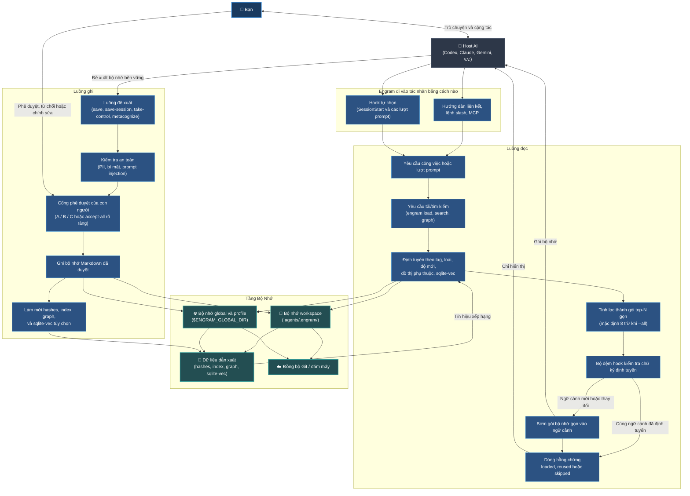

# Engram (Tiếng Việt)

[](../../LICENSE) [](https://github.com/the-long-ride/engram) [](https://www.npmjs.com/package/@the-long-ride/engram) [](https://www.npmjs.com/package/@the-long-ride/engram)


[English](../../README.md) | [Tiếng Việt](README.md) | [Español](../es/README.md) | [Français](../fr/README.md) | [中文](../zh/README.md) | [한국어](../ko/README.md) | [日本語](../ja/README.md) | [Русский](../ru/README.md)

**Engram là một giao thức bộ nhớ do con người sở hữu, thiết kế dưới dạng tệp tin dành cho các tác nhân AI. Đồng hành cùng bạn và đội ngũ của bạn.**

Giao thức này cung cấp bộ nhớ cho tác nhân AI nhưng quyền sở hữu luôn thuộc về con người. Các quy tắc bền vững, quy trình làm việc và kiến thức dự án được lưu dưới dạng Markdown dễ đọc, được con người xem xét, di động qua Git và có thể sử dụng bởi bất kỳ tác nhân AI nào.

---

## Điểm Nhấn Chính

- **Con Người Kiểm Soát**: AI đề xuất bộ nhớ; con người xem xét và phê duyệt (phím A/B/C, tự động hóa qua quy tắc).
- **Tối Ưu Hóa Ngữ Cảnh**: Định tuyến và chắt lọc các bộ nhớ phù hợp vào gói gọn nhẹ (mặc định 8 tệp) tránh quá tải ngữ cảnh.
- **Git và File Thuần Túy**: Lưu dưới dạng Markdown trong thư mục `.agents/.engram/` và đồng bộ qua Git—không phụ thuộc nhà cung cấp, hoạt động ngoại tuyến.
- **Quyền Riêng Tư & Bảo Mật**: Hoạt động cục bộ 100% và quét thông tin nhạy cảm/mã bảo mật trước khi ghi.
- **Đồ Thị Phụ Thuộc**: Khai báo phụ thuộc giữa các bộ nhớ (`depends_on`) giúp tác nhân AI tự động tải quy tắc nền tảng trước quy tắc nâng cao.

---

### Luồng Hệ Thống Cấp Cao



---

## Engram Là Gì (Hợp Đồng Bộ Nhớ)

- **Markdown là bộ nhớ bền vững** — không có định dạng nhị phân ẩn hay độc quyền.
- **Chỉ mục JSON, đồ thị và sqlite-vec tùy chọn** đóng vai trò là các lớp tăng tốc.
- **Phê duyệt là ranh giới tin cậy** — AI đề xuất, con người phê duyệt.
- **Mã băm kiểm tra tính toàn vẹn** và **Quy tắc bỏ qua xử lý quyền riêng tư**.
- **Profile tách biệt ngữ cảnh bộ nhớ** (cá nhân, khách hàng và doanh nghiệp).
- **Git cung cấp tính di động và lịch sử kiểm toán** — dễ dàng chia sẻ quy tắc trong nhóm.
- **Bộ điều hợp là tiện ích, không có quyền quyết định**.
- **Quy tắc nghiêm ngặt quản lý phản hồi của tác nhân AI** để tránh ảo tưởng.

---

## Lý Do Engram Tồn Tại (Giải Pháp Thực Tế)

Các tệp quy tắc chuẩn gửi đi cùng mọi tin nhắn gây phình ngữ cảnh, ảo tưởng, rò rỉ mã bảo mật, hoặc khóa chặt bạn vào dịch vụ đám mây. Engram giải quyết các thách thức này như sau:

| Thách thức thực tế | Giải pháp từ Engram |
| --- | --- |
| **Quá nhiều quy tắc làm phình ngữ cảnh** | Định tuyến và tải bộ nhớ phù hợp cho tác vụ hiện tại trong gói gọn, mặc định 8 bộ nhớ. |
| **Ghi bộ nhớ ngầm & Rò rỉ thông tin bảo mật** | Yêu cầu phê duyệt trực tiếp của con người (A/B/C) và quét bảo mật trước khi lưu. |
| **Khóa chặt nhà cung cấp (Vendor Lock-In)** | Sử dụng tệp Markdown thuần túy, dễ dàng chuyển đổi giữa các mô hình AI hoặc IDE khác nhau. |
| **Không có kết nối mạng (Offline)** | Chạy hoàn toàn cục bộ như một giao thức tệp nhẹ—không cần máy chủ bên thứ ba. |
| **Lệch ngữ cảnh trong đội ngũ** | Đồng bộ hóa và chia sẻ các quy tắc, tài liệu dự án trực tiếp qua Git. |
| **Bộ nhớ cũ, bị hỏng hoặc lỗi thời** | Cung cấp công cụ kiểm tra và dọn dẹp mạnh mẽ (`engram verify`, `engram repair`). |

---

## Các Trường Hợp Sử Dụng

- **Cá Nhân & Công Việc**: Phong cách viết, sở thích, danh sách kiểm tra (checklists), từ vựng, tài liệu học tập, mục tiêu cuộc sống.
- **Phát Triển Phần Mềm**: Quy tắc dự án, tiêu chuẩn code, hướng dẫn sửa lỗi, lệnh CLI chung, onboarding đội ngũ.
- **Doanh Nghiệp**: Quy trình bảo mật & tuân thủ, wiki SOPs nội bộ, giọng điệu thương hiệu, lịch sử kiểm toán Git.

---

## Cài Đặt & Thiết Lập

### 1. Cài đặt Engram CLI
```bash
npm install -g @the-long-ride/engram
```

### 2. Cài đặt Bộ kỹ năng toàn cục (Global Skillset)
Dạy tác nhân AI cách tương tác với Engram:
```bash
# Kiểm tra danh sách tác nhân hỗ trợ
engram link list

# Cài đặt bộ kỹ năng toàn cục cho tác nhân của bạn
engram link --global <tên-tác-nhân-ai>
```
*(Thay `<tên-tác-nhân-ai>` bằng tên tác nhân phù hợp; dùng `agents-md` nếu tác nhân chưa được hỗ trợ nhưng đọc `AGENTS.md`.)*

Cho Gemini / Antigravity:
```bash
engram link gemini
```

Các hook tự động tải tùy chọn khả dụng cho các host có thể bơm ngữ cảnh ở cả thời điểm bắt đầu phiên và các lượt prompt sau đó:
```bash
engram link codex
engram link claude
engram link gemini
engram set-read auto
engram set-proof compact
```
Cài đặt hook v1 bị giới hạn ở `codex`, `claude` và `gemini`. Khả năng tương thích với Antigravity hiện định tuyến qua `gemini`; Cursor, Copilot, Cline và Windsurf/Cascade vẫn hoạt động dựa trên hướng dẫn/skillset/tải thủ công cho đến khi các bề mặt hook của chúng hỗ trợ bơm ngữ cảnh đáng tin cậy tại thời điểm prompt.
Sử dụng `engram set-proof compact` khi bạn muốn các hook được hỗ trợ nối thêm một dòng ngắn `Engram proof:` vào mỗi lượt đủ điều kiện để hiển thị xem bộ nhớ Engram đã được tải, sử dụng lại hay bỏ qua mà không làm thay đổi hành vi bơm của `set-read`.

### 3. Khởi tạo Không gian làm việc
Chạy lệnh này tại thư mục gốc của dự án:
```bash
engram inject
```
*Lưu ý: tạo thư mục `.agents/.engram/` cục bộ, cấu hình đường dẫn thư mục global và hỗ trợ tùy chọn submodule (`--submodule`) hoặc đồng bộ đám mây.*

### 4. Mở Giao diện Web Điều khiển (Control Panel)
Chạy lệnh sau để trực quan hóa, tìm kiếm và cấu hình các profile bộ nhớ của bạn:
```bash
engram entry
```


---

## Bắt Đầu Nhanh Với Tác Nhân AI

Bạn có thể yêu cầu tác nhân sử dụng các lệnh slesh sau trong chat:

- **Bắt đầu nhiệm vụ**: `/engram load "design pricing table component"`
- **Lưu quyết định/kiến thức quan trọng**: `/engram save knowledge "Webhook secret is process.env.STRIPE_WEBHOOK"`
- **Tóm tắt & lưu phiên**: `/engram save-session` (hoặc `--query-level 3`, hoặc `ss -a last 50 sessions` để tự động phê duyệt)

Khi tác nhân AI hỏi cách sử dụng Engram, hãy chạy `engram llm`. Lệnh này sẽ in ra hướng dẫn tác nhân AI `llm.txt` được đóng gói sẵn, an toàn để sử dụng trước khi chạy `engram inject`.

Khi một tác nhân AI đề xuất các ứng viên bộ nhớ dạng `TYPE: ... | TEXT: ...`, nó có thể thêm tùy chọn `CONTEXT: ...` khi điều đó giúp giải thích lý do bộ nhớ tồn tại. Các sự kiện đơn giản có thể bỏ qua phần này và sử dụng ngữ cảnh phê duyệt mặc định.


---

## Bảng Tra Cứu Lệnh & Tác Nhân (Cheat Sheet)

| Nhiệm vụ | Lệnh CLI | Gợi ý Tác nhân AI |
| --- | --- | --- |
| **Tải Bộ Nhớ** | `engram load "<tác vụ>"` | `/engram load "<tác vụ>"` |
| **Xem Trước Tải** | `engram load --dry-run "<tác vụ>"` | `/engram load --dry-run "<tác vụ>"` |
| **Lưu Một Bộ Nhớ** | `engram save <loại> "<nội dung>"` | `/engram save <loại> "<nội dung>"` |
| **Đề Xuất Phiên Lưu** | `engram save-session` | `/engram ss` |
| **Khai Thác Phiên Gần Đây** | `engram save-session --query-level <n>` | `/engram save-session --query-level <n>` |
| **Tự Động Phê Duyệt Lưu** | `engram save-session --accept-all` | `/engram ss -a` |
| **Nhập Tệp / Tài Liệu** | `engram take-control --all` | `/engram take-control --all` |
| **Nhập & Tái Cấu Trúc** | `engram take-control --all --metacognize --accept-all` | `/engram take control accept all metacognize` |
| **Tái Cấu Trúc Thư Mục** | `engram metacognize --workspace` | `/engram restructure workspace memory accept all` |
| **Giải Quyết Xung Đột** | `engram resolve-conflicts --metacognize` | `/engram resolve conflicts and metacognize` |
| **Kiểm Tra Cấu Hình** | `engram entry` | `/engram entry` |
| **Hiển Thị Hướng Dẫn Tác Nhân** | `engram llm` | Chạy một lần khi tác nhân cần hướng dẫn sử dụng Engram |
| **Quản Lý Profile** | `engram profile status` / `create` / `use` | `/engram profile status` |
| **Cấu Hình Nơi Lưu** | `engram set-save-target <workspace/global/both>` | `/engram set-save-target <target>` |
| **Cấu Hình Giới Hạn Tải** | `engram set-load-limit <1..32>` | `/engram set-load-limit <count>` |
| **Cấu Hình Tự Động Đọc** | `engram set-read startup|auto|always|manual|off` | `/engram set-read auto` |
| **Cấu Hình Hiển Thị Bằng Chứng** | `engram set-proof off|compact` | `/engram set-proof compact` |
| **Cài Hook Tác Nhân** | `engram link codex|claude|gemini` | Chạy một lần trong terminal |
| **Cập Nhật Đường Dẫn Global** | `engram update-global-folder <đường-dẫn-mới>` | `/engram set global memory path to <new-path>` |
| **Sao Chép Bộ Nhớ** | `engram clone-memory <nguồn> <đích>` | `/engram clone workspace memory to global` |
| **Cấu Hình Vai Trò (Role)** | `engram set-role <các-vai-trò>` | `/engram set-role <roles>` |
| **Cấu Hình Độ Nghiêm Ngặt** | `engram set-rule-variant <variant>` | `/engram set-rule-variant <variant>` |
| **Kiểm Tra & Sửa Lỗi** | `engram verify` / `engram repair` | `/engram verify` / `/engram repair` |
| **Quét Mâu Thuẫn** | `engram quality-check` | `/engram quality-check` |
| **Đồng Bộ Bộ Nhớ** | `engram sync` | `/engram sync` |

Khi `engram set-role ...` hoặc `engram set-rule-variant ...` thành công, Engram giờ đây sẽ trả về một dòng `Agent action:`. Các bộ điều hợp hỗ trợ Engram và host MCP nên chạy lại ngay lập tức `engram load "<tác vụ/yêu cầu hiện tại>"` và thay thế ngữ cảnh cũ bắt nguồn từ Engram trong cùng một cuộc trò chuyện. Việc này diễn ra sau khi lệnh hoàn tất, không phải ở giữa phản hồi, và các tệp skillset đã cài đặt vẫn kiểm soát các cuộc trò chuyện trong tương lai hoặc đã tải lại.

---

## So Sánh

### So sánh với Agentmemory
[rohitg00/agentmemory](https://github.com/rohitg00/agentmemory) hoạt động như một máy chủ bộ nhớ tự động chạy ẩn. Engram tập trung vào các tệp Markdown cục bộ do con người phê duyệt và không cần dịch vụ chạy ẩn.

| Tiêu chí | Engram | agentmemory |
| --- | --- | --- |
| Nguồn sự thật | Markdown được phê duyệt | Máy chủ/kho bộ nhớ |
| Ranh giới tin cậy | Phê duyệt A/B/C | Thu thập tự động |
| Dạng hoạt động | Giao thức tệp (không daemon) | Khuyên dùng dịch vụ chạy ẩn |
| Đánh giá thay đổi | Git diff và Markdown review | Trình xem/API/lịch sử phiên |
| Phù hợp nhất | Bộ nhớ dự án do người sở hữu | Tải và xem lại tự động |
| Rủi ro chính | Yêu cầu kỷ luật lưu | Trạng thái ẩn không kiểm soát |

### So sánh với Tolaria
[refactoringhq/tolaria](https://github.com/refactoringhq/tolaria) là một ứng dụng ghi chú Markdown trên máy tính. Engram nằm ở tầng dưới, cung cấp CLI, skillset cho tác nhân AI, và quản lý quy tắc qua Git.

| Tiêu chí | Engram | Tolaria |
| --- | --- | --- |
| Nguồn sự thật | Bộ nhớ trong `.agents/.engram/` | Các ghi chú Markdown |
| Giao diện chính | CLI, bộ điều hợp slash, skillset | Ứng dụng máy tính để bàn |
| Viết bộ nhớ | Tác nhân đề xuất; người phê duyệt | Con người trực tiếp quản lý |
| Phù hợp nhất | Quản trị bộ nhớ có thể kiểm toán | Duyệt và quản lý thư mục |

### So sánh với Obsidian
[Obsidian](https://obsidian.md/) là một ứng dụng ghi chú cá nhân mạnh mẽ. Engram là một giao thức bộ nhớ tác nhân: phạm vi nhỏ hơn, phê duyệt nghiêm ngặt và theo dõi hướng dẫn tác nhân như mã nguồn.

| Tiêu chí | Engram | Obsidian |
| --- | --- | --- |
| Nguồn sự thật | Bộ nhớ trong `.agents/.engram/` | Thư mục ghi chú cục bộ |
| Viết bộ nhớ | Tác nhân đề xuất; người phê duyệt | Chỉnh sửa ghi chú trực tiếp |
| Phù hợp nhất | Quản trị bộ nhớ tác nhân rõ ràng | Ghi chú & xây dựng "bộ não thứ hai" |

### So sánh với Hermes Agent
Hermes Agent sử dụng cấu trúc bộ nhớ tự động với giới hạn ký tự cứng, trong khi Engram do con người sở hữu (hoặc tự động hóa qua quy tắc) với định tuyến bộ nhớ theo nhu cầu bằng tag và đồ thị.

| | Engram | Hermes Agent |
|---|---|---|
| **Triết lý** | Sở hữu bởi con người, giao thức tệp (tùy chọn tự động hóa) | Bộ nhớ tự động, luôn kích hoạt |
| **Lưu trữ** | Các file Markdown trong `.agents/.engram/` | `MEMORY.md` + `USER.md` (giới hạn cứng ký tự) |
| **Mô hình ghi** | Con người phê duyệt (шлюз A/B/C; tự động hóa qua quy tắc) | Tác nhân ghi tự động |
| **Mô hình tải** | Theo nhu cầu: `engram load "<tác vụ>"` để tải file phù hợp | Luôn bật: tải thẳng vào system prompt mỗi phiên |
| **Tìm kiếm vector** | Tùy chọn sqlite-vec cục bộ | Qua nhà cung cấp ngoài (agentmemory) |
| **Năng lực** | Không daemon, yêu cầu kỷ luật (nếu không tự động hóa) | Tiến trình máy chủ, UI, REST API, MCP server |

### So sánh với Bộ nhớ Tích hợp sẵn (Built-In Memory)
Bộ nhớ tích hợp sẵn (ChatGPT, Claude Projects, Cursor rules) bị cô lập trên từng nền tảng. Engram sử dụng các tệp cục bộ làm nguồn sự thật, chia sẻ qua Git, quét bảo mật, và có thể mang đi mọi nơi.

| Tiêu chí | Engram | Bộ nhớ tích hợp sẵn |
| --- | --- | --- |
| **Tính di động** | Markdown đọc được bởi mọi IDE/tác nhân | Bị khóa chặt trong một nền tảng |
| **Kiểm soát** | Phê duyệt rõ ràng A/B/C trước khi ghi | Tự động cập nhật ngầm (hộp đen) |
| **Hợp tác** | Chia sẻ qua Git cho cả đội ngũ | Chỉ dùng cho một người |
| **Bảo mật** | Chạy cục bộ, quét PII và mã bảo mật | Lưu đám mây, nguy cơ rò rỉ cao |

---

## Tài Liệu Chi Tiết

Toàn bộ tài liệu nằm trong thư mục `documentation/`:
- [English](README.md) | [Tiếng Việt](documentation/vi/index.md) | [Español](documentation/es/index.md) | [Français](documentation/fr/index.md) | [中文](documentation/zh/index.md) | [한국어](documentation/ko/index.md) | [日本語](documentation/ja/index.md) | [Русский](documentation/ru/index.md)

## Roadmap & Dự Án Đồng Hành
Chúng tôi đang phát triển **Ưu tiên làm cho Engram dễ sử dụng hơn trước, sau đó là trang tài liệu**, **Trang tài liệu**, **Tích hợp Web Chat AI** và **Cải thiện ánh xạ lệnh bằng ngôn ngữ tự nhiên**. 
Để duyệt tệp Markdown trực quan hơn, hãy dùng [Markdown Explorer](https://the-long-ride.github.io/markdown-explorer/).

## Bản Quyền & Changelog
Phát hành theo giấy phép [GPL-3.0](LICENSE). Xem thêm tại [Changelog](https://github.com/the-long-ride/engram/blob/main/CHANGELOG.md).
