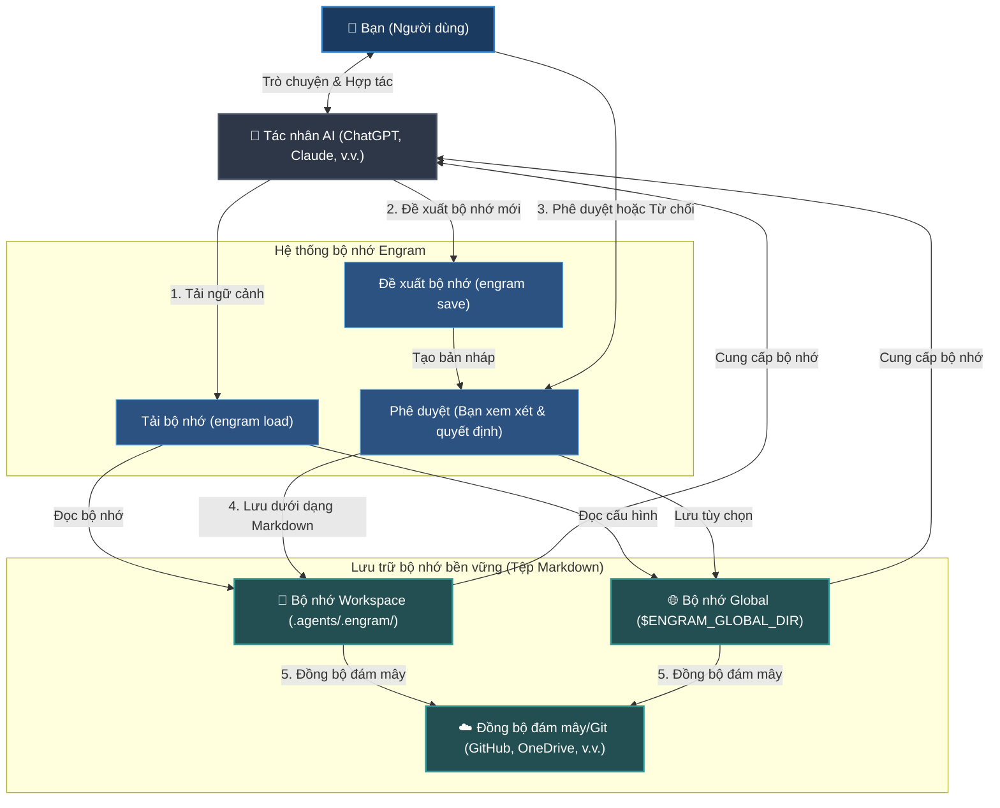

# Engram (Tiếng Việt)


[English](../../README.md) | [Tiếng Việt](README.md) | [Español](../es/README.md) | [Français](../fr/README.md) | [中文](../zh/README.md) | [한국어](../ko/README.md) | [日本語](../ja/README.md) | [Русский](../ru/README.md)

**Engram là một giao thức bộ nhớ do con người sở hữu dành cho các tác nhân AI. Phát triển cùng bạn và đội ngũ của bạn.**

Nó cung cấp bộ nhớ cho tác nhân AI nhưng quyền sở hữu bộ nhớ luôn thuộc về con người. Các quy tắc bền vững, quy trình làm việc và kiến thức dự án được lưu dưới dạng Markdown dễ đọc, được con người xem xét, di động qua Git và có thể sử dụng bởi bất kỳ tác nhân AI nào có khả năng đọc tệp.

---

## What It Is (Engram Là Gì)

Engram là một trung tâm lưu trữ kiến thức cho không gian làm việc, dự án, đội ngũ và cá nhân.

Nó không phải là một bộ não ẩn của tác nhân AI. Nó không phải là kho lưu trữ bộ nhớ của nhà cung cấp. Nó không phải là một cơ sở dữ liệu mà chỉ có một công cụ hiểu được.

Hợp đồng của Engram:
- **Markdown là bộ nhớ bền vững.**
- **JSON index, đồ thị (graph) và sqlite-vec tùy chọn là lớp tăng tốc.**
- **Sự phê duyệt (Approval) là ranh giới tin cậy.**
- **Mã băm (Hashes) là công cụ kiểm tra tính toàn vẹn.**
- **Quy tắc bỏ qua (Ignore) là công cụ kiểm soát quyền riêng tư.**
- **Profile tách biệt ngữ cảnh bộ nhớ.** Giữ bộ nhớ công ty, khách hàng và cá nhân trong các profile giống trình duyệt để ngữ cảnh dùng với API bên ngoài hoặc tác nhân do công ty cấp không rò rỉ sang dự án cá nhân.
- **Git cung cấp tính di động và lịch sử kiểm toán.**
- **Các bộ điều hợp (Adapters) là tiện ích, không có quyền quyết định.**

Nguyên tắc cốt lõi: **các tác nhân AI có thể đề xuất bộ nhớ, nhưng con người sở hữu những gì thực sự trở thành bộ nhớ.**

### Sơ đồ Luồng Hệ Thống (High-Level Flow)



---

## Why It Exists (Lý Do Engram Tồn Tại)

Các trợ lý và tác nhân AI thường quên các quyết định, lặp lại các câu hỏi thiết lập và mang lại các bài học hữu ích chỉ trong một phiên chat, một tài khoản nhà cung cấp hoặc một máy tính. Điều đó rất tiện lợi cho đến khi một nhóm cần xem xét, chia sẻ, sửa chữa hoặc xóa bộ nhớ.

Hơn nữa, các cách tiếp cận bộ nhớ AI hiện tại phải đối mặt với những thách thức thực tế nghiêm trọng:
- **Quá nhiều quy tắc làm phình ngữ cảnh (Context Bloat):** Các tệp quy tắc tiêu chuẩn (như `.cursorrules`) được gửi đi cùng với mọi tin nhắn. Khi các quy tắc tăng lên, chúng tiêu tốn giới hạn token, làm chậm phản hồi và tăng chi phí.
- **Lệch ngữ cảnh & Ảo tưởng (Hallucination):** Trong các phiên chat dài, tác nhân AI bị lệch khỏi các hướng dẫn, tự bịa ra cú pháp hoặc ảo tưởng hành vi do thiếu cấu trúc bộ nhớ và định tuyến lọc.
- **Rò rỉ thông tin bảo mật ngầm:** Các công cụ ghi nhớ tự động có thể âm thầm ghi lại các khóa bảo mật nhạy cảm, API token, mật khẩu hoặc thông tin cá nhân (PII) mà không có sự kiểm duyệt của bạn.
- **Khóa chặt nhà cung cấp (Vendor Lock-In):** Các cơ sở dữ liệu bộ nhớ của nhà cung cấp khóa chặt ngữ cảnh của bạn vào một nền tảng hoặc nhà cung cấp mô hình cụ thể.
- **Lỗi khi làm việc ngoại tuyến (Offline):** Các hệ thống bộ nhớ dựa trên đám mây ngừng hoạt động ngay khi bạn mất kết nối internet.

Engram di chuyển bộ nhớ vào các tệp tin để giải quyết những vấn đề này:

| Thách thức thực tế | Giải pháp từ Engram |
| --- | --- |
| **Quá nhiều quy tắc làm phình ngữ cảnh** | Chỉ định tuyến và tải các tệp bộ nhớ phù hợp nhất cho tác vụ hiện tại (mặc định tải tối đa 8 tệp). |
| **Ghi bộ nhớ ngầm & Rò rỉ thông tin bảo mật** | Yêu cầu sự phê duyệt trực tiếp của con người (A/B/C) và quét mã bảo mật trước khi lưu. |
| **Khóa chặt nhà cung cấp (Vendor Lock-In)** | Sử dụng các tệp Markdown thuần túy, dễ dàng chuyển đổi giữa các mô hình AI hoặc IDE khác nhau. |
| **Không có kết nối mạng (Offline)** | Chạy hoàn toàn cục bộ như một giao thức tệp tin nhẹ—không cần máy chủ bên thứ ba. |
| **Lệch ngữ cảnh trong đội ngũ** | Đồng bộ hóa và chia sẻ các quy tắc, tài liệu dự án trực tiếp qua Git. |
| **Bộ nhớ cũ, bị hỏng hoặc lỗi thời** | Cung cấp các công cụ kiểm tra và dọn dẹp mạnh mẽ (`engram verify`, `engram repair`). |

Workspace memory tải trước. Global memory là dự phòng. Khi global memory được định cấu hình, các quy trình lưu workspace được phê duyệt cũng giữ một bản sao toàn cục để bộ nhớ di động tồn tại ngay cả trong các không gian làm việc chưa chạy `engram init`.

Các bộ nhớ cũng có thể khai báo phụ thuộc bằng `depends_on` và cấp độ tùy chọn như `level: advanced`. Đồ thị sắp xếp chúng từ nền tảng đến kiến thức sâu hơn, và `engram load` giữ bộ nhớ nền tảng đi cùng bộ nhớ phụ thuộc trong gói ngữ cảnh gọn. Khi chạy `engram save`, phần xem trước sẽ báo các bộ nhớ liên quan hoặc khả năng trùng lặp để bạn tái cấu trúc trước khi lưu.

---

## Example Use Cases (Các Trường Hợp Sử Dụng)

Engram linh hoạt và có thể được sử dụng cho bất kỳ bộ nhớ cá nhân, công việc hoặc phát triển nào.

### Bộ Nhớ Cá Nhân & Công Việc
- **Phong Cách Viết & Lựa Chọn Cá Nhân:** Dạy trợ lý AI cách bạn muốn giao tiếp, giọng điệu ưa thích, lựa chọn định dạng hoặc mẫu email/blog để nó luôn soạn thảo nội dung chính xác theo ý muốn của bạn.
- **Tài Liệu Học Tập & Nghiên Cứu:** Lưu trữ tóm tắt các chủ đề bạn đang học, công thức chính, từ vựng ngoại ngữ hoặc các khái niệm phức tạp bạn đã nắm vững, cho phép AI đố vui hoặc giải thích lại dựa trên ngữ cảnh cũ của bạn.
- **Danh Sách Kiểm Tra (Checklists):** Giữ các biểu mẫu tùy chỉnh và danh sách kiểm tra từng bước cho các tác vụ lặp đi lặp lại—như danh sách kiểm tra biên tập video, quy trình xuất bản bài viết blog hoặc kế hoạch du lịch.
- **Nguyên Tắc Sống & Thói Quen:** Tài liệu hóa các thói quen cá nhân, mục tiêu tài chính, công thức nấu ăn hoặc thói quen sức khỏe để AI có thể giúp bạn lập kế hoạch hoặc quản lý công việc theo hướng dẫn của bạn.

### Phát Triển Phần Mềm & Công Nghệ
- **Quy Tắc Dự Án & Tiêu Chuẩn Code:** Định nghĩa quy chuẩn code, cấu trúc thư mục hoặc quy tắc cụ thể (ví dụ: "Luôn viết unit test cho các endpoint") để bất kỳ tác nhân AI nào cũng phải tuân theo khi chỉnh sửa code.
- **Hướng Dẫn Khắc Phục Lỗi:** Lưu trữ giải pháp cho các lỗi phức tạp, cách thiết lập phần cứng cụ thể hoặc hướng dẫn thiết lập kiểm thử để các tác nhân AI tương lai không lãng phí thời gian khắc phục lại cùng một vấn đề.
- **Lệnh CLI & Quy Trình Chung:** Theo dõi các lệnh chạy mã nguồn dự án, quy trình triển khai và lệnh CLI khắc phục sự cố được thiết kế riêng cho môi trường hiện tại.
- **Onboarding và Alignment:** Chia sẻ tài liệu kiến trúc dự án và các lỗi thường gặp trực tiếp qua Markdown được kiểm soát phiên bản trong Git, giữ cho toàn bộ đội ngũ (và các tác nhân AI) luôn thống nhất.

### Cho Doanh Nghiệp & Đội Ngũ
- **Quy Tắc Bảo Mật & Tuân Thủ:** Định nghĩa các giao thức tuân thủ nghiêm ngặt, hướng dẫn bảo mật dữ liệu hoặc chính sách bảo mật mà tác nhân AI không được vi phạm khi xử lý dữ liệu của tổ chức hoặc khách hàng.
- **Quy Trình Vận Hành Tiêu Chuẩn (SOPs):** Lưu trữ và kiểm soát phiên bản các SOP của đội ngũ, thông số kỹ thuật sản phẩm, kịch bản dịch vụ khách hàng và wiki nội bộ dưới dạng Markdown.
- **Giọng Điệu Thương Hiệu Nhất Quán:** Thực thi hướng dẫn tiếp thị, quy tắc nhãn hiệu và tuyên bố từ chối trách nhiệm pháp lý trên tất cả nội dung do tác nhân tạo ra.
- **Lịch Sử Kiểm Toán & Quản Trị:** Duy trì hồ sơ lịch sử đầy đủ về người đã sửa đổi hướng dẫn nào, khi nào và tại sao thông qua nhật ký Git, đáp ứng các yêu cầu kiểm toán bảo mật của doanh nghiệp.

---

## AI-Agent Quickstart (Bắt Đầu Nhanh Với Tác Nhân AI)

Để sử dụng hàng ngày, hãy để trợ lý AI của bạn xử lý việc tải và lưu bộ nhớ trực tiếp trong cửa sổ chat.

### Best Scenarios (AI Chat Usage)
- **Bắt đầu một phiên chat:** Yêu cầu trợ lý AI tải các hướng dẫn hoặc ưu tiên liên quan cho công việc của bạn.
  ```text
  # Nếu bạn đã cài đặt skillset trên toàn cục, tác nhân sẽ tự động chạy engram load khi bắt đầu phiên làm việc và khi thay đổi nhiệm vụ.
  /engram load "design pricing table component"
  ```
- **Đề xuất bộ nhớ mới:** Yêu cầu tác nhân lưu lại một quyết định hoặc sự thật quan trọng được phát hiện trong cuộc trò chuyện.
  ```text
  /engram save knowledge "Stripe webhook secret is loaded from process.env.STRIPE_WEBHOOK_SECRET"
  ```
- **Tóm tắt và lưu lại phiên làm việc:** Cuối phiên làm việc, yêu cầu tác nhân gom tất cả các quy tắc, quy trình làm việc hoặc sự thật mới lại.
  ```text
  /engram save-session
  ```
  Để yêu cầu tác nhân bao gồm lịch sử trò chuyện gần đây mà nó thực sự có thể truy cập, hãy truyền mức truy vấn số nguyên dương:
  ```text
  /engram save-session --query-level 3
  ```
  Tác nhân nên khai thác tối đa ngần đó phiên chat gần đây, bao gồm phiên hiện tại, và không được bịa ra lịch sử trò chuyện không thể truy cập.
  
  Để vừa khai thác lịch sử truy cập gần đây vừa tự động phê duyệt tất cả các đề xuất, hãy sử dụng:
  ```text
  /engram ss -a last 50 sessions
  ```
  *(Điều này chuẩn hóa thành `engram save-session --query-level 50 --accept-all`; `-a` là sự phê duyệt rõ ràng của con người đối với tất cả các ứng viên được tạo)*

Để biết đầy đủ thông tin chi tiết và các tính năng nâng cao, vui lòng xem [Tài Liệu Chi Tiết](index.md).

---

## Installation & Setup (Cài Đặt & Thiết Lập)

Định cấu hình Engram CLI và cài đặt cho trợ lý AI của bạn.

### 1. Cài đặt Engram CLI
Cài đặt công cụ trên toàn cục:
```bash
npm install -g @the-long-ride/engram
```

### 2. Cài đặt Bộ kỹ năng toàn cục (Global Skillset)
Dạy cho trợ lý AI của bạn cách tương tác với Engram:
```bash
# Kiểm tra danh sách các tác nhân được hỗ trợ
engram is list
```
```bash
# Cài đặt bộ kỹ năng toàn cục để tự động tải bộ nhớ khi bắt đầu nhiệm vụ + khả năng dùng lệnh /engram thủ công
engram is --global <tên-tác-nhân-ai>
```
*(Thay thế `<tên-tác-nhân-ai>` bằng tên tác nhân phù hợp trong kết quả của `engram is list`)*

Đối với Antigravity, sử dụng mục tiêu hệ sinh thái hợp nhất:
```bash
engram install-skillset antigravity
```
Điều này ghi nhận các hướng dẫn không gian làm việc trong `.antigravity/`, `.antigravity-cli/`, `.antigravity-ide/` và `.antigravityrules`. Tên mục tiêu cũ `antigravity-cli` vẫn được chấp nhận như một bí danh tương thích.

### 3. Khởi tạo Không gian làm việc
Chạy lệnh này tại thư mục gốc của dự án:
```bash
engram init
```

> [!IMPORTANT]
> **Những điều cần lưu ý khi khởi tạo (`engram init`):**
> - **Workspace Memory:** Tạo thư mục cục bộ `.agents/.engram/` để lưu trữ các bộ nhớ cụ thể cho dự án của bạn.
> - **Tùy chọn Git Submodule:** Sử dụng `engram init --submodule` nếu đội ngũ của bạn muốn theo dõi bộ nhớ trong một kho lưu trữ Git riêng biệt, chuyên dụng.
> - **Bộ nhớ Toàn cục Cá nhân:** Nhập một đường dẫn thư mục toàn cục (ví dụ: `--global-path ~/engram-global`). Đây là nơi lưu trữ các cài đặt cá nhân đi theo bạn trên mọi dự án.
> - **Đồng bộ hóa & Sao lưu đám mây:** Cấu hình URL kho lưu trữ toàn cục (`--global-remote <git-url>`) hoặc thiết lập OneDrive/ Google Drive/ Dropbox để sao lưu và đồng bộ bộ nhớ một cách liền mạch.

---

## Settings & Next Commands (Cài Đặt & Lệnh Tiếp Theo)

Sau khi khởi tạo, bạn có thể định cấu hình các tùy chọn hoạt động. Cả lệnh CLI và sлэш-lệnh của tác nhân AI đều được hỗ trợ.

### Thiết lập Vai trò (Roles)
Lọc bộ nhớ được tải dựa trên các vai trò phát triển cụ thể (ví dụ: `frontend`, `backend`, `security`, `docs`).
- **CLI:**
  ```bash
  # Lọc tải bộ nhớ cho frontend và thiết kế
  engram set-role frontend design

  # Xóa bộ lọc vai trò để tải bộ nhớ không hạn chế
  engram set-role
  ```
- **AI Agent Chat:**
  ```text
  /engram set-role frontend design
  /engram set-role
  ```

### Thiết lập Độ nghiêm ngặt của Quy tắc (Rule Variant)
Điều chỉnh mức độ nghiêm ngặt của các quy tắc khi được trợ lý AI tải:
- **CLI:**
  ```bash
  # strict: đầu ra sắc nét hơn cho các mô hình nhỏ/yếu; có thể gây ra hiện tượng "brainlock" (quá hạn chế) đối với các mô hình suy luận mạnh mẽ (ví dụ: Claude Opus 3.5, GPT-5.5)
  # balanced/light: giữ cho khả năng suy luận linh hoạt và tối ưu cho các mô hình cao cấp
  engram set-rule-variant balanced
  ```
- **AI Agent Chat:**
  ```text
  /engram set-rule-variant balanced
  ```

### Các Lệnh Tiếp Theo Khác
- **Kiểm tra cài đặt hoạt động & đường dẫn:** `engram entry` (Agent: `/engram entry`)
- **Đồng bộ hóa thay đổi cục bộ & toàn cục:** `engram sync` (Agent: `/engram sync`)
- **Đặt đích lưu mặc định:** `engram set-save-target workspace|global|both|status` (Agent: `/engram set-save-target status`)
- **Quản lý profile tách biệt:** `engram profile status` / `engram profile merge personal company --dry-run` (Agent: `/engram profile status`)
- **Sao chép bộ nhớ workspace/global:** `engram clone-memory workspace global` / `engram clone-memory global workspace --force` (Agent: `/engram clone workspace memory to global`)
- **Kiểm tra & dọn dẹp liên kết lỗi:** `engram verify` / `engram repair` (Agent: `/engram verify` / `/engram repair`)
- **Quét mâu thuẫn tư vấn:** `engram quality-check` (Agent: `/engram quality-check`)

---

## CLI Command vs. AI Agent Cheat Sheet (Bảng Tra Cứu Nhanh)

| Tác vụ | Lệnh CLI | Lệnh trên chat với Tác nhân AI |
| --- | --- | --- |
| **Tải bộ nhớ** | `engram load "<tác vụ>"` | `/engram load "<tác vụ>"` |
| **Xem trước bộ nhớ tải** | `engram load --dry-run "<tác vụ>"` | `/engram load --dry-run "<tác vụ>"` |
| **Lưu một bộ nhớ** | `engram save <loại> "<nội dung>"` | `/engram save <loại> "<nội dung>"` |
| **Lưu nhiều bộ nhớ** | `engram save-session` | `/engram ss` |
| **Khai thác chat gần đây** | `engram save-session --query-level 3` | `/engram save-session --query-level 3` |
| **Tự động phê duyệt** | `engram save-session --accept-all` | `/engram ss -a` |
| **Khai thác và tự động duyệt** | `engram save-session --query-level 50 --accept-all` | `/engram ss -a last 50 sessions` |
| **Nhập hướng dẫn hiện có** | `engram take-control --all` | `/engram take-control --all` |
| **Kiểm tra cấu hình/đường dẫn** | `engram entry` | `/engram entry` |
| **Kiểm tra tính toàn vẹn** | `engram verify` | `/engram verify` |
| **Thiết lập vai trò** | `engram set-role <roles>` | `/engram set-role <roles>` |
| **Thiết lập biến thể quy tắc** | `engram set-rule-variant <variant>` | `/engram set-rule-variant <variant>` |
| **Đặt đích lưu mặc định** | `engram set-save-target <đích>` | `/engram set-save-target <đích>` |
| **Quản lý profile** | `engram profile status` / `engram profile merge personal company --dry-run` | `/engram profile status` |
| **Sao chép bộ nhớ workspace/global** | `engram clone-memory workspace global` | `/engram clone workspace memory to global` |
| **Đồng bộ hóa bộ nhớ** | `engram sync` | `/engram sync` |
| **Sửa chữa chỉ mục** | `engram repair` | `/engram repair` |

---

## Documentation (Tài Liệu Chi Tiết)

Tài liệu đầy đủ nằm trong kho lưu trữ dưới thư mục `documentation/`. Gói npm chỉ gửi kèm tệp README này và các tài liệu/tài nguyên chạy cần thiết cho CLI.

| Ngôn ngữ | Bắt đầu tại đây |
| --- | --- |
| Tiếng Anh | [documentation/en/index.md](../en/index.md) |
| Tiếng Việt | [documentation/vi/index.md](index.md) |
| Tây Ban Nha | [documentation/es/index.md](../es/index.md) |
| Tiếng Pháp | [documentation/fr/index.md](../fr/index.md) |
| Trung Quốc | [documentation/zh/index.md](../zh/index.md) |
| Hàn Quốc | [documentation/ko/index.md](../ko/index.md) |
| Nhật Bản | [documentation/ja/index.md](../ja/index.md) |
| Tiếng Nga | [documentation/ru/index.md](../ru/index.md) |

Mỗi ngôn ngữ bao gồm các trang tổng quan, hiểu biết, bắt đầu nhanh với tác nhân AI, giao thức, hoạt động và so sánh.

---

## Pros (Ưu Điểm)
- Định dạng Markdown thuần túy làm nguồn sự thật (source of truth).
- Phê duyệt của con người trước khi ghi bộ nhớ bền vững.
- Đánh giá, lịch sử, đồng bộ hóa và phục hồi thân thiện với Git.
- Ưu tiên không gian làm việc (workspace-first) với bộ nhớ toàn cục dự phòng (global-fallback) tùy chọn.
- Không phụ thuộc vào tác nhân AI: Codex, Claude, Cursor, Gemini, Copilot, OpenCode, Antigravity, Cline, Windsurf và các tác nhân đọc tệp đều có thể sử dụng.
- Định tuyến nhỏ gọn theo mặc định, với chế độ xem trước tinh chỉnh và tùy chọn sqlite-vec cục bộ cho phạm vi bộ nhớ lớn.
- Lớp bảo mật mạnh mẽ: xác thực cấu trúc (schema), quét thông tin nhạy cảm, quét chèn câu lệnh (prompt injection), mã băm bảo mật và quy tắc bỏ qua.
- Các luồng bảo trì hữu ích: observe, take-control, graph, archive, benchmark, repair.
- Không yêu cầu dịch vụ chạy ẩn (daemon), cơ sở dữ liệu riêng hay tài khoản đám mây; sqlite-vec chỉ là một công cụ bổ trợ cục bộ tùy chọn, không phải nguồn sự thật.

---

## Cons (Nhược Điểm)
- Ít tính tự động hơn so với các hệ thống bộ nhớ chạy ẩn tự động ghi nhận mọi thứ trong nền.
- Tìm kiếm mặc định là tìm kiếm từ vựng mang tính quyết định; `search --semantic` chỉ bổ sung so khớp độ tương đồng cục bộ chứ không phải tìm kiếm ngữ nghĩa dựa trên các mô hình embedding đầy đủ.
- Định tuyến sqlite-vec tùy chọn sử dụng các vector từ băm cục bộ, không gọi tới các dịch vụ embedding bên ngoài.
- Tính năng phát hiện mâu thuẫn hoạt động theo thuật toán phỏng đoán và chỉ mang tính chất tham khảo, tư vấn.
- Tính năng `deduplicate --semantic` sử dụng độ tương đồng cục bộ, không gọi tới các mô hình embedding bên ngoài.
- Khai thác mẫu (pattern mining), mã hóa cấu hình và quy trình PR tự động vẫn đang là các khu vực thiết kế, chưa phải là quy trình hoạt động hoàn chỉnh.

---

## Compared With Agentmemory (So Với Agentmemory)

[rohitg00/agentmemory](https://github.com/rohitg00/agentmemory) là một công cụ quản lý bộ nhớ tự động mạnh mẽ cho các tác nhân lập trình, với bộ nhớ dựa trên máy chủ, tích hợp MCP/hooks/REST, nhiều bộ điều hợp tác nhân, các tuyên bố về hiệu năng kiểm thử, giao diện xem trực quan, phát lại phiên làm việc, truy xuất hỗn hợp và tích hợp với mô hình Hermes.

Engram chọn một trọng tâm khác biệt.

| Tiêu chí | Engram | agentmemory |
| --- | --- | --- |
| Nguồn sự thật | Markdown được con người phê duyệt | Máy chủ/kho lưu trữ bộ nhớ |
| Ranh giới tin cậy | Phê duyệt A/B/C trước khi ghi | Thu thập tự động + kiểm soát bằng công cụ |
| Chế độ mặc định | Giao thức tệp tin, không cần daemon; sqlite-vec tùy chọn cho quy mô lớn | Đề xuất chạy dịch vụ ẩn liên tục |
| Đánh giá thay đổi | So sánh Git diff và xem xét Markdown | Giao diện xem/API/lịch sử phiên làm việc |
| Phù hợp nhất cho | Quyền sở hữu bộ nhớ nhóm và khả năng kiểm toán | Tự động nhớ lại và phát lại |
| Rủi ro chính | Đòi hỏi kỷ luật lưu trữ thủ công | Có thể trở thành trạng thái ẩn khó kiểm soát nếu thiếu quản lý |

---

## Compared With Tolaria (So Với Tolaria)

[refactoringhq/tolaria](https://github.com/refactoringhq/tolaria) là một ứng dụng máy tính để quản lý cơ sở kiến thức Markdown. Nó ưu tiên tệp tin, ưu tiên Git, ngoại tuyến và được thiết kế cho các kho lưu trữ cá nhân hoặc nhóm lớn làm ngữ cảnh hữu ích cho tác nhân AI.

Engram nằm ở lớp thấp hơn trong hệ thống. Nó không phải là một ứng dụng quản lý kiến thức trên máy tính; nó là một giao thức bộ nhớ, CLI và bộ kỹ năng tác nhân cho bộ nhớ tác nhân được quản lý.

| Tiêu chí | Engram | Tolaria |
| --- | --- | --- |
| Nguồn sự thật | Các tệp bộ nhớ đã phê duyệt trong `.agents/.engram/` | Các ghi chú Markdown với YAML frontmatter |
| Giao diện chính | CLI, slash adapters, MCP-style wrapper, Markdown | Ứng dụng máy tính đa nền tảng |
| Mô hình ghi | Tác nhân đề xuất; con người phê duyệt ghi bộ nhớ | Con người trực tiếp quản lý cơ sở kiến thức Markdown |
| Phạm vi | Quy tắc, quy trình, kỹ năng và bộ nhớ tác nhân | Cơ sở kiến thức cá nhân/nhóm và bộ não thứ hai |
| Chế độ mặc định | Không cần daemon, cơ sở dữ liệu, tài khoản đám mây hay ứng dụng | Ứng dụng máy tính Tauri cho macOS, Windows, Linux |
| Phù hợp nhất cho | Quản trị bộ nhớ có thể kiểm toán trên nhiều tác nhân/dự án | Duyệt, chỉnh sửa và tổ chức các kho Markdown lớn |
| Rủi ro chính | Đòi hỏi kỷ luật lưu trữ thủ công | Quá nhiều bề mặt ứng dụng nếu bạn chỉ muốn giao thức bộ nhớ |

---

## Compared With Obsidian (So Với Obsidian)

[Obsidian](https://obsidian.md/) là một ứng dụng Markdown tuyệt vời cho các ghi chú cá nhân, cơ sở kiến thức liên kết, lập kế hoạch và các kho lưu trữ lâu dài. Nó lưu trữ ghi chú cục bộ, có hệ sinh thái plugin/theme lớn, và cung cấp các dịch vụ Sync/Publish tùy chọn.

Engram không cố gắng trở thành một ứng dụng ghi chú. Nó là một giao thức bộ nhớ được quản trị cho các tác nhân AI: phạm vi nhỏ hơn, chặt chẽ hơn về mặt phê duyệt và được thiết kế để bộ nhớ tác nhân có thể được xem xét giống như mã nguồn.

| Tiêu chí | Engram | Obsidian |
| --- | --- | --- |
| Nguồn sự thật | Các tệp bộ nhớ đã phê duyệt trong `.agents/.engram/` | Các ghi chú Markdown cục bộ |
| Giao diện chính | CLI, slash adapters, MCP-style wrapper, Markdown | Ứng dụng ghi chú di động và máy tính với canvas/theme/plugin |
| Mô hình ghi | Tác nhân đề xuất; con người phê duyệt ghi bộ nhớ | Con người và các plugin chỉnh sửa ghi chú trực tiếp |
| Phạm vi | Quy tắc, quy trình, kỹ năng và bộ nhớ tác nhân | Ghi chú cá nhân, viết lách, kế hoạch và cơ sở kiến thức |
| Chế độ mặc định | Không cần ứng dụng, daemon, cơ sở dữ liệu hay tài khoản đám mây | Ứng dụng Obsidian, với Sync, Publish và plugin cộng đồng tùy chọn |
| Tích hợp AI | Hướng dẫn tác nhân cài đặt và luồng bộ nhớ phê duyệt | Kho lưu trữ có thể làm ngữ cảnh AI qua plugin/MCP |
| Phù hợp nhất cho | Quản trị bộ nhớ tác nhân có thể kiểm toán | Ghi chú Markdown phong phú và quy trình bộ não thứ hai |
| Rủi ro chính | Đòi hỏi kỷ luật lưu trữ thủ công | Ngữ cảnh tác nhân có thể quá rộng hoặc không được kiểm duyệt |

Chúng cũng có thể hoạt động cùng nhau: giữ các ghi chú rộng trong Obsidian, sau đó chắt lọc các quy tắc AI và kiến thức dự án bền vững vào Engram.

---

## Compared With Built-In Agent Memory (So Với Bộ Nhớ Tích Hợp Sẵn)

Bộ nhớ tích hợp sẵn của trợ lý AI (như bộ nhớ của ChatGPT, Claude Projects hoặc Cursor Rules Settings) tuy tiện lợi nhưng thường bị khóa trong một máy chủ cụ thể. Rất khó để so sánh sự khác biệt (diff), xuất dữ liệu, kiểm duyệt, chia sẻ hoặc sửa chữa.

Engram coi bộ nhớ tích hợp sẵn chỉ là một lớp tiện ích bổ trợ, không phải là cơ quan có thẩm quyền cao nhất. Quyền lực tối cao vẫn thuộc về các tệp tin mà con người có thể kiểm tra.

| Tiêu chí | Engram | Bộ Nhớ Tích Hợp Sẵn |
| --- | --- | --- |
| **Tính di động** | Đa tác nhân & đa nền tảng: các tệp Markdown thuần túy có thể được đọc bởi bất kỳ trình biên tập hoặc tác nhân nào. | Bị khóa trong một nền tảng duy nhất (ví dụ: chỉ trên ChatGPT Web hoặc chỉ trong Cursor). |
| **Kiểm soát của con người** | Rõ ràng: tác nhân đề xuất các bản nháp bộ nhớ, nhưng con người xem xét và phê duyệt (A/B/C) trước khi ghi. | Không rõ ràng: trợ lý cập nhật bộ nhớ trong nền mà không có sự kiểm duyệt của người dùng. |
| **Hợp tác** | Thân thiện với Git: chia sẻ bộ nhớ dự án trong toàn bộ đội ngũ thông qua kiểm soát phiên bản. | Chỉ dành cho một người dùng: không có cách nào để chia sẻ, hợp nhất hoặc hợp tác trên các bộ nhớ. |
| **Bảo mật & Quyền riêng tư** | An toàn: quét thông tin cá nhân (PII) và mã bảo mật trước khi ghi, chạy 100% cục bộ/ngoại tuyến. | Rủi ro cao: có thể âm thầm ghi lại và tải lên các khóa API, mật khẩu và dữ liệu công ty nhạy cảm. |
| **Tối ưu hóa Prompts** | Lọc lựa: chỉ tải các tệp bộ nhớ có liên quan đến tác vụ hoặc vai trò của nhà phát triển hiện tại. | Nguyên khối: gửi toàn bộ quy tắc vào ngữ cảnh hoặc sử dụng các vector mờ phía máy chủ. |

Sử dụng bộ nhớ tích hợp sẵn khi bạn muốn cá nhân hóa rảnh tay trong nền trên một nền tảng chat web duy nhất.

Sử dụng Engram khi bạn muốn bộ nhớ trợ lý của mình có thể kiểm toán, chia sẻ với đội ngũ của bạn, di động trên nhiều IDE và do bạn kiểm soát 100%.

---

## Roadmap (Lộ Trình Phát Triển)

Chúng tôi đang mở rộng Engram để hỗ trợ liền mạch các giao diện AI dựa trên web và đồng bộ hóa lưu trữ đám mây:

- **AI Web Chat Integration (Tích hợp Web Chat):** Phát triển các tiện ích mở rộng trình duyệt (Chrome/Firefox) và các plugin web gốc cho phép bộ nhớ Engram hoạt động trực tiếp trong các ứng dụng chat web như ChatGPT, Claude.ai và Gemini Web.
- **Linked Cloud & Git Storage (Liên kết đám mây & Git):** Cho phép người dùng trợ lý AI dựa trên web tải bộ nhớ trực tiếp từ kho lưu trữ GitHub, Google Drive, OneDrive hoặc Dropbox đã liên kết.
- **Natural Language Command Mapping (Ánh xạ ngôn ngữ tự nhiên):** Cho phép các tác nhân AI ánh xạ các lệnh trò chuyện tự nhiên (ví dụ: "Này, hãy nhớ rằng chúng ta dùng HSL" hoặc "Kiểm tra sức khỏe bộ nhớ của tôi") trực tiếp vào các hành động Engram tương ứng mà không cần các lệnh slash cứng nhắc.

---

## Companion Project: Markdown Explorer (Dự Án Bạn Đồng Hành)

Cần một phương pháp trực quan để điều hướng và tìm kiếm các tệp Markdown của bạn? Hãy xem [Markdown Explorer](https://the-long-ride.github.io/markdown-explorer/) — một tiện ích mở rộng VS Code / ứng dụng máy tính (Windows, Linux, macOS) nhẹ, mã nguồn mở (MIT) để khám phá, trực quan hóa và tìm kiếm các thư mục Markdown cục bộ của bạn. Nó hoạt động tuyệt vời cùng với Engram để giúp bạn duyệt các quy tắc, kỹ năng và tệp kiến thức của tác nhân trực tiếp trong thư mục bộ nhớ Engram.

---

## License (Bản Quyền)

[GPL-3.0 License](../../LICENSE)
