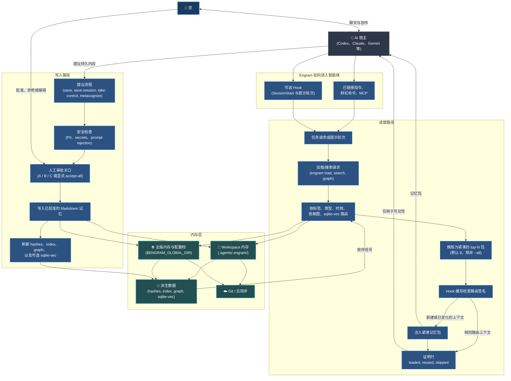

# Engram (中文)

[](../../LICENSE) [](https://github.com/the-long-ride/engram) [](https://www.npmjs.com/package/@the-long-ride/engram) [](https://www.npmjs.com/package/@the-long-ride/engram)


[English](../../README.md) | [Tiếng Việt](../vi/README.md) | [Español](../es/README.md) | [Français](../fr/README.md) | [中文](README.md) | [한국어](../ko/README.md) | [日本語](../ja/README.md) | [Русский](../ru/README.md)

**Engram 是一个由人类所有、文件优先的 AI 智能体内存协议。与您和您的团队共同成长。**

它赋予智能体记忆能力，但内存的所有权完全属于人类。持久的规则、工作流和项目知识以直观的 Markdown 形式存在，由人类审查，通过 Git 移植，并可供任何读取文件的智能体使用。

---

## 核心亮点

- **人机协同**：AI 提议内存候选；人类审查并批准（A/B/C 闸口，可通过规则自动化）。
- **上下文优化**：将匹配任务的内存路由并提炼为紧凑的包（默认 8 个文件），避免上下文膨胀。
- **Git 原生与本地化**：Markdown 文件保存在 `.agents/.engram/` 并通过 Git 同步——完全无云锁定，支持离线。
- **隐私与安全控制**：100% 本地运行，在保存前自动扫描敏感信息 (PII) 和秘钥。
- **依赖关系图**：声明先决条件 (`depends_on`)，使智能体自动加载基础规则再加载高级规则。

---

### 高层系统流程



---

## 什么是 Engram (内存契约)

- **Markdown 是持久内存** — 无隐藏的二进制或私有格式。
- **JSON 索引、依赖图和可选的 sqlite-vec 侧车**作为加速层。
- **批准是信任边界** — 核心原则是智能体建议，人类批准。
- **哈希检查完整性**，**Ignore 规则处理隐私**。
- **配置文件 (Profiles) 隔离内存上下文**（个人、客户和企业）。
- **Git 提供移植性和审计历史** — 在团队中轻松共享规则。
- **智能体适配器是便利，而非权威**。
- **严格规则约束智能体输出**以防止飘移和幻觉。

---

## 为什么需要 Engram (实际解决方案)

标准规则文件会随每条消息发送，导致上下文膨胀、方向飘移、秘钥泄漏，或使您锁定在云端服务中。Engram 解决这些挑战如下：

| 战术挑战 | Engram 的解决方案 |
| --- | --- |
| **规则过多导致上下文膨胀** | 路由并提炼匹配当前任务的特化内存包，默认 8 个文件。 |
| **静默写入与秘钥泄露** | 需要人类 A/B/C 批准，保存前扫描秘钥和注入。 |
| **云端供应商锁定** | 使用通用、可读的 Markdown 文件，适用于任何智能体或模型。 |
| **无离线访问能力** | 本地运行的轻量级文件协议，无需运行后台服务。 |
| **团队项目的上下文漂移** | 通过 Git 版本控制，团队共享并同步规则与指南。 |
| **损坏或过时的旧内存** | 提供验证和清理工具 (`engram repair`, `engram quality-check`)。 |

---

## 典型使用场景

- **个人与专业**：写作风格、偏好、清单 (checklists)、词汇、学习笔记、生活准则。
- **软件开发**：代码规约、架构指南、调试脚本、常见故障排查、团队 onboarding。
- **企业应用**：安全合规指南、内部 SOP 维基、品牌语气一致性、Git 审计历史。

---

## 安装与配置

### 1. 安装 Engram CLI
```bash
npm install -g @the-long-ride/engram
```

### 2. 全局安装智能体 Skillset
教授 AI 助手如何与 Engram 交互（加载、保存、维护）：
```bash
# 列出支持的智能体
engram link list

# 全局安装 Skillset 到您的智能体
engram link --global <您的智能体名称>
```
*(替换 `<您的智能体名称>` 为您的助手名字；使用 `agents-md` 用于未列出但能读取 `AGENTS.md` 的智能体。)*

对于 Gemini / Antigravity 环境：
```bash
engram link gemini
```

可选的自动加载钩子适用于能够在会话开始和后续提示轮次中注入上下文的主机：
```bash
engram link codex
engram link claude
engram link gemini
engram set-read auto
engram set-proof compact
```
v1 钩子安装仅限于 `codex`、`claude` 和 `gemini`。Antigravity 的兼容性目前通过 `gemini` 进行路由；Cursor、Copilot、Cline 和 Windsurf/Cascade 仍由指令/技能集/手动加载驱动，直到它们的钩子表面支持在提示时进行可靠的上下文注入。
当您希望支持的钩子在每个符合条件的轮次中追加一行简短的 `Engram proof:`，以显示 Engram 内存是被加载、重用还是跳过，而不改变 `set-read` 的注入行为时，请使用 `engram set-proof compact`。


### 3. 初始化工作空间
在项目根目录下运行：
```bash
engram inject
```
*注意：创建工作空间本地 `.agents/.engram/` 文件夹，配置全局内存路径，支持 submodule (`--submodule`) 和云端同步配置。*

### 4. 打开控制面板 Web UI
运行以下命令以可视化、搜索和配置您的内存 Profile：
```bash
engram entry
```


---

## AI 智能体快速开始

您可以在聊天中指示智能体使用以下命令：

- **开始任务**：`/engram load "design pricing table component"`
- **保存重要决策/事实**：`/engram save knowledge "Webhook secret is process.env.STRIPE_WEBHOOK"`
- **总结并保存会话**：`/engram save-session`（or `--query-level 3`，或使用 `ss -a last 50 sessions` 自动批准）

当代理询问如何使用 Engram 时，运行 `engram llm`。它会打印打包的 `llm.txt` AI 代理指南，在 `engram inject` 之前运行也是安全的。

当 AI 代理提出 `TYPE: ... | TEXT: ...` 内存候选时，如果有助于解释内存存在的原因，它可以添加可选的 `CONTEXT: ...`。简单的事实可以省略它并使用默认的批准上下文。


---

## 命令对照表 (Cheat Sheet)

| 任务 | CLI 命令 | AI 智能体建议命令 |
| --- | --- | --- |
| **加载内存** | `engram load "<任务内容>"` | `/engram load "<任务内容>"` |
| **演练加载** | `engram load --dry-run "<任务内容>"` | `/engram load --dry-run "<任务内容>"` |
| **保存单条内存** | `engram save <类型> "<偏好内容>"` | `/engram save <类型> "<偏好内容>"` |
| **提议多条保存** | `engram save-session` | `/engram ss` |
| **提取近期会话** | `engram save-session --query-level <n>` | `/engram save-session --query-level <n>` |
| **自动批准保存** | `engram save-session --accept-all` | `/engram ss -a` |
| **导入文件/文档** | `engram take-control --all` | `/engram take-control --all` |
| **导入并重构** | `engram take-control --all --metacognize --accept-all` | `/engram take control accept all metacognize` |
| **重构内存文件夹** | `engram metacognize --workspace` | `/engram restructure workspace memory accept all` |
| **解决内存冲突** | `engram resolve-conflicts --metacognize` | `/engram resolve conflicts and metacognize` |
| **检查路径配置** | `engram entry` | `/engram entry` |
| **显示代理指南** | `engram llm` | 当代理需要 Engram 使用指南时运行一次 |
| **管理隔离配置** | `engram profile status` / `create` / `use` | `/engram profile status` |
| **配置保存目标** | `engram set-save-target <workspace/global/both>` | `/engram set-save-target <target>` |
| **配置加载上限** | `engram set-load-limit <1..32>` | `/engram set-load-limit <count>` |
| **配置自动读取** | `engram set-read startup|auto|always|manual|off` | `/engram set-read auto` |
| **配置证明显示** | `engram set-proof off|compact` | `/engram set-proof compact` |
| **安装智能体 Hooks** | `engram link codex|claude|gemini` | 在终端执行一次 |
| **更新全局路径** | `engram update-global-folder <新路径>` | `/engram set global memory path to <new-path>` |
| **复制内存文件** | `engram clone-memory <源> <目的>` | `/engram clone workspace memory to global` |
| **设定开发角色** | `engram set-role <角色列表>` | `/engram set-role <roles>` |
| **设定规则严苛度** | `engram set-rule-variant <variant>` | `/engram set-rule-variant <variant>` |
| **验证与修复** | `engram verify` / `engram repair` | `/engram verify` / `/engram repair` |
| **检测矛盾规则** | `engram quality-check` | `/engram quality-check` |
| **同步内存** | `engram sync` | `/engram sync` |

当 `engram set-role ...` 或 `engram set-rule-variant ...` 成功时，Engram 现在会返回一个 `Agent action:` 行。感知 Engram 的适配器和 MCP 主机应立即重新运行 `engram load "<当前任务/请求>"` 并替换同一对话中早期由 Engram 派生的上下文。这发生在命令完成后，而不是在响应的中间，并且安装的技能集文件仍然控制未来或重新加载的聊天。

---

## 横向对比

### 对比 Agentmemory
[rohitg00/agentmemory](https://github.com/rohitg00/agentmemory) 是一款后台自动运行的服务器式内存引擎。Engram 则专注于人类审核的本地 Markdown 文件，不使用后台守护进程。

| 维度 | Engram | agentmemory |
| --- | --- | --- |
| 真理来源 | 人类批准的 Markdown | 内存服务器 / 数据库 |
| 信任边界 | 写入前的 A/B/C 审核 | 后台自动捕获 |
| 运行形式 | 本地文件协议 (无 daemon) | 建议运行后台服务 |
| 审核模型 | Git diff 与 Markdown 文件审核 | 浏览器查看器 / API 历史 |

### 对比 Tolaria
[refactoringhq/tolaria](https://github.com/refactoringhq/tolaria) 是一款 Markdown 桌面知识库应用。Engram 处于更低层级，提供 CLI、智能体 skillset 和 Git 同步支持。

| 维度 | Engram | Tolaria |
| --- | --- | --- |
| 真理来源 | `.agents/.engram/` 内存 | Markdown 库笔记 |
| 主体界面 | CLI、斜杠适配器与技能指令 | 桌面端应用程序 |

### 对比 Obsidian
[Obsidian](https://obsidian.md/) 是一款笔记软件。Engram 则定位于智能体内存协议：规模更小、审查极严、把内存当代码版本管理。

| 维度 | Engram | Obsidian |
| --- | --- | --- |
| 真理来源 | `.agents/.engram/` 内存 | 本地 Markdown 笔记 |
| 写入方式 | 智能体建议；人类审查 | 直接编辑修改笔记 |

### 对比 Hermes Agent
Hermes Agent 采用有着硬性字数限制的自动内存结构，而 Engram 以人类所有（或规则自动保存）为基础，并以标签和依赖图在有需要时才进行路由加载。

| | Engram | Hermes Agent |
|---|---|---|
| **哲学** | 人类所有，文件优先（自动化可选） | 自主、持续激活的内存 |
| **存储** | 位于 `.agents/.engram/` 下的 Markdown 文件 | `MEMORY.md` + `USER.md`（硬性字数限制） |
| **写入** | 人类审核（可规则自动保存） | 智能体自主静默写入 |
| **召回** | 按需：`engram load "<任务>"` 注入匹配文件 | 总是开启：每轮会话直接注入系统提示词 |
| **向量检索** | 可选本地 sqlite-vec 侧车 | 外部提供商 (agentmemory) |

### 对比内置内存 (Built-In Memory)
内置内存（如 ChatGPT 网页偏好、Claude 页面、Cursor 规则）是封闭的。Engram 使用本地文件作为数据源，支持 Git 团队协同，并自带秘钥泄露扫描。

| 维度 | Engram | 内置助手内存 |
| --- | --- | --- |
| **可移植性** | 纯 Markdown，支持任何编辑器与智能体 | 锁定在单个平台或主机中 |
| **人类控制** | 写入前有明确的 A/B/C 审核机制 | 智能体在后台静默自动更新 |

---

## 详细文档

完整的说明文档位于库内的 `documentation/` 文件夹下：
- [English](../../README.md) | [Tiếng Việt](../vi/README.md) | [Español](../es/README.md) | [Français](../fr/README.md) | [中文](index.md) | [한국어](../ko/README.md) | [日本語](../ja/README.md) | [Русский](../ru/README.md)

## 路线图与伴侣项目
我们正在开发 **优先使 Engram 更易于使用，然后是文档页面**、**文档网站**、**Web 聊天智能体集成** 以及 **改进自然语言命令映射**。
要以可视化的方式管理您的 Markdown 文件，可以使用 [Markdown Explorer](https://the-long-ride.github.io/markdown-explorer/)。

## 许可证与日志
采用 [GPL-3.0](LICENSE) 开源许可证。请参阅 [Changelog](https://github.com/the-long-ride/engram/blob/main/CHANGELOG.md)。
