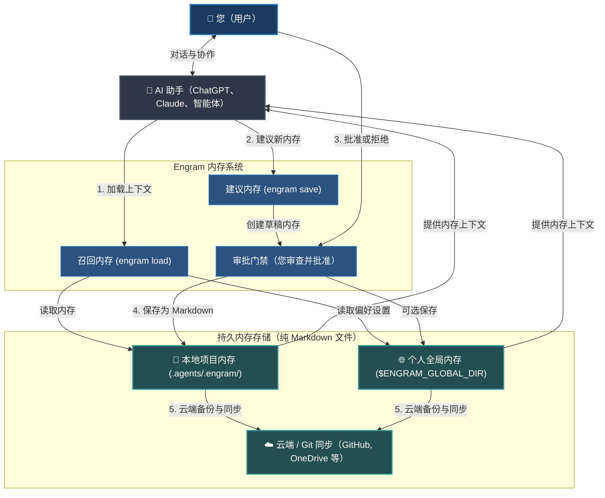

# Engram (中文)


[English](../../README.md) | [Tiếng Việt](../vi/README.md) | [Español](../es/README.md) | [Français](../fr/README.md) | [中文](README.md) | [한국어](../ko/README.md) | [日本語](../ja/README.md) | [Русский](../ru/README.md)

**Engram 是一个供 AI 智能体（Agent）使用的、由人类拥有的内存协议。它与您和您的团队共同成长。**

它在不给智能体内存所有权的情况下，为智能体提供内存。持久的规则、工作流和项目知识以可读的 Markdown 形式存在，由人类评审，通过 Git 移植，并可被任何具有文件读取能力的智能体所使用。

---

## 什么是 Engram

Engram 是用于项目、工作区、团队和个人上下文的知识内存中心。

它不是一个隐藏的智能体大脑。它不是供应商的内存孤岛。它不是一个只有一种工具能读懂的数据库。

Engram 的协议契约：

- **Markdown 是持久的内存。**
- **JSON 索引、图谱和可选的 sqlite-vec 边车（sidecars）是加速层。**
- **批准是信任的边界。**
- **哈希是完整性校验。**
- **忽略规则是隐私控制。**
- **配置档隔离内存上下文。** 像浏览器配置档一样分开公司、客户和个人内存，避免外部 API 或公司提供的智能体把公司上下文泄漏到个人项目。
- **Git 提供可移植性和审计历史。**
- **智能体适配器是为了方便，而非权威。**
- **严格规则约束智能体输出。** 使用严格规则（strict-rules）加载知识内存，以控制、引导和约束 AI 智能体的输出。

核心原则：**智能体可以建议内存，但人类拥有什么能成为内存的决定权。**

### 系统高层级流程 (High-Level Flow)



---

## 为什么它存在

AI 助手和智能体经常遗忘决定、重复设置问题，并且有用的经验教训只保存在一个对话、一个供应商账户或一台机器内部。这虽然很方便，但当团队需要评审、共享、纠正或删除内存时，麻烦就来了。

此外，当前的 AI 内存方案面临严峻的战术挑战：

- **上下文窗口膨胀（Context Window Bloat）：** 标准规则文件（如 `.cursorrules` 或系统提示词）会随每条消息一起发送。随着规则增长，它们会消耗 token 限制、耗费资金并减慢响应时间。
- **上下文漂移与幻觉：** 在长对话中，由于内存缺乏结构和过滤，智能体会漂移出指令、自创语法或产生行为幻觉。
- **静默隐私泄露：** 后台自动内存捕获工具可能会在未经您同意或知情的情况下，静默记录敏感密钥、API 令牌、密码或个人身份信息（PII）。
- **供应商锁死（Vendor Lock-In）：** 供应商拥有的内存数据库将您的上下文锁定在特定的平台或模型提供商上，从而无法切换助手或自行备份数据。
- **断网下工作流受损：** 基于云的内存系统在您失去互联网连接时就会停止工作，使您的智能体失去关键上下文。

Engram 将内存移动到文件中以解决这些问题：

| 战术挑战 | Engram 的解决方案 |
| --- | --- |
| **过多的规则使上下文膨胀** | 将与任务匹配的内存路由并精简为紧凑上下文包，默认 8 条。 |
| **静默写入与密钥泄露** | 需要人类进行 A/B/C 批准，并扫描密钥和注入攻击。 |
| **供应商锁死** | 使用纯文本、易读且可在任何智能体或模型之间移植的 Markdown 文件。 |
| **无离线访问** | 作为轻量级文件协议在本地运行——不需要服务器或互联网。 |
| **团队项目中的上下文漂移** | 通过 Git 在团队范围内同步规则和指南。 |
| **损坏或过时的内存** | 提供验证和清理工具（`engram verify`、`engram repair`）。 |

工作区内存首先加载。全局内存是后备。配置全局内存后，经批准的工作区保存流也会保留全局副本，因此即使在未运行 `engram init` 的工作区中，可移植的内存也能保留下来。
当宽泛查询匹配的内存超过已配置加载上限时，`engram load` 会使用标签、类型、新鲜度、图谱和可选 sqlite-vec 向量信号重新排序，然后加载紧凑上下文包。普通加载会显示已选择数量和相关总数，例如 `loaded 8 memory files / 14 total related memories`。使用 `engram load --dry-run "<任务>"` 预览相关计数和建议标签，用 `engram set-load-limit 1..32` 调整默认值，或在确实需要宽泛上下文时使用 `--all`。

内存也可以通过 `depends_on` 和可选的 `level: advanced` 等级声明依赖关系。图谱会把它们按基础到深入的层次排序，`engram load` 会在紧凑上下文包中保留依赖内存所需的前置基础。`engram save` 预览会提示相关的现有内存或可能的重复项，方便在保存前补充 `depends_on` 或清理重复内容。

---

## 典型使用场景

Engram 功能多样，可用于任何个人、专业或开发内存。

### 用于个人与专业内存
- **个人偏好与写作风格：** 教您的 AI 助手了解您喜欢的沟通方式、偏好语气、格式选择或电子邮件/博客模板，以便它始终能完全按照您的意愿起草内容。
- **学习笔记与学习指南：** 存储您正在学习的主题的摘要、关键公式、外语词汇或您已掌握的复杂概念，允许 AI 使用您过去的上下文来测试您或向您解释事物。
- **工作流清单：** 保留针对重复性任务的自定义模板 and 逐步清单——如视频剪辑清单、博客文章发布程序或旅行计划模板。
- **个人生活规则与原则：** 记录个人习惯、财务目标、食谱或健康程序，以便您的 AI 助手可以根据您的指南帮您计划膳食、预算或管理任务。

### 用于软件开发与技术
- **仓库规则与指南：** 记录代码库风格约定、架构指南或特定规则（如“始终为端点编写单元测试”），以便任何编码智能体都能遵守它们。
- **排障与调试指南：** 保存复杂 Bug 的解决方案、硬件变通方案或环境设置步骤，以便未来的智能体（和团队成员）不会浪费时间重复排查同一问题。
- **常用 CLI 命令与工作流：** 随时保留一份仓库特定的脚本、测试执行流和部署命令清单。
- **团队入职与对齐：** 通过版本控制的 Markdown 直接同步项目的架构概述和常见坑点，保持整个团队步调一致。

### 用于企业与团队
- **安全与合规红线：** 定义严格的合规协议、数据隐私指南或安全策略，AI 智能体在处理组织或客户数据时不得违反这些策略。
- **共享标准作业程序（SOP）：** 将团队 SOP、产品规格、客户服务话术和公司 Wiki 作为 Markdown 内存进行存储和版本控制。
- **一致的品牌声调与风格指南：** 在所有团队产出的内容和外部智能体中强制执行营销指南、商标规则和法律免责声明。
- **审计轨迹与治理：** 通过 git 提交日志维护谁修改了哪些指南、何时修改以及为什么修改的完整历史记录，以满足企业安全审计要求。

---

## AI 智能体快速入门

日常使用中，让您的 AI 助手直接在对话内处理内存加载和保存流程。

### 最佳场景（AI 对话使用）

- **对话会话开始：** 告诉您的 AI 助手召回与您的任务相关的指南或偏好。
  ```text
  # 如果您在全局安装了该技能集，受支持的智能体会自动在会话开始和任务更改时运行 engram load。
  /engram load "design pricing table component"
  ```
- **建议新内存：** 要求智能体保存对话中发现的重要决定或事实。
  ```text
  /engram save knowledge "Stripe webhook secret is loaded from process.env.STRIPE_WEBHOOK_SECRET"
  ```
- **总结并保存会话：** 在会话结束时，要求智能体捆绑所有新的规则、工作流或事实。
  ```text
  /engram save-session
  ```
  要要求智能体包含它实际可访问的近期聊天历史记录，请传入正整数查询层级：
  ```text
  /engram save-session --query-level 3
  ```
  智能体最多应挖掘该数量的近期人类-智能体聊天会话（包括当前会话），且不得虚构不可用的历史记录。
  若要同时挖掘近期可访问历史并自动批准所有推荐的内存，请使用：
  ```text
  /engram ss -a last 50 sessions
  ```
  这会标准化为 `engram save-session --query-level 50 --accept-all`；`-a` 是人类对所有生成候选的明确批准。

要获取完整细节和高级功能，请参阅[详细文档](index.md)。

---

## 安装与配置

设置 Engram CLI 并配置您的 AI 助手。

### 1. 安装 Engram CLI
在您的系统上全局安装该工具：
```bash
npm install -g @the-long-ride/engram
```

### 2. 全局安装技能集
教授您的全局 AI 助手如何与 Engram 交互（加载、保存、更新和维护）：
```bash
# 您可以先使用以下命令进行了解。
# engram h is
# 使用以下命令了解受支持智能体的目标名称。
engram is list
```
```bash
# 安装到您的 AI 助手作为全局作用域，以便在任务开始时自动加载内存 + 手动使用 /engram 命令的能力
engram is --global <您的智能体名称>
# 如果您的智能体未列出但能读取 AGENTS.md，请使用通用的后备目标。
engram is --global agents-md
```
*(将 `<您的智能体名称>` 替换为 `engram is list` 结果中的助手名称；当您的助手未列出但能读取 `AGENTS.md` 时，使用 `agents-md`。)*

对于 Antigravity，使用统一的生态系统目标：
```bash
engram install-skillset antigravity
```
这会写入 `.antigravity/`、`.antigravity-cli/`、`.antigravity-ide/` 和 `.antigravityrules` 工作区指南。旧的目标名称 `antigravity-cli` 仅作为兼容级别别名被接受。

### 3. 初始化工作区
在您希望启用 Engram 的任何项目或工作区的根文件夹中运行此命令：
```bash
engram init
```

> [!IMPORTANT]
> **初始化期间需要注意的事项 (`engram init`):**
> - **工作区内存：** 它创建一个本地 `.agents/.engram/` 目录来存储项目特定的内存。
> - **Git 子模块选项：** 如果您的团队希望在单独的、专用的 Git 仓库中跟踪内存，请使用 `engram init --submodule`。
> - **个人全局内存：** 它会提示输入全局目录路径（例如 `--global-path ~/engram-global`）。这作为跨您所有项目保留的个人偏好设置的后备位置。
> - **云端备份与同步：** 配置全局仓库 URL（`--global-remote <git-url>`）或设置 OneDrive/ Google Drive/ Dropbox 以无缝同步 and 备份您的内存。

---

## 设置与后续命令

初始化后，配置活动选项和同步行为。命令行 CLI 命令和其对应的 AI 助手斜杠命令均受支持。

### 设置开发人员角色
通过特定的开发角色（例如 `frontend`、`backend`、`security`、`docs`）来过滤活动内存的加载。
- **CLI:**
  ```bash
  # 将内存加载过滤为前端和设计规则
  engram set-role frontend design

  # 清除活动角色以无过滤加载所有内存
  engram set-role
  ```
- **AI 智能体对话:**
  ```text
  /engram set-role frontend design
  /engram set-role
  ```

### 设置规则变体（严格级别）
调整 AI 助手加载规则时的严格程度：
- **CLI:**
  ```bash
  # strict: 对低阶/较小模型输出更清晰；在先进的顶阶模型（如 Claude Opus 3.5, GPT-5.5）中可能引起“脑锁”（脑锁限制过度）
  # balanced/light: 保持推理灵活，对先进模型最为优化
  engram set-rule-variant balanced
  ```
- **AI 智能体对话:**
  ```text
  /engram set-rule-variant balanced
  ```

### 其他后续命令
- **检查活动设置与活动路径：** `engram entry` (智能体: `/engram entry`)
- **同步本地与全局更改：** `engram sync` (智能体: `/engram sync`)
- **设置默认保存目标：** `engram set-save-target workspace|global|both|status` (智能体: `/engram set-save-target status`)
- **设置加载上限：** `engram set-load-limit 1..32|status|reset` (智能体: `/engram set-load-limit status`)
- **管理隔离配置档：** `engram profile status` / `engram profile merge personal company --dry-run` (智能体: `/engram profile status`)
- **重构现有内存文件夹：** `engram metacognize --workspace|--global|--all --accept-all` (智能体: `/engram restructure workspace memory accept all`)
- **克隆 workspace/global 内存：** `engram clone-memory workspace global` / `engram clone-memory global workspace --force` (智能体: `/engram clone workspace memory to global`) (`--metacognize` routes cloned memories through save-session-style approval instead of raw copy.)
- **运行健康检查并清理坏链：** `engram verify` / `engram repair` (智能体: `/engram verify` / `/engram repair`)
- **建议性矛盾冲突扫描：** `engram quality-check` (智能体: `/engram quality-check`)

---

## 典型命令 vs. AI 智能体对比速查表

| 任务 | CLI 命令 | AI 智能体建议 (Slash 命令) |
| --- | --- | --- |
| **加载内存** | `engram load "<任务>"` | `/engram load "<任务>"` |
| **预览加载精简** | `engram load --dry-run "<任务>"` | `/engram load --dry-run "<任务>"` |
| **保存单条内存** | `engram save <类型> "<文本>"` | `/engram save <类型> "<文本>"` |
| **提议多条内存** | `engram save-session` | `/engram ss` |
| **挖掘近期对话会话** | `engram save-session --query-level 3` | `/engram save-session --query-level 3` |
| **自动批准保存候选** | `engram save-session --accept-all` | `/engram ss -a` |
| **挖掘并自动批准近期会话** | `engram save-session --query-level 50 --accept-all` | `/engram ss -a last 50 sessions` |
| **导入现有文件/文档** | `engram take-control --all` | `/engram take-control --all` |
| **重构现有内存文件夹** | `engram metacognize --workspace` / `engram metacognize --all --accept-all` | `/engram restructure workspace memory accept all` |
| **检查配置/路径** | `engram entry` | `/engram entry` |
| **验证内存完整性** | `engram verify` | `/engram verify` |
| **设置活动角色** | `engram set-role <角色>` | `/engram set-role <角色>` |
| **设置规则变体** | `engram set-rule-variant <变体>` | `/engram set-rule-variant <变体>` |
| **设置默认保存目标** | `engram set-save-target <目标>` | `/engram set-save-target <目标>` |
| **设置加载上限** | `engram set-load-limit <数量>` | `/engram set-load-limit <数量>` |
| **管理配置档** | `engram profile status` / `engram profile merge personal company --dry-run` | `/engram profile status` |
| **克隆 Workspace/Global 内存** | `engram clone-memory workspace global` / `engram clone-memory workspace global --metacognize` | `/engram clone workspace memory to global` |
| **同步内存** | `engram sync` | `/engram sync` |
| **重建并修复索引** | `engram repair` | `/engram repair` |


## 文档

完整文档存在于仓库的 `documentation/` 目录下；npm 包特意只分发此 README 以及 CLI 运行所需的文档和资产，不分发整个文档树。

| 语言 | 从这里开始 |
| --- | --- |
| 英文 | [documentation/en/index.md](../en/index.md) |
| 越南文 | [documentation/vi/index.md](../vi/index.md) |
| 西班牙文 | [documentation/es/index.md](../es/index.md) |
| 法文 | [documentation/fr/index.md](../fr/index.md) |
| 中文 | [documentation/zh/index.md](index.md) |
| 韩文 | [documentation/ko/index.md](../ko/index.md) |
| 日文 | [documentation/ja/index.md](../ja/index.md) |
| 俄文 | [documentation/ru/index.md](../ru/index.md) |

每种语言均包括概述、心智模型、AI 智能体快速入门、协议契约、操作和对比页面。

## 优点

- 纯 Markdown 事实来源。
- 持久化写入前需人类批准。
- Git 友好的评审、历史、同步和恢复。
- 工作区优先，带有可选的全局后备。
- 独立于智能体：Codex, Claude, Cursor, Gemini, Copilot, OpenCode, Antigravity, Cline, Windsurf 和任何能够读取文件的智能体均可使用。
- 默认采用紧凑路由，支持 dry-run 精简预览，以及适用于大内存范围的可选本地 sqlite-vec 边车。
- 安全保障层：结构校验、密钥扫描、Prompt 注入扫描、哈希和忽略规则。
- 实用的维护流程：observe, take-control, graph, archive, benchmark, repair。
- 无需后台守护进程、外部数据库或云端账号；sqlite-vec 只是可选的本地辅助工具，而非唯一事实来源。

## 缺点

- 自动化程度低于在后台捕获一切的自动内存引擎。
- 默认搜索是确定性的词汇搜索；`search --semantic` 仅添加确定性的本地相似度匹配，而非外部高维嵌入支撑的语义搜索。
- 可选的 sqlite-vec 路由使用本地哈希词向量，而非外部嵌入服务。
- 矛盾检测是启发式且仅供参考的。
- `deduplicate --semantic` 使用确定性的本地相似度，不使用外部嵌入服务。
- 模式挖掘、加密存储和完全 PR 自动化是设计中区域，目前尚不是运行时的完整工作流。

## 与 Agentmemory 的对比

[rohitg00/agentmemory](https://github.com/rohitg00/agentmemory) 是一个适用于编码智能体的强大的自动内存引擎，提供服务器端内存、MCP/hooks/REST 集成、会话回放/查看器工作流、基准测试声称、混合检索以及 Hermes 等集成。

Engram 选择了一个不同的重力中心。

| 对比维度 | Engram | agentmemory |
| --- | --- | --- |
| 唯一事实来源 | 人类批准的 Markdown | 内存服务器 / 数据库 |
| 信任边界 | 写入前 A/B/C 批准 | 自动捕获加上工具治理 |
| 默认形态 | 文件协议，不需要常驻进程；sqlite-vec 可作为大范围辅助 | 推荐运行后台服务 |
| 评审机制 | Git diff 和 Markdown 评审 | 查看器/API/会话历史 |
| 最佳适用场景 | 团队所有的内存管理与审计性 | 自动召回与回放 |
| 主要风险 | 需要手动的保存纪律 | 如果没有良好治理，可能会成为隐性状态 |

当您需要自动捕获、回放、向量检索和许多活动内存工具时，请使用 agentmemory。

当您希望内存以最好的方式保持简单和乏味时，请使用 Engram：文件、评审、哈希、Git 和人类所有权。

## 与 Tolaria 的对比

[refactoringhq/tolaria](https://github.com/refactoringhq/tolaria) 是一个用于管理 Markdown 知识库的强大桌面应用。它是文件优先、Git 优先、离线优先且符合标准，专为个人或团队大型保险库（vaults）设计，也可作为 AI 智能体的有用上下文。

Engram 在技术栈中处于更低的位置。它不是一个桌面知识库软件；它是一个内存协议、CLI 和针对智能体受控内存的适配智能体技能集。

| 对比维度 | Engram | Tolaria |
| --- | --- | --- |
| 唯一事实来源 | 在 `.agents/.engram/` 中经人类批准的内存 | 带有 YAML frontmatter 的 Markdown 保险库笔记 |
| 主要接口 | CLI, slash 适配器, MCP 式包装和智能体可读 Markdown | 跨平台桌面应用 |
| 写入模型 | 智能体提议；人类批准持久内存写入 | 人类直接管理 Markdown 知识库 |
| 范围 | 规则、工作流、技能以及项目/团队/个人智能体内存 | 广泛的个人或团队知识库与第二大脑 |
| 运行状态 | 无需守护进程、云端账户或桌面应用；大范围可选本地 sqlite-vec | 用于 macOS、Windows 和 Linux 的 Tauri 桌面应用 |
| 最佳适用场景 | 跨智能体和仓库的可审计内存治理 | 浏览、编辑和组织大型 Markdown 保险库 |
| 主要风险 | 需要手动的保存纪律 | 如果您只需要智能体内存协议，其应用面多于实际所需 |

当您需要一个用于 Markdown 笔记、保险库导航和键盘优先的知识工作的完整桌面主页时，请使用 Tolaria。

当您希望智能体内存层本身保持小巧、明确、可评审、可移植和受控时，请使用 Engram。

## 与 Obsidian 的对比

[Obsidian](https://obsidian.md/) 是一款出色的 Markdown 优先笔记软件，适用于个人笔记、双向链接知识库、写作、规划和长期保存。它将笔记存储在本地，拥有庞大的插件和主题生态系统，并提供可选的同步与发布服务。

Engram 并不试图成为一款笔记软件。它是一个针对 AI 智能体的受治理内存协议：范围更小，在批准方面更严格，其设计目的是让智能体持久内存像代码一样进行评审。

| 对比维度 | Engram | Obsidian |
| --- | --- | --- |
| 唯一事实来源 | 在 `.agents/.engram/` 中经人类批准的内存 | 本地 Markdown 保险库笔记 |
| 主要接口 | CLI, slash 适配器, MCP 式包装和智能体可读 Markdown | 带有链接、图谱、画布、插件和主题的桌面与移动端笔记应用 |
| 写入模型 | 智能体提议；人类批准持久内存写入 | 人类和插件直接编辑保险库笔记 |
| 范围 | 规则、工作流、技能以及项目/团队/个人智能体内存 | 个人或团队笔记、写作、规划和知识库 |
| 运行状态 | 无需应用、守护进程或云端账户；大范围可选本地 sqlite-vec | Obsidian 应用，可选同步、发布和社区插件 |
| AI 集成 | 可安装的智能体指令和审批式内存流 | 保险库可通过插件、MCP 服务或自定义工作流变成 AI 上下文 |
| 最佳适用场景 | 可审计的跨智能体内存治理 | 丰富的 Markdown 记事和第二大脑工作流 |
| 主要风险 | 需要手动的保存纪律 | 如果没有单独的治理层，智能体面向的上下文可能会变得宽泛或未经评审 |

当您需要一个完整的思考、写作和笔记导航工作空间时，请使用 Obsidian。

当您希望智能体内存层保持小巧、明确、可评审、可移植和受控时，请使用 Engram。

它们也可以协同工作：在 Obsidian 中保留广泛的笔记，然后将持久的 AI 智能体规则和项目知识蒸馏到 Engram 中。

## 与智能体内置内存的对比

内置的 AI 助手内存（如 ChatGPT 的内存、Claude 的 Project 或 Cursor 的 rules 设置）很方便，但通常锁定在单个平台主机上。它可能难以进行对比（diff）、导出、审计、共享或纠正。

Engram 将内置内存视为便利层，而非权威来源。权威仍然是人类可以检查的内存文件夹。

| 对比维度 | Engram | 智能体内置内存 |
| --- | --- | --- |
| **可移植性** | 跨智能体和平台：纯 Markdown 文件，任何编辑器或智能体均可读取。 | 锁定在单个平台上（例如，仅在 ChatGPT 网页端，或仅在 Cursor 中）。 |
| **人类控制** | 明确：智能体提议内存草稿，但人类在写入前进行评审和批准（A/B/C 门禁）。 | 隐蔽/黑盒：助手在后台更新内存，无需用户评审。 |
| **协作性** | Git 友好：通过版本控制在团队范围内共享项目内存。 | 仅限单用户：没有原生方式来共享、合并或在内存上协作。 |
| **安全性与隐私** | 安全：写入前扫描 PII 和敏感密钥，且 100% 本地/离线运行。 | 高风险：可能会隐蔽捕获并上传 API 密钥、密码和敏感公司数据。 |
| **提示词优化** | 选择性：仅加载与当前任务或开发人员角色相关的内存文件。 | 单一整体：要么将所有指令倾倒进上下文，要么使用不透明的后台向量。 |

当您想要在单个网页聊天平台上进行免提的后台个性化定制时，请使用内置内存。

当您希望助手的内存可审计、可与团队共享、可跨多个 IDE 移植且完全由您控制时，请使用 Engram。

---

## 路线图

我们正在拓展 Engram 以无缝支持基于网页的 AI 界面和云端存储同步：

- **AI 网页对话集成：** 开发浏览器扩展（Chrome/Firefox）和原生 Web 插件，让 Engram 内存能够直接在 ChatGPT, Claude.ai 和 Gemini Web 等网页聊天客户端中工作。
- **链接的云端与 Git 存储：** 让使用网页端 AI 助手的用户能够直接从其链接 of GitHub 仓库、Google Drive、OneDrive 或 Dropbox 文件夹加载内存。
- **自然语言命令映射：** 允许 AI 智能体将对话命令（例如“嘿，请记住我们使用 HSL 颜色”或“检查我的内存库健康状况”）直接映射到对应的 Engram 操作，而不需要严格的斜线命令。

---

## 同伴项目：Markdown Explorer

需要一种可视化的方式来导航和搜索您的 Markdown 文件吗？快来了解 [Markdown Explorer](https://the-long-ride.github.io/markdown-explorer/)——一个轻量级、开源（MIT 协议）的 VS Code 插件/桌面应用（Windows, Linux, macOS），用于探索、可视化和检索您的本地 Markdown 文件夹。它与 Engram 完美配合，帮助您直接在 Engram 内存文件夹中浏览智能体规则、技能和知识文件。

---

## 许可证

[GPL-3.0 许可证](LICENSE)
