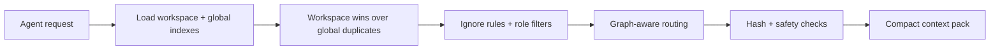

# Read path and routing

The read flow decides which memory an agent sees for a given task.

## Read flow

1. Engram loads workspace and optional global indexes.
2. Workspace entries win over global duplicates.
3. Ignore rules and role filters hide irrelevant entries.
4. Graph-aware routing selects a compact context pack.
5. Hash and safety checks run before content is printed.

## Anchor and refine

`load` first anchors routing on meaningful query terms, ignoring generic memory words such as `rule`, `knowledge`, and common stopwords. It then refines the wider candidate pool into a compact context pack.

Normal load reports selected and total related counts, like `loaded 8 memory files / 14 total related memories`.

- `load --dry-run` shows candidate counts, narrowing tags, and match reasons.
- `load --all` returns every visible routed match instead of applying the compact limit.
- Default `load` is the agent-facing compact route. Use `load --full` for broader legacy output.

`workflow` and `workflows` still route to skill memories, but generic type words do not make a broad match by themselves.

## Dependency layers

Use `depends_on` frontmatter when a memory should build on another memory instead of repeating it:

```yaml
depends_on: [release-foundation]
level: advanced
```

Run `engram graph --rebuild` after manual edits. The graph reports dependency layers, and `engram load` pulls routed prerequisites into the same compact context pack before deeper memories. Graph related edges and vector hits cannot load unrelated memories by themselves; they only help rerank or expand memories that already overlap meaningful query terms. Explicit `depends_on` prerequisites may still load without their own keyword overlap.

## Routing diagram



## Next steps

- [Write path and approval](write-path.md)
- [CLI: load / search / graph](../cli/load-search-graph.md)
