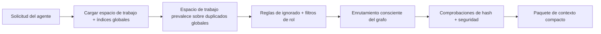

# Ruta de lectura y enrutamiento

El flujo de lectura decide qué memoria ve un agente para una tarea determinada.

## Flujo de lectura

1. Engram carga el espacio de trabajo y los índices globales opcionales.
2. Las entradas del espacio de trabajo prevalecen sobre los duplicados globales.
3. Las reglas de ignorado y los filtros de rol ocultan las entradas irrelevantes.
4. El enrutamiento consciente de grafos selecciona un paquete de contexto compacto.
5. Se ejecutan comprobaciones de hash y seguridad antes de imprimir el contenido.

## Anclar y refinar

`load` primero ancla el enrutamiento en términos de consulta significativos, ignorando palabras de memoria genéricas como `rule`, `knowledge` y palabras de parada comunes. Luego refina el grupo de candidatos más amplio en un paquete de contexto compacto.

La carga normal informa los recuentos seleccionados y relacionados totales, como `loaded 8 memory files / 14 total related memories`.

- `load --dry-run` muestra los recuentos de candidatos, etiquetas de limitación y motivos de coincidencia.
- `load --all` devuelve cada coincidencia enrutada visible en lugar de aplicar el límite compacto.
- `load` es la ruta compacta orientada al agente.

`workflow` y `workflows` todavía enrutan a memorias de habilidades (skill memories), pero las palabras de tipo genéricas no generan una coincidencia amplia por sí mismas.

## Capas de dependencia

Use la propiedad `depends_on` del frontmatter cuando una memoria deba construirse sobre otra memoria en lugar de repetirla:

```yaml
depends_on: [release-foundation]
level: advanced
```

Ejecute `engram graph --rebuild` después de las ediciones manuales. El grafo informa las capas de dependencia, y `engram load` extrae los prerrequisitos enrutados en el mismo paquete de contexto compacto antes de las memorias más profundas. Los bordes relacionados con el grafo y los aciertos vectoriales no pueden cargar memorias no relacionadas por sí mismos; solo ayudan a reclasificar o expandir memorias que ya se superponen con términos de consulta significativos. Los prerrequisitos explícitos `depends_on` aún pueden cargarse sin su propia superposición de palabras clave.

## Diagrama de enrutamiento



## Siguientes pasos

- [Ruta de escritura y aprobación](write-path.md)
- [CLI: load / search / graph](../cli/load-search-graph.md)

