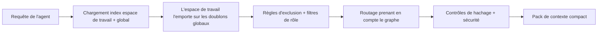

# Chemin de lecture et routage

Le flux de lecture détermine quelle mémoire un agent voit pour une tâche donnée.

## Flux de lecture

1. Engram charge l'espace de travail et les index globaux optionnels.
2. Les entrées de l'espace de travail l'emportent sur les doublons globaux.
3. Les règles d'exclusion (ignore rules) et les filtres de rôle masquent les entrées non pertinentes.
4. Un routage prenant en compte le graphe de dépendance sélectionne un pack de contexte compact.
5. Des contrôles de hachage et de sécurité sont exécutés avant l'affichage du contenu.

## Ancrer et affiner

`load` ancre d'abord le routage sur des termes de requête significatifs, en ignorant les mots génériques relatifs à la mémoire comme `rule`, `knowledge`, ainsi que les mots vides (stopwords) courants. Il affine ensuite l'ensemble des candidats potentiels pour former un pack de contexte compact.

Un chargement normal signale le nombre d'éléments sélectionnés et le total d'éléments liés, sous la forme : `loaded 8 memory files / 14 total related memories`.

- `load --dry-run` affiche le nombre de candidats, les étiquettes de restriction et les raisons des correspondances.
- `load --all` renvoie toutes les correspondances routées visibles au lieu d'appliquer la limite du pack compact.
- `load` représente la route compacte destinée aux agents.

`workflow` et `workflows` ciblent toujours les mémoires de compétences (skill memories), mais les termes de types génériques ne suffisent pas à eux seuls à établir une correspondance large.

## Couches de dépendances

Utilisez la propriété `depends_on` du frontmatter lorsqu'une mémoire doit s'appuyer sur une autre mémoire plutôt que de la répéter :

```yaml
depends_on: [release-foundation]
level: advanced
```

Exécutez `engram graph --rebuild` après toute modification manuelle. Le graphe indique les couches de dépendance, et `engram load` intègre les prérequis routés dans le même pack de contexte compact avant les mémoires plus approfondies. Les liaisons du graphe et les correspondances vectorielles ne peuvent pas charger des mémoires non liées de manière autonome ; elles aident uniquement à reclasser ou à étendre les mémoires qui chevauchent déjà des termes de requête significatifs. Les prérequis explicitement définis via `depends_on` peuvent toujours être chargés même sans chevauchement de leurs propres mots-clés.

## Schéma de routage



## Étapes suivantes

- [Chemin d'écriture et approbation](write-path.md)
- [CLI : load / search / graph](../cli/load-search-graph.md)

