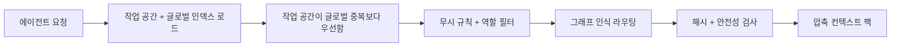

# 읽기 경로 및 라우팅

읽기 흐름은 에이전트가 지정된 작업에 대해 보게 될 메모리를 결정합니다.

## 읽기 흐름

1. Engram이 작업 공간 및 선택적 글로벌 인덱스를 로드합니다.
2. 작업 공간 항목이 글로벌 중복 항목보다 우선합니다.
3. 무시 규칙 및 역할 필터가 무관한 항목을 숨깁니다.
4. 그래프 인식 라우팅(Graph-aware routing)을 통해 압축된 컨텍스트 팩을 선택합니다.
5. 콘텐츠가 출력되기 전에 해시 및 안전성 검사가 실행됩니다.

## 앵커 및 정제

`load`는 먼저 `rule`, `knowledge` 및 일반적인 불용어(stopwords)와 같이 범용적인 메모리 단어를 무시하고 의미 있는 쿼리 용어에 라우팅을 고정(anchor)합니다. 그런 다음 더 넓은 후보 풀을 압축된 컨텍스트 팩으로 정제(refine)합니다.

일반 로드는 `loaded 8 memory files / 14 total related memories`와 같이 선택된 메모리 및 전체 관련 메모리 개수를 보고합니다.

- `load --dry-run`은 후보 수, 좁히기 태그 및 일치 이유를 보여줍니다.
- `load --all`은 압축 제한을 적용하는 대신 표시되는 모든 라우팅된 일치 항목을 반환합니다.
- `load`는 에이전트 전용 압축 경로입니다.

`workflow` 및 `workflows`는 여전히 기술 메모리(skill memories)로 라우팅되지만, 일반적인 유형 단어 자체만으로는 광범위한 일치가 이루어지지 않습니다.

## 의존성 레이어

하나의 메모리가 다른 메모리를 반복하지 않고 기반으로 빌드되어야 할 때는 `depends_on` frontmatter를 사용합니다.

```yaml
depends_on: [release-foundation]
level: advanced
```

수동 편집 후 `engram graph --rebuild`를 실행합니다. 그래프가 의존성 레이어를 보고하고, `engram load`는 더 깊은 메모리보다 먼저 라우팅된 전제 조건을 동일한 압축 컨텍스트 팩으로 가져옵니다. 그래프 관련 에지 및 벡터 히트는 그 자체로 관련 없는 메모리를 로드할 수 없으며, 의미 있는 쿼리 단어와 이미 겹치는 메모리의 순위를 재조정하거나 확장하는 데만 도움이 됩니다. 명시적인 `depends_on` 전제 조건은 키워드가 겹치지 않더라도 로드될 수 있습니다.

## 라우팅 다이어그램



## 다음 단계

- [쓰기 경로 및 승인](write-path.md)
- [CLI: load / search / graph](../cli/load-search-graph.md)

