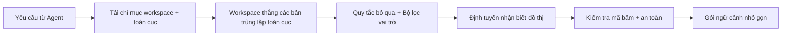

# Đường dẫn đọc và định tuyến

Luồng đọc quyết định bộ nhớ nào mà agent nhìn thấy cho một nhiệm vụ nhất định.

## Luồng đọc

1. Engram tải chỉ mục của workspace và chỉ mục toàn cục tùy chọn.
2. Các mục trong workspace sẽ thắng các mục trùng lặp toàn cục.
3. Các quy tắc bỏ qua (ignore rules) và bộ lọc vai trò (role filters) ẩn các mục không liên quan.
4. Định tuyến nhận biết đồ thị (graph-aware routing) chọn một gói ngữ cảnh nhỏ gọn.
5. Kiểm tra mã băm (hash) và an toàn trước khi in nội dung.

## Định vị và tinh lọc

`load` trước tiên định vị việc định tuyến dựa trên các thuật ngữ truy vấn có ý nghĩa, bỏ qua các từ bộ nhớ chung chung như `rule`, `knowledge` và các từ dừng phổ biến (stopwords). Sau đó, nó tinh lọc nhóm ứng viên rộng hơn thành một gói ngữ cảnh nhỏ gọn.

Tải thông thường sẽ báo cáo số lượng bộ nhớ được chọn và tổng số bộ nhớ liên quan, ví dụ: `loaded 8 memory files / 14 total related memories`.

- `load --dry-run` hiển thị số lượng ứng viên, thẻ thu hẹp phạm vi và lý do khớp.
- `load --all` trả về mọi kết quả định tuyến hiển thị thay vì áp dụng giới hạn gói nhỏ gọn.
- `load --for-agents` là đường dẫn rút gọn dành cho agent.

`workflow` và `workflows` vẫn định tuyến đến bộ nhớ kỹ năng (skill memories), nhưng các từ loại chung chung tự chúng không tạo ra một kết quả khớp rộng.

## Các lớp phụ thuộc

Sử dụng trường `depends_on` trong frontmatter khi một bộ nhớ cần xây dựng dựa trên một bộ nhớ khác thay vì lặp lại nó:

```yaml
depends_on: [release-foundation]
level: advanced
```

Chạy `engram graph --rebuild` sau khi chỉnh sửa thủ công. Đồ thị báo cáo các lớp phụ thuộc và `engram load` sẽ kéo các điều kiện tiên quyết đã định tuyến vào cùng một gói ngữ cảnh nhỏ gọn trước các bộ nhớ sâu hơn. Các cạnh liên quan trong đồ thị và lượt khớp vector không thể tự tải các bộ nhớ không liên quan; chúng chỉ giúp xếp hạng lại hoặc mở rộng các bộ nhớ đã trùng lặp các từ khóa truy vấn có ý nghĩa. Các điều kiện tiên quyết `depends_on` rõ ràng vẫn có thể tải mà không cần trùng lặp từ khóa riêng của chúng.

## Sơ đồ định tuyến



## Bước tiếp theo

- [Đường dẫn ghi và phê duyệt](write-path.md)
- [CLI: load / search / graph](../cli/load-search-graph.md)
